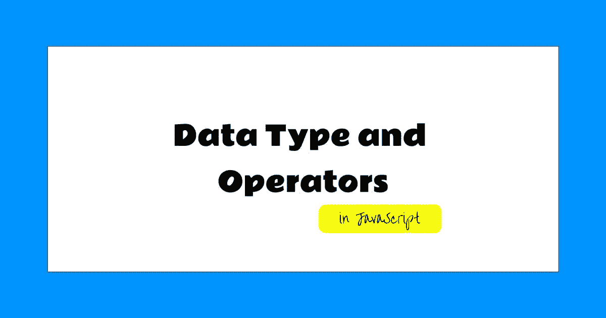
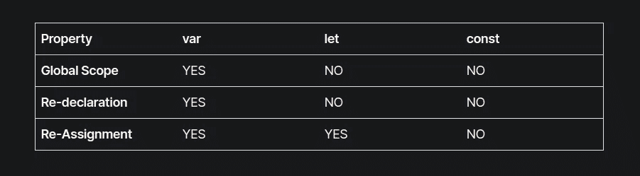

# JavaScript 中的数据类型和运算符

> 原文：<https://medium.com/nerd-for-tech/data-type-and-operators-in-javascript-f16378083f76?source=collection_archive---------29----------------------->



## Javascript 中的基本数据类型和运算符。

嘿，伙计们，这是 JavaScript A、B、C 系列的第二篇文章，如果你们还没有读过我的第一篇文章，我推荐你们在这里阅读。在本文中，我将解释 JavaScript 中的基本数据结构和操作符。

对于每一种编程语言，值都是基本的构造块，值可以是任何类型，可以是实体的名称，实体的数字表示，或者简单的是或否格式。在 JavaScript 中，有几种编程术语中的**类型**值，我们称之为**数据类型**。在深入研究数据类型之前，让我们先了解如何在 JavaScript 中定义任何类型的值。

传统上，只有一种方法来定义值，借助关键字`var`，但是在现代编程中，我们引入了两种新的方法来定义值，即`let`和`const`，在 JavaScript 中定义值非常简单，你只需要遵循以下语法，

```
var name = 'hashnode';
let name = 'hashnode';
const name = 'hashnode';
```

语法是相似的，但是每个变体都有不同之处，请看下面的不同之处，



带有关键字`var`和`let`的值在整个程序中可以变化，这就是为什么我们称它们为**变量**，在`const`一旦定义就不能更改的情况下，它们被称为**常量值**或仅仅是**常量**。

# 数据类型

# 数字

为了表示一个数值，我们使用了一个`Number`数据类型，它可以是`10`、`-10`或`3.14`。

```
let valueOfPI = 3.14; // data with the value type Number
```

javascript 中有三个特殊的值，它们被认为是数字，但它们的行为不像数字，前两个是`Infinity`和`-Infinity`，它们代表正负无穷大。无穷大- 1 还是无穷大，以此类推。

第三个是`NaN`，NaN 代表“不是数字”，即使是数字类型的值。当您尝试计算 0 / 0(零除以零)、无穷大-无穷大或任何其他不会产生有意义结果的数字运算时，您会得到这个结果。

# 线

`String`是另一种基本的数据类型，它们用来表示文本值，你可以通过用引号将文本括起来来定义一个字符串值，

```
let name = 'Adarsh Thakur Blogs'; // enclosed in single quote
let anotherName = "A, B, C's of JavaScript"; // enclosed in double quote
```

除了这两种传统方法，在现代编程中，我们还可以使用反斜线 **(`)** 来表示字符串，它们有助于在 JavaScript 中创建模板文字，我们将在后续文章中介绍。

```
let language = `JavaScript`; // this is also valid
```

您几乎可以将任何内容括在引号内，并且它将以字符串的形式结束，但是有些字符需要以不同的方式处理。想象一下在引号旁边添加一个引号或者在输入值中添加一个新行`(\n)`,为了能够在字符串中包含这样的字符，可以使用下面的符号:每当在带引号的文本中发现一个**反斜杠(\ )** 时，它表示它后面的字符有特殊的含义。这叫做**转义**字符。

```
let title = "A newline character is written like \"\\n\".";
```

# 布尔代数学体系的

有些情况下，值只能区分两种可能性，如“是”和“否”或“开”和“关”。因为 Javascript 有特殊的数据类型`Boolean`，它们只能有两个值`true`和`false`。

```
let isThisArticleGreat = true;
```

# 空值

JavaScript 中有两种特殊类型的值，表示为`null`和`undefined`，它们是实际值，但不携带任何有意义的信息。文献表明，两个值的含义之间的差异是偶然的，你可以互换使用它们。

# 经营者

语言中的特殊字符如`*`和`+`被称为**运算符**，它们在编程中非常有用，让我们学习一些运算符及其用法。

# 算术运算符

我们使用数值的主要原因是为了执行算术运算，如加法、乘法等。要将两个数相加，我们只需使用加法运算符`+`、`-`、`*`和`\`进行减法、乘法和除法运算。

```
let sum = 10 + 10;
// Expected output 20
let square = 2 * 2;
// Expected output 4
```

# 一元运算符

不是所有的操作符和符号，有些写成单词(关键字)，其中一个是`typeof`，当应用于一个值时，它给出了该值的类型

```
const numberOfGirlfriendsIhave = 1; // 🥰 
console.log(typeof numberOfGirlfriendsIhave);
// -> number
```

`typeof`运算符只使用一个值，因此称为一元运算符，有些运算符使用两个值，这就是为什么它们是二元运算符，请注意`-`既可以用作二元运算符，也可以用作一元运算符。

```
console.log( - (9 -5) );
// → -4
```

# 比较运算符

您可能会遇到一些需要比较两个值的情况，Javascript 提供的运算符在这种情况下可能会派上用场。下面是比较运算符的列表，

```
cosole.log(10 > 20); // > 'Greater than`
cosole.log(10 < 20); // < 'Less than`
cosole.log(10 >= 20); // > 'Greater than or equal to`
cosole.log(10 <= 20); // < 'Less than or equal to`
cosole.log(10 == 20); // < 'Equals to`
```

> *有趣的事实:在 JavaScript 中，除了 NaN，所有的值都等于自己。*

# 逻辑算子

一些操作可以应用于布尔值本身。JavaScript 支持三种逻辑运算符:and、or 和 not。`&&`运算符是一个逻辑与运算，它是一个二元运算符，只有当两个值都为真时才返回真，否则返回假。

```
console.log(true && false);
// → false
console.log(true && true);
// → true
```

`||`操作符是一个逻辑 or 操作符，它也是一个二元操作符，如果任何一个值为真，它返回真。运算符 NOT 由感叹号表示，它是一元运算符，并翻转其值。

```
console.log(false || true);
// → true
console.log(false || false);
// → false
```

# 三元运算符

到目前为止，我们已经看到了一元运算符和二元运算符，但是在 JavaScript 中有一个三元运算符是用问号(？)和冒号(:)符号如下，

```
console.log(true ? 1 : 2);
// Expected Output 1
```

在该运算符中，输出依赖于`?`前值的真实性，如果提供的值为真，输出将在冒号`:`前取值，否则，冒号后的值有时也被称为**条件运算符。**

你可能想知道，我们学习了 JavaScript 的基本数据类型🤔在所有的例子中，我们没有指定值的数据类型，那么 JavaScript 如何知道`10`是一个数字，而`"10"`是一个字符串，这里有一个概念**如何自动类型转换**。

# 自动类型转换

如果您已经阅读了本系列的第一篇文章，那么您一定记得 JavaScript 是最聪明的编程语言之一，让我来给你证明，

```
console.log(5 * null)
// → 0
console.log("3" - 1)
// → 2
console.log("6" + 1)
// → 61
```

每当一个操作符使用了错误的数据类型时，JavaScript 就会使用一组通常不是您想要或期望的规则悄悄地将该值转换成合适的类型。这叫**式强制**。

在这种情况下，`null`变成了`0`，`"3"`被转换成了`3`，在第三个例子中，我们试图用一个数字来联系`"6"`，使`1`被转换成`"1"`，从而给出`"61"`的结果。

当您不希望 JavaScript 转换这些值并比较它们时，JavaScript 提供了一种特殊类型的操作符，`===`和`!==`。第一个运算符检查两个值是否完全相等，第二个运算符检查两个值是否完全不相等。

> *提示:我推荐你使用* `*===*` *和* `*!==*` *运算符来意外地进行自动类型转换。*

因此，我们可以使用不同的数据类型和操作符来执行一些操作，在本系列的下一篇文章中，我将解释 JavaScript 中的函数和对象。

要获得关于我下一篇文章的通知，请关注我，在此之前，您可以通过 Twitter[或 DM](https://twitter.com/_adarshthakur)[Discord](https://discord.com/users/814740989510942730)联系我。

如果你喜欢这篇文章，你可以到我这里喝杯咖啡[https://www.buymeacoffee.com/adarshthakur](https://www.buymeacoffee.com/adarshthakur)

*最初发布于*[*https://adarsh-tha kur . hash node . dev*](https://adarsh-thakur.hashnode.dev/data-type-and-operators-in-javascript)*。*