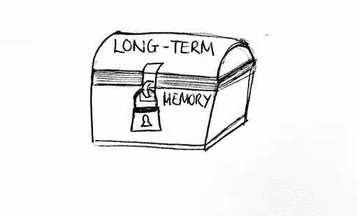
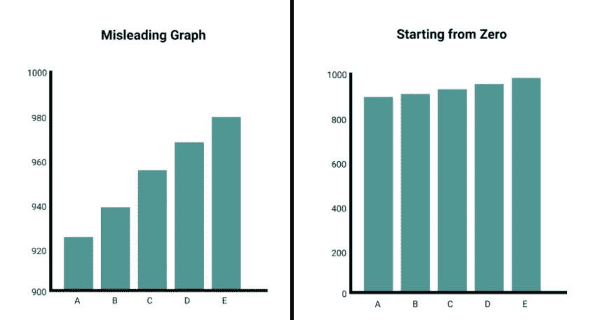
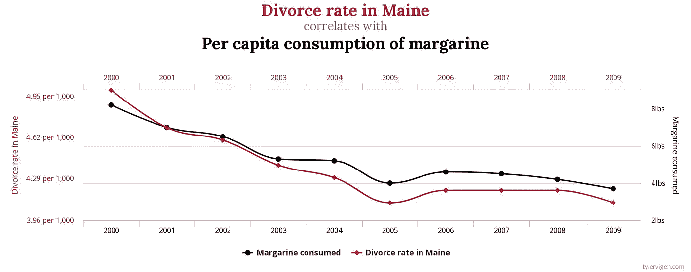

# 数据可视化

> 原文：<https://medium.com/nerd-for-tech/data-visualization-debc39f1da54?source=collection_archive---------26----------------------->

## *一图抵千言*。

# 一张图胜过千言万语。

**含义:**一幅图像比文字更能传达信息。

**起源:**这句话是由一位广告业高管弗雷德·r·巴纳德发明的。1921 年，为了推销他的广告公司，他用印刷体墨水做了一个广告，标题是“一个眼神胜过千言万语”，并将其归功于一位古代日本哲学家。

# **为什么一张图片胜过千言万语？**

## 1.视觉生物又名人类:

关于[***Bryan Caplan***](https://www.linkedin.com/in/bryancaplan/)*(首席执行官，Bryan Caplan Marketing)* 的报告，人类是视觉生物，他们对视觉数据的反应和处理优于任何其他类型的数据。人类能够快速翻译视觉内容。人脑处理视觉内容 ***比处理文字快六万倍*** 。还有，*传到大脑的信息 90%是视觉的。人类用视觉信息进行观察、学习、处理和决策。*

## *2.长期记忆住宅:*

*视觉效果存在于长期记忆中，它们帮助人们理解内容并引导他们的注意力。*

**

> *“……除非我们的文字、概念、想法被挂在一个图像上，否则它们会从一只耳朵进去，穿过大脑，从另一只耳朵出去。单词是由我们的短期记忆处理的，我们只能保留大约 7 位信息。”—[**Lynell Burmark**](https://books.google.com/books?id=slE8DwAAQBAJ&pg=PA136&lpg=PA136&dq=dr+lynell+burmark+unless+our+words&source=bl&ots=B4saya3FwJ&sig=ACfU3U0v4gG3Ne2M8JfMg69PmzFBapwd8w&hl=en&sa=X&ved=2ahUKEwjG84qz14ThAhUFi6wKHeRzC_EQ6AEwCXoECAMQAQ#v=onepage&q=dr%20lynell%20burmark%20unless%20our%20words&f=false)博士(视觉读写能力专家)*

# *数据可视化*

*因为使用图像和数字更容易传达故事和意义。在数据科学中， ***数据可视化*** 用于创建价值远超 1000 字的图片。数据可视化是*信息*和*数据*的图形化表示。通过使用类似于 ***图表*** 、 ***图形、*** 和 ***地图*** 的可视化元素，数据可视化工具提供了一种查看和理解数据中的 ***趋势*** 、 ***异常值*** 和 ***模式*** 的便捷方式。*

**

*此外，数据可视化通过将数据整理成更容易理解的形式来讲述故事。一个好的可视化可以讲述一个故事，去除数据中的噪音，突出有用的信息。*

# *数据可视化的力量*

*如果使用得当， ***数据可视化*** 对于*数据清理**探索数据结构**检测异常值和异常组*，*识别趋势*和*聚类，发现局部模式，评估建模输出，*和*呈现结果。**

**

*可视化揭示了统计和模型可能遗漏的数据特征:数据的异常分布、局部模式、聚类、间隙、缺失值、舍入或堆积的证据、隐式边界、异常值等等。视觉效果引发问题，刺激研究和提出想法。*

*数据可视化是一把*双刃剑，虽然它能以更清晰、更有条理的方式传达思想。它可能被用来误导观众。有几种技术可用于此目的，但最常用和最棘手的技术是:**

## **1.从 Y 轴中排除零值**

*****条形图*** 用于比较子组之间的数量。这种比较是基于条形的长度或高度进行的。基本上，越大的条形意味着数量越多。**

****

**从 Y 轴中排除零用于夸大实例之间的差异。它的工作原理是迷惑读者去寻找 ***绝对差异*** ，其中图表说明了 ***相对差异*** 。**

## **2.使用两个 Y 轴来暗示相关性和因果关系**

**一个**双轴图表**(也称为**多轴图表**)使用两个**轴**来说明两个具有不同量值和度量尺度的变量之间的关系。**

****

**相关性:94.71% (r=0.974091)**

**当两个图形在同一点上有相同的形状或变化时，人们可以断定这两个值在某种程度上是相关的。然而，事实远非如此。 ***泰勒·维根*** 创建了一组 [*双轴图表*](http://www.tylervigen.com/spurious-correlations) 来展示两个完全独立且不相关的值如何共享几乎相同的图形形状，这并不意味着一个以任何方式影响另一个。**

**这是由于所谓的 ***假相关*** 造成的，其中两个或更多的事件或变量相关联但没有因果关系。**

# **数据可视化工具**

****

**数据可视化工具为设计人员提供了一种更简单的方法来创建大型和小型数据集的可视化表示。可视化创建过程的自动化使设计者的工作变得非常容易，并且不容易出错。创建图形和图表以及操作数据可视化技术有多种方法，包括编程语言、编程库、插件、服务和旨在完成预期工作的软件。**

## **1.Python 与 R**

**总的来说，R 和 Python 都为数据可视化做了很好的准备。**

****

*   **r 是一种主要用于数据分析的语言，这表现在它提供了各种为科学可视化而设计的包。**
*   **Python 是一种通用编程语言，也可用于数据分析，并为数据可视化提供了许多好的解决方案。**
*   **在 R 中借助 ***ggplot2*** 定制图形比在 Python 中借助 ***Matplotlib*** 定制图形更容易、更直观。 ***Seaborn*** 库有助于克服这一点，并提供了良好的标准解决方案，只需相对少的几行代码。**

## **2.Microsoft PowerBI 和 Excel**

****

*****Excel*** 是一个强大、灵活的工具，适用于所有分析活动。当它与 ***Power BI、*** 结合时，这种结合有助于获得广泛的数据分析和可视化能力。使他们的用户能够以新的方式轻松收集、塑造、分析和探索关键业务数据，同时使用这两种应用程序，只需更少的时间。**

## **3.Tableau 对 Grafana**

*****Grafana*** 和 ***Tableau*** 都是可以帮助执行数据可视化和分析的工具。**

****

*   **Grafana 的概念非常宽泛，而 Tableau 更侧重于商业智能。**
*   **Grafana 非常适合处理时间序列、应用程序监控和服务器监控。**
*   **使用 Tableau 处理服务器可能会不太舒服。**
*   **Tableau 有更具体的商业分析工具。例如，只有 Tableau 支持箱线图。**

**此外，数据可视化是 ***探索性数据分析【EDA】***的基本要素，用于检查数据质量，并帮助分析人员熟悉他们面前数据的结构和特征。**

# *****探索性*** 数据分析(EDA)**

> *****EDA*** 就是在着手处理数据之前，理解手头的数据。**

****

*****探索性数据分析*******EDA***是指对数据进行初步调查，以*发现模式*、*现场异常*、*检验假设*、*借助汇总统计和图形表示检查假设*的关键过程。首先理解数据并尝试从中收集尽可能多的见解是一个好习惯。***

> ****约翰·图基**(被认为是**探索性数据分析**之父)
> 曾经说过:“一张照片最大的价值是当它迫使我们注意到我们从未期望看到的东西。”**

> **感谢您的阅读！**

# ****资源****

*   **[*用视觉内容活跃营销的 3 个理由。*](https://www.score.org/blog/3-reasons-liven-your-marketing-visual-content)*—*[***得分***](https://www.score.org/)**
*   **[*一张图的清晰度胜过千言万语*](https://www.dictionary.com/browse/picture-is-worth-a-thousand-words--one) *。——*[**Dictionary.com**](https://www.dictionary.com/)**
*   **[*什么是数据可视化？*](https://www.tableau.com/learn/articles/data-visualization)——[***tableau***](https://www.tableau.com/)**
*   **[*什么是探索性数据分析？*](https://towardsdatascience.com/exploratory-data-analysis-8fc1cb20fd15)*——*****
*   ***[*为什么数据可视化很重要？数据可视化中什么是重要的？*](https://hdsr.mitpress.mit.edu/pub/zok97i7p/release/3)——[***哈佛数据科学评论***](https://hdsr.mitpress.mit.edu/)***
*   **[*数据可视化误导的五种方式*](https://www.tessellationtech.io/top-five-ways-mislead-data-visualization/)*—*[***镶嵌***](https://www.tessellationtech.io/)**
*   **[*误导图*](https://towardsdatascience.com/misleading-graphs-e86c8df8c5de) *。——***
*   ***[*新冠肺炎时代的糟糕数据可视化*](/nightingale/bad-data-visualization-in-the-time-of-covid-19-5a9f8198ce3e) *。——*[***夜莺***](https://medium.com/nightingale)***
*   **[*最好的数据可视化工具*](https://www.toptal.com/designers/data-visualization/data-visualization-tools) *的完整概述。*——**
*   ***[*R 中的数据可视化 vs. Python*](https://www.inwt-statistics.com/read-blog/data-visualization-R-versus-python.html) *。——****
*   ***[*Excel 和*](https://powerbi.microsoft.com/en-us/excel-and-power-bi/) *。—* [***微软***](https://www.microsoft.com/)***
*   **[*Grafana vs . Tableau*](https://www.metricfire.com/blog/grafana-vs-tableau/#span-stylefontweight-400Introductionspan)*[***metric fire***](https://www.metricfire.com/)***

# ****图片****

*   **[https://www.gutenberg.org/files/43662/43662-h/43662-h.htm](https://www.gutenberg.org/files/43662/43662-h/43662-h.htm)**
*   **[https://smritilimbukhim . WordPress . com/what-is-long-term-memory/](https://smritilimbukhim.wordpress.com/what-is-long-term-memory/)**
*   **[https://www . simpli learn . com/data-visualization-tools-article](https://www.simplilearn.com/data-visualization-tools-article)**
*   **[https://www . ajasratech . com/blog/4-ways-to-use-data-visualization-for-your-business/](https://www.ajasratech.com/blog/4-ways-to-use-data-visualization-for-your-business/)**
*   **[https://www . klipfolio . com/resources/articles/what-is-data-visualization](https://www.klipfolio.com/resources/articles/what-is-data-visualization)**
*   **[https://towards data science . com/missinging-graphs-e 86 c 8d F8 C5 de](https://towardsdatascience.com/misleading-graphs-e86c8df8c5de)**
*   **[http://www.tylervigen.com/spurious-correlations](http://www.tylervigen.com/spurious-correlations)**
*   **[https://boost labs . com/blog/when-to-use-data-visualization-tools-2/](https://boostlabs.com/blog/when-to-use-data-visualization-tools-2/)**
*   **[https://www . r-bloggers . com/2020/01/python-vs-r-for-data-science-what-the-difference/](https://www.r-bloggers.com/2020/01/python-vs-r-for-data-science-whats-the-difference/)**
*   **[https://venturebeat . com/2020/10/29/Microsoft-excel-power-bi-data-types/](https://venturebeat.com/2020/10/29/microsoft-excel-power-bi-data-types/)**
*   **[https://www . metric fire . com/blog/grafana-vs-tableau/# span-stylefont weight-400 简介 span](https://www.metricfire.com/blog/grafana-vs-tableau/#span-stylefontweight-400Introductionspan)**