# 使用 Pandas 实现数据可视化

> 原文：<https://medium.com/nerd-for-tech/data-visualization-using-pandas-cfcde72807b1?source=collection_archive---------0----------------------->

## 这篇文章将帮助您使用内置的 Pandas 方法来可视化数据和绘制洞察力。

# 如何导入包？

熊猫套餐是进口的。除此之外，还提到了神奇的函数“%matplotlib inline”来确保绘图显示在笔记本中。

```
**>>> import** numpy **as** np
**>>> import** pandas **as** pd
**>>> %**matplotlib inline
```

出于理解的目的，取一个具有随机值的数据集。

```
>>> df1 **=** pd.read_csv('dataset2.csv')
>>> df1.head()
```

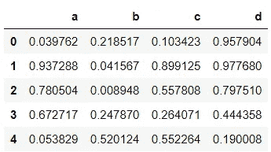

# 如何创建直方图？

可以通过在数据帧的列上使用“hist”方法来生成直方图。也可以指定容器的数量。

```
>>> df1['b'].hist(bins**=**15)
```


如果您想以 seaborn 风格查看绘图，然后导入 seaborn 包，设置风格并再次运行代码。

```
**>>> import** seaborn **as** sns
>>> sns.set_style('whitegrid')>>> df1['b'].hist(bins**=**15)
```

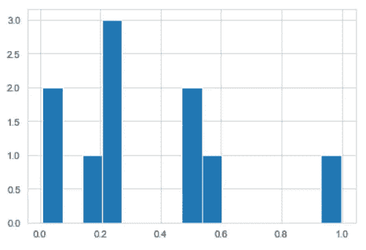

# 一般剧情种类怎么处理？

您还可以调用数据帧的“plot”方法，并提及所需的绘图类型。

```
>>> df1['c'].plot(kind**=**'hist',bins**=**10)
```

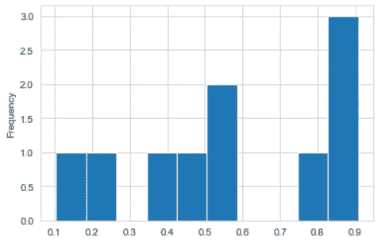

也可以通过 plot 方法直接调用 hist 方法。

```
>>> df1['c'].plot.hist()
```

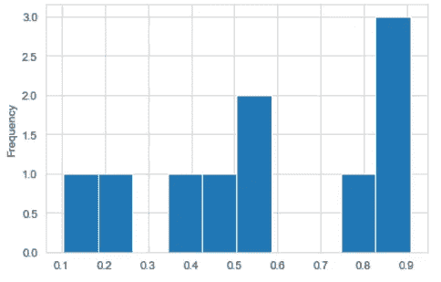

# 如何创建面积图？

它绘制了数据框列的面积。可以指定 alpha 关键字来调整透明度。

```
>>> df1.plot.area(alpha**=**0.7)
```

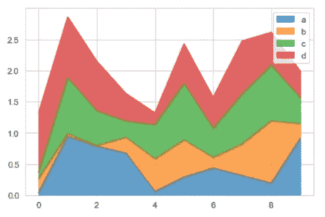

# 如何创建条形图？

“条形图”方法绘制条形图。

```
>>> df1.plot.bar()
```

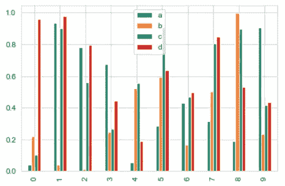

如果您不希望单独绘制条形，而是将条形堆叠在一起，请将值 True 传递给 stacked 关键字。

```
>>> df1.plot.bar(stacked**=True**)
```

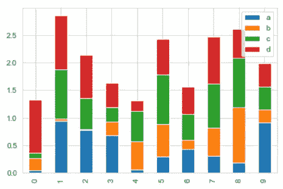

# 如何创建线图？

可以通过调用 line 方法并传递 x 和 y 值来绘制线图。

```
>>> df1.plot.line(y**=**'d')
```

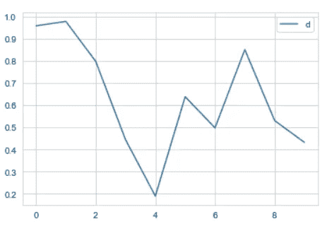

图形大小和线条样式也可以像线宽一样改变。

```
>>> df1.plot.line(y**=**'a',figsize**=**(5,3),lw**=**2)
```

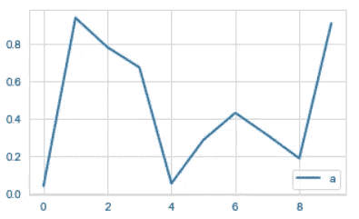

# 如何创建散点图？

调用 scatter 方法并传递 x 和 y 值。

```
>>> df1.plot.scatter(x**=**'b',y**=**'d')
```

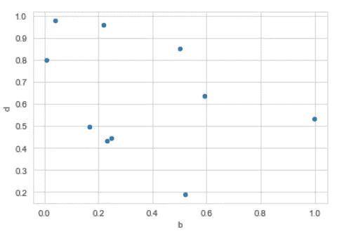

如果您想与另一列进行比较，那么请将列名提到“c”值。您也可以使用 cmap 关键字更改绘图的颜色。

```
>>> df1.plot.scatter(x**=**'b',y**=**'d',c**=**'a',cmap**=**'rainbow')
```

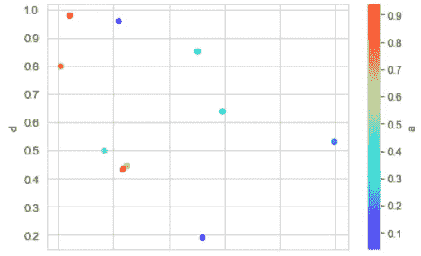

# 如何创建方框图？

可以调用 box 方法来创建盒状图。

```
>>> df1.plot.box()
```

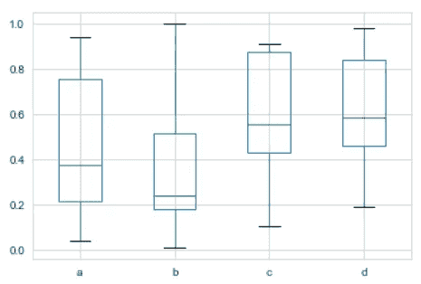

# 如何创建十六进制图？

这就像散点图，但是数据点用十六进制单元格表示。

```
>>> df1.plot.hexbin(x**=**'b',y**=**'d',gridsize**=**15)
```

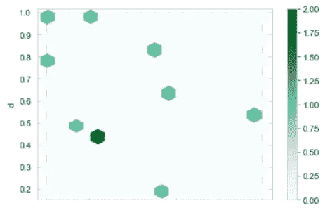

# 如何创造 KDE 情节？

KDE 代表核密度估计。可以调用 kde 方法来绘制它。

```
>>> df1['d'].plot.kde()
```


```
>>> df1.plot.kde()
```

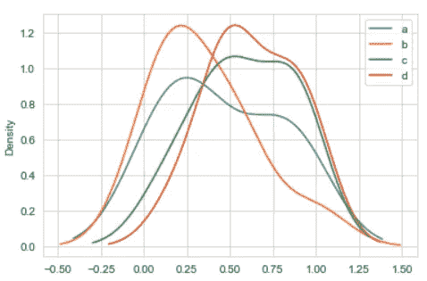

> *关于熊猫数据可视化的更多详细信息，查看官方文档* [*这里*](https://pandas.pydata.org/pandas-docs/stable/user_guide/visualization.html) *。*
> 
> *此处* *代码请参考笔记本。*

# 可供参考的书籍:

[](https://amzn.to/3uoYw4z) [## 熊猫的动手数据分析和可视化](https://amzn.to/3uoYw4z) [](https://amzn.to/34ma5Pt) [## Python 数据分析:使用 Python、NumPy 和…开始数据分析的终极指南

### 你是否完全是编程新手，想学习如何编码，但不知道从哪里开始？你想……](https://amzn.to/34ma5Pt) [](https://amzn.to/3fMFkbD) [## 用于数据分析的 Python，2e:与 Pandas、Numpy 和 Ipython 的数据争论

### 用于数据分析的 Python，2e:与熊猫的数据争论，Numpy 和 Ipython: Amazon.in: Mckinney，Wes: Books](https://amzn.to/3fMFkbD) [](https://amzn.to/3usg0wO) [## Python 数据分析:使用 Pandas、NumPy 和 Matplotlib

### 探索最新的 Python 工具和技术，帮助您应对数据采集和分析领域。你会…](https://amzn.to/3usg0wO) 

> *联系我:* [*LinkedIn*](https://www.linkedin.com/in/jayashree-domala8/)
> 
> *查看我的其他作品:* [*GitHub*](https://github.com/jayashree8)