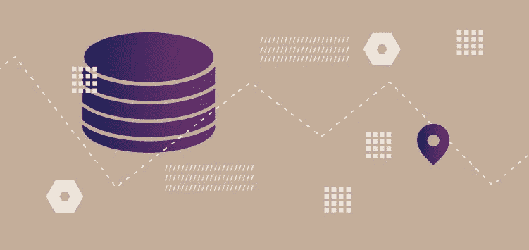

# 数据仓库集成:优化您的客户数据堆栈

> 原文：<https://medium.com/nerd-for-tech/data-warehouse-integration-refining-your-customer-data-stack-4897d4607a8f?source=collection_archive---------7----------------------->

数据仓库是一个集中的存储库，存储从多个系统收集的集成数据。典型的业务以几个系统为特征，例如 ERP、CRM、营销自动化平台或电子商务系统。有趣的是，所有这些都运行在一个富含关键数据的关系数据库上。

用户可以通过设置 ETL 驱动的数据管道来整合这些信息。

该管道可以从基本系统中提取数据，在将所有数据存储在一个巨大的关系数据库(即数据仓库)中之前对其进行净化和集成。

# 数据仓库实施的八步计划

一旦用户认识到数据仓库管理的需要，就应该开始计划了。数据仓库实现的以下步骤是成功数据管理的必备知识。

# #1 收集需求

多个利益相关者很可能会参与到这样一个公司范围的数据项目中。

如果是这样，请联系以下专业人士:

*   **决策者**:与战略家和最高管理层的领导者交谈。像这样的专家可以促进与公司主要目标的协调过程。
*   **IT**:IT 团队在数据项目中扮演着重要的角色，主要是通过连接数据源到数据管道。如果您选择本地解决方案，IT 团队还将处理任何错误，甚至为仓库提供支持。
*   **分析**:分析师将定义项目的结果，这将有助于识别必要的数据来源。
*   **合规与安全**:用于处理敏感信息。人们需要确保在这个过程中没有额外的风险或违规行为。

一旦一切就绪，就可以开始实现数据仓库了。

# #2 创建仓库环境

在此阶段之后，仓库环境将有几个选项可用:

*   **本地**:本地硬件主机。
*   **私有云**:拥有硬件云主机或雇佣可信第三方。
*   **公有云**:使用 Azure AWS 或 AWS(托管云解决方案)。
*   **混合云**:混合云存储和本地存储，或者使用云功能在本地分析、处理和存储数据。
*   **公有云**:虽然最简单最便宜的解决方案是公有云，但是大部分的辛苦都是由主机来完成的。但是，要考虑各种可能会让客户改变主意的安全和延迟问题。

您还需要创建三个独立的环境:开发、测试和生产。

# #3 选择数据模型

数据建模是实现数据仓库中最具挑战性的方面。默认情况下，每个源数据库都有一个单独的模式。一旦建立了仓库模式，所有传入的数据都应该适合它。

以下是一些可用的主要模式类型:

*   **星型模式**:链接维度表和事实表
*   **雪花模式**:通过增加一个级别来增强维度表，从而提升星型模式
*   **星系模式**:多个事实表，由普通维度表连接
*   星座图:通过一个增加的层级来提升星系图维度表

# #4 连接到信号源

在这个阶段，您需要在将数据上传到仓库之前从目标源中提取数据。您可以通过几种方式实现提取，如 **API 调用**(由安全接口处理的事务)**文件传输**(遗留系统可能将数据导出为文件)，以及**直接查询**(通过使用 SQL 查询获得数据库结果)。

一旦获得数据，就需要将数据加载到数据仓库中。了解更多关于如何[找到在数据仓库中加载数据的最佳方式](https://rudderstack.com/blog/find-the-best-way-to-load-data-in-a-data-warehouse)。

# #5 转换输入数据

数据转换是 **ETL(提取、转换、加载)**过程的一个重要步骤。在此过程中，数据从其原始模式转换到目标模式。转换还可以包括以下任何步骤:

*   **验证**:确保所有数据符合逻辑约束，比如邮政编码与地址匹配或者日期有效
*   清理:删除任何重复或损坏的数据
*   **协调**:将所有的数据统一成一个唯一的格式，比如将所有的日期格式改为 DD/MM 或者将温度转换成摄氏度
*   **丰富**:合并来自剩余来源的数据记录，从而全面提高数据质量

# #6 创建数据集市

即使大多数人不需要整体可用性，数据仓库存储一切。正如销售团队需要销售数据一样，运营团队也需要运营数据。

为了无缝地做到这一点，您将不得不依赖于数据集市。集市是数据仓库中的一个逻辑部分。例如，您可以将一些记录标记为财务，而将其他记录标记为销售。然后，Marts 可以显示每个匹配标签的记录，使仓库精确地交付目标结果。

# #7 配置商业智能和分析

大多数分析工具和商业 BI(商业智能)提供简单的数据仓库集成。它们都依赖于**量**(更大的数据量意味着更详细的分析)**速度**和**准确性**(质量)，提供对当前状态的精确评估。

# #8 审计和审查

一旦数据仓库完全投入运行，并且分析团队不缺少选项，就应该采取措施来确保整体数据质量。这可能包括自动化数据质量的测试工具，使测量仓库内容质量变得更加容易。

# 结论

数据仓库是一个大的关系数据库。然而，这一切都围绕着保持数据集成顺畅的过程。获取数据、整合数据，并将这些数据转移到您的分析工具和 BI 中，这些都是该流程中的重要因素。

[RudderStack](https://rudderstack.com/) 让您将丰富的分析从您的仓库发送到您的整个客户数据堆栈。阅读更多关于 [RudderStack 的仓库操作功能如何解锁您仓库中的数据](https://rudderstack.com/blog/rudderstack-warehouse-actions-unlocks-the-data-in-your-warehouse)。

# 免费注册并开始发送数据

测试我们的事件流、ELT 和反向 ETL 管道。使用我们的 HTTP 源在不到 5 分钟的时间内发送数据，或者在您的网站或应用程序中安装我们 12 个 SDK 中的一个。[上手](https://app.rudderstack.com/signup?type=freetrial)。

本博客最初发表于:
[https://rudder stack . com/guides/data-warehouse-integration-refining-your-customer-data-stack](https://rudderstack.com/guides/data-warehouse-integration-refining-your-customer-data-stack)