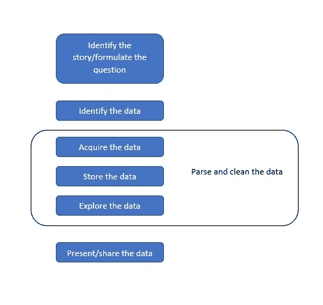
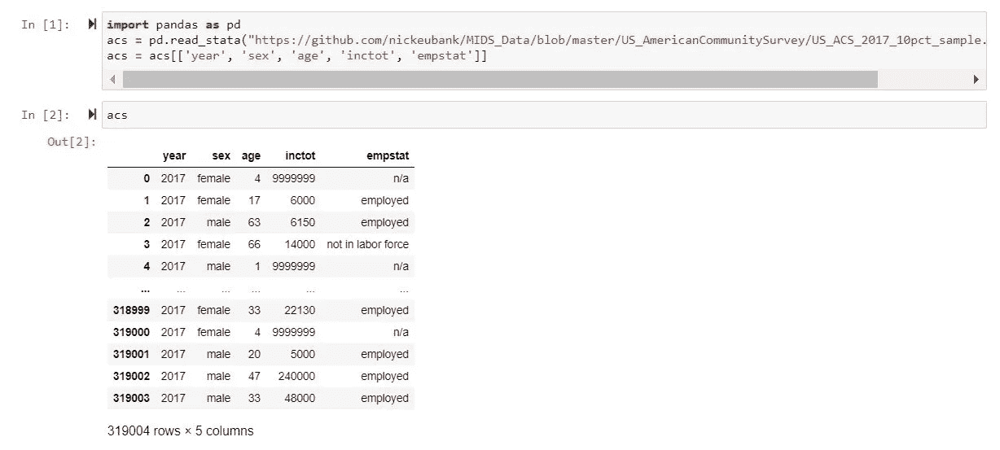
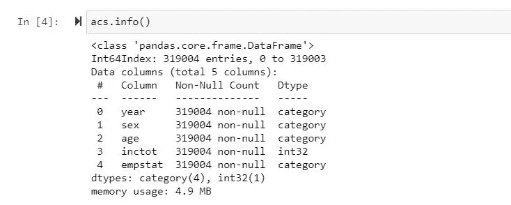
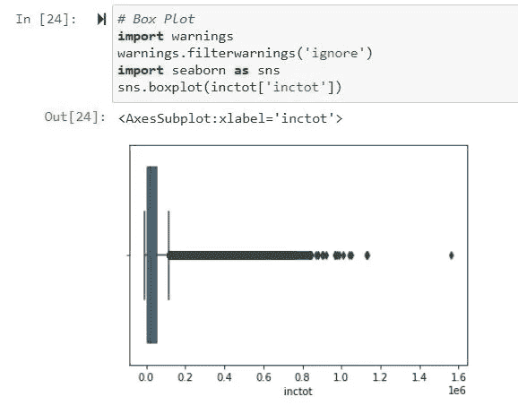
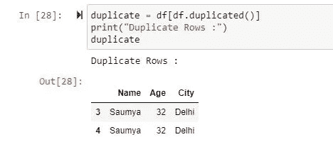
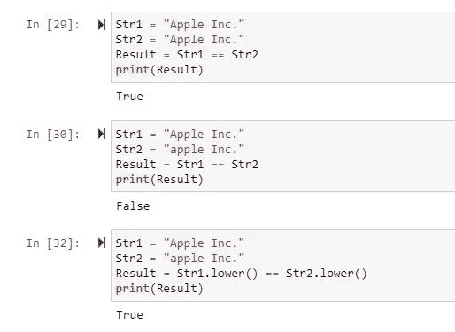
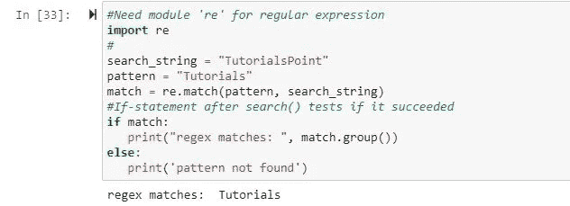

# 数据争论—数据清理:调查、匹配和格式化

> 原文：<https://medium.com/nerd-for-tech/data-wrangling-data-cleanup-investigation-matching-and-formatting-1d5958a9bce9?source=collection_archive---------12----------------------->

数据处理过程

**并非所有数据都是相同的**

尽管我们愿意相信我们看到的每个数据集的准确性和质量，但并不是所有的数据集都符合我们的期望。在进一步研究后，甚至我们目前使用的数据集也可能被证明是无效和低效的来源。当我们探索我们所面临的数据争论问题的自动化解决方案时，我们会发现 Python 可以帮助确定好数据与坏数据的工具，并帮助我们确定数据的可行性。

**可读性、清洁度和寿命**

我们可以使用 Python 来帮助我们读取难以辨认的数据，但是难以辨认可能意味着数据的来源不可靠。如果是由计算机生成的海量数据，那是一回事——数据库转储从来都不好看。但是，如果您拥有的数据难以辨认，并且来自人工来源，这可能表明存在数据清洁度和可变性的问题。

我们面临的另一个问题是我们的数据是否已经被清理。我们可以通过询问更多关于如何收集、报告和更新数据来确定这一点。

**存储数据:何时、为何、如何？**

找到数据后，我们需要一个地方来存储它。有时，我们会收到干净、易于访问、机器可读格式的数据。其他时候，我们可能想找到一种不同的方式来存储它。当我们第一次从 CSV 或 PDF 中提取数据时，我们将回顾一些要使用的数据存储工具，或者我们可以等待数据完全处理和清理后再存储。

**数据清理:调查、匹配和格式化**

清理我们的数据不是最吸引人的任务，但它是数据争论的一个重要部分。成为一名数据清理专家需要你的研究领域的精确性和健康的知识。知道如何正确地清理和组合您的数据将使我们在我们的领域中与众不同。

Python 是为数据清理而精心设计的；它帮助我们围绕模式构建功能，消除重复性工作。正如我们在目前的代码中已经看到的，学习用脚本和代码修复重复性问题可以将几个小时的手工工作变成我们运行一次的脚本。

**为什么要清理数据？**

有些数据可能经过适当的格式化后就可以使用了。如果是这样的话，我们应该感到幸运。但是，大多数数据，即使经过清理，也存在一些格式不一致或可读性问题(例如，首字母缩写词或不匹配的描述标题)。如果我们使用来自多个数据集的数据，情况尤其如此。除非我们花时间对数据进行格式化和标准化，否则我们的数据不太可能正确连接并有用。

如果我们想展示研究结果并发布我们的数据，我们会希望发布干净的版本。这为其他数据争论者提供了轻松导入和分析数据的机会。我们还可以将原始数据与您完成的数据集一起发布，并注明我们采取了哪些步骤来清理和规范化它。

**识别数据清理值**

我们从简单检查我们找到的字段和我们能看到的任何视觉不一致开始我们的数据清理。如果我们通过使数据看起来更干净来开始我们的数据清理，我们将会很好地了解当我们规范化我们的数据时我们必须克服的初始问题。

识别价值

inctot (9999999)中有一些奇怪的值，年龄覆盖了相当大的范围，empstat 中有一些 n/a 值。

**格式化数据**

数据清理最常见的形式之一是让我们不可读或难以阅读的数据和数据类型适合一种正确的可读格式。特别是如果我们需要创建包含数据或可下载文件的报告，我们会希望确保它从机器可读变为人类可读。如果我们的数据需要和 API 一起使用，我们可能需要特殊格式的数据类型。

格式化数据

**发现异常值和坏数据**

识别数据集中的异常值和坏数据可能是数据清理中最困难的部分之一，这需要时间来做好。即使我们对统计学和异常值如何影响我们的数据有深刻的理解，这也是一个需要谨慎探索的话题。

发现异常值和坏数据

**寻找重复**

如果我们使用多个具有相同调查数据的数据集，或者如果我们使用了可能有重复条目的原始数据，删除重复数据将是确保我们的数据得到准确使用的重要一步。

查找重复项

**模糊匹配**

如果我们使用一个以上的数据集或者不干净的、非标准化的数据，我们可能会使用模糊匹配来查找和合并重复的数据。模糊匹配允许我们确定两个项目(通常是字符串)是否“相同”虽然不如使用自然语言处理或机器学习来确定与大数据集在语言上的匹配那么深入，但模糊匹配可以帮助我们将“我的狗和我”与“我和我的狗”联系起来，因为它们具有相似的含义。

模糊匹配

**正则表达式匹配**

正则表达式允许计算机匹配、查找或消除代码中定义的字符串或数据中的模式。开发人员经常害怕正则表达式，因为它们可能变得复杂，难以阅读和理解。但是，它们可能非常有用，对它们的基本介绍可以帮助您阅读、编写和理解正则表达式何时可以帮助您解决问题。

正则表达式匹配

**结论**

在这次讨论中，我们了解了数据清理的基础知识，以及为什么它是我们数据争论过程中的一个重要步骤。

清理我们的数据有利于存储、搜索和重用。如果先清理数据，将数据存储在适当的模型中会容易得多。

如果我们可以标准化我们期望看到的内容，并清除或删除不符合的记录，那么我们就可以确保数据的一致性，并在以后需要查询数据集中的资产时消除繁重的工作。

**参考**

与 Python 的数据角力；作者:杰奎琳·卡齐尔、凯瑟琳·贾穆尔；上映日期:2016 年 2 月；出版商:奥莱利媒体公司 ISBN: 9781491948811

【使用正则表达式在 Python 中进行模式匹配(tutorialspoint.com T2)

[根据所有或选定的列在数据帧中查找重复行— GeeksforGeeks](https://www.geeksforgeeks.org/find-duplicate-rows-in-a-dataframe-based-on-all-or-selected-columns/)

[使用 Python-GeeksforGeeks](https://www.geeksforgeeks.org/detect-and-remove-the-outliers-using-python/)检测并移除异常值

[Python 中的模糊字符串匹配— DataCamp](https://www.datacamp.com/community/tutorials/fuzzy-string-python)

[使用正则表达式在 Python 中进行模式匹配(tutorialspoint.com)](https://www.tutorialspoint.com/pattern-matching-in-python-with-regex)