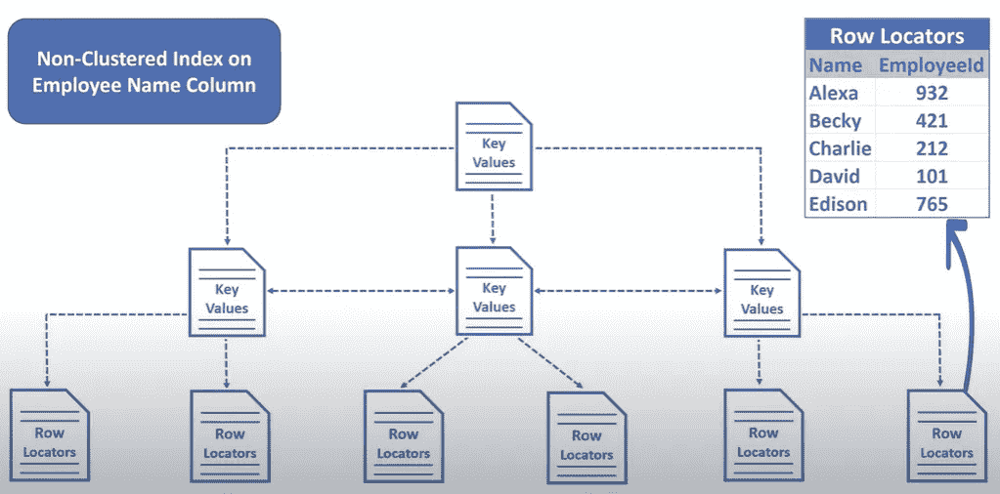

# 简而言之，数据库索引

> 原文：<https://medium.com/nerd-for-tech/database-indexing-in-a-nutshell-b525b73eadef?source=collection_archive---------2----------------------->

## 索引是一种性能调整方法，可以更快地检索记录。索引为索引列中的每个值创建一个入口点。


马库斯·温克勒在 [Unsplash](https://unsplash.com?utm_source=medium&utm_medium=referral) 上的照片

*索引*是在数据库后台使用的查找表，用于加快查询速度。索引通过提供一种快速查找所请求数据的方法来增强查询。

简单地说，索引是指向表中数据的指针。数据库中的索引非常类似于一本书的索引页。

## Index 通过提供指向关联值的指针，帮助数据库快速找到行。

## 为什么要索引？

当数据库表变得更大时，扫描数百万、数十亿或数万亿行，只返回两三行是一种巨大的浪费。

想象一下，当你的老师要求你打开第五章，并阅读该章中的某个子主题。你显然没有一页一页地滚动，以达到特定的子主题。你可以进入“索引”页面，从第五章找到特定子主题的页码，然后直接打开该页码。

同样，当你请求一个特定的行时，数据库使用它们的索引来查找所请求的数据，如果 DBMS 没有索引，当你请求一个特定的行时，它将按顺序进行并检查每一行；"*这是我需要的那一行吗？*”，如果是则返回，如果不是，则继续搜索直到结束。

索引只是一种存储在 DBMS 中的数据结构，最常见的形式是 B 树或哈希表。

> *默认情况下，大多数 DBMS 自动在主列和唯一列上创建索引。*

在本文中，我们将讨论两种非常流行的索引技术。

# **聚集索引**

聚集索引定义了数据在表中的存储顺序，表只能按一种方式排序。因此，每个表只能有一个聚集索引。在 RDBMS 中，主键通常允许您基于特定的列创建聚集索引。任何经过**排序且唯一的**列值都可以用作聚集索引，大多数情况下使用二分搜索法算法来高效地检索数据。


EmployeeId 的聚集索引

# **非聚集索引**

当您需要使用另一列来查询数据时，我们可以创建一个称为非聚集索引的辅助索引。假设我们想为*雇员表*、*、*中的*第一个*、*姓名*创建一个辅助索引，而聚集索引是*雇员 id。*

对于具有大量插入/更新操作的表，应该首选非聚集索引，因为它不需要额外的时间和 CPU 计算来在实际表上的每次插入/更新后对行进行排序。


名字的非聚集索引

***但是非聚集索引比聚集索引*** 低，因为我们仍然需要从为二级索引创建的表中读取数据，然后跳转到 employee 表以获得特定的雇员。但是，它比全表扫描快得多。


**运行速度比较**

## **索引是如何工作的？**

假设您有一个主键的索引(*雇员 id* )。这将在一个单独的表中创建一个主键值的有序列表，每个条目都有一个指向原始表中相对值的指针。

每当你想使用主键访问表时，它将使用二分搜索法算法(耗时 O(LogN))来访问索引表中所需的值，然后，转到原始表中的相对值。


**聚集索引**

**在*员工 id 上创建的聚集索引***中， *员工 id 存储在多个数据页/页面文件中。*当您要求一个特定的*员工 id* 时，它将导航到相关的页面文件以选择值。

> 页面文件是数据库系统保存数据的基本和最小单位。无论数据库有多大，所有的原始数据都存储在页面文件中。



**非聚集索引**

**非聚集索引**在单独的表中创建；它有两列，一列用于姓氏，一列用于相应的*员工 id* 。创建的表现在按*姓氏*排序，这种方式我们实际上不能在 employee 表中使用，因为我们已经按*雇员 id* 排序。

当查询非聚集索引时，它使用与员工 Id 关联的行定位器找到相关的行。然后在聚集索引中导航，并在实际的表中找到相关的数据行。

# **创建索引**

```
CREATE INDEX employee_idx
  ON employee(employee_id);
```

# 最后的想法

为数据库编制索引需要很好地理解数据、用户功能以及数据库是如何编制索引的。当处理大型数据集时，打开数据库终端并在有索引和没有索引的表上运行查询会发现速度有很大的差异。

索引可以大大提高搜索速度，但它们也有相关的缺点。每个插入、更新或删除操作都需要更新索引。如果你添加越来越多的数据，它将消耗更多的时间和占用大量的空间。当表包含多个索引时，每个索引都会增加处理表更新的时间。到目前为止，仅对用于搜索目的的列创建索引是一个很好的选择。

# 包装东西

最后，我希望您对数据库索引有一个清晰的概念。

如果有什么我说得不对的地方，欢迎在下面评论！。*如果你喜欢这篇文章，点击👏下面这样更多的人可以看到它！请务必在*[***Medium***](/@susithrj)**或* [***我的博客***](https://susithrj.wordpress.com/)**上关注我，以便在有新文章发表时获得更新。***

***快乐*索引 ！👌**