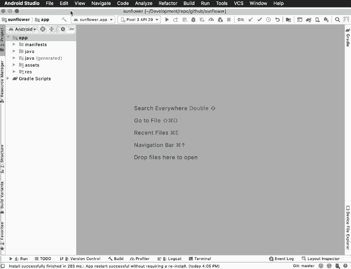
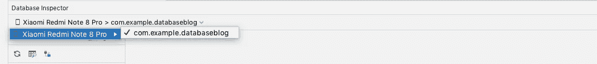
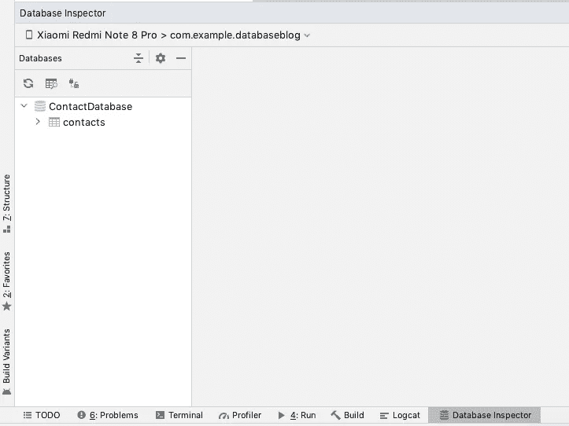
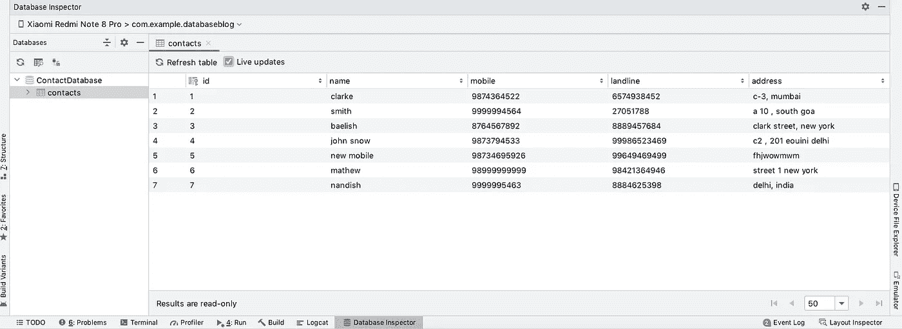
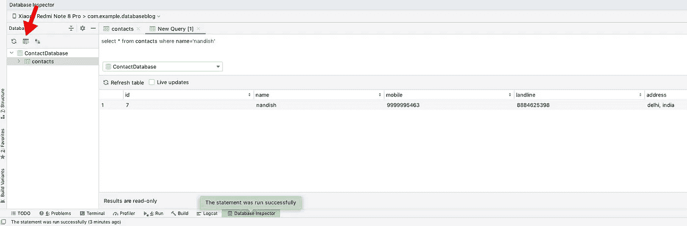

# 数据库检查器—查看 SQLite 数据

> 原文：<https://medium.com/nerd-for-tech/database-inspector-view-sqlite-data-e8a103e737ee?source=collection_archive---------11----------------------->

使用数据库检查器直接从 android studio 查看存储在数据库中的数据。期待已久的功能终于来了。

创建和管理本地数据库是 android 应用程序最常见和最重要的方面之一。到目前为止，开发人员依赖第三方软件来查看和操作数据库中的数据。

最后，谷歌听到了开发者的祈祷，他们在 ndroid studio 4.1 中发布了数据库检查器。您不仅可以查看数据，还可以在应用程序中查询和操作实时运行的数据。

# 打开数据库检查器

要在 Android Studio 中打开数据库检查器，从菜单栏中选择**视图>工具窗口>数据库检查器**。

接下来，您需要选择您想要调试的设备和应用程序包。

一旦您选择了正确的应用程序进程，您将能够在下面的面板中看到数据库模式

> ***数据库检查器将在 API 等级为 26 或更高的设备上工作***

# 图像数据

要浏览表中的数据，请单击要查看其数据的表的名称。
例如，在我们的例子中，我们有一个名为“contacts”的表，当我们选择它时，表中的所有数据都显示在右侧

# 实时更新

选择复选框“实时更新”将显示从应用程序更新的数据。

# 执行 SQL 查询

您可以通过单击“打开新查询选项卡”按钮来运行查询。您将在右侧看到一个用于输入查询的部分和一个用于选择数据库的下拉列表。输入查询并单击 Run 按钮，您将看到下面的结果。

# 编辑行中数据

人们可以直接在 android studio 中编辑数据，它会在设备数据库中自动更新。只需选择想要更新的字段，然后输入新信息。请记住，在尝试更新单元格中的数据之前，请取消选中“实时更新”复选框。

*暂时就这样吧！！
感谢您的阅读，不要忘记与您的开发伙伴分享:)
这篇文章最初发布在*[*code theraphy*](https://www.codetheraphy.com/)