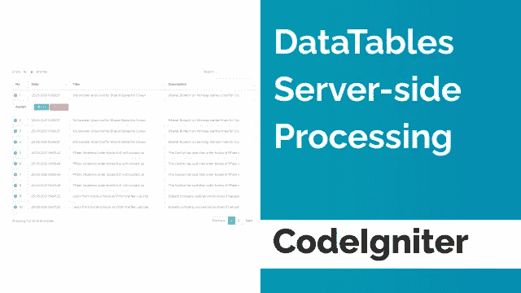

# CodeIgniter 中的数据表服务器端处理

> 原文：<https://medium.com/nerd-for-tech/datatables-server-side-processing-in-codeigniter-6e0c88ef59e8?source=collection_archive---------2----------------------->



CodeIgniter 中的数据表服务器端处理

本教程将讨论在 Codeigniter 中实现带有远程服务器端处理的 DataTables jQuery 插件的最简单方法。在这里，我将看到如何在 Codeigniter 中通过 ajax 从远程 MySQL 数据库获取数据。

**DataTables** 是 jQuery Javascript 库的一个表格增强插件，它可以帮助简单的 HTML 表格增加排序、分页和过滤功能。主要目标是增强普通 HTML 表中数据的可访问性。

对于本教程，我们只需要查看 6 个 post 请求。

1.  **长度**:表格在本次绘制中可以显示的记录数。除非服务器返回的记录更少，否则返回的记录数应该等于这个数。
2.  **开始**:分页首录指示灯。这是当前数据集中的起始点(基于 0 索引，即 0 是第一条记录)。
3.  **order[0]Column**:order 应该应用的列。这是对也提交给服务器的列的信息数组的索引引用。
4.  **order[0]dir** :该列的排序方向。它将是 ASC 或 DESC，分别表示升序或降序。
5.  **搜索【值】**:全局搜索值。
6.  **绘制**:绘制计数器。数据表使用它来确保从服务器端处理请求返回的 Ajax 是由数据表按顺序绘制的(Ajax 请求是异步的，因此可以无序返回)

# 查看页面

```
<!DOCTYPE html>
<html lang="en">

<head>
	<meta charset="utf-8" />
	<title>News - List</title>
	<meta name="viewport" content="width=device-width, initial-scale=1.0">
	<meta content="A fully featured admin theme which can be used to build CRM, CMS, etc." name="description" />
	<meta content="Coderthemes" name="author" />
	<meta http-equiv="X-UA-Compatible" content="IE=edge" />
	<link rel="stylesheet" href="https://maxcdn.bootstrapcdn.com/bootstrap/3.4.1/css/bootstrap.min.css">
	<link rel="stylesheet" type="text/css" href="https://cdn.datatables.net/1.10.24/css/jquery.dataTables.min.css"/>

	<script src="https://ajax.googleapis.com/ajax/libs/jquery/3.5.1/jquery.min.js"></script>
	<script src="https://maxcdn.bootstrapcdn.com/bootstrap/3.4.1/js/bootstrap.min.js"></script>
	<script type="text/javascript" src="https://cdn.datatables.net/1.10.24/js/jquery.dataTables.min.js"></script>
</head>

<body>
	<!-- Begin page -->
	<div id="wrapper">

		<div class="content-page">
			<div class="content">
				<!-- Start Content-->
				<div class="container-fluid">
					<!-- start page title -->
					<div class="row">
						<div class="col-12">
							<div class="page-title-box">
								<div class="page-title-right">
								</div>
								<h4 class="page-title">News - List</h4>
							</div>
						</div>
					</div>
					<!-- end page title -->
					<div class="row">
						<div class="col-xl-12 col-lg-12">
							<div class="card-box">
								<table id="table-news" class="table table-bordered dt-responsive nowrap" width="100%">
									<thead>
										<tr>
											<th width="5%">No.</th>
											<th width="10%">Date</th>
											<th width="30%">Title</th>
											<th width="25%">Description</th>
											<th width="20%">Action</th>
										</tr>
									</thead>
									<tbody>
									</tbody>
								</table>
							</div>
						</div>
					</div>
					<!--- end row -->	
				</div>
				<!-- end container-fluid -->
			</div>
			<!-- end content -->
		</div>
	</div>
	<script>
	$(function() {
		var table_news = $('#table-news').DataTable({
			"processing":true,
			"serverSide":true,  
			"order":[], 
			"ajax": {
				url : '<?php echo base_url("news/news_list"); ?>',
				type: "GET"  
			},
			"columnDefs":[  
				{  
					"targets":[0],  
					"orderable":false,
				},  
			], 
		});
		$("#table-news tbody").on('click', 'button', function() {
			var id = $(this).attr('data-id');
			if(this.name == "deleteButton") {
				var is_delete = confirm("Are your sure?");
				if(is_delete) {
					$.post('news/delete', {id: id}, function(result) {
						$(".result").html(result);
						table_news.ajax.reload();
					});
				}
			}
		});
	});
	</script>
</body>

</html>
```

# 控制器

```
<?php
defined('BASEPATH') OR exit('No direct script access allowed');

class News extends MY_Controller {

	public function __construct() {
		parent::__construct();
		$this->load->model('News_model', 'news');
		//
		$this->ip_address 	= $_SERVER['REMOTE_ADDR'];
		$this->datetime 	= date('Y-m-d H:i:s');
		$this->login_id 	= $this->session->userdata('login_id');
		$this->login_name 	= $this->session->userdata('login_name');
	}

	public function index() {
		$this->list();
	}

	public function list() {
		$data 					= [];
		$data['content_title'] 	= 'News - List'; 
		$data['status_list']	= $this->status->get_all(["status"=>"1"]);
		$this->load->view('list', $data);
	}

	public function news_datatable() {
		$arrayList = [];
		$result 	= $this->news_defer->getRows($this->input->get()); 
		$i 			= $this->input->get('start');
		foreach($result as $row) {
			$action = '
			<a href="'.base_url('news/edit?id='.$row->id).'" class="btn btn-sm btn-primary">
              <i class="fe-edit"></i> Edit</a>
			<button name="deleteButton" data-id="'.$row->id.'" class="btn btn-sm btn-danger">
              <i class="fe-trash"></i> Delete</button>
			';
			$arrayList [] = [
				++$i,
				nice_date($row->created_at, 'd-m-Y H:i:s'),
				$row->title,
				$row->description,
				$action
			];
		}
		$output = array(
			"draw" 				=> $this->input->get('draw'),
			"recordsTotal" 		=> $this->news_defer->countAll(),
			"recordsFiltered"	=> $this->news_defer->countFiltered($this->input->get()),
			"data" 				=> $arrayList,
		);

		echo json_encode($output);
	}

	public function delete() {
		$id 		= $this->input->post('id');
		$where 		= ['id' => $id];
		$result = $this->news->delete($where);
		if($result) {
			echo "deleted";
		}
	}
}
```

# 模型页面

```
<?php
defined('BASEPATH') OR exit('No direct script access allowed');

class News_defer_model extends CI_Model {

	public function __construct() {
		parent::__construct();

    	$this->is_admin       = ($this->session->userdata('login_role') == "admin") ? true : false;
    	$this->login_id       = $this->session->userdata('login_id');
		//
		$this->table          = 'news_info';
		$fields               = $this->db->list_fields($this->table);
		$this->column_order   = $this->getColumnOrder($fields);
		$this->column_search  = $this->getColumnSearch($fields);
	}

	public function getColumnOrder($fields) {
		$list 		= [];
		$list[0] 	= null;
		foreach($fields as $field) {
			$list[] = $field;
		}
		return $list;
	}

	public function getColumnSearch($fields) {
		$list 		= [];
		foreach($fields as $field) {
			$list[] = $field;
		}
		return $list;
	}

	public function getRows($postData){
        $this->_get_datatables_query($postData);
        if($postData['length'] != -1){
            $this->db->limit($postData['length'], $postData['start']);
        }
        $query = $this->db->get();
        return $query->result();
    }

    public function countAll(){
        $this->db->from($this->table);
        return $this->db->count_all_results();
    }

    public function countFiltered($postData){
        $this->_get_datatables_query($postData);
        $query = $this->db->get();
        return $query->num_rows();
    }

    private function _get_datatables_query($postData){

        $this->db->from($this->table);
        if($this->is_admin) {
        	$this->db->where(["status"=>$postData['status']]);
        } else {
        	$this->db->where(["status"=>$postData['status'], "created_by"=>$this->login_id]);
        }
        $this->db->order_by('created_at', 'DESC');

        $i = 0;
        // loop searchable columns 
        foreach($this->column_search as $item){
            // if datatable send POST for search
            if($postData['search']['value']){
                // first loop
                if($i===0){
                    // open bracket
                    $this->db->group_start();
                    $this->db->like($item, $postData['search']['value']);
                }else{
                    $this->db->or_like($item, $postData['search']['value']);
                }
                // last loop
                if(count($this->column_search) - 1 == $i){
                    // close bracket
                    $this->db->group_end();
                }
            }
            $i++;
        }

        if(isset($postData['order'])){
            $this->db->order_by($this->column_order[$postData['order']['0']['column']], $postData['order']['0']['dir']);
        }else if(isset($this->order)){
            $order = $this->order;
            $this->db->order_by(key($order), $order[key($order)]);
        }
    }

}
```

更多信息请访问[https://infovistar . com/codeigniter/datatable-server-side-processing-in-codeigniter](https://infovistar.com/codeigniter/datatable-server-side-processing-in-codeigniter)