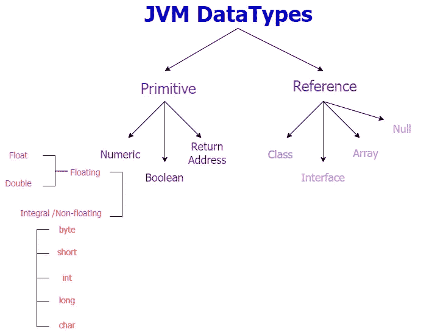

# JVM 中的数据类型

> 原文：<https://medium.com/nerd-for-tech/datatypes-in-jvm-356b09fe7b46?source=collection_archive---------3----------------------->

对不起，我弄错了吗？？？是 Java 里的数据类型吗？？？

是的，这是正确的！！！我们要讨论 JVM 中的 ***数据类型！！！***

众所周知，JVM 是有内存区域的。希望你们都记得！让我重述一下！

JVM 有 3 个组件，其中一个是内存区域。已编译的。类文件首先由 JVM 读取，然后加载到 JVM 中。一边读着。类文件，它在**方法区**中存储了**类信息**。加载完。类文件到 JVM 中，它将所有的**对象的数据**存储在**堆区**、**方法信息、**栈**中的局部变量信息**、 **PC 寄存器中的下一条指令**的**内存地址、**和**本机方法栈**中的**本机方法信息**。

这说明 JVM 是存储数据的！很明显，这就是为什么它有一个记忆区域！

因此，需要知道保存这些数据的数据类型！

JVM 中的数据类型与 Java 语言中的**数据类型非常相似。他们有两种类型。**

*   Primitive —这些数据类型本身保存数据的 ***值*** 。
*   引用—这些数据类型本身不保存数据的值，但是它们保存对数据的值 的 ***引用。***

下图显示了 JVM 中的数据类型是如何分类的。



JVM 数据类型分类

好吧，但是 JVM 如何区分这些类型呢？？？

> JVM 希望所有类型检查都在运行前完成，通常由编译器完成，这样就不需要自己检查了。在运行时，基本类型的值不需要被标记或检查来确定它们的类型。相反，JVM 的指令集使用旨在对特定类型的值进行操作的指令来区分其操作数类型。
> 
> 例如，JVM 指令，如 ***ladd、iadd、fadd 和 dadd，*** 将两个数值相加&产生数值结果，但每个结果都是针对每个操作数类型的。
> 
> ***【梯子】*** - >为 ***长*** 数据
> 
> ***iadd*** - >为***int*数据**
> 
> ***fadd*** - >为 ***浮点*** 数据
> 
> ***dadd*** - >为 ***double*** 数据

JVM 支持的原始数据类型是数字、布尔和返回地址类型。

# 数字的

数字类型主要保存数值，由整型/非浮点型和浮点型组成。

整数类型存储整数，正数或负数，不带小数。这些包括:

*   byte —取范围从-128 到 127(包括这两个值)的 2⁸位有符号整数值。
*   short —取 2 个⁶位有符号整数值，范围从-32768 到 32767，包括这两个值。
*   int —取范围从-2147483648 到 2147483647(含)的 2 位有符号整数值。
*   long —采用 2⁶⁴位有符号整数值，范围从-9223372036854775808 到 9223372036854775807，包括这两个值。
*   char —取 16 位无符号整数，范围从 0 到 65535，包括 0 和 65535。

浮点类型存储包含一个或多个小数的数字。这些包括:

*   float——一个 32 位单精度浮点数，浮点值的精度表示该值在小数点后可以有多少位数。浮点数在小数点后只能有 6-7 位数。

默认情况下，*浮点数*在 java 中被视为*双精度数*。因此，当在 Java 中初始化一个浮点数时，我们需要做以下事情。

```
//Defining a float numberfloat height = 167.7;//Above initialisation gives a compilation error. Error corrected by //adding a suffix 'F' or 'f'float height = 167.7f;
//OR
float height = 167.7F;
```

*   double—64 位双精度浮点数。双精度值的小数点后可以有 15 位数字。初始化双变量时，可以选择使用后缀“D”或“D”。

```
//Defining the double variable
double price = 980.97D;
//OR 
double price = 980.97;//Any way Java will store price as a double variable.
```

好吧，数字太多了？？？我们来讨论布尔！！！

# 布尔代数学体系的

尽管 JVM 定义了一个布尔类型，但它只提供了有限的支持，也就是说，没有 JVM 指令专门用于布尔值的操作。*相反，java 编程语言中操作布尔值的表达式被编译为使用****JVM******int***数据类型的值。所以在 JVM 中，*布尔型*用 *int 或者 byte 来表示。*

这就是为什么 Java 语言中的“布尔假”表示为 0，而 Java 语言中的“布尔真”表示为非零/ 1。

JVM 直接支持布尔数组。布尔数组由字节数组表示。使用字节数组指令访问和修改布尔数组。

简单来说， ***Java 语言的布尔值*** 被编译器映射成 JVM 类型 int 的 ***值。Java 语言*** 中的布尔数组映射到 ***JVM 字节数组。***

# 回信地址

JVM 中最后一个原语类型是**返回地址类型**。开发者不能使用这种数据类型，因为它是 JVM 专用的****在 Java 语言*** 中找不到。与数字基本类型不同，返回地址类型不对应于任何 Java 语言类型，并且不能被正在运行的程序修改。*

*再次强调！！！在原语类型中，只有 ***返回地址类型*** 是 ***不直接与 Java 编程语言类型*** 相关联。*

*JVM 使用这种数据类型来实现“final”关键字或“final 块”。*

*好吧！唷！够原始了！！！让我们来看看引用数据类型。*

# *参考类型*

*对对象的引用被认为具有 JVM 类型**引用**。引用类型值被认为是指向对象的指针，也就是说，该值是**存储在堆区域中的对象的内存地址**。一个对象或者是一个动态分配的**类实例**或者是一个数组 ***。****

*JVM 中有 4 种类型的引用数据类型。*

*   *类类型引用—对特定类的实例的引用。*
*   *接口类型引用—对特定接口的实现类实例的引用。*

*例如，有一个接口 A 和一个实现这个接口的类 B。下面的代码片段进一步解释了这一点。*

```
*//Interface A
interface A {
   void speak();
}//class B implements the interface A
class B implements A {
   public void speak() {
     System.out.println("bow bow!!!");
   }
}//main class
public class mainB {
   public static void main(String args[]) {
      **B b1 = new B();** //<-------- **this is an interface type //reference, it references to the instance of class B.**
      b1.speak();
   }
}*
```

*   *数组类型引用—对数组的引用。*
*   *空引用—这是一种特殊类型，它不引用任何地方，即不引用任何对象，也不引用任何对象！*引用类型*的*默认值*为*空。**

*还有一种特殊的关键字叫做 ***字*** 或者 ***字大小*** 。这只是一个基础/单位，因为你不能从字的大小来衡量。我们需要给单词大小赋值来解释它。*

*内部 JVM 实现表示为字长。字长由特定的 JVM 实现决定。定义单词长度有两个规则:*

1.  *字长应该能够容纳任何原始数据类型。*

*比如有一个变量叫“int a”，字长要能装“a”。*

*2.两倍的字大小，即 2 个字(WORD WORD)应该能够保存长值或双精度值。*

*在实现字长时，必须考虑这两个规则。因此，这意味着字长至少应为 32 位。*

*对，就是它！！！希望你喜欢阅读，并得到更好的理解！！！*

*快乐学习！！！*

# *参考*

1.  *[第二章。Java 虚拟机的结构(oracle.com)](https://docs.oracle.com/javase/specs/jvms/se8/html/jvms-2.html#jvms-2.2)*
2.  *[(27) JVM 第三部分—JVM 中的数据类型— YouTube](https://www.youtube.com/watch?v=6AWckdRYWTI&list=PLD-mYtebG3X-rF1hU16AC3Rf9E-mAAkXJ&index=3)*
3.  *[浮点 Vs 双 Java—Java point](https://www.javatpoint.com/float-vs-double-java)*