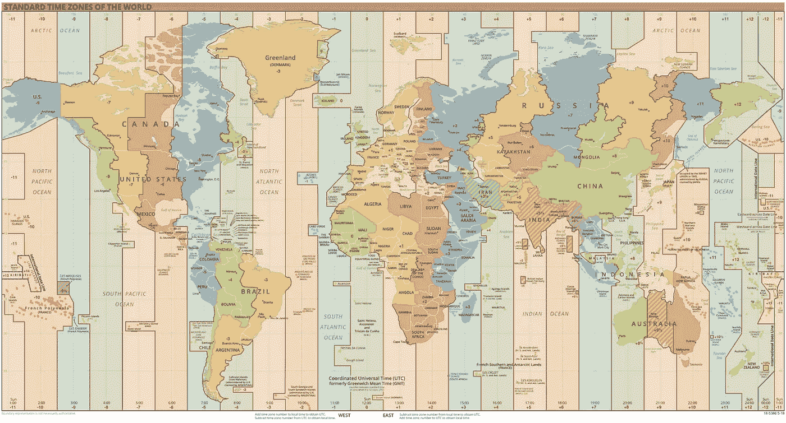

# 日期和时间在编程中的重要性

> 原文：<https://medium.com/nerd-for-tech/date-and-time-and-timezone-f40984779553?source=collection_archive---------15----------------------->


特里斯坦·科朗吉罗在 [Unsplash](https://unsplash.com?utm_source=medium&utm_medium=referral) 上拍摄的照片

世界上的一切都完全取决于日期和时间。今天是 2021 年 5 月 16 日，现在是凌晨 12 点 14 分，但是全世界的时间都一样吗，不对，为什么呢？因为显然我们知道地球是一个球体，当**围绕太阳旋转的时候，**围绕着**轴旋转。所以太阳不可能同时出现在地球上所有的地方。因此，地球的一半将有白天，另一半将有夜晚。世界上有 24 个时区。一天被分解成几秒钟，通过计算得到某个地点的精确时间。但事情没那么简单。24 个时区，每个时区代表一天中的一个小时，理论上像经度一样垂直画在地球上。一切都要遵循一个标准，避免冲突。这就是 UTC 发生的地方。 **UTC** 是世界调节时钟和时间的主要时间标准，其范围从最西端(12:00)到最东端(+14:00)。**



(图片:[https://en.wikipedia.org/wiki/List_of_UTC_time_offsets](https://en.wikipedia.org/wiki/List_of_UTC_time_offsets))

有些国家有多个时区，而有 23 个国家至少有两个时区。时区最多的国家是法国，主要是因为它在世界各地都有自己的领地。但是有些国家虽然有多个时区，但大多数情况下他们只用一个时区。你知道有些国家会改变他们的时间。让我们讨论一下。

## 日光节约

在较温暖的月份将时钟拨快(通常拨快一小时)的做法，在美国和加拿大称为夏令时或夏令时，在英国、欧盟和其他国家称为夏令时。为了恢复标准时间，时钟通常在春季向前调整一小时(“春季向前”)，在秋季向后调整一小时(“秋季向后”)。因此，在冬末或早春，有一个 23 小时的一天和一个 25 小时的一天，而在秋季，有一个 25 小时的一天。

作为一名程序员，他或她在处理日期和时间时必须意识到这一点，因为这可能会导致项目中的灾难性情况。所以让我们谈谈程序员如何处理这个问题。

# Java 8 日期时间 API

Java 8 中引入了全新的日期和时间 API。新的 Java 日期和时间 API 可以在`java.time`包中找到，它包含在标准 Java 8 类库中。Java 8 日期时间 API 的关键区别在于，自 1970 年 1 月 1 日以来，日期和时间现在用秒和纳秒的数量来表示，而不是用毫秒的数量来表示。long 表示秒数，可以是正数也可以是负数。int 表示纳秒数，它总是正数。新的 Java 日期时间 API 中的许多类将使用这种新的日期和时间格式。

这个 API 中有一些有用的常用类，比如 **LocalDate** ， **LocalTime，LocalDateTime** 和 **ZonedDateTime。让我们一个一个地讨论。**

## 本地日期

Java 8 date time API 中的 LocalDate 类定义了一个本地日期，这是一个没有与之关联的时区的日期。本地日期是指一年中特定的一天，如生日或法定假日。这个类在`java.time`包里。所以它的完全限定类名是`java.time.LocalDate`，并且这个类是不可变的。所以它将为在一个`LocalDate`类上进行的所有计算返回一个新的`LocalDate`。默认格式为( **YYYY-MM-DD** )。

有几种方法可以创建，

*   使用`now`关键字获取当前日期

```
LocalDate localDate = LocalDate.now();
```

所以如果我们打印变量`localDate`，我们将能够得到打印发生的日期。

*   通过手动输入日期、月份和年份等信息进行创建

```
LocalDate localDate1 = LocalDate.of(2021, 05, 16);
```

我们还可以使用以下方法来获取日期信息，

*   `getYear()`
*   `getMonth()`
*   `getDayOfMonth()`
*   `getDayOfWeek()`
*   `getDayOfYear()`

## 本地时间

Java 8 日期时间 API 的`LocalTime`类指定了一天中指定的时间，而没有任何时区信息。例如，上午 10:00。如果相关国家的时间比 UTC 更重要，则可以使用`LocalTime`实例来表示不同国家的学校或工作开始时间。您可以用带时区的 UTC 来表示，但是也可以使用不带时区信息的`LocalTime`对象。

这里也有几种方法来创建它，

*   像`LocalDate`一样使用`now`关键字获取当前时间

```
LocalTime localTime = LocalTime.now();
```

*   通过手动给出诸如小时、分钟、秒和纳秒的信息来创建`LocalTime`

```
LocalTime localTime1 = LocalTime.of(02, 11, 59, 1200);
```

获取时间信息的方法有以下几种:

*   `getHour()`
*   `getMinute()`
*   `getSecond()`
*   `getNano()`

## 本地日期时间

Java 8 日期时间 API 中的`LocalDateTime`类(java.time.LocalDateTime)表示没有时区信息的本地日期和时间。`LocalDateTime`类是 Java 8 日期时间 API 的`LocalDate`和`LocalTime`类的混合。

这里也有几种方法来创建它，

*   LocalDateTime 对象的静态工厂方法之一用于构造它。

```
LocalDateTime localDateTime = LocalDateTime.now();
```

*   创建`LocalDateTime`对象的另一种方法是基于特定的年、月、日等创建它。

```
LocalDateTime localDateTime2 = LocalDateTime.of(2021, 05, 16, 02, 16, 36, 1100);
```

有一些方法用于访问日期和时间字段信息，如下:

*   `getYear()`
*   `getMonth()`
*   `getDayOfMonth()`
*   `getDayOfWeek()`
*   `getDayOfYear()`
*   `getHour()`
*   `getMinute()`
*   `getSecond()`
*   `getNano()`

## ZonedDateTime

Java 8 日期时间 API 的`ZonedDateTime`类表示包含时区信息的日期和时间。

这里也有几种方法来创建它，

*   第一个是调用`ZonedDateTime`类的`now()`方法。

```
ZonedDateTime zonedDateTime = ZonedDateTime.now();
```

*   `of()`方法可以从特定的日期和时间创建 ZonedDateTime 对象，这是创建 ZonedDateTime 对象的另一个选项。这可能标志着一个世界性事件的开始，比如一个会议或一次火箭发射。为了处理时区问题，我们可以使用 ZonedDateTime 类。我们必须利用 ZoneId 类来获取或设置特定的时区。

```
ZoneId zone= ZoneId.of("Asia/Colombo");
```

也可以将 UTC 值作为参数来获取区域。现在让我们创建`zonedDateTime`对象，

```
ZonedDateTime zonedDateTime1 = ZonedDateTime.of(2021, 05, 16, 02, 28, 59, 1345, zone);
```

因为我们可以得到某个特定地区的日期和时间，所以让我们试着转换有夏令时问题的国家的时间。

所以输出是，

```
2021-05-16T02:46:09.538271700+05:30[Asia/Colombo]
2021-05-15T22:16:09.538271700+01:00[Europe/London]
```

所以在 Java 中，`ZonedDateTime`自己处理日光节约。通常最好用在情况紧急的场合，如国际会议、葬礼、出生时间(发生在国外)或类似的场合。正常情况下，我们可以使用`LocalDateTime`

# 参考

[](https://www.geographyrealm.com/country-time-zones/) [## 哪个国家的时区最多？

### 时区是遵守相同标准时间的地区或区域。世界纵向分为时间…

www.geographyrealm.com](https://www.geographyrealm.com/country-time-zones/) [](http://tutorials.jenkov.com/java-date-time/index.html) [## Java 日期时间教程

### 当您第一次试图弄清楚如何使用 Java 日期和时间 API 时，它可能会相当令人困惑。因此我把…

tutorials.jenkov.com](http://tutorials.jenkov.com/java-date-time/index.html) 

【https://en.wikipedia.org/wiki/Daylight_saving_time 号

 [## java.time (Java 平台 SE 8)

### 日期、时间、瞬间和持续时间的主 API。这里定义的类表示主要的日期-时间…

docs.oracle.com](https://docs.oracle.com/javase/8/docs/api/java/time/package-summary.html)