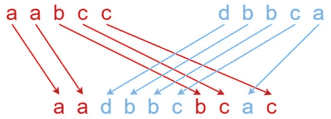

# 第二天:交叉字符串

> 原文：<https://medium.com/nerd-for-tech/day-2-interleaving-string-d4d3f20e9379?source=collection_archive---------16----------------------->

***问题链接:***

[https://leet code . com/explore/challenge/card/June-leet codeing-challenge-2021/603/week-1-6 月 1 日-6 月 7 日/3765](https://leetcode.com/explore/challenge/card/june-leetcoding-challenge-2021/603/week-1-june-1st-june-7th/3765/) /

***问题陈述:***

给定字符串`s1`、`s2`、`s3`，找出`s3`是否由`s1`的**和`s2`的**交错而成。

两个串`s`和`t`的**交错**是一种配置，其中它们被分成**非空**子串，使得:

*   `s = s1 + s2 + ... + sn`
*   `t = t1 + t2 + ... + tm`
*   `|n - m| <= 1`
*   **交错**为`s1 + t1 + s2 + t2 + s3 + t3 + ...`或`t1 + s1 + t2 + s2 + t3 + s3 + ...`

**注意:** `a + b`是字符串`a`和`b`的串联。

***例 1:***

```
**Input:** s1 = "aabcc", s2 = "dbbca", s3 = "aadbbcbcac"
**Output:** true**Explanation:**
```



***例二:***

```
**Input:** s1 = "aabcc", s2 = "dbbca", s3 = "aadbbbaccc"
**Output:** false
```

***例题 2:***

```
**Input:** s1 = "", s2 = "", s3 = ""
**Output:** true
```

***约束:***

*   `0 <= s1.length, s2.length <= 100`
*   `0 <= s3.length <= 200`
*   `s1`、`s2`和`s3`由小写英文字母组成。

***我的解决方案:***

```
from functools import lru_cachedef isInterleave(self, s1: str, s2: str, s3: str) -> bool:        
    if len(s3) != len(s1) + len(s2): return False

    [@lru_cache](http://twitter.com/lru_cache)(None)
    def helper(s1, s2, s3):
        if not s1: return s2 == s3 #If s1 is empty
        if not s2: return s1 == s3 #If s2 is empty #Check for both the cases, i.e. char match with s1[0] or it matches with s2[0].
        return (
            s1[0] == s3[0] and helper(s1[1:], s2, s3[1:])) 
            or (s2[0] == s3[0] and helper(s1, s2[1:], s3[1:]))                    
    return helper(s1, s2, s3)
```

***解释:***

如果你能够断定这个问题可以通过解决它的子问题来解决，那么这个问题看起来会很容易。

如果 s1[0]和 s2[0]都匹配 s3[0]，我们有 2 种情况，即要么从 s1 中取出该字符并对 s1[1::]和 s2 重复该过程，要么从 s2 中取出该字符并对 s1 和 s2[1::]重复该过程。于是，我们取 isInterleave(s1[1:]，s2，s3[1:]) || isInterleave(s1，s2[1:]，s3[1:])。如果只有一个匹配，我们只重现一次。

然后这个问题被简化成一个子问题。我们继续这样做，直到 s1、s2 和 s3 都为空。因此，我们找到了解决问题的方法。

就是这样！

如果你有兴趣解决更多的问题，请跟随我，和我一起踏上这段旅程。

明天见！

干杯！