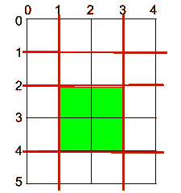
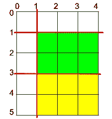

# 第三天:水平和垂直切割后一块蛋糕的最大面积

> 原文：<https://medium.com/nerd-for-tech/day-3-maximum-area-of-a-piece-of-cake-after-horizontal-and-vertical-cuts-774ecadafca1?source=collection_archive---------11----------------------->

***问题链接:***

[https://leet code . com/explore/challenge/card/June-leet codeing-challenge-2021/603/week-1-6 月 1 日-6 月 7 日/3766/](https://leetcode.com/explore/challenge/card/june-leetcoding-challenge-2021/603/week-1-june-1st-june-7th/3766/)

***问题陈述:***

给定一个高`h`宽`w`的矩形蛋糕，以及两个整数数组`horizontalCuts`和`verticalCuts`，其中`horizontalCuts[i]`是从矩形蛋糕顶部到`ith`水平切割的距离，同样，`verticalCuts[j]`是从矩形蛋糕左侧到`jth`垂直切割的距离。

*返回在数组* `*horizontalCuts*` *和* `*verticalCuts*` *中提供的每个水平和垂直位置切割后一块蛋糕的最大面积。由于答案可以是一个巨大的数字，返回这个模 10^9 + 7。*

***例 1:***



```
**Input:** h = 5, w = 4, horizontalCuts = [1,2,4], verticalCuts = [1,3]
**Output:** 4 
**Explanation:** Red lines are the horizontal and vertical cuts. After you cut the cake, the green piece of cake has the maximum area.
```

***例二:***



```
**Input:** h = 5, w = 4, horizontalCuts = [3,1], verticalCuts = [1]
**Output:** 6
**Explanation:** Red lines are the horizontal and vertical cuts. After you cut the cake, the green and yellow pieces of cake have the maximum area.
```

***例题 3:***

```
**Input:** h = 5, w = 4, horizontalCuts = [3], verticalCuts = [3]
**Output:** 9
```

***约束:***

```
2 <= h, w <= 10^9
1 <= horizontalCuts.length < min(h, 10^5)
1 <= verticalCuts.length < min(w, 10^5)
1 <= horizontalCuts[i] < h
1 <= verticalCuts[i] < w
It is guaranteed that all elements in horizontalCuts are distinct.
It is guaranteed that all elements in verticalCuts are distinct.
```

***我的解决方案:***

```
class Solution:
    def maxArea(self, h: int, w: int, hc: List[int], vc: List[int]) -> int:
        hc.sort()
        vc.sort()
        maxh, maxv = max(hc[0], h - hc[-1]), max(vc[0], w - vc[-1])
        for i in range(len(hc)):
            maxh = max(maxh, hc[i] - hc[i-1])
        for i in range(len(vc)):
            maxv = max(maxv, vc[i] - vc[i-1])
        return (maxh * maxv) % 1000000007
```

***解释:***

这个问题的思想是认识到所有的垂直切片都与所有的水平切片相交。这意味着我们只需要找到每个的最大值，横截面应该是最大的切片。

为了找到每一个的最大切片，我们需要首先对水平切片( **hc** )和垂直切片( **vc** )进行**排序，然后遍历这两个切片，并跟踪两个连续切片之间的最大差异( **maxh** ， **maxv** )。**

**注意:**不要忘记包括两个端部切口，它们是使用 **0** 和 **h** / **w** 找到的。

一旦我们得到两个数字的最大差值，我们就可以用**返回**这两个数字的乘积，**对 1e9+7** 取模。

*   ***时间复杂度:O(N * log(N)+M * log(M))****其中* ***N*** *是长度* ***hc*** *和* ***M*** *是长度* ***vc***
*   ***空间复杂度:O(1)***

就是这样！

如果你有兴趣解决更多的问题，请跟随我，和我一起踏上这段旅程。

明天见！

干杯！