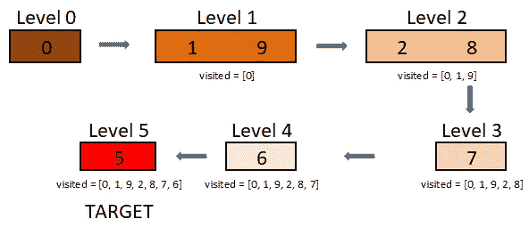

# 第四天:打开锁

> 原文：<https://medium.com/nerd-for-tech/day-4-interleaving-string-8c232e934967?source=collection_archive---------17----------------------->

***问题链接:***

[](https://leetcode.com/explore/challenge/card/june-leetcoding-challenge-2021/603/week-1-june-1st-june-7th/3767/) [## 探索- LeetCode

### 这个挑战是初学者友好的，对高级和非高级用户都可用。它由 30 个每日…

leetcode.com](https://leetcode.com/explore/challenge/card/june-leetcoding-challenge-2021/603/week-1-june-1st-june-7th/3767/) 

***问题陈述:***

你面前有一把锁，有四个圆形的轮子。每个轮子有 10 个槽:`'0', '1', '2', '3', '4', '5', '6', '7', '8', '9'`。轮子可以自由旋转和环绕:比如我们可以把`'9'`变成`'0'`，或者把`'0'`变成`'9'`。每次移动包括在一个槽中转动一个轮子。

锁最初从`'0000'`开始，这是一个代表 4 个车轮状态的字符串。

你会得到一个`deadends`死胡同列表，这意味着如果锁显示这些代码中的任何一个，锁的轮子将停止转动，你将无法打开它。

给定一个代表将解锁锁的轮子的值的`target`，返回打开锁所需的最小总圈数，如果不可能，则返回-1。

***例 1:***

```
**Input:** deadends = ["0201","0101","0102","1212","2002"], target = "0202"
**Output:** 6
**Explanation:**
A sequence of valid moves would be "0000" -> "1000" -> "1100" -> "1200" -> "1201" -> "1202" -> "0202".
Note that a sequence like "0000" -> "0001" -> "0002" -> "0102" -> "0202" would be invalid,
because the wheels of the lock become stuck after the display becomes the dead end "0102".
```

***例二:***

```
**Input:** deadends = ["8888"], target = "0009"
**Output:** 1
**Explanation:**
We can turn the last wheel in reverse to move from "0000" -> "0009".
```

***例题 3:***

```
**Input:** deadends = ["8887","8889","8878","8898","8788","8988","7888","9888"], target = "8888"
**Output:** -1
Explanation:
We can't reach the target without getting stuck.
```

***例 4:***

```
**Input:** deadends = ["0000"], target = "8888"
**Output:** -1
```

***约束:***

```
- 1 <= deadends.length <= 500
- deadends[i].length == 4
- target.length == 4
- target will not be in the list deadends
- target and deadends[i] consist of digits only.**Output:** -1
```

***我的解决方案:***

```
from collections import dequeclass Solution:
    def openLock(self, deadends: List[str], target: str) -> int:
        if target in deadends or '0000' in deadends or not target:
            return -1

        deadset = set(deadends)
        queue = deque(['0000'])
        distance = {'0000': 0}

        while queue:
            cur = queue.popleft()
            if cur == target:
                return distance[target]

            for neigh in self.neighbours(cur, deadset):
                if neigh in distance:
                    continue
                queue.append(neigh)
                distance[neigh] = distance[cur] + 1

        return -1

    def neighbours(self, state, deadset):
        ans = []
        for idx, char in enumerate(state):
            for op in [-1, 1]:
                nextSlot = str((int(char) + op) % 10) 
                neighbour = state[:idx] + nextSlot + state[idx + 1:]
                if neighbour not in deadset:
                    ans.append(neighbour)
        return ans
```

***解释:***

先举个简单的例子。

```
deadends = ["3"], target = "5", initialString = "0"
```

如果是这种情况，那么我们有两个选择，顺时针或逆时针从 1 到 5。请注意，如果我们顺时针方向移动，我们将被困在死胡同 3。因此，为了解决这个问题，我们必须想出一个办法，我们可以同时检查顺时针和逆时针方向。对于这样的问题，队列是最好的选择。

让我们看看怎么做。

1.  将 0 推入队列，并将其标记为 0 级。与队列一起，保存一个访问过的数组。
2.  弹出 0，将其添加到访问过的数组，将两个邻居，即 1(顺时针)和 9(逆时针)推入队列。
3.  Pop 1，将其添加到已访问的数组中。现在我们有两个选项，即 0 和 2。我们丢弃 0，因为它已经在被访问的数组中。还有，pop 9。我们还有两个选项，即 0 和 8。重复同样的步骤，直到你到达目标。
4.  请注意，在第 2 级，当我们弹出 2 时，我们有一个将 3 推入队列的选项，但是因为它是一个死胡同，所以我们跳过它。



因此，我们分 5 步实现目标。

用同样的方法，对给定的问题算出这个算法。变化是，我们有 4 个数字，而不是 1 个数字。所以，对所有的数字应用这个算法，你就会得到答案。

就是这样！

如果你有兴趣解决更多的问题，请跟随我，和我一起踏上这段旅程。

明天见！

干杯！