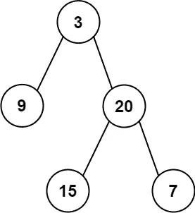

# 第八天:根据前序和中序遍历构建二叉树

> 原文：<https://medium.com/nerd-for-tech/day-8-construct-binary-tree-from-preorder-and-inorder-traversal-18b5bd83115?source=collection_archive---------11----------------------->

***问题链接:***

[](https://leetcode.com/explore/challenge/card/june-leetcoding-challenge-2021/604/week-2-june-8th-june-14th/3772/) [## 探索- LeetCode

### 这个挑战是初学者友好的，对高级和非高级用户都可用。它由 30 个每日…

leetcode.com](https://leetcode.com/explore/challenge/card/june-leetcoding-challenge-2021/604/week-2-june-8th-june-14th/3772/) 

***问题陈述:***

给定两个整数数组`preorder`和`inorder`，其中`preorder`是二叉树的前序遍历，`inorder`是同一棵树的有序遍历，构造并返回*二叉树*。



***例 1:***

```
**Input:** preorder = [3,9,20,15,7], inorder = [9,3,15,20,7]
**Output:** [3,9,20,null,null,15,7]
```

***例二:***

```
**Input:** preorder = [-1], inorder = [-1]
**Output:** [-1]
```

***约束:***

```
- 1 <= preorder.length <= 3000
- inorder.length == preorder.length
- -3000 <= preorder[i], inorder[i] <= 3000
- preorder and inorder consist of **unique** values
- Each value of inorder also appears in preorder
- preorder is **guaranteed** to be the preorder traversal of the tree
- inorder is **guaranteed** to be the inorder traversal of the tree
```

***我的解决方案:***

```
class Solution:
    def buildTree(self, P: List[int], I: List[int]) -> TreeNode:
        M = {I[i]: i for i in range(len(I))}
        return self.splitTree(P, I, M, 0, 0, len(P)-1)

    def splitTree(self, P: List[int], I: List[int], M: dict, pix: int, ileft: int, iright: int) -> TreeNode:
        rval = P[pix]
        root, imid = TreeNode(rval), M[rval]
        if imid > ileft:
            root.left = self.splitTree(P, I, M, pix+1, ileft, imid-1)
        if imid < iright:
            root.right = self.splitTree(P, I, M, pix+imid-ileft+1, imid+1, iright)
        return root
```

***解释:***

对于这个问题，我们可以利用遍历中节点的顺序。前序遍历是**【节点，左，右】**，而顺序遍历是**【左，节点，右】**。

我们知道树的**根**节点是前序数组的第一个元素( **P** )。我们还知道，inorder 数组( **I** )中根元素左边的每个元素都在左子树上，而 **I** 中**根**元素右边的所有元素都在右子树上。

一旦你这样做了，你的问题现在已经减少到一个较小的范围。现在你有了左右子树的有序和前序遍历，你需要找出它们。

为了实现这一点，我们只需要传递定义 **I** 中当前子树的子数组的左右界限( **ileft，iright** )，以及 **P** 中子树的**根**节点的索引( **pix** )。

此时，我们*可以*通过 **I** 向前迭代，直到我们每次都找到**根**节点的位置( **imid** ，但是那样会把这个解推到**O(N)**的时间复杂度。

相反，我们可以对 **I** 中的值做一个初步的**索引映射** ( **M** ，这样我们就可以在每次递归中查找 **O(1) time** 中 **imid** 的值。这将以 **O(N)** 的**空间复杂度**为代价，将时间复杂度降低到 **O(N)** 。

在每次递归中，如果 **imid = ileft** ，那么左边没有节点，所以我们不应该为那一边调用递归。如果 **imid = iright** ，这同样适用于右侧。

*   ***时间复杂度:O(N)*** *其中* ***N*** *是长度* ***P*** *和* ***I***
*   ***空间复杂度:O(N)*** *为* ***M***

就是这样！

如果你有兴趣解决更多的问题，请跟随我，和我一起踏上这段旅程。

明天见！

干杯！