# DB 死锁，使用 GoLang 的完整案例研究

> 原文：<https://medium.com/nerd-for-tech/db-dead-lock-complete-case-study-using-golang-15dd754e5cb8?source=collection_archive---------1----------------------->

在这个故事中，我们将经历如何在 Postgres 数据库中调试死锁的过程。如何避免死锁或如何实时最小化死锁情况。为此，我将深入探讨事务性用例中并发请求的 DB 事务。

我选择了 golang、Postgres 和一些支持事务特性的 go lang 模块。

**什么是数据库事务？**

它是一个工作单元，通常由多个数据库操作组成。

例如:假设我们是一个简单的银行系统，当我们启动从账户 A 到账户 b 的资金转移时，该系统保存用户的账户详细信息。这将最终执行多个数据库操作，如:-

*   启动转账详情。
*   为这些帐户创建交易记录。例如:对于从账户 A 到账户 B 的 100 美元账户转账，交易表中将有两个记录，账户 A → -100 美元，账户 B → +100 美元。
*   最后，用-100 美元和+100 美元更新帐户 A 和 B 的余额。

所以总的来说，从账户 A 到账户 B 的简单金额转账将有 5 个操作。

> 开始转移。
> 
> 为帐户 a 创建交易记录。
> 
> 为帐户 b 创建交易记录。
> 
> 更新帐户 a 中的余额。
> 
> 更新帐户 b 中的余额。

**我们为什么需要数据库事务？**

1.  即使在系统故障时，RDBMS 也能提供可靠和一致的数据。
2.  提供并发访问数据库的进程/程序之间的数据隔离。

RDBMS 通过其 **ACID 属性支持上述功能。**

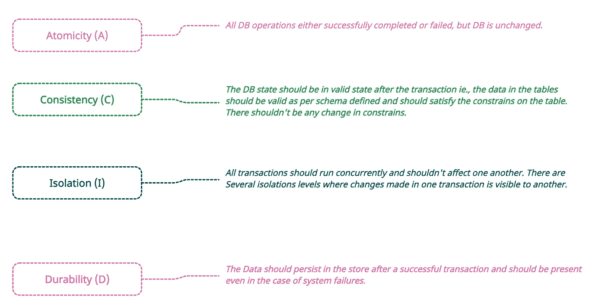

**如何在事务中运行 DB？**

答案很简单，使用`Begin`，然后是 SQL 语句，最后是`commit`。对于失败，它是`rollback`。

**对于成功的交易**

```
**BEGIN;
-- 
SQL Statements
--**
**COMMIT;**
```

成功提交后，数据库表将具有修改后的值。

**失败交易**

```
**BEGIN;
-- 
SQL Statements -- Exception occurred
--**
**ROLLBACK;**
```

回滚后，对表所做的所有更改都将丢失，DB 将保留以前的成功状态。

**让我们用 goLang 运行一个代码示例**

我们将采取同样的例子(账户转账)，我前面解释过。

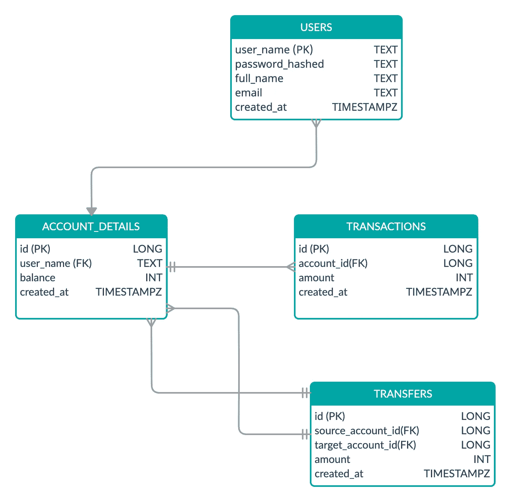

**围棋郎实现**

我考虑了 Golang 和一些有助于演示这个用例的模块

> GOLang Migrate → For DB Migration 要了解更多细节，请点击[这里](/geekculture/db-migration-in-go-lang-d325effc55de)查看我之前的博客。
> 
> SQLC →对于 DB CRUD 操作的自动生成代码，这纯粹是为了 Postgres 支持。
> 
> 测试用例→使用 TDD 和测试用例来解释和实现。

由于我们没有为此使用任何 ORM 模块，我认为如果我们使用任何 ORM 模块，解释数据库事务会变得很困难，因为它隐藏了底层的数据库功能，而且 ORM 比普通 SQL 慢。

让我们使用 begin、commit 和 rollback 在 go 文件中创建事务功能。下面的方法为一组数据库操作设置事务边界上下文。

实际的 initiate transaction 方法在事务中运行。下面的方法将根据业务规则以特定的顺序执行一些 SQL 语句。您可以看到，在更新源和目标之前，我已经查询了帐户详细信息。这是不需要的，我们可以直接更新余额，而无需获取数据。对于展示，我遵循了这种方法。

现在我们将编写一个测试用例来演示并发请求。在下面的测试用例中，我对并发请求使用了 goroutines，并使用通道来捕获结果并在以后进行验证。下面的测试用例启动了 5 次从源到目标的资金转移，每次 10 美元。最后，在 5 个并发请求中，从源到目标需要 50 美元。

使用当前的代码库，如果我运行测试用例，测试用例会失败，因为在并发模式下，每个进程都不会从之前的提交中获得更新的余额。所以会有不一致的平衡导致断言失败。

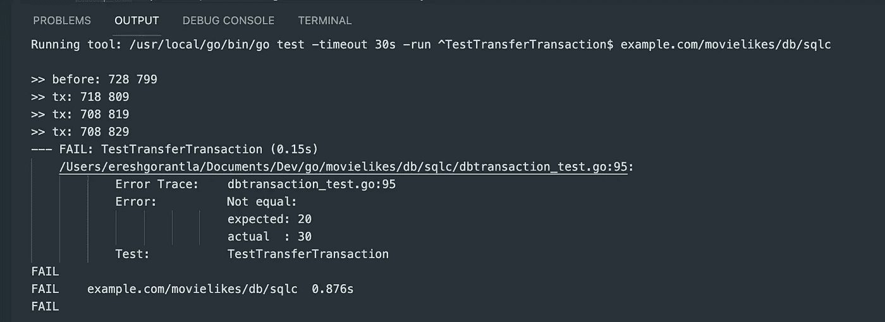

如果您观察交易前的日志，源帐户的余额是 728，目标帐户的余额是 799。

> 第一笔交易→ S (718)，T (809)
> 
> 第二次交易→ S(708)，T (819)
> 
> 第三次交易→ S(708)，T(829)

在第二次交易之后，来源的余额不会更新，它与前一次交易保持相同。但是目标帐户更新了它的余额，导致了一致性问题。

原因是我们已经使用了一个简单的 select 查询来使用`SELECT * FROM account_details WHERE id = 1;`获取帐户细节。这是一个普通的 SELECT 语句，不会阻止更新。因此并发请求将获得相同的数据，并最终导致不一致。

让我们在单独的 psql 窗口中运行并行事务，并尝试获取数据。

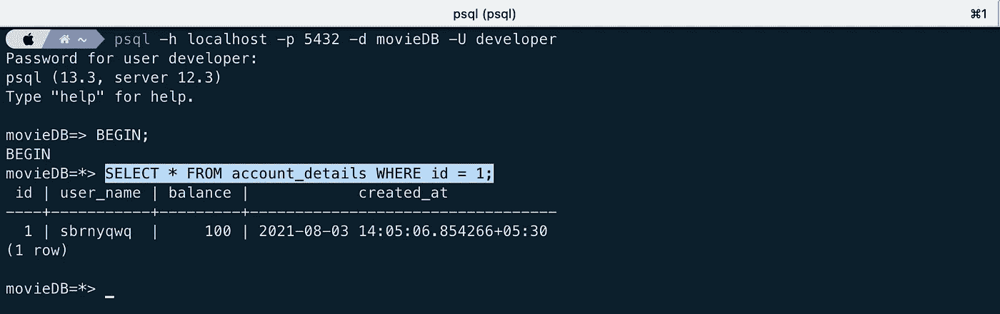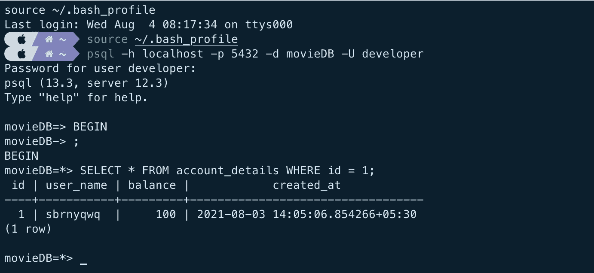

它立即返回，没有阻拦。

**解决方案 1 :**

将选择查询更改为``SELECT * FROM account_details WHERE id = 1 FOR UPDATE`

事务中第一个窗口立即返回

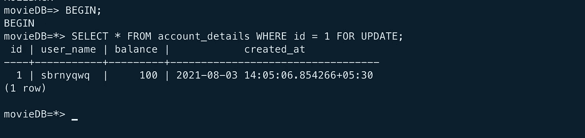

第二个被阻塞，依赖于前一个事务。它要么提交，要么回滚。

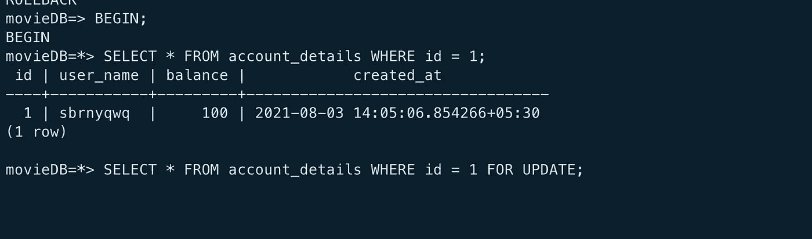

如果我通过更新余额提交第一个事务，第二个事务将获得更新后的值。

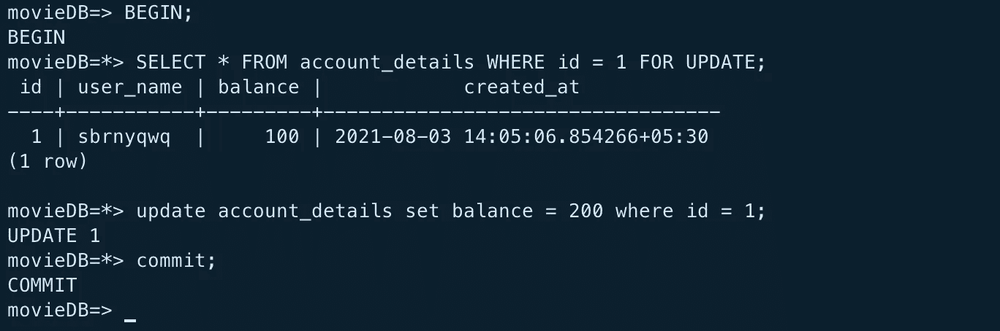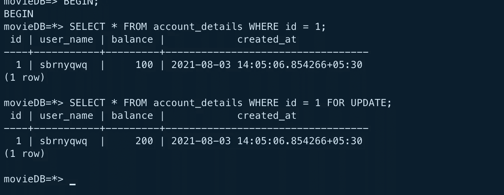

现在我已经更新了查询并再次执行了测试用例。让我们看看这是否可行，并在实际方法中添加一些日志以供调试。

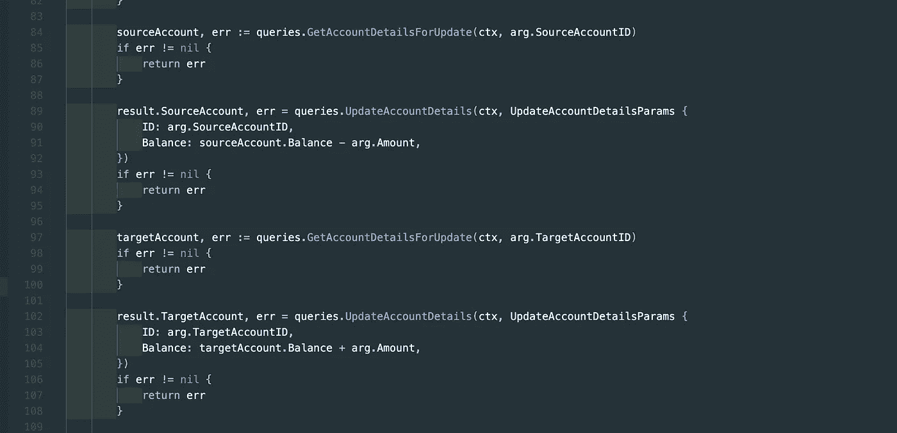

测试用例返回以下错误，一个死锁

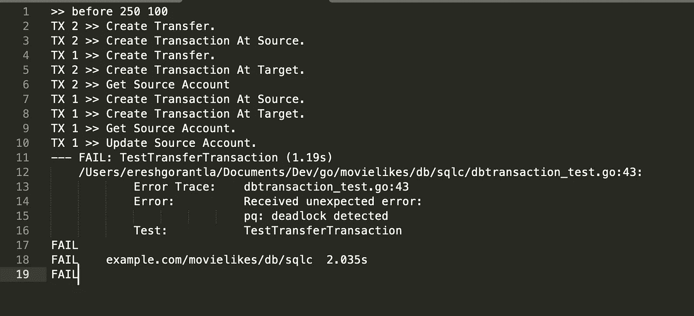

这些是我们得到的日志，如果你注意到并发请求的顺序是没有保证的。让我们在 PSQL 的两个独立窗口中复制同样的东西。

***第二笔交易:***

选择查询在这里被阻塞。

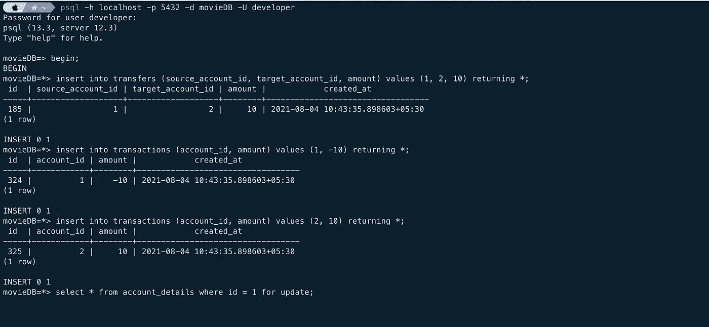

第一笔交易

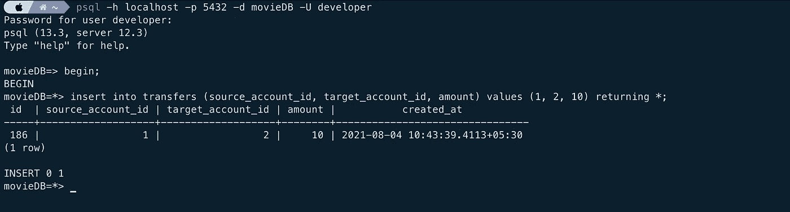

让我们看看 PG 锁为什么 Select 查询被阻塞。

查询以检查被阻止的查询列表以及阻止它们的原因。

```
**SELECT blocked_locks.pid     AS blocked_pid,
         blocked_activity.usename  AS blocked_user,
         blocking_locks.pid     AS blocking_pid,
         blocking_activity.usename AS blocking_user,
         blocked_activity.query    AS blocked_statement,
         blocking_activity.query   AS current_statement_in_blocking_process
   FROM  pg_catalog.pg_locks         blocked_locks
    JOIN pg_catalog.pg_stat_activity blocked_activity  ON blocked_activity.pid = blocked_locks.pid
    JOIN pg_catalog.pg_locks         blocking_locks 
        ON blocking_locks.locktype = blocked_locks.locktype
        AND blocking_locks.database IS NOT DISTINCT FROM blocked_locks.database
        AND blocking_locks.relation IS NOT DISTINCT FROM blocked_locks.relation
        AND blocking_locks.page IS NOT DISTINCT FROM blocked_locks.page
        AND blocking_locks.tuple IS NOT DISTINCT FROM blocked_locks.tuple
        AND blocking_locks.virtualxid IS NOT DISTINCT FROM blocked_locks.virtualxid
        AND blocking_locks.transactionid IS NOT DISTINCT FROM blocked_locks.transactionid
        AND blocking_locks.classid IS NOT DISTINCT FROM blocked_locks.classid
        AND blocking_locks.objid IS NOT DISTINCT FROM blocked_locks.objid
        AND blocking_locks.objsubid IS NOT DISTINCT FROM blocked_locks.objsubid
        AND blocking_locks.pid != blocked_locks.pid****JOIN pg_catalog.pg_stat_activity blocking_activity ON blocking_activity.pid = blocking_locks.pid
   WHERE NOT blocked_locks.granted;**
```

结果是:

```
blocked_pid|blocked_user|blocking_pid|blocking_user|blocked_statement                                     |current_statement_in_blocking_process                                                              |
-----------+------------+------------+-------------+------------------------------------------------------+---------------------------------------------------------------------------------------------------+
        987|developer   |         975|developer    |***select * from account_details where id = 1 for update;***|***insert into transfers (source_account_id, target_account_id, amount) values (1, 2, 10) returning *;***|
```

如果您注意到，第二个事务中的 select 查询被我们在不同表的第一个事务中执行的 insert 阻塞了。让我们理解为什么，但在此之前，让我们看看数据库中尚未释放的所有锁。

```
**SELECT a.datname,
         l.relation::regclass,
         l.transactionid,
         l.mode,
         l.GRANTED,
         a.usename,
         a.query,
         a.query_start,
         a.pid
FROM pg_stat_activity a
JOIN pg_locks l ON l.pid = a.pid
where granted = false
ORDER BY a.pid;**----------------------------------------------datname|relation|transactionid|mode     |granted|usename  |query                                                 |query_start        |pid|
-------+--------+-------------+---------+-------+---------+------------------------------------------------------+-------------------+---+
***movieDB***|        |5210113      |***ShareLock***|false  |developer|select * from account_details where id = 1 for update;|2021-08-04 10:44:24|987|
```

锁定模式为`ShareLock`。让我们分析一下为什么我们的查询列表中有`ShareLock`，然后让我们继续第**个事务**直到死锁。

**第一笔交易完成:**

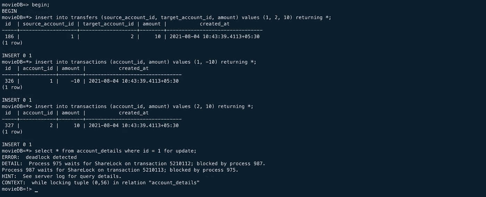

**这里为什么会出现僵局？**

如果您观察这个模式，`transfers`表在`account_details(id)`表上有外键约束`source_account_id and target_account_id`。对表的任何更新都会影响这些外键约束。所以当我们使用`SELECT For UPDATE ON account_details`时，它需要获得外键约束的锁，并保证数据的一致性。

**绕过**

最简单的方法是删除 transactions 表上的外键约束。但不建议这样做。

**一个完美的解决方案**

如果您查看更新查询，您会发现我们从未更改过表的主键。我们修改底层的列。那么，如果我们让 Select query 知道我们没有更新 ID，我们更新了其他列。这应该能解决我们的问题。如下所示更新选择查询

```
SELECT * FROM account_details where account_id = 1 **FOR NO KEY UPDATE**;
```

让我们重新运行测试用例。

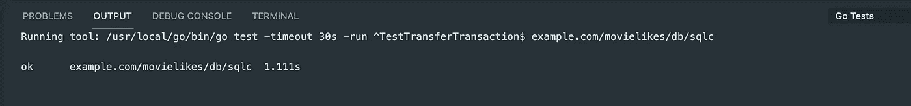

**方案二**

如果您观察代码，就会发现有一个不必要的 select 语句来获取帐户余额。在 SQL 中，这是不需要的，我们可以编写更新查询来将余额从以前的值修改为新值。

```
***UPDATE account_details SET balance = balance + $(amount) where ID = :ID;***
```

让我们修改代码并重新运行测试。

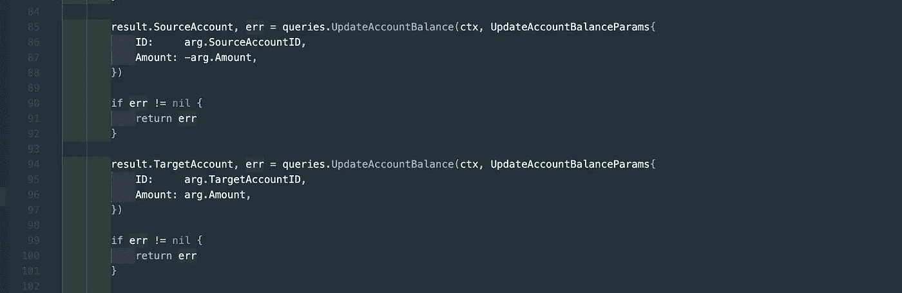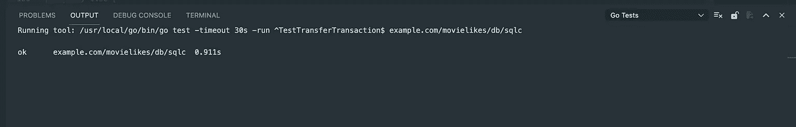

# **学习:**

有两种方法可以修复死锁情况，一种是修复潜在的问题，另一种是逃离或避免死锁情况。我们在上面的用例中已经看到了这两种情况。`Solution 1`正在解决问题，`Solution 2`正在避免死锁情况。

我更喜欢第二种方法，不要陷入死锁状态，总是正确的，干净的代码。 ***说到清理上面的代码库还是有一些问题让我们来看看。***

**问题二**

到目前为止，我们所做的是总是以同样的顺序更新余额。，帐户 ID: 1 到帐户 Id: 2。如果出现不知道更新 ie 顺序的场景怎么办？，它可以是源到目标，反之亦然。

让我们在 psql 中运行并行事务

**交易 1**

```
**begin**;
**update** account_details **set** balance = balance - 10 **where** id = 1 **returning** *;**update** account_details **set** balance = balance + 10 **where** id = 2 **returning** *;**rollback**
```

**交易 2**

```
**begin**;
**update** account_details **set** balance = balance - 10 **where** id = 2 **returning** *;**update** account_details **set** balance = balance + 10 **where** id = 1 **returning** *;**rollback**
```

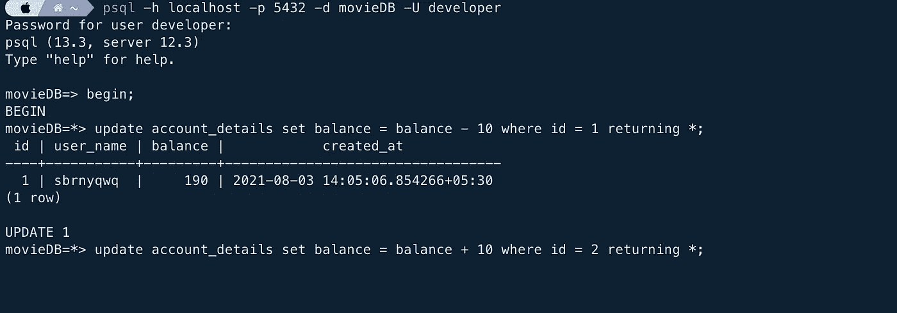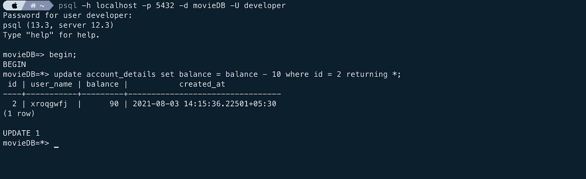

让我们看看被阻塞的查询以及阻塞它们的原因。再次运行与之前相同的查询。

```
blocked_pid|blocked_user|blocking_pid|blocking_user|blocked_statement                                                          |current_statement_in_blocking_process                                      |
-----------+------------+------------+-------------+---------------------------------------------------------------------------+---------------------------------------------------------------------------+
       2485|developer   |        2492|developer    |***update account_details set balance = balance + 10 where id = 2 returning *;***|**update account_details set balance = balance - 10 where id = 2 returning *;**|
```

还要分析锁的类型。

```
datname|relation|transactionid|mode     |granted|usename  |query                                                                      |query_start        |pid |
-------+--------+-------------+---------+-------+---------+---------------------------------------------------------------------------+-------------------+----+
movieDB|        |5210137      |**ShareLock**|false  |developer|update account_details set balance = balance + 10 where id = 2 returning *;|2021-08-04 11:39:56|2485|
```

如果我们在第二个事务中更新 id 1，就会检测到死锁。

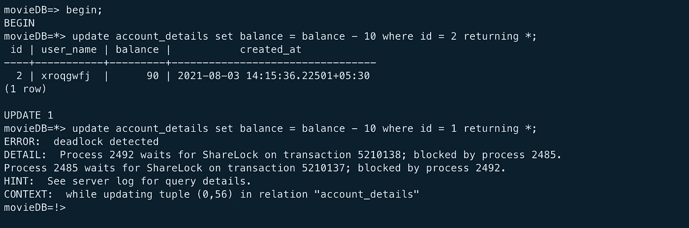

因为我们在第二个事务中执行了对 ID 2 的更新，该事务尚未提交。如果我们试图在另一个事务中更新相同的 id，那么就会检测到死锁。

以测试用例的形式实现相同的功能。启动了 10 个并发传输并循环运行。对于偶数索引，源和目标是相同的。对于奇数索引，则相反。

这是测试用例的结果，一个死锁。

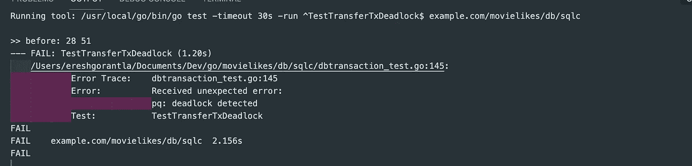

**解决方案**

死锁的原因是不同事务中的插入顺序，我们必须遵循事务中相同的更新/插入顺序。我已经修改了主 go 文件中的代码。 ***始终从较低的帐户 id 更新，然后从较高的帐户 id 更新。***

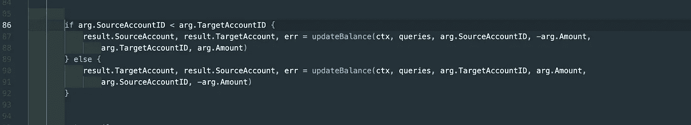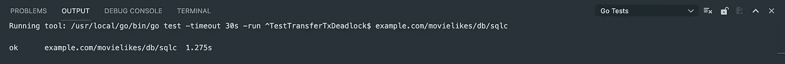

# **学习**

In transactions 总是以相同的顺序实现插入/更新。这将有助于事务以干净的方式进行，并避免数据库获得不必要的锁。

请从[这里](https://github.com/ereshzealous/movielikes)找到源代码