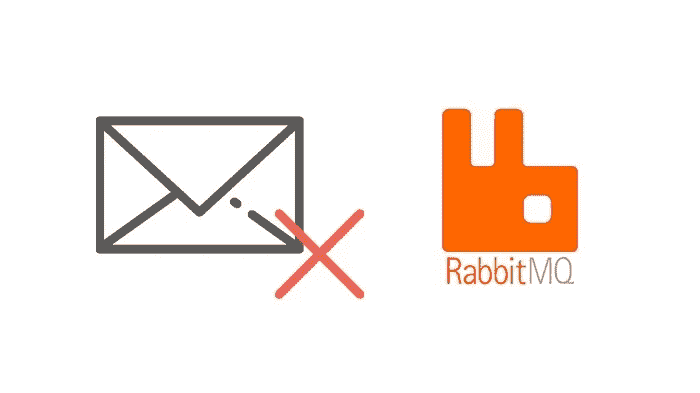
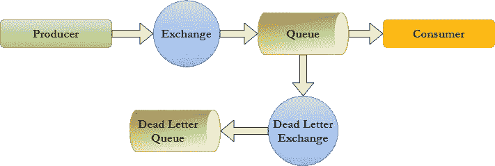
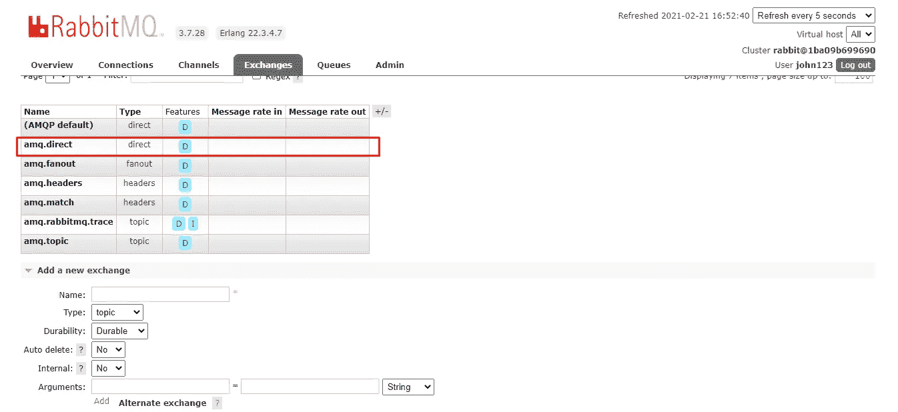
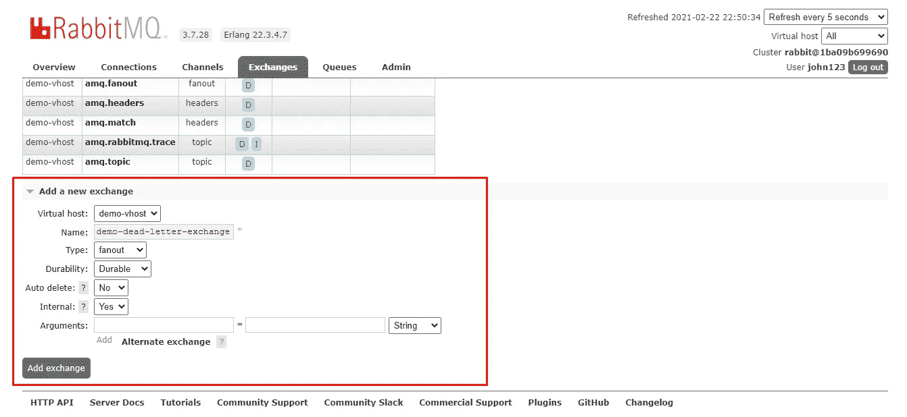
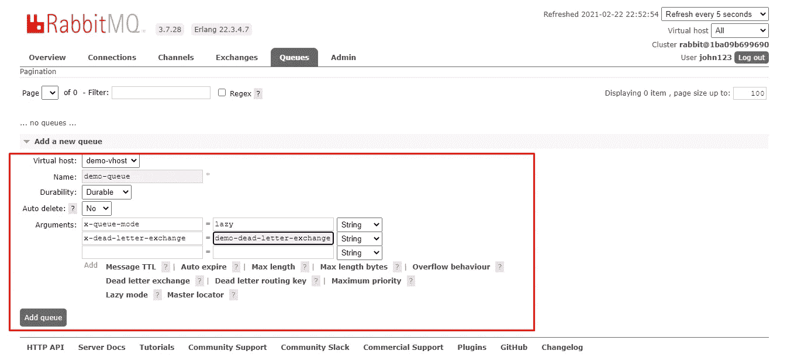
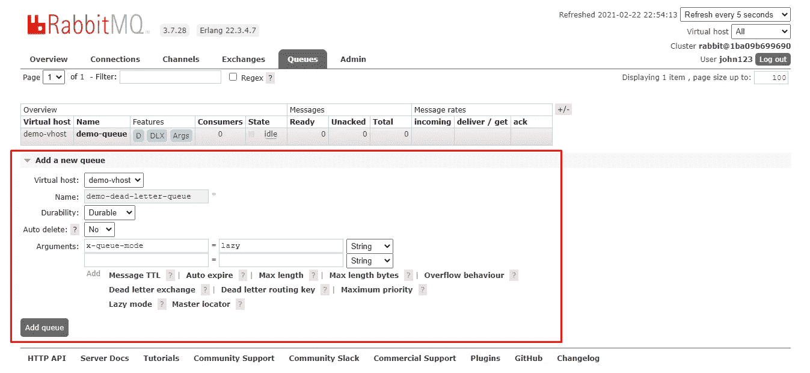
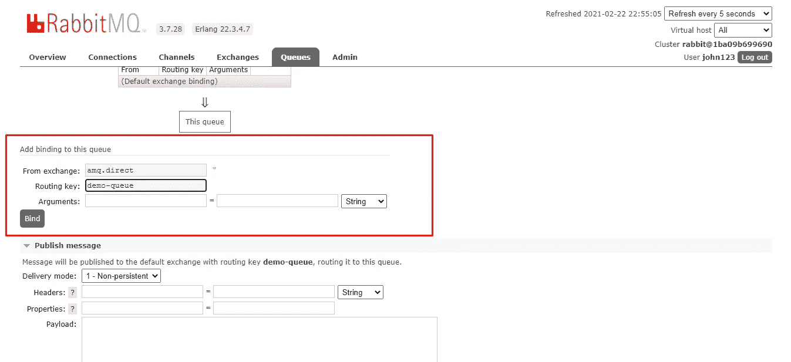
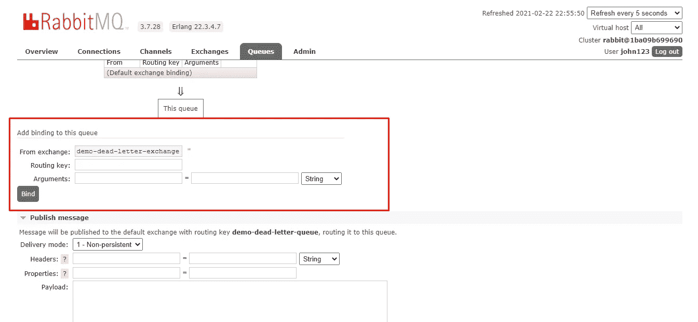
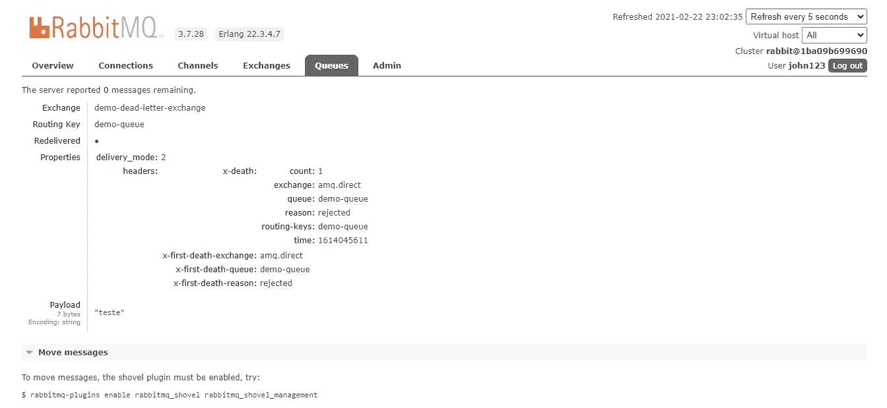

# RabbitMQ +上的死信交流。网络核心

> 原文：<https://medium.com/nerd-for-tech/dead-letter-exchanges-at-rabbitmq-net-core-b6348122460d?source=collection_archive---------0----------------------->



当我们配置 RabbitMQ 实例时，我们不能忘记考虑的一件事是，在实践中，队列的消费者可能无法处理某些通知，甚至队列本身也可能由于某些事件而拒绝消息。在这种情况下，我们必须实现死信交换，这样才有可能保留那些消息并在其他时间重新处理它们。

在本文中，我打算解释何时使用死信交换(dlx)，如何在 RabbitMQ 中配置它，以及如何构建一个. NET 核心应用程序来测试流。

## 何时使用死信交换(dlx)

有几种无法传递或处理消息的情况，在 RabbitMQ 中，它们是:

1.  **由于 TTL(生存时间)，消息已经过期:**在 RabbitMQ 中，可以将参数 x-message-ttl 添加到队列中，以设置消息可以生存多长时间。当消息的 TTL 过期时，该消息将被丢弃。
2.  **消息被消费者拒绝:**由于某种原因，消息无法被处理，因此消费者以 requeue 标志设置为 false 的方式否定确认(Nack)消息时，会发生这种情况。
3.  **队列已经达到了它的长度容量:**在 RabbitMQ 中，可以将参数 *x-max-length* 添加到队列中，以设置它可以包含多少个就绪消息。当达到容量时，下一条消息将被丢弃。

在任何一种情况下，如果您不想丢失这些消息，就必须配置 dlx。

## 如何在 RabbitMQ 配置 DLXs

下图显示了具有 DLX 的 RabbitMQ 实例的体系结构:



**DLX 使用的建筑**

因此，基本上，该解决方案包括:

*   **生产者:**向交易所发送消息的应用程序
*   **交换:**将消息重定向到普通队列的普通交换
*   **队列:**普通队列，存储交换机发送的消息
*   **消费者:**从队列中接收消息的应用程序
*   **死信交换:**专用于重定向被拒绝消息的交换
*   **死信队列:**专门存储被拒绝消息的队列

现在，让我们使用 RabbitMQ 管理接口创建交换、队列和绑定。(这里我不会展示如何使用 Docker 创建 RabbitMQ 的实例，也不会展示如何创建用户和虚拟主机。为此，我建议你阅读我的另一篇关于在启动时配置 RabbitMQ 的文章。

首先，让我们处理交流。

为了简化解释，我不会创建一个交换来将消息重定向到普通队列，因为我将使用 *amq.direct* 交换，这是在创建 RabbitMQ 的实例时默认出现的。



**amq.direct 交换，用于将发布的消息重定向到队列**

为了创建死信交换，我们将使用以下配置:

*   **名字:**我会把它命名为 *demo-dead-letter-exchange，*但是你可以选择你想要的名字。
*   **Type:** 为了简化，我准备使用 ***fanout*** ，这样绑定到交换的每个队列都会收到被拒绝的消息。
*   **耐久性:**我将把它设置为**耐久性**，这样交换可以持续到服务器重启
*   **自动删除:**它将被设置为**否**，因此当没有队列绑定到交换机时，它不会被删除。
*   **内部:**由于我不打算让这个交换可以被出版商使用，它将被设置为 **Yes。**

死信交换的配置应该如下所示:



**DLX 的配置**

配置好所有的交换之后，让我们创建队列。

为了开始创建队列，我们将创建存储已发布消息的队列，它将具有以下配置:

*   **名称:**我将它命名为 *demo-queue，*但是你可以选择你想要的名称。
*   **耐久性:**我将把它设置为**耐久性**，这样队列可以存活到服务器重启。
*   **自动删除:**它将被设置为**否**，因此当所有用户断开连接时，它不会被删除。

以及以下论点:

*   **x-queue-mode:** 它将被设置为 **lazy，**因为我不需要快速访问消息。
*   **x-dead-letter-exchange:**它将被设置为**demo-dead-letter-exchange**，这是之前创建的 DLX 的名称。如前所述，正是这个参数将使被拒绝的消息被重定向到 DLX。

您的队列应该是这样的:



***配置*队列*中的*，该队列将存储已发布的消息**

现在，为了完成队列的创建，我们将创建死信队列，它将被称为*演示死信队列*和将具有与*演示队列*几乎相同的配置，因为我们将只排除 *x 死信交换*参数。*演示死信队列*应该是这样的:



***配置*的死信*队列***

最后，我们将把交换绑定到各自的队列，以完成 RabbitMQ 的配置。

*演示队列*必须绑定到 *amq.direct* 交换:



***绑定*的演示*-队列* *与*的 amq.direct 交换**

demo-dead-letter-queue 必须像这样绑定到 *amq.direct* 交换:



***绑定*的演示 *-* 死 *-* 信*-排队*-*带*的演示 *-* 死 *-* 信 *-* 交换**

一旦我们完成了 RabbitMQ 的配置，就该使用。NET，所以所做的一切都可以被测试。

## 测试死信交换的功能。网络核心

测试 DLX 的代码非常简单，由四个类组成:

1.  ***RabbitMQ connection . cs*:**负责与 rabbit MQ 连接的类。从代码中可以看出，虚拟主机必须命名为 *demo-vhost，*用户 *john123，*密码 *123456* ，主机为 localhost:5672，这是默认设置(但是可以随意配置)。

```
using RabbitMQ.Client;using System;namespace ConfiguringDeadLetterExchange{
    public class RabbitMQConnection { private readonly IConnectionFactory _connectionFactory; private IConnection _connection; public RabbitMQConnection() { _connectionFactory = new ConnectionFactory() { Uri = new Uri(GetConnectionString()) }; _connection = _connectionFactory.CreateConnection(); } public IModel CreateModel() { return _connection.CreateModel(); } private string GetConnectionString() {            string user = "john123"; string password = "123456"; string host = "localhost:5672"; string virtualHost = "demo-vhost"; string connectionString = "amqp://{0}:{1}@{2}/{3}"; return string.Format(connectionString, user, password,
                host, virtualHost); } }}
```

*2。****consumer . cs:***类，负责消费来自*演示队列*的消息，并使用 *BasicNack* 方法拒绝它。此外，它有一个方法 *SetConsumer* 来启用队列的监听器。

```
using Newtonsoft.Json;using RabbitMQ.Client;using RabbitMQ.Client.Events;using System.Text;namespace ConfiguringDeadLetterExchange{ public class Consumer { public Consumer(IModel channel) { _channel = channel; } private IModel _channel; public void SetConsumer() { var consumer = new EventingBasicConsumer(_channel); consumer.Received += ReceivedEvent; _channel.BasicConsume(queue: "demo-queue", autoAck:
                false, consumer: consumer); } public async void ReceivedEvent(object sender,
            BasicDeliverEventArgs e) { var message = Encoding.UTF8.GetString(e.Body.Span); if (e.RoutingKey == "demo-queue") { var deserializedMessage =
                    JsonConvert.DeserializeObject<object>(message); _channel.BasicNack(e.DeliveryTag, false, false); } } }}
```

*3。****producer . cs*:**类，负责使用 *amq.direct* 交换向*演示队列*发布消息。

```
using Newtonsoft.Json;using RabbitMQ.Client;using System.Text;namespace ConfiguringDeadLetterExchange{ public class Producer { private IModel _channel; public Producer(IModel channel) { _channel = channel; } public void Publish(object publishModel) { var message = JsonConvert.SerializeObject(publishModel); var body = Encoding.UTF8.GetBytes(message); IBasicProperties properties 
                = _channel.CreateBasicProperties(); properties.Persistent = true; properties.DeliveryMode = 2; _channel.ConfirmSelect(); _channel.BasicPublish(exchange: "amq.direct",
                routingKey: "demo-queue", mandatory: true,
                basicProperties: properties, body: body); _channel.WaitForConfirmsOrDie(); _channel.ConfirmSelect(); } }}
```

*4。* ***Program.cs* :** 类，该类使用 *CreateModel* 方法创建通道，使用 *SetConsumer* 方法启用监听器，并将消息 **test** 发布到 *demo-queue，*稍后将被消费和拒绝(线程。代码处的睡眠只是为了防止程序在消息被消费之前终止，因为它是控制台应用程序的代码)。

```
using RabbitMQ.Client;using System.Threading;namespace ConfiguringDeadLetterExchange{ class Program { static void Main(string[] args) { RabbitMQConnection rabbitMQConnection = new
                RabbitMQConnection(); IModel channel = rabbitMQConnection.CreateModel(); Consumer consumer = new Consumer(channel); consumer.SetConsumer(); Producer producer = new Producer(channel); producer.Publish("teste"); Thread.Sleep(10000); } }}
```

执行应用程序后，消息 **test** 将被拒绝，并应出现在演示死信队列中:


***带有被拒绝消息***的演示死信队列

如果您使用 RabbitMQ 的 managemente 接口从队列中获取消息，您可以看到一些有趣的事情，例如**计数**，它表示消息被拒绝的次数，以及**原因**，它表示消息被拒绝的原因。在这种情况下，原因是**被拒绝**，因为我们使用 *BasicAck* 方法、显式地拒绝了它，但是原因可以根据消息被拒绝的情况而变化。



**在*****demo-dead-letter-queue***的被拒绝报文的属性

在配置了 DLX 并将被拒绝的消息存储在队列中之后，您可以创建自己的流程来重新处理它们，这可以是安排重试以将这些消息返回到*演示队列*或者甚至手动处理它们。

有了 RabbitMQ 的这种死信交换配置，我希望您不会丢失更多的消息，并在您的流中获得更多的弹性。