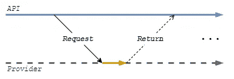
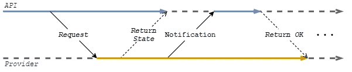
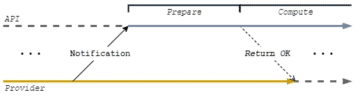
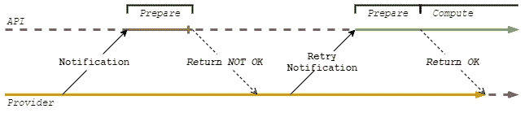

# 处理 API 上的异步请求

> 原文：<https://medium.com/nerd-for-tech/dealing-with-asynchronous-requests-on-apis-4439cbeaaeb?source=collection_archive---------8----------------------->

丹·伯顿在 [Unsplash](https://unsplash.com?utm_source=medium&utm_medium=referral) 上拍摄的照片

当开发一个 API 时，有时你的服务可能依赖于提供者，即第三方服务，来执行某种行为。

您可能面临的一个问题是，是否存在*异步请求*，以及您应该如何处理它们。

这里我将提到:

*   *同步请求*—当你的 API 在请求结束时收到最终的回答；
*   *异步请求* —当你的 API 通过对你的 API 的请求，即通知，收到最终的回答时；

# 同步请求

最常见的情况是，当联系一个 API 时，客户端会收到对其请求的最终答复。这意味着在相同的连接中，您将收到一个答案。

如果由于任何原因，您的请求由于可用性问题而失败，您可以稍后重试相同的请求。希望在重试时，提供商的服务将是可用的。

# 异步请求

有时，提供者的服务依赖于行为，由于依赖性或其他因素，**可能会**花费比预期更多的时间或精力。为了确保较短的响应时间，服务分为两部分:

1.  提供者启动请求并返回状态；
2.  提供者继续计算请求，并通过将最终结果通知给客户端 API 来结束；

当您有这种行为时，数据首先处于*“已创建”*，只有在收到“通知”请求后，它才会转换到*“完成”*。

这意味着数据需要在两个请求之间持久化，这意味着在第一个请求之后，API 不能返回正确的结果*(为了简单起见，我们将忽略 API 客户端的可能性)*。

有了这个通知，API 将能够继续工作。以回答提供商结束。

**但是**，如果“通知”服务工作复杂，可能会失败怎么办？如果它需要很长的时间间隔来完成它的工作呢？

当 API 正在处理通知服务时，我们希望提供者等待吗？还是可以在特定的时刻释放？

一种方法是将“通知”服务分成两部分:

*   *准备* —服务准备计算，之后提供者可以被释放，计算可以开始；
*   *计算* —完成异步请求的逻辑；

通过这种方法，*准备*将产生一个答案，供提供商了解准备*计算*是否成功。

**但是**，万一失败了呢？

该逻辑可能在*准备*或*计算的两个瞬间失效。**准备*部分在成功保存“通知”上的答案时结束。此后，*计算*部分开始。

但是，如果由于任何原因 API 不能成功保存通知，那么这个逻辑将会中断，需要重新启动。

**希望提供商重试“通知”请求**。如果我们有任何类型的重试机制，它应该只表示对准备“通知”服务的必要计算的依赖。

一种方法是使用 HTTP 状态作为一种方法来通知是否应该进行重试。在这种情况下，如果“通知”服务返回不同于 200 OK 的 HTTP 状态，则进行重试。

当提供者接收到不同于 200 OK 的 HTTP 状态时，它计划稍后重试“通知”请求。

在我们完成*后，准备*零件，没有失败，然后我们可以开始*计算*部分。这里也可能失败，但从这里开始，恢复并不意味着依赖于第三方，而是可以更容易地依靠资源的可用性来管理。

# 重新开始

这里可以讨论的还有很多，所有这些都代表了一种处理*异步请求*的方法。

例如，我们没有详细说明*准备*在技术上代表什么，或者如何从*计算*的故障中恢复。根据你在做什么和你计划如何去做，这些会有很大的变化。

但在继续之前，我想以我认为是这篇文章的要点来结束:

*   依赖关系——总是尽可能快地移除依赖关系，以提高工作和资源的可管理性；
*   **恢复** —准备重试机制；
*   **重试能力** —规划恢复点，确保服务的幂等性和一致性；

我希望你能从这里得到一些关于如何处理异步请求的想法。