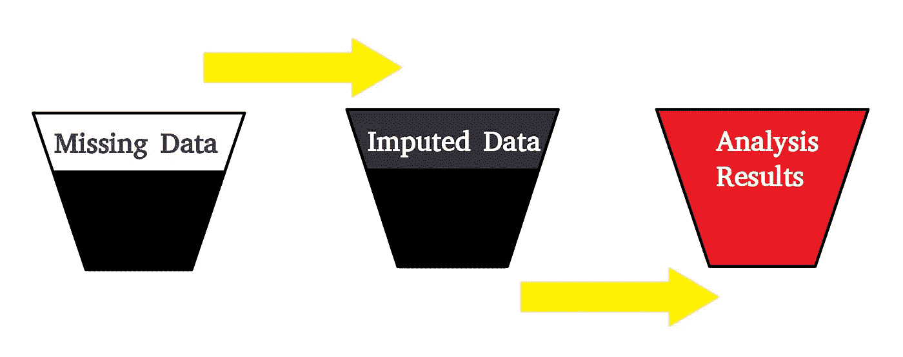
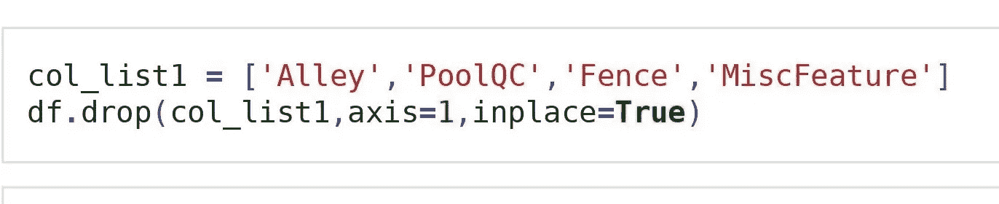
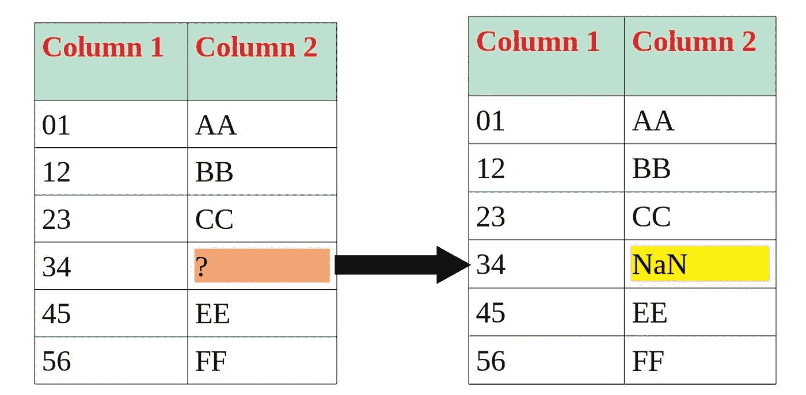
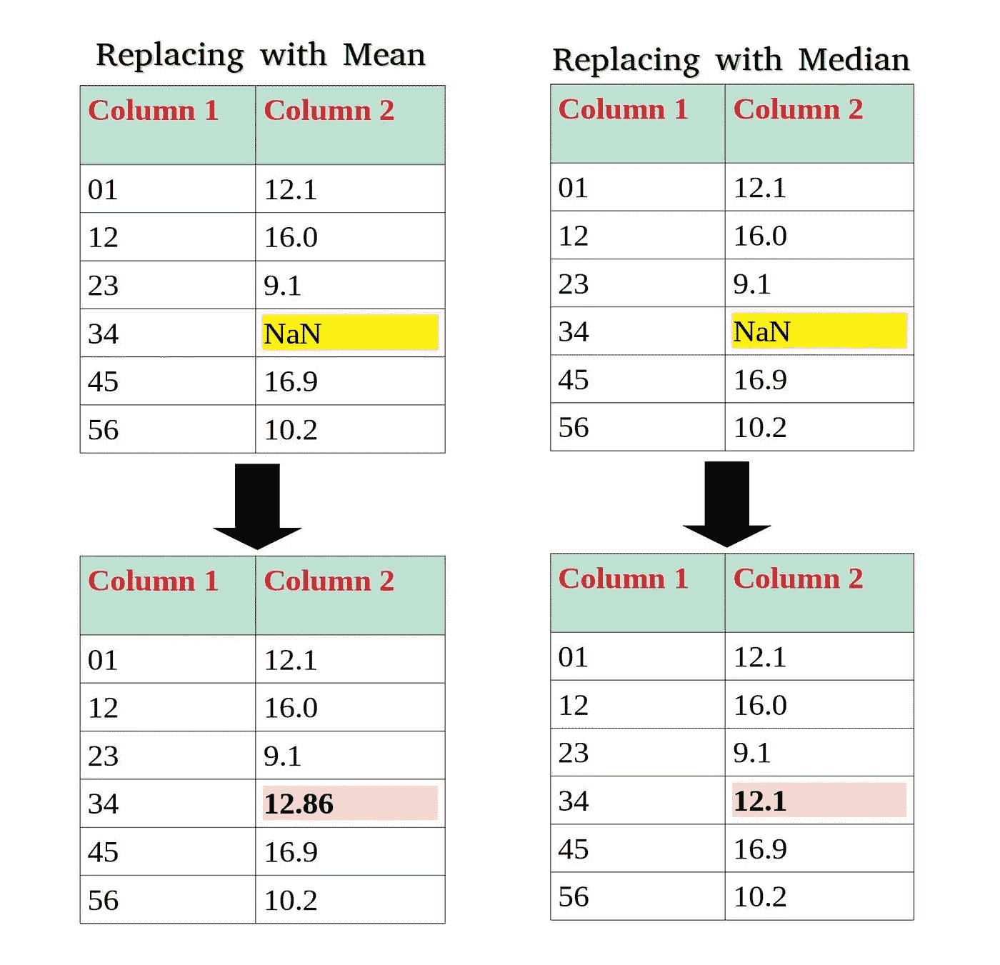
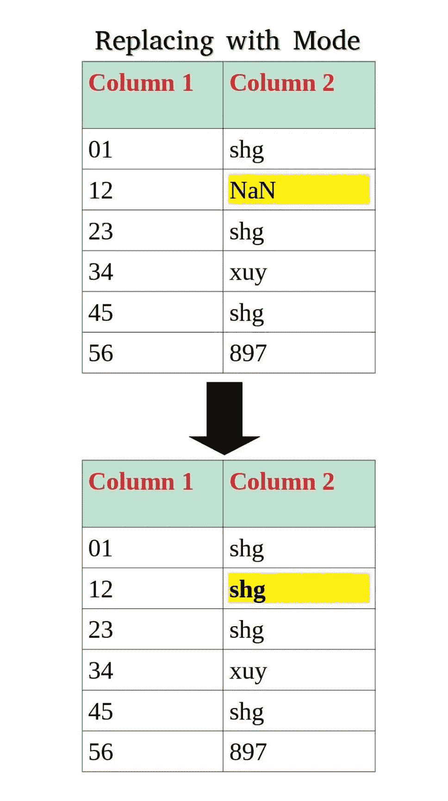
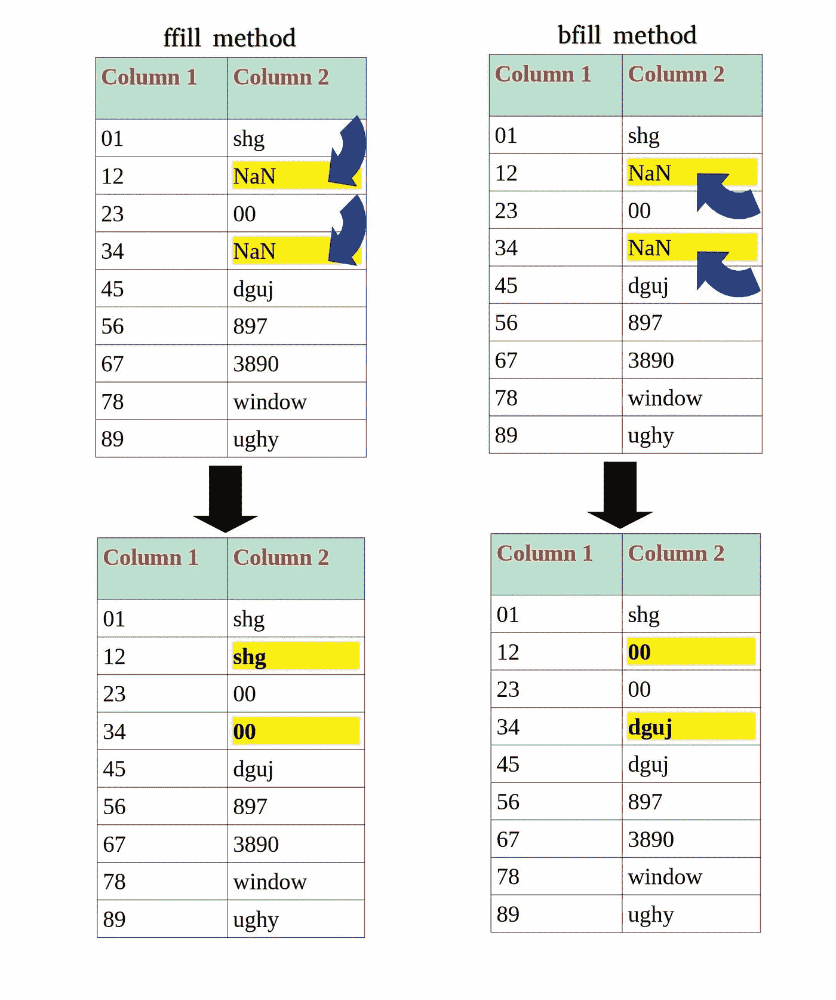

# 使用 python 处理缺失数据

> 原文：<https://medium.com/nerd-for-tech/dealing-with-missing-data-using-python-3fd785b77a05?source=collection_archive---------0----------------------->

*使用 Pandas 和 NumPy 处理数据集中出现的缺失值*


由 [NASA](https://unsplash.com/@nasa?utm_source=unsplash&utm_medium=referral&utm_content=creditCopyText) 在 [Unsplash](https://unsplash.com/?utm_source=unsplash&utm_medium=referral&utm_content=creditCopyText) 上拍摄的照片

# 介绍

在现实生活中，可用的数据很少是干净的。每个数据集都可能有缺失值，因此数据清洗是每个数据科学项目的主要和最重要的部分。



作者照片

在本文中，我们展示了一些流行的内置 Pandas 工具，用于处理 Python 中的缺失数据。这个练习是通过使用 [**Kaggle 的房价数据集**](https://www.kaggle.com/c/house-prices-advanced-regression-techniques/data?select=train.csv) 进行的。

> **为什么我们需要填写缺失的数据？**

来源: [Giphy](https://giphy.com/gifs/backstreetboys-backstreet-boys-bsb-larger-than-life-1jajMAVf2vN9KxoFfw)

不幸的是，如果我们传递一个缺失值，例如不是一个数字( **NaN** )，我们想要用于分类或回归问题的大多数机器学习(ML)模型将会提供一个错误。因此，在开始任何模型构建过程之前，我们需要确定数据清理过程的优先级。最基本的策略是删除所有包含缺失值的行，或者在极端情况下，删除包含缺失值的整列。然而，这种方法有一个缺点，因为我们会丢失数据，这可能会影响我们的模型性能。所以，这不是最好的主意。尽管如此，当一列中的大多数值都丢失时，它还是很有用的。

**加载并查看数据集:**

使用的数据集有 1460 个观察值，79 个解释性特征变量描述了美国不同州住宅的各个方面，一个输出变量预测每个住宅的最终价格。这些变量的全部细节在这里[描述。在本文中，我们将只关注处理缺失值的不同方法。](https://www.kaggle.com/c/house-prices-advanced-regression-techniques/data)

让我们首先将 [Pandas](https://pandas.pydata.org/pandas-docs/stable/user_guide/10min.html) 和 [NumPy](https://numpy.org/doc/stable/user/absolute_beginners.html) 导入到我们的 python 环境中，并将 [**加载一个. csv 数据集**](https://pandas.pydata.org/docs/reference/api/pandas.read_csv.html) 到名为 **df** 的 pandas dataframe 中。本文中展示的每一个例子都在 [Jupyter 笔记本](https://jupyter.org/)上得到验证。

加载。csv 数据集并检查数据的结构

在开始分析数据并得出任何结论之前，有必要了解任何数据集中是否存在缺失值。数据集中缺失的值可以用不同的约定来表示(**？，南，$，那，。…** )。

> 如何知道数据集是否有缺失值？

要检查我们的数据集是否有缺失值，最简单的方法就是使用 [**df.info()**](https://pandas.pydata.org/docs/reference/api/pandas.DataFrame.info.html) 函数。该函数将为我们提供列名以及每列中非空值的数量。

索引数据类型、列和每列的非空值

还有另一种方法可以发现数据中是否有空值，那就是使用 [**df.isnull()**](https://pandas.pydata.org/docs/reference/api/pandas.DataFrame.isnull.html) 函数。 **df.isnull()。sum()** 用于汇总每列缺失值的总数。

至少有一个 NaN 的列中缺失数据的总数

从上面的输出中，我们发现 19 列缺少值。为了让我们的生活稍微轻松一点，最好编写一个缺失值函数，该函数将输出缺失值的总百分比以及数据集中存在缺失值的所有列的分布。我们将使用 [matplotlib](https://matplotlib.org/stable/tutorials/introductory/usage.html) 库来绘制缺失数据的列。

缺少值的列的条形图

处理缺失数据有多种方法，不同类型的数据集有不同的方法。没有处理缺失数据的通用方法。您需要探索不同的选项，并尝试确定哪种方法最适合您的数据集。

现在，让我们讨论一下处理缺失数据的方法:

*   删除缺少数据的行/列
*   输入缺失值(用值填充缺失数据)

# **删除缺失数据的行/列**

第一种方法是删除所有包含缺失值的行，或者在极端情况下，删除包含缺失值的整列。这可以通过使用[**df . dropna()**](https://pandas.pydata.org/docs/reference/api/pandas.DataFrame.dropna.html)**函数来实现。**轴=0** 或**轴=1** 用于删除有 NaN 值的行/列。**

```
# drop rows with missing values
df.dropna(axis=0, inplace=True)
```

****

**此图片显示了删除一行(左)或一列(右)后的表格转换。**

**在我们的数据集中，我们观察到 4 列具有超过 1000 个 NaN 值(> 65%)。因此，最好删除这些列。**

****

**使用 Pandas drop()函数删除四列**

# ****输入缺失值****

**下一个方法是用某个值替换丢失的值。替换缺失值时，有许多选项可供选择:**

*   **替换方法。**
*   **用零代替 NaNs。**
*   **使用列的平均值/中值/众数替换 NaNs。**
*   **用 sklearn 的 SimpleImputer()代替 NaNs**
*   **用 k 个最近邻替换 NaNs(kNN)**
*   **用上一行或下一行的值替换 NaNs(使用 ffill 或 bfill 方法)。**
*   **用插值法替换 NaNs**

1.  ****替换方法:****

**有时我们会在数据集中以 **__、NA、@、？**等。检查这些缺失值的最简单方法是打印特定列的唯一值。**

```
df["column"].unique()
```

**在这种情况下，我们将使用 [**df.replace()**](https://pandas.pydata.org/docs/reference/api/pandas.DataFrame.replace.html) 函数将所有缺失的值替换为 **NaN** 。这里，我们指定了要替换的值和替换值。现在，对我们来说，处理空值比处理任何未定义的符号更容易。**

```
df = df.replace('?',np.nan)
```

****

**"?"第 2 列中的 sybmol 替换为“NaN”**

**2.**用零替换 NaNs:****

**我们将使用 Pandas**[**df . fillna()**](https://pandas.pydata.org/pandas-docs/stable/reference/api/pandas.DataFrame.fillna.html)函数将一列中缺失的值替换为 0。****

```
**df["MasVnrArea"] = df["MasVnrArea"].fillna(0)**
```

****通过替换方法也可以获得相同的输出。****

```
**df["MasVnrArea"] = df["MasVnrArea"].replace(np.nan, 0)**
```

****3.**用均值/中值替换方差:******

****在数字列或变量(dtype : int，float)的情况下，我们可以用它们的平均值或中值来填充缺失的值。如果您将 dtype 作为数字列的对象，那么 pandas[**to _ numeric(**](https://pandas.pydata.org/docs/reference/api/pandas.to_numeric.html)**)**函数对于将对象类型列转换为数字列非常有用。****

```
**df["column"] = pd.to_numeric(df["column"], errors = 'coerce')**
```

********

****此图显示了在第 2 列中用平均值(左)或中值(右)替换 NaN 值****

```
**#using mean
df['LotFrontage'] = df['LotFrontage'].fillna(df['LotFrontage'].mean(), inplace=True)# using median
df['LotFrontage'] = df['LotFrontage'].fillna(df['LotFrontage'].median(), inplace=True)**
```

****只有当数据有更多异常值时，才最好用数据的中值替换缺失数据。****

****4.**用模式替换 NaNs:******

****在分类列或变量(dtype : object)的情况下，我们可以用最常见的值 mode 替换缺失的数据。****

```
**# using mode
df["GarageType"] = df["GarageType"].fillna(df["GarageType"].mode(), inplace=True)**
```

********

****此图显示了用第 2 列中最常见的值(模式)替换 NaN 值****

****5.**使用 SimpleImputer()进行输入:******

****sklearn 库提供了一个函数[**simple impurt(**](https://scikit-learn.org/stable/modules/generated/sklearn.impute.SimpleImputer.html)**)**，可以用来替换缺失值。这允许我们通过传递一个 startegy 参数(如 mean、median、mode 或任何常量)来指定要替换的值。****

****用 SimpleImputer()估算缺失数据并检查非空计数****

****在上面的例子中，我通过从现有的 dataframe **df 中选择一列(MasVnrArea)创建了一个新的 dataframe **df1** 。**该列共有 8 个 NaN 值。使用 simple import(strategy = ' mean ')将所有缺失值估算为平均值。****

****注:**均值/中值方法对编码分类变量给出的结果很差。此外，这些方法(均值、中值、众数)也没有考虑不同变量之间的相关性。**

**6.**用 k 个最近邻居进行输入:****

**sklearn 库提供了函数[**KNNImputer()**](https://scikit-learn.org/stable/modules/generated/sklearn.impute.KNNImputer.html)**来替换缺失的值。这允许我们指定一个值，用数据点最近邻(n_neighbors)的平均值替换缺失值。****

********

****在上图中，我们将 k 值设为 3，在找到新数据点的最近邻后，新记录将倾向于根据多数投票转移到绿色三角形类，因为三角形数据记录更多地出现在 k 最近半径中。在 k 值= 7 的情况下，新的数据点将倾向于移动到红星类别。****

****用 KNNImputer()估算缺失数据并检查非空计数****

****在上面的例子中，我通过从现有的数据框架 **df 中选择两列(MasVnrArea，SalePrice)创建了一个新的数据框架 **df2** 。**新数据帧在 MasVnrArea 变量中共有 8 个 NaN 值。通过使用 KNN，所有缺失值都用 3 个最近邻居的平均距离值进行估算。****

**7.**用 ffill/bfil 方法替换 NaNs:****

**在这个方法中，我们可以指定一个前向填充(ffill)来向前传播前一个值，或者指定一个后向填充(bfill)来向后传播该值。**

****

**此图显示了用 ffill(左)或 bfill(右)方法替换 NaN 值。**

**如果前一个值在正向填充期间不可用，则 NaN 值保持不变，反之亦然。因此，您可以根据数据集为列选择 ffill 或 bfill 方法。**

```
# using ffill method
df["GarageType"] = df["GarageType"].fillna(method='ffill')OR# using bfill method
df["GarageType"] = df["GarageType"].fillna(method='bfill')
```

**8.**用插值法替换 NaNs:****

**填充 NaN 值的另一种方法是使用插值技术，该技术可通过使用 [**interpolate()**](https://pandas.pydata.org/pandas-docs/stable/reference/api/pandas.DataFrame.interpolate.html) 函数来执行。这种方法在时间序列数据中非常有用。**

```
df["column"].interpolate(method="linear", direction = "forward", inplace=True)
```

# **结论**

*   **我们了解到，每个数据集都可能有缺失值，因此数据清理是每个数据科学项目的主要和最重要的部分。**
*   **根据数据集的不同，有不同的方法来填充缺失值。没有填充缺失值的规则。您需要试验并检查哪种方法最适合您的分析。**
*   **我建议通过 [DataCamp](https://app.datacamp.com/learn/courses/dealing-with-missing-data-in-python) 来详细了解本课程。**

**这就把我们带到了本文的结尾。感谢您通读这篇文章。希望现在你能更好地理解如何处理缺失值。如果你有任何疑问，欢迎在评论区留言。**

**整篇文章中都提供了适当的参考资料。下面提到了一些更有用的文章参考和在线课程细节。**

# **参考资料:**

*   **[缺失数据](https://www.tutorialspoint.com/python_pandas/python_pandas_missing_data.htm):熊猫**
*   **[Python 中缺失数据的处理](https://www.datacamp.com/courses/dealing-with-missing-data-in-python) : Datacamp 课程**
*   **[缺失数据类型](https://towardsdatascience.com/missing-value-handling-missing-data-types-a89c0d81a5bb#:~:text=There%20are%20four%20types%20of,of%20multiple%20missing%20data%20types.):作者[扎卡里·沃恩斯](https://zjwarnes.medium.com)**
*   **[如何用 Python 处理缺失数据](https://machinelearningmastery.com/handle-missing-data-python/):机器学习精通**
*   **[处理缺失值](https://www.analyticsvidhya.com/blog/2021/10/handling-missing-value/):解析 Vidhya**