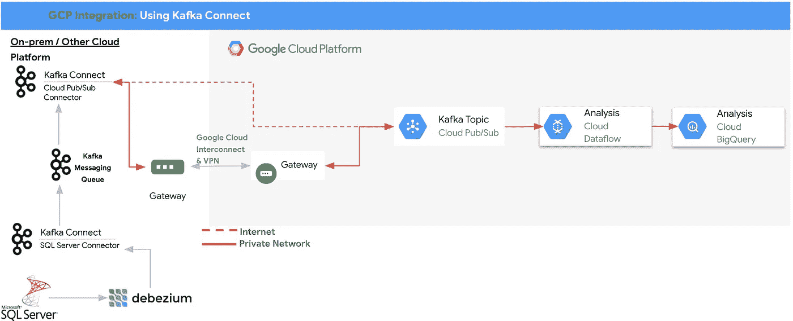
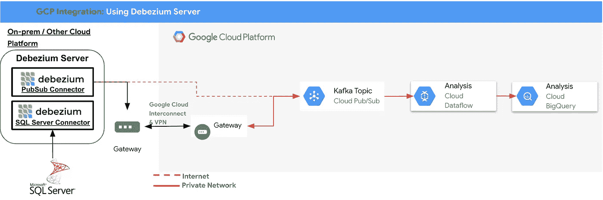
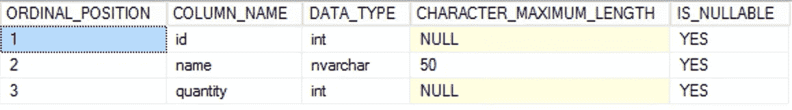
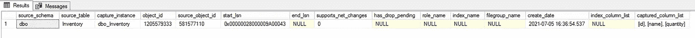
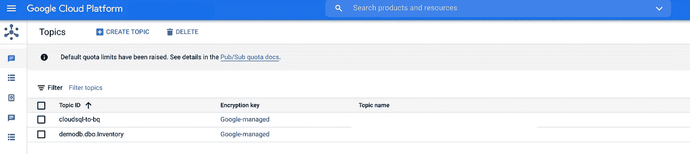
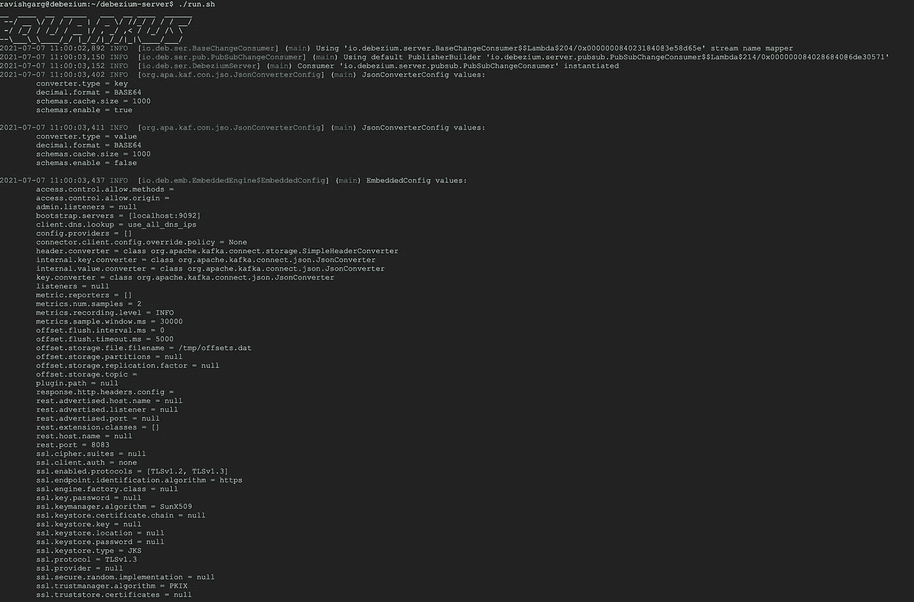
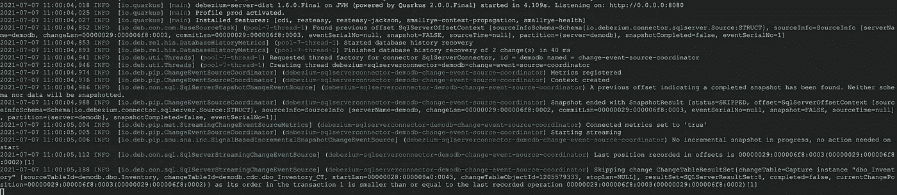
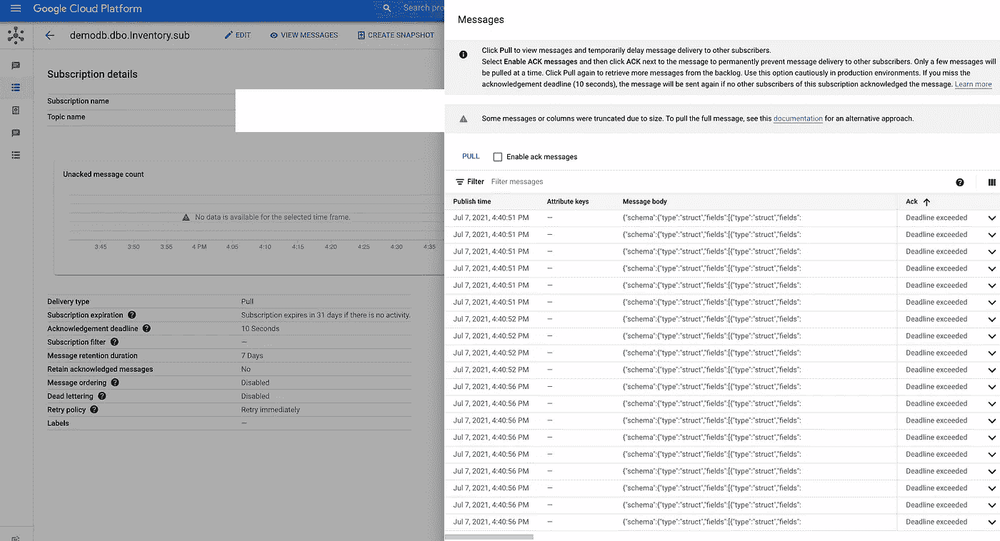

# 从 Debezium 服务器到 Cloud PubSub:一种无 Kafka 的方式来从数据库中传输更改

> 原文：<https://medium.com/nerd-for-tech/debezium-server-to-cloud-pubsub-a-kafka-less-way-to-stream-changes-from-databases-1d6edc97da40?source=collection_archive---------2----------------------->

正如根据[《哈佛商业评论》(HBR)](https://hbr.org/2017/05/whats-your-data-strategy) **所言，只有不到 1%的非结构化数据和 50%的结构化数据被用于决策制定**，因为组织不知道如何有效地集成、管理数据并从中提取价值。此外，为了在市场中保持竞争力，组织需要实时处理和分析数据以获得洞察力。这就是数据流的用武之地，最受欢迎的开源工具之一是 [Debezium](http://www.debezium.io) 。它是一个用于变更数据捕获的开源分布式平台。

唯一的限制是，您需要通过 Apache Kafka Connect 作为源连接器来部署 Debezium，因此，所有捕获的记录都必须通过 Kafka 消息队列传播到 Sink 连接器，进而传播到其他系统，甚至像 Cloud PubSub 这样的消息队列。



**作者使用 Debezium Kafka 连接器进行云 PubSub 集成**

现在，该团队已经引入了 Debezium Server，这是一个现成的应用程序，可以将变更事件从源数据库直接传输到消息传递基础架构，如 Google cloud managed Cloud Pub/Sub，而不需要 Apache Kafka，因此减少了相关的操作开销和额外的跳跃。



**使用 Debezium 服务器的云发布订阅集成**，作者

# Debezium 服务器设置

让我们配置 Debezium 服务器，source 为企业数据库引擎“SQL Server”，sink 为 Google Cloud PubSub，不需要 Kafka 组件。

## 为 CDC 配置 SQL Server

*   请确保您是 sysadmin 固定服务器角色的成员。
*   您是数据库的 db_owner。
*   SQL Server 代理正在运行。
*   要为数据库“demodb”启用 CDC，请执行以下操作:

```
USE demodb
GO
EXEC sys.sp_cdc_enable_db 
GO
```

*   在感兴趣的源表上启用数据捕获。

```
USE demodb
GO
EXEC sys.sp_cdc_enable_table 
@source_schema = N'dbo', 
@source_name   = N'Inventory',  
@role_name     = NULL,   
@supports_net_changes = 0
GO
```



来源表定义:**存货**，按作者

*   验证对 CDC 表的访问。

```
USE demodb
GO
EXEC sys.sp_cdc_help_change_data_capture
GO
```



**CDC 表 dbo_Inventory** 已由作者创建并可用

## 配置 Debezium 服务器

*   下载并安装 [Debezium 服务器发行版](https://repo1.maven.org/maven2/io/debezium/debezium-server-dist/1.6.0.Final/debezium-server-dist-1.6.0.Final.tar.gz)。
*   创建配置文件“conf/application.properties ”,该文件将包含与源、接收器、格式和适用转换相关的所有配置。
*   以 SQL Server 数据库作为源，以 Google Cloud PubSub 作为消息传递基础设施的配置文件将如下所示:

```
debezium.sink.type=pubsub
debezium.sink.pubsub.project.id= **<<PUT YOUR PROJECT_ID>>**
debezium.source.connector.class=io.debezium.connector.sqlserver.SqlServerConnector
debezium.source.offset.storage.file.filename=/tmp/offsets.dat
debezium.source.offset.flush.interval.ms=0
debezium.source.database.hostname=**<<SQL-Server HOSTNAME/IP_ADDRESS>>**
debezium.source.database.port=1433
debezium.source.database.user=sa
debezium.source.database.password= **<<PASSWORD>>**
debezium.source.database.dbname=demodb
debezium.source.database.server.name=demodb
debezium.sink.pravega.scope=empty
debezium.source.table.whitelist=dbo.Inventory
debezium.source.database.history.file.filename=/tmp/FileDatabaseHistory.dat
debezium.source.database.history=io.debezium.relational.history.FileDatabaseHistory
```

## 配置云发布订阅

*   使用以下名称创建 PubSub 主题**<<db _ name . schema . table _ name>>**



发布主题: **demodb.dbo.Inventory** ，作者

*   创建 PubSub 订阅以查看推送到 PubSub 主题的消息。

## 启动 Debezium 服务器

*   通过执行**<<Debezium _ Server _ Path/run . sh>>**启动 Debezium 服务器



**。/run.sh 输出**，作者



**。/run.sh 输出**，作者

*   让我们将数据添加到 ***库存*** 表，并检查 PubSub 订阅



**来自 SQL Server 的 CDC 数据在作者的发布订阅**中可见

## 摘要

Debezium Server 减轻了对 Kafka Connect 的依赖，因此用户可以将其与所选的托管产品集成，从而不再需要对采用 Debezium 带来的额外运营开销进行任何规划。但是，需要注意的是，该功能仍处于酝酿阶段，即确切的语义、配置选项等。在未来的版本中可能会有所变化。因此，在将其用于生产系统之前，请确保在您的非生产环境中对其进行了彻底的测试。

## 参考

[谷歌云发布订阅](https://cloud.google.com/pubsub)

[Debezium](http://www.debezium.io)

微软 SQL Server CDC