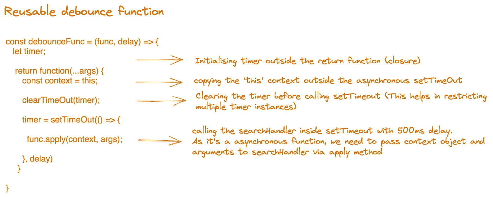
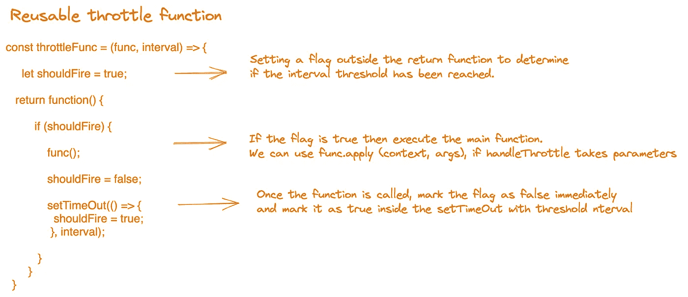

# JavaScript 中的去抖动和节流

> 原文：<https://medium.com/nerd-for-tech/debouncing-throttling-in-javascript-d36ace200cea?source=collection_archive---------0----------------------->


詹姆斯·哈里逊在 [Unsplash](https://unsplash.com/s/photos/code?utm_source=unsplash&utm_medium=referral&utm_content=creditCopyText) 上拍摄的照片

去抖动和节流是 javascript 中优化应用程序和浏览器性能的技术。

**什么是去抖功能？**

去抖功能限制函数调用的执行，并在再次运行之前等待一段时间。

让我们来看一个我们最常用的真实场景。

大多数网站都有搜索栏，帮助用户用特定的关键字搜索，以得到他们想要的东西。如果我们以电子商务为例，当用户试图搜索一个特定的产品时，甚至在他输入整个关键词之前，就可以看到多个建议弹出来。

所以这里发生的事情是，一旦用户开始键入关键字，我们就对每个字符进行 API 调用。如果用户键入“Apple MacBook Pro”，那么我们已经进行了 17 次(包括空格)API 调用来获得结果。

这种方法并不理想，尽管我们的初衷是在用户打字时向他显示建议。

我们可以通过去抖逻辑优化和减少 API 调用的数量。在进行下一次 API 调用之前，我们可以等待一段时间。

这里我们监控用户在两次按键之间给出的延迟。如果这个延迟符合我们的阈值限制，那么我们进行另一个 API 调用。

让我们将 500 毫秒作为这个延迟的阈值限制，这意味着如果用户花费 500 毫秒或更长时间来键入下一个字符，那么我们才进行下一个 API 调用。理想情况下，当用户键入“Apple MacBook Pro”时，每次按键之间的延迟时间为 500 毫秒或更长，只有 3 到 5 次。这样，我们可以将 API 调用的数量从 17 个减少到 3-5 个。

让我们看看我们的代码在第一个场景中是怎样的，其中 17 个 API 调用发生在“Apple MacBook Pro”上

通常我们会用 onChange 或 onKeyUp 事件来处理搜索功能。

```
<inputclassName="search-bar"onChange={ **searchHandler** }/>
```

searchHandler 函数将如下所示:

```
function **searchHandler**(...args){/* capture the search query entered by customer */
const { value } = args[0].target;/* Make an API call with search query */
getSearchResults(value);}
```

现在，让我们看看如何使用 searchHandler 和 delay threshold 作为参数编写一个可重用的去抖函数:

```
const **optimisedSearchHandler** = **debounceFunc**(*searchHandler*, *500*)const **debounceFunc** = (*func*, *delay*) => {
   let timer;
    return function(...*args*) {
       const context = this;
       clearTimeOut(timer);
       timer = setTimeOut(() => {
           func.apply(context, args);
       }, delay)
     }}
```

去抖功能逻辑分解:



现在我们可以将 optimisedSearchHandler 传递给我们的搜索栏输入 onChange 事件

```
<inputclassName="search-bar"onChange={ **optimisedSearchHandler** }/>
```

这样，我们可以避免多次执行任何昂贵的功能，如基于用户行为逻辑的 searchHandler。

**什么是节流功能？**

节流是一种限制事件处理函数执行的技术，即使该事件由于用户操作而连续触发。(例如:调整浏览器大小)

让我们举一个射击游戏的例子，用户连续扣动武器的扳机。我们需要注意不同类型武器的[](https://en.wikipedia.org/wiki/Rate_of_fire)****射速。****

****散弹枪在两轮射击之间可能需要更多的时间间隔，而机关枪需要更少的时间间隔。但这里的挑战是，通常用户连续点击触发按钮，我们需要注意每次拍摄之间的时间间隔。****

****假设霰弹枪发射下一发子弹需要 500 毫秒，而机枪只需要 100 毫秒。我们需要编写这样的逻辑，即使用户在这个阈值之前点击触发按钮，我们也应该根据武器的**射速保持射击。******

****触发器单击的事件处理程序:****

```
**window.addEventListener(onclick, **handlerTrigger**);const handlerTrigger = () => { fireShot();      // Expensive call}**
```

****每当用户点击某个按钮时，上面的代码调用 handlerTrigger 函数。****

****现在，让我们看看如何使用 handlerTrigger 和 interval 作为参数编写一个可重用的 throttle 函数:****

```
**const **optimisedTriggerHandler** = **throttleFunc**(handlerTrigger, 100);const **throttleFunc** = (func, interval) => {
     let shouldFire = true;
   return function() {
         if (shouldFire) {
             func(); shouldFire = false; setTimeOut(() => {
               shouldFire = true;
              }, interval) }
       }
  }**
```

****节流功能逻辑分解:****

********

****现在我们可以将**optimized trigger handler**传递给 onclick 事件监听器:****

```
**window.addEventListener(onclick, **optimisedTriggerHandler**);**
```

****这样我们可以为不同时间间隔的不同武器制作**优化扳机手柄**的副本。****

****要理解 apply 方法是如何工作的，请查阅我关于用 JavaScript 调用、应用和绑定的文章。****

******概要:******

1.  ******去抖**是一种技术，我们可以监控用户动作的时间延迟，一旦该延迟达到我们预定的阈值，我们就可以进行函数调用。****
2.  ******节流**是一种技术，在这种技术中，我们在预先确定的时间间隔内进行函数调用，而不考虑连续的用户操作。****
3.  ****尽管去抖动和节流看起来很相似，但它们都有自己的使用案例。不建议在**搜索栏**中使用节流逻辑，我们不能在**射击游戏**场景或**浏览器调整**或**滚动**事件中使用去抖动。****

****[**Chidanandan****P**](https://www.linkedin.com/in/chidanandan-p/)(如果这个名字很难发音，就叫他 ***Chidu*** )是马士基公司的一名软件开发工程师，他在那里帮助构建技术和解决方案，为劳氏公司及其各种业务提供动力。****