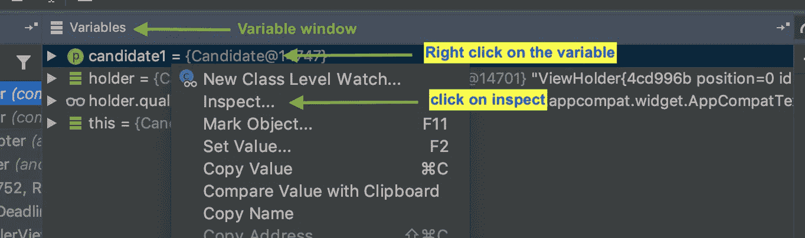
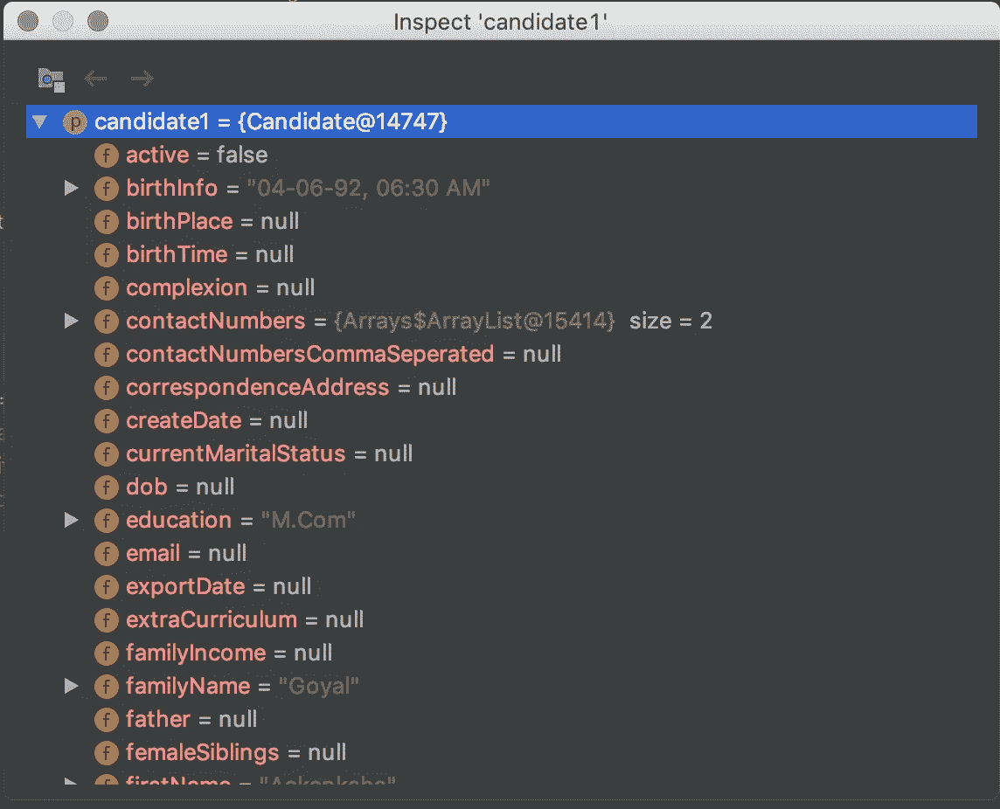
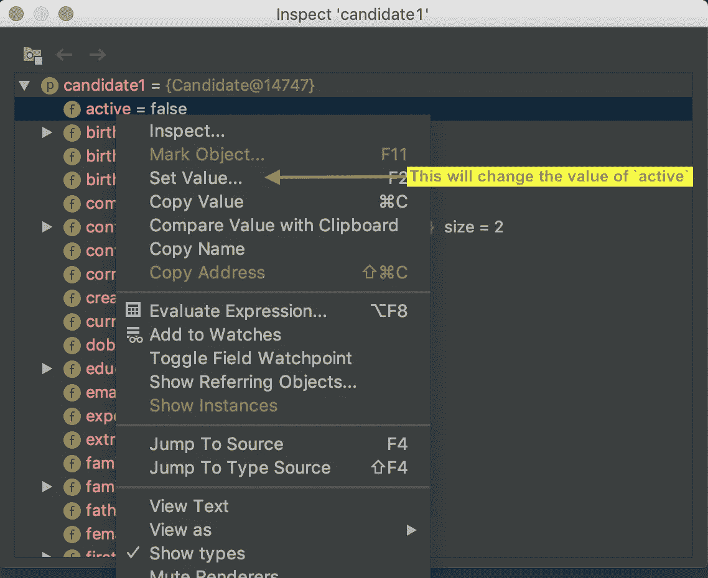
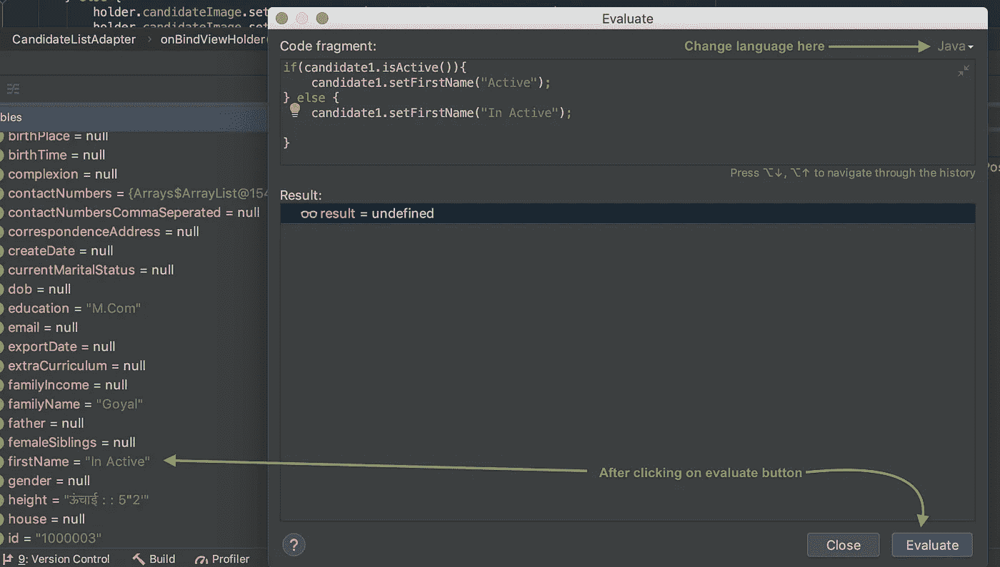
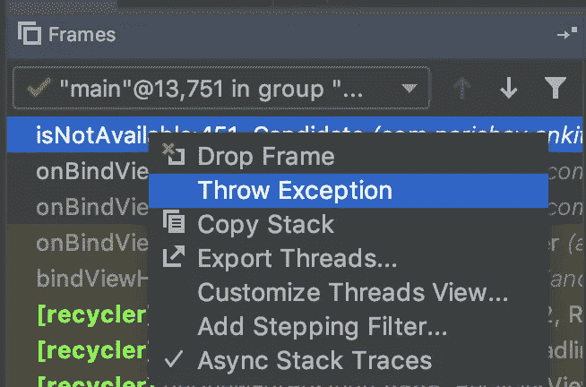
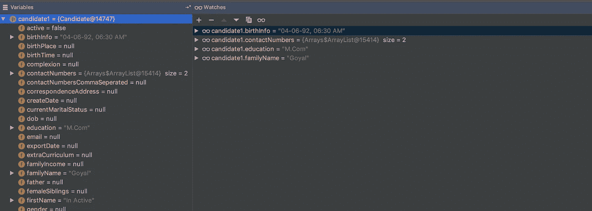
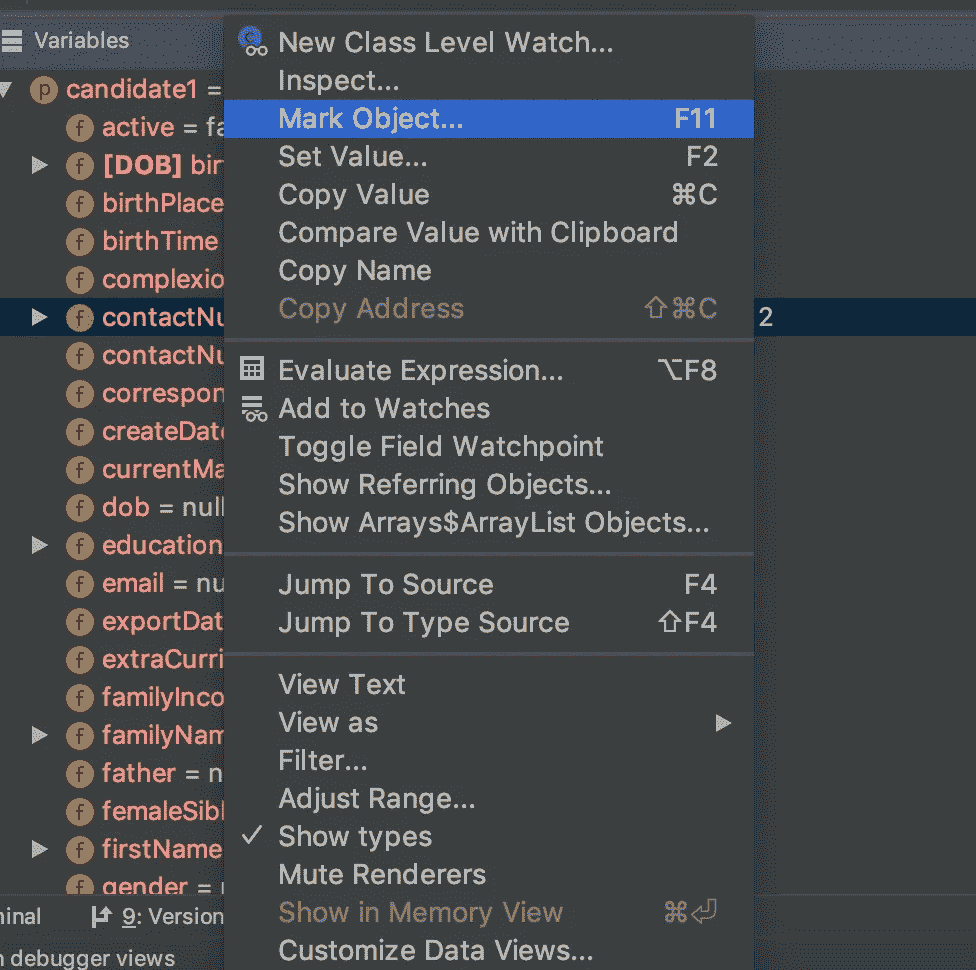
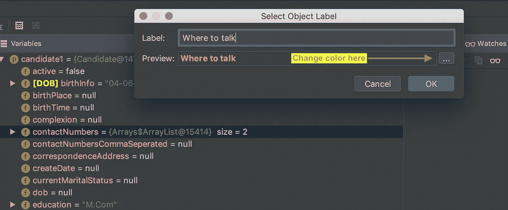
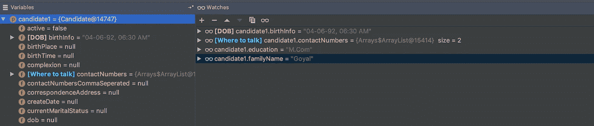

# Android Studio 上的调试器模式

> 原文：<https://medium.com/nerd-for-tech/debugger-mode-on-android-studio-ffe8312f78a7?source=collection_archive---------2----------------------->

我带着另一个 Android Studio 工具(大多数基于 Intellij 的 ide)的故事回来了。在我之前的故事中，我们已经看到了断点的多个高级选项🔴这次我们将研究如何在 Android Studio 上使用调试模式。这个故事将分为三个部分:

*   基础
*   预先的
*   让生活变得简单

# 基础

要进入调试模式，您需要在您的应用程序代码中放置至少一个断点，之后，您需要在调试器模式下运行您的代码，或者在您的仿真器或设备上附加一个带运行应用程序的调试器。

一旦你的应用程序遇到一个断点，你会看到一个调试器窗口将弹出如下

调试器模式

基本命令包括

复查

*   **跳过** :-转到下一行代码。

进入

*   **进入** :-进入一个方法/函数，(*注意* :- *它首先创建参数。)*

走出去

*   **步出** :-走出任何方法/函数。

运行到光标处

*   **Run to cursor** :-这可能是一个令人困惑的问题，但它将执行到光标的当前位置。

显示执行点

*   **显示执行点** :-如果你已经移动到代码中的某个地方，这将把你带到当前的执行点。

# 预先的

让我们来讨论一些高级主题，它们会让您的生活变得轻松，调试也会变得有趣。

*   检查一个物体
*   评估表达式
*   更改变量的值
*   从方法中强制抛出异常

# 检查一个物体

使用它你可以看到任何对象中所有类级变量的值。

一旦你点击 inspect，一个新的弹出窗口就会打开，如下图所示，它会给你关于对象的全部信息，比如所有类变量的值等等。

检查弹出窗口

在这里你可以改变一些变量值(在 Kotlin 中，如果一个变量被声明为`val`你不能改变它的值)

# 评估表达式

若要在调试期间运行任何代码，可以使用“计算表达式”选项。这将允许你执行任何代码，可以是多行的，也可以是不同语言的。

# 抛出异常

从**框架窗格中，**你可以强制一个方法抛出一个异常。在 Intellij 网站上，他们提到了另一个选项，可以在方法的 return 语句之前强制返回值，但在 Android studio 中没有相同的选项(我使用的是 3.5.1 版本)

右键单击方法名称后

# 让生活变得简单

调试器模式有助于开发人员找到代码的流程，但它需要大量的注意力，而且很多时候它会显示很多你当时可能不感兴趣的信息，所以如何在工作时让我们的生活变得轻松有趣。因为这个**观察者**是来帮助我们的。

# 看守人

Watcher 可以让您专注于正在解决的问题，并消除屏幕上的混乱。

您感兴趣的任何变量只需**拖放**到观察器窗格中，您就可以在变量窗格中对它们进行任何操作。

选择几个变量后的观察器窗格

在这种情况下，我对任何候选人的出生日期、联系电话、教育和姓氏感兴趣，所以我将它们移动到观察器窗格并关闭变量窗格。现在，为了使我的观察列表中的一些项目更加突出和易读，我已经使用**标记对象**选项对它们进行了标记。

右击任意变量，选择**标记对象**

选择标记对象后，会出现一个新的弹出窗口，您可以在其中更改名称和颜色

贴出标签和不同的颜色

我希望这篇文章能帮助你更好地理解 Android Studio 或任何其他基于 IntelliJ 的 IDE 上的调试器，让你的生活变得轻松。如果你喜欢，那就给我一些👏并提出一些意见，以便我可以改进我即将到来的故事。