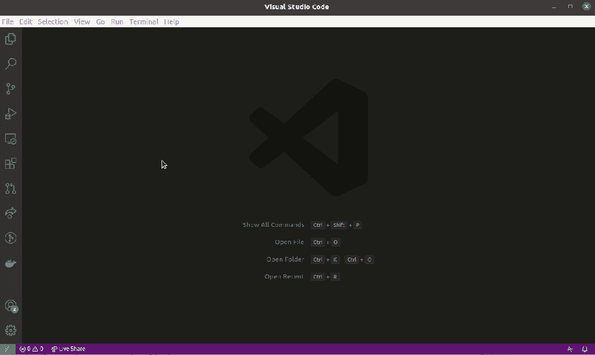
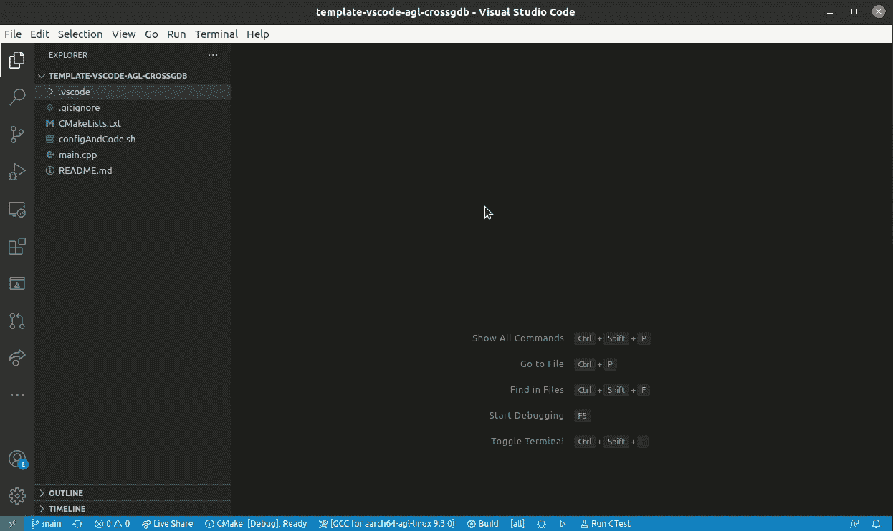

# 用 Visual Studio 代码调试 Raspberry Pi 4 汽车级 Linux

> 原文：<https://medium.com/nerd-for-tech/debugging-a-raspberry-pi-4-automotive-grade-linux-with-visual-studio-code-ceab83f36b66?source=collection_archive---------2----------------------->

*TL，DR: AGL 岩石坚硬。安装 VSCode 和 C/C++扩展包，抢到一个 debug enabled AGL SDK，得到一个我酝酿的* [*模板项目*](https://github.com/pauloasherring/template-vscode-agl-crossgdb) *的副本，按照 README.md 上的说明:构建，部署，调试，盈利。*

调试能力是开发过程中至关重要的一部分。Linux 系统中的大多数调试都是使用 [gdb](https://en.wikipedia.org/wiki/GNU_Debugger) 或 [lldb](//en.wikipedia.org/wiki/LLDB_(debugger)) 进行的。在本文中，我将向您介绍我使用几个关键工具远程调试嵌入式 Linux 应用程序的过程:

*   微软的 Visual Studio 代码(vs Code)；
*   VSCode 的 C/C++扩展包；
*   汽车级 Linux 和(AGL)软件开发套件(SDK)；
*   sshpass:内联密码传递所必需的— *注意安全！*；
*   树莓 Pi 4。

你会得到一个关于如何设置微软的 Visual Studio 代码以实现远程调试的一步一步的过程——使*变得有些容易*——使用一个我酝酿并在这里提供的模板项目。

*预先声明:交叉编译和远程调试本身对于新手来说并不是微不足道的任务，所以，如果你有什么不明白的地方，请给我留言和/或通读其他关于交叉编译的资料。*

# 1.得到好东西

在这一步中，我们将建立开始所需的基本设置。我不会讲得太深，但是，这里有一些关于从哪里得到什么的一般性建议。

*   Ubuntu 上的 vs code*:`sudo snap install --classic code`*
*   *VSCode 的 C/C++扩展包:*

**

*   *汽车级 Linux (AGL)和软件开发套件(SDK):请参考之前的[岗位#1](https://theuppernibble.wordpress.com/2021/02/24/cross-compiling-a-sample-application-using-automotive-grade-linux/) 和[岗位#2](https://theuppernibble.wordpress.com/2021/02/13/running-automotive-grade-linux-on-a-raspberry-pi-4/) 。*
*   *sshpass: `sudo apt instal sshpass`*
*   *你真正的[模板工程](https://github.com/pauloasherring/template-vscode-agl-crossgdb) :
    `git clone [https://github.com/pauloasherring/template-vscode-agl-crossgdb](https://github.com/pauloasherring/template-vscode-agl-crossgdb)`*

*应该差不多了。继续前进。*

# *2.使用好东西*

# *启动 IDE*

*正如我在以前的帖子中提到的，使用 AGL 的 SDK 需要您获取一个环境文件，导出所有类型的环境变量，让 CMake *et al* 。到达你的 SDK。为了实现自动化，您可以从终端获取它，然后运行`code .`来启动一个包含所有变量的 VSCode 实例。*

*然而，更方便的方法是运行模板项目提供的`configAndCode.sh`。因此，继续运行它，从您在步骤 1 中克隆的文件夹(*您可能会被 CMake 的扩展提示从一个编译器列表中选择。如果你不确定选择什么，请参考* [帖子#2](https://theuppernibble.wordpress.com/2021/02/13/running-automotive-grade-linux-on-a-raspberry-pi-4/) *，在那里会有更详细的讨论*。*

# *针对您的目标进行配置*

*为了使用 gdb，必须定义几件事，即:调试什么；将它部署到哪里；以及如何部署它，即使用什么凭证。配置在`.vscode/settings.json`完成。从 VSCode 中，导航到它并输入所需的输入:*

*   *你的目标的 IP(target IP)；*
*   *你的目标的用户名(target user)；*
*   *你的目标的用户名的密码(target password)；*
*   *目标的目标文件夹，用于远程部署(targetDestFolder)；*
*   *二进制文件的文件名(target appname)；*
*   *二进制文件的路径(targetInFolder)。*

*这些配置在`tasks.json`中用于驱动在开始调试之前发生的部署过程。确保你做对了:你应该能够使用你输入的配置`scp`和`ssh`。如果你做不到这一点，你将无法调试，因为这些是用来驱动调试会话的机制。*

# *构建和调试*

*在建筑部门，模板项目提供了三个任务，由`CTRL + SHIFT + B`触发:*

*   *CMake Build:运行 CMake configure，Build，并运行生成的构建系统。*
*   *CMake Clean:删除所有构建的文件，但保留缓存和其他；*
*   *删除构建文件夹:永久删除构建文件夹，进行更严格的重置。*
*   **Extra:*Kill remote gdbserver:这是一种便捷的方法，可以杀死在目标上运行的已停止的 gdb server 实例。*

*对于调试，`CTRL + SHIFT + B`并选择 CMake Build。如果您没有更改 CMake 文件，那么应该已经生成了一个二进制文件，并在`./build/SampleApp`时可用。*

*之后，按`F5`开始调试。这应该需要几秒钟才能开始。*

*整个过程描述如下:*

**

# *在引擎盖下寻找*

*构建过程非常传统，唯一真正的区别是在启动任何 CMake 实例之前获取 AGL 的 SDK 配置文件:这允许 CMake 正确地识别成功交叉编译所需的一切。在目前的方法中，源需要在启动 VSCode 之前完成:CMake 将继承它的环境变量。*

*至于调试，则需要更多的努力。有几个有趣的链接，要么 a)一般的想法；b)瞄准其他硬件和工具链；c)瞄准其他方法，如 gdb -tui 或 eclipse。其中有几个是:[【1】](/@karel.l.vermeiren/cross-architecture-remote-debugging-using-gdb-with-visual-studio-code-vscode-on-linux-c0572794b4ef)[【2】](https://gojimmypi.blogspot.com/2017/05/vscode-remote-debugging-of-embedded.html)[【3】](https://elinux.org/ECE497_Notes_on_Installing_the_Eclipse_IDE)[【4】](https://eastrivervillage.com/debugging-application-with-cross-gdb-yocto/)。*

*简要描述一下发生的情况，涉及的步骤如下:*

1.  *将二进制文件复制到目标——这里用`scp`完成，这是一个*复制 ssh* 工具；*
2.  *让二进制文件成为可执行文件——这里是通过 ssh 会话用`chmod +x binaryName`完成的；*
3.  *在目标上启动 gdbserver 在这里通过 ssh 会话用`gdbserver :3000 binaryName`完成；*
4.  *使用 SDK 提供的 gdb 二进制文件连接到正在运行的 gdbserver 会话——这里由 VSCode 自己完成。*
5.  *连接后，使用*

*为了实现这一点，我设计了一些长的一行命令，在`tasks.json`上使用。*

# *3.结论*

*微软的 Visual Studio 代码是一个令人难以置信的免费 IDE，被许多人选择作为首选解决方案。很明显，它走过了漫长的道路，并随着时间的推移不断改进。*

*现在，对于像你我这样的嵌入式开发人员来说，它仍然有些缺乏，因为通常使用 IDE 进行开发，使用其他工具进行构建和调试。*

*在本文中，我介绍了一个自酿的 VSCode 模板项目，用于支持嵌入式 Linux 目标的开发、构建和调试。虽然我关注的是汽车级 Linux，但是所介绍的方法可以很容易地适用于任何基于 Yocto 的项目。*

*希望对你有帮助:)*

*如果有，请告诉我。此外，反馈将非常感谢，提高我的博客技能。*

**这个原来贴在这里:* [*上半字节*](https://theuppernibble.wordpress.com/2021/03/04/debugging-automotive-grade-linux-with-visual-studio-code/) *。**