# 使用 IntelliJ 1/3 进行调试[测试文章系列第 11 部分中的软件开发工程师]

> 原文：<https://medium.com/nerd-for-tech/debugging-with-intellij-1-3-software-development-engineer-in-test-article-series-part-11-2b666d5c06f4?source=collection_archive---------3----------------------->

到目前为止，我已经写了 10 篇文章，大部分是关于软件测试的结构。第八篇文章是技术文章。你可以从 [**这里**](https://kicchi.medium.com/) 阅读之前的文章。

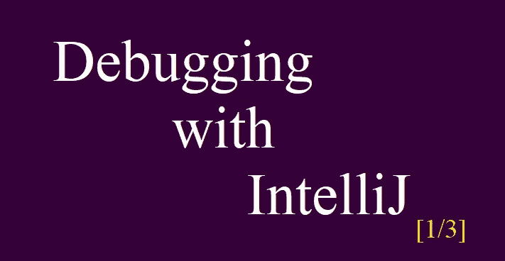

本文和后面的两篇文章为初学者处理 IntelliJ IDE 的调试。这些文章中没有讨论调试的高级特性。但是这个分三篇文章的系列中解释的特性对于大多数代码编写人员来说已经足够了。

我假设读者知道用 Java 编码，并且熟悉 IntelliJ IDE。

技术先决条件:

*   必须安装 IntelliJ IDE。
*   必须安装 JDK。

> **什么是调试？**

它仅仅意味着逐行或逐命令地运行源代码。

> 我为什么想要那个？运行它。

如果你的代码有问题

或者

如果你想实时观察变化

您将需要调试。

> 如果我有问题，就会有例外。我可以读取异常来检测问题。它甚至显示异常发生在哪一行。不是吗？

在某些情况下，会有**无例外**。你会遇到故障，但不会有错误。然后，您将不得不通过调试来寻找可能的错误资源。

> 好的，我明白了。那么，我为什么要实时观察变化呢？

有时你会使用或尝试你的框架或编程语言的新特性。编程语言和库总是在发展，它们发布了具有新特性的新版本。然而，他们有相关的文档，你会满意地观察新功能的输出。

或者，您可能希望通过调试来实时观察变化，只是为了理解另一个人的代码。

> **那么，调试和测试的区别是什么？**

调试，顾名思义，来自于发现并清除**bug**(缺陷)。

然而，大多数人说“调试是定位错误的过程”，正如我上面所说的，这不是调试的唯一原因。

测试的主要目标是找到 bug，但是调试也可以满足其他需求。

调试只能通过直接访问源代码来执行。但是除了单元测试之外，大多数测试都是在不访问实际源代码的情况下进行的。

有时候，通过调试，您可以在编写一次性测试代码之前解决一些问题。

所以**不管**你是软件**开发者**还是 **SDET** ，只要你写代码，就可以使用调试，或者不得不使用调试。

> **如何调试？**

首先在 IntelliJ 中创建一个新的 Maven 项目，如下所示:

(注意:您也可以创建一个 Java 项目，但是 Maven 项目的创建步骤如下所示)

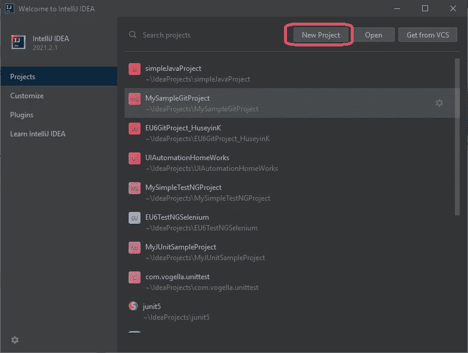

创建新项目

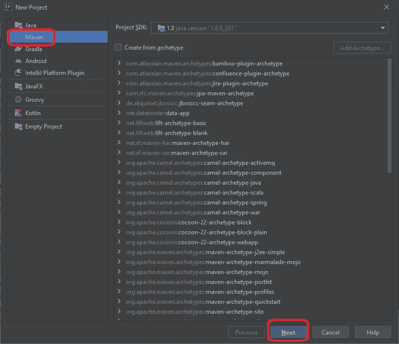

选择 maven，选择一个 SDK，版本不重要，点击下一步

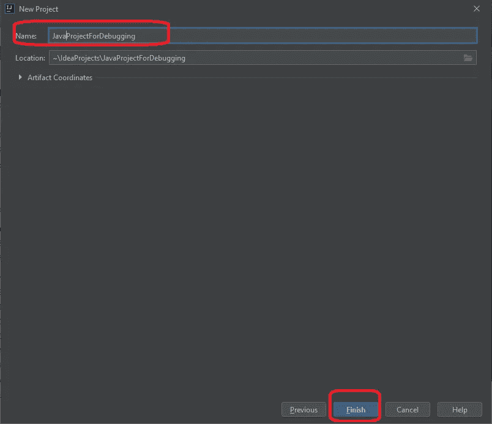

命名您的项目

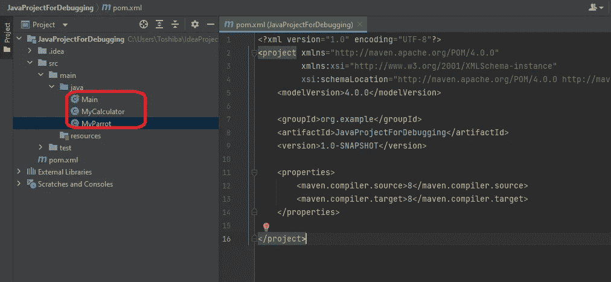

在 src/main/java 下创建三个类

您可以简单地下载这三个类，并添加到您新创建的项目中(或者只是复制/粘贴代码):

[T3【Main.java】T5](https://github.com/khicchi/JavaProjectForDebugging/blob/master/Main.java)

[**MyCalculator.java**](https://github.com/khicchi/JavaProjectForDebugging/blob/master/MyCalculator.java)

[**MyParent.java**](https://github.com/khicchi/JavaProjectForDebugging/blob/master/MyParrot.java)

> **重要提示:**请勿对课程进行任何修改。因为行号对于练习非常重要。

这三个类别的概述:

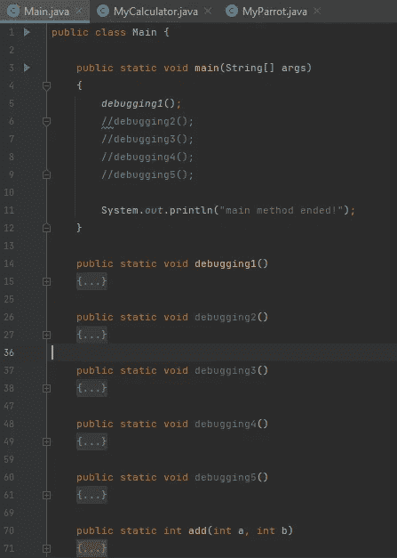

主课程概述

在我们的 **Main** 类中有 **main** 函数。除了 *main()* 法之外还有 7 种方法；其中 5 个是连续命名的，一个是简单的 add()方法，一个是简单的 *doubleTheValue()* 方法。我们会逐一调试每个方法，在调试中获得经验。

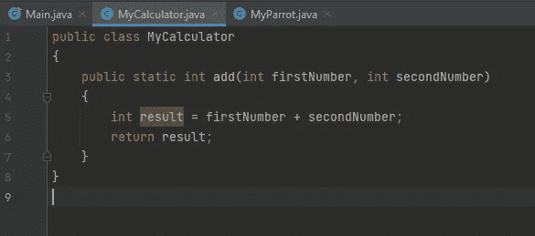

MyCalculator 类概述

MyCalculator 类有 1 个名为 *add()* 的方法。

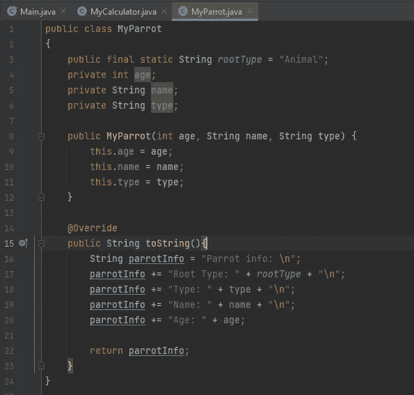

MyParrot 类概述

MyParrot 类有一个 final 静态字符串字段和三个实例变量。有一个带三个参数的*构造函数*。此外， *toString()* 方法被**覆盖**，以返回更加用户友好的对象信息。

调试过程可以通过 3 种方式开始:

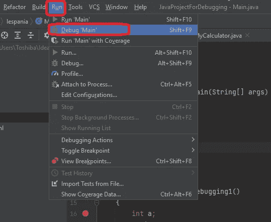

1.从运行菜单>调试命令

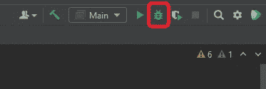

2.从右上角菜单>调试图标

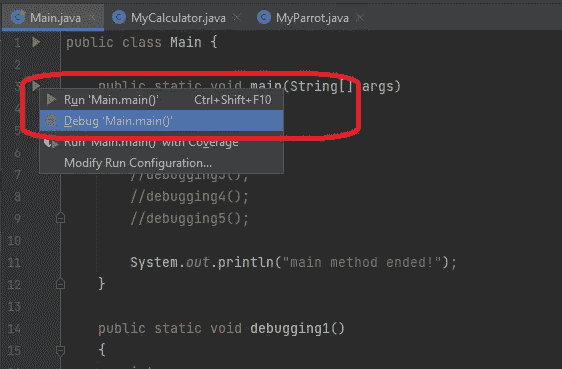

3.从左侧的绿色箭头(主方法或类级别)>选择 debug command

请按照我解释的步骤，在你的项目中同步执行。

我们需要**断点**进行调试。当我们点击调试按钮时；程序将启动并运行**，直到**遇到断点。然后它会等待我们的命令。要添加断点，只需单击要检查的行号右侧。如果出现一个红圈，这意味着您在该行添加了断点。您可以通过简单地点击它来删除断点。

**练习 1 : *debugging1()* 方法**

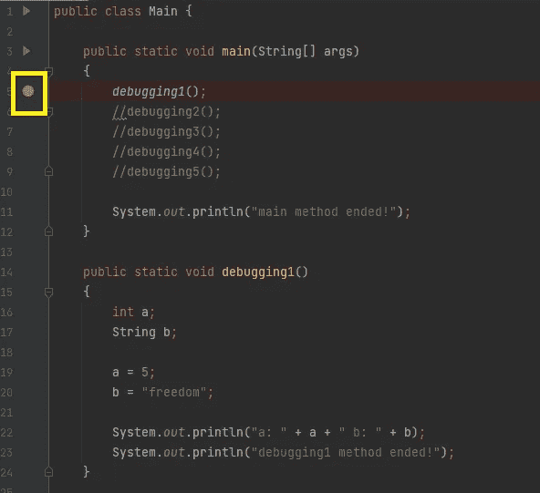

我们的第一个断点添加在第 5 行

在第 5 行放置一个断点。这意味着当我们单击 debug 图标时，程序将直接运行到第 5 行。众所周知，代码是从上到下、从左到右执行的。当到达断点时，它将停止。

让我们通过上面解释的三种方法之一来调试程序，并检查发生了什么:

S**点击 bug 图标开始调试。**

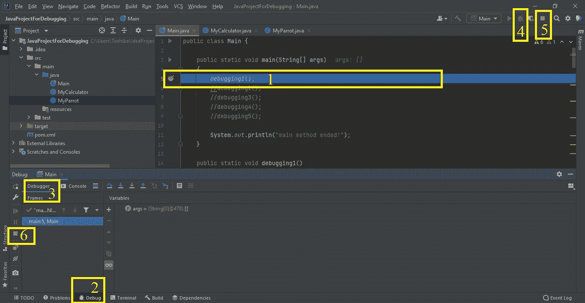

程序处于调试模式(调试会话已启动)

程序正在调试模式下运行；正在调试。

1.  执行在第 5 行**停止**。我们可以从**蓝**线背景来理解。我们目前正在这一点上。程序正在等待我们的命令。
2.  调试**选项卡**显示调试过程的相关窗口。**绿色小圆圈**表示调试正在进行。
3.  调试窗口中有两个子窗口。我们目前在**调试器窗口**中。
4.  绿色小圆圈表示我们处于调试模式。
5.  5 和 6:**红色停止图标**仅在我们处于调试模式或运行模式时可见。处于**运行模式**时可以停止运行，处于**调试模式**时可以停止调试。

调试器正在等待我们的命令。那么，让我们看看我们拥有的命令:

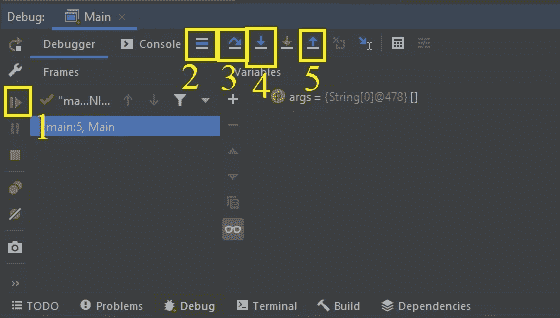

调试命令

1.  该按钮运行程序**，直到**遇到新的断点。点击该按钮可以直接跳到**另一个断点**。
2.  这个按钮把你带到等待行，我的意思是调试器在哪一行停止。如果您在调试过程中**在类和代码中迷失了**，您可以简单地点击这个按钮，它会将您带到**调试器一直在等待**我们的命令的那一行(在这种情况下，它会将您带到主类的第 5 行，因为调试器当前正在等待那一行)。
3.  该按钮**跳过**当前命令。捷径是 F8。跨过意味着；只需执行该命令，然后转到下一个命令。如果有函数调用(比如“ *debugging1()* ”))，它将**不进入**该功能，它将简单地调用和**运行该功能并跳过**到下一个命令。
4.  该按钮**进入**当前命令。捷径是 F7。步入手段；如果有函数调用(比如“*debugging 1()*；))，不立即执行代码，而是**单步执行被调用的函数**。所以它不同于跨步。调试将在被调用方法的中继续**。**
5.  该按钮**退出**当前代码块****。快捷键是 Shift+F8。步出意味着；立即执行完当前块的**剩余部分(例如 *debugging1()* 方法)，并返回到调用程序行。**

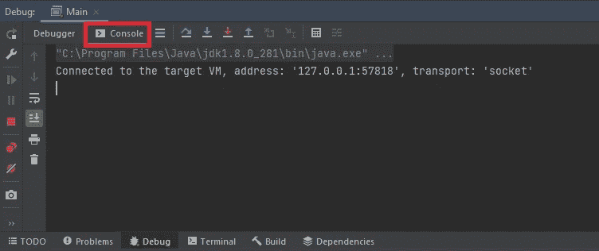

调试选项卡中的控制台窗口

在调试窗口中，除了调试器，我们还有一个**控制台窗口**。如您所知，这向我们显示了控制台输出。

到目前为止，我们没有在 debug 方法中执行任何一行。**调试器正在等待**。让我们只执行当前行。

C ***点击一下“跳过(F8)”按钮。***

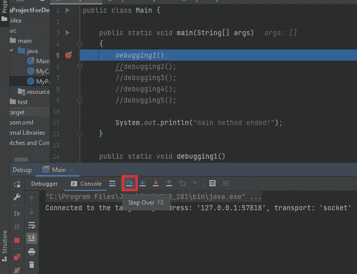

单击“跳过”按钮

单击“跳过”按钮将执行第五行。代码是

*调试 1()；*

因此调试器将**调用**的 *debugging1()* 方法并且**跳到下一行。控制台输出如下所示:**

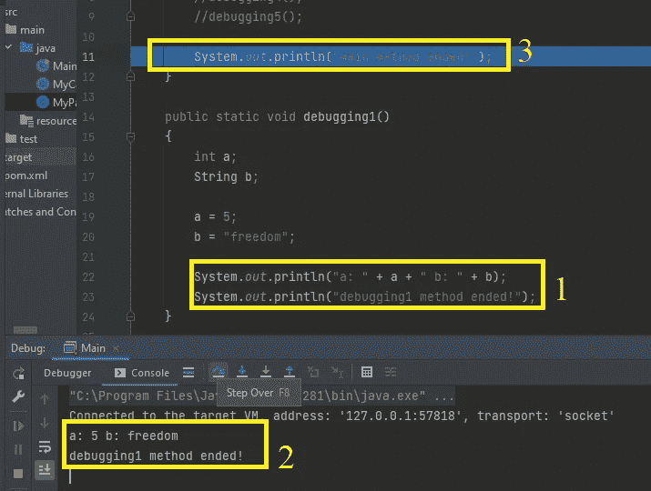

检查变化

1.  这些代码是**向控制台**写入两行。一个用于反映变量的值，另一个用于通知当前的过程。
2.  我们知道 Step Over 只是运行命令。在这种情况下，该命令正在调用 *debugging1()* 方法，因此它运行代码并且**没有进入**该方法。我们使用“跳过”按钮立即运行该方法。 *debugging1()* 方法打印出我们在控制台中看到的几行。
3.  运行 *debugging1()* 方法(第 5 行)后，执行**在第 11 行停止**。**蓝线**显示执行在**停止**的地方。现在，调试器再次**等待**我们的命令。正如我们预测的，被**注释的行跳过了**，因为这些行不能运行。

现在我们在第 11 行。让我们执行这个打印命令:

点击一次“跳过(F8)”按钮。

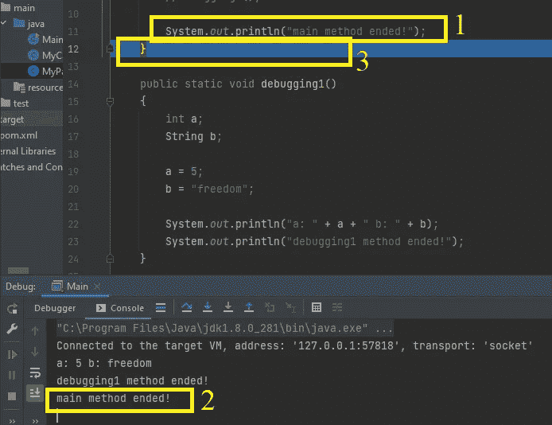

检查变化

1.  执行第 11 行并在第二个矩形打印出消息。
2.  遵循**控制台**上的变化。11 号线打印了这一行。
3.  执行指令到达第 12 行，**停止**。因为我们正在一个代码接一个代码地执行程序**。等待中的**线是 12，我们从**蓝色背景**中了解到。****

C ***点击一次“跳过(F8)”按钮。***

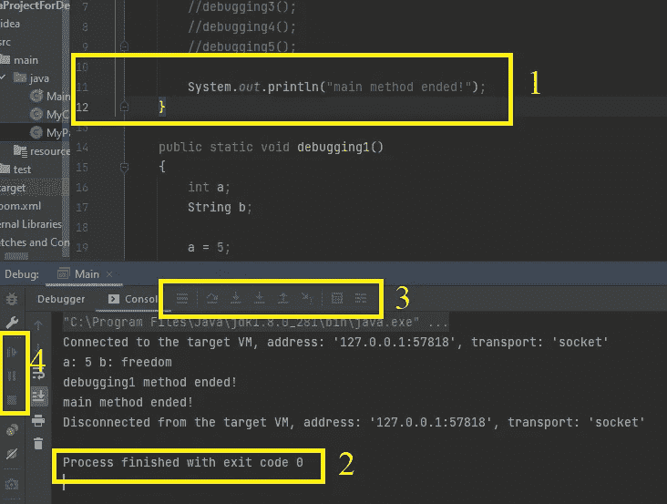

程序已完成

1.  执行第 12 行。没有**蓝线**，程序结束。
2.  从这个消息中我们了解到，程序的执行是有规律地完成的(没有例外)。所以调试也是**完成**。
3.  图 3 和图 4 向我们展示了调试命令按钮**已经淡出**。这意味着调试会话已经结束，因此无法执行更多的调试命令。

> **太刺激了。你可以在任何你想的地方停止程序的执行并控制流程。如果我们按下第 5 行的“步入”按钮会怎么样？**

让我们试试。

**练习二:*调试 1()* 方法**

验证在调用调试方法的第 5 行是否有断点

S ***点击 bug 图标开始调试。***

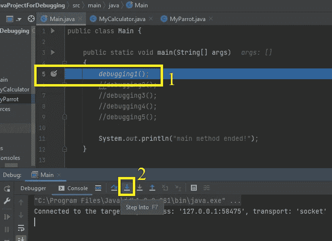

调试会话已开始

调试会话已开始。

1.  程序执行在我们的断点所在的第 5 行停止。我们知道等候的队伍是从蓝线过来的。
2.  现在，我们将在第 5 行执行“**步入**”动作。

C ***点击“踏入(F7)”按钮。***

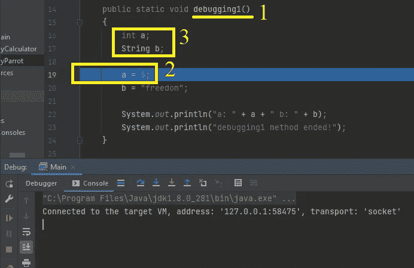

调试 debug 1 方法

1.  正如我们看到的，调试器**进入了***调试 1()* 方法
2.  调试器在第 19 行停止。我们可以从蓝线颜色来理解。换句话说，**下一个要执行的行是第 19 行**。
3.  正如我们所见，当调试器进入 *debugging1()* 方法时，它直接转到第 19 行。它**跳过了**第 16 和 17 行。因为在这两行中定义了局部变量，但是**没有初始化**。所以调试器跳过了定义，转到了第 19 行，这里 5 是**分配给变量“a”的**。

让我们执行第 19 行= >“a = 5；”。它会将 5 赋给变量“a”。

这次，您可以单击“跳过”按钮或“步入”按钮。**他们两个**会做**同样的**动作。有**不是方法调用**，只是一个赋值，所以有**没什么可踏入**的。

C ***点击“踏入(F7)”或“跨过(F8)”按钮。***

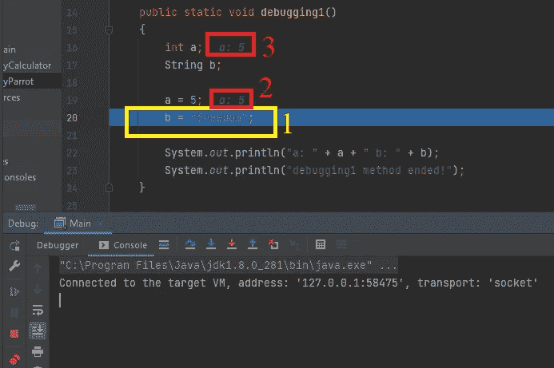

逐行调试，第 19 行被执行

1.  我们执行了第 19 行，来到了第 20 行(正如我们从蓝线颜色所理解的)。
2.  当我们在第 19 行执行赋值时，调试器自动在第 2 个和第 3 个矩形中显示变量“a”的**值。所以我们开始学习调试器的特性。它显示了**变量的值**。我们还可以观察到**值的变化**。**

C ***点击“踏入(F7)”或“跨过(F8)”按钮。***

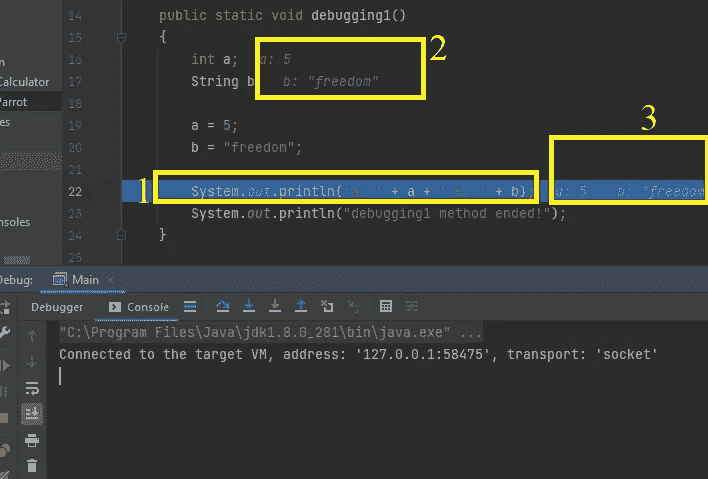

逐行调试，第 20 行被执行

1.  我们刚刚执行了第 20 行，现在我们在第 22 行。调试器正在**等待**我们的命令。**蓝线**显示等候线就是这条线。
2.  当我们对变量“b”执行赋值命令时，在第 20 行，b 的值是“freedom”。再一次，调试器**显示**当前代码块的变量的值。
3.  由于“a”和“b”变量在第 22 行中使用**，调试器**也**在同一行的末尾显示它们的值。这个特性帮助我们在**执行下一个代码之前跟踪**表达式**、**中使用的变量值。**

C ***点击“跳过(F8)”按钮。***

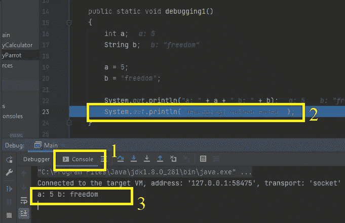

逐行调试，第 22 行被执行

1.  确保你在**控制台**窗口。
2.  等候的队伍是 23 号。调试器在第 23 行停止。第 23 行是**当我们恢复代码执行时第一个被执行的行**。
3.  当执行第 22 行时，它将输出打印到控制台。

C ***点击“跳过(F8)”按钮。***

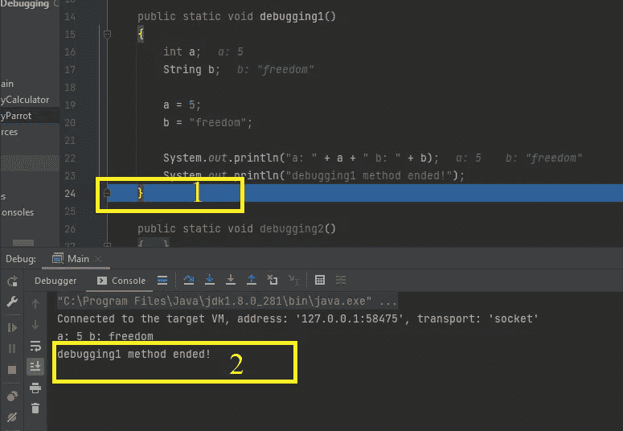

逐行调试，第 23 行被执行

1.  在用我们的“单步执行”命令执行第 23 行之后，调试器在第 24 行停止。
2.  当调试器执行第 23 行时，第 23 行中的代码将此消息打印到控制台。

C ***点击“跳过(F8)”按钮。***

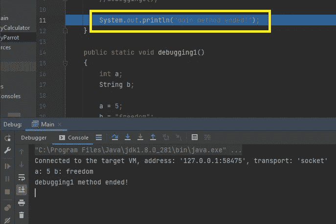

调试 1 方法结束

我们调试完了 *debugging1()* 方法。所以程序执行到第 11 行就停止了。第 11 行是第 5 行之后的代码行。

通过在我们的调试会话开始时点击“步入”按钮，程序流进入了 *debugging1()* 方法。这个方法一完成，流程就返回到 *debugging1()* 方法的**调用程序块**，在这种情况下，它是主方法。**第 5 行执行完毕，我们在第 11 行**。

请记住，在之前的练习(练习 1)中，我们来到了第 11 行，就在通过“Step Over”命令执行第 5 行之后。因为“ **Step Over** ”命令执行 debugging1 方法**而没有进入**它，只是在**执行了一次**debugging 1 的全部代码，**在第 11 行**停止，**好像在第 11 行**有一个断点；

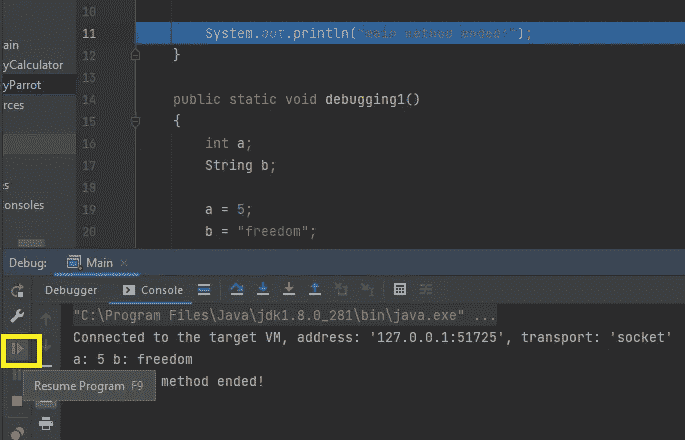

黄色矩形中的继续按钮

C ***点击“恢复(F9)”按钮。***

“恢复”按钮运行程序**，而**不会在每一行**处停止，直到**遇到一个**新断点**。如果没有任何其他断点，程序会结束，调试会话也会结束。

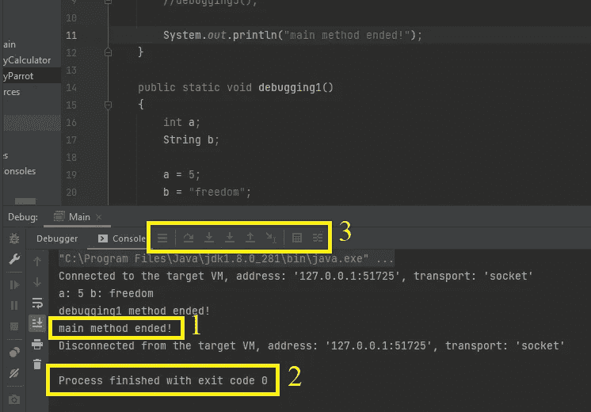

程序完成

在我们的场景中，没有其他断点。程序没有在任何其他行停下来就结束了。

记住，在前面的练习(练习 1)中，我们用“单步执行”命令执行了第 11 行，调试器在第 12 行停止。那就是"单步执行"按钮的行为=> **逐行执行**(不单步执行)。但是现在，在同一行，我们给了调试器“Resume”命令，它就开始运行**而没有在每一行**停止。

1.  执行第 11 行并打印出该消息。
2.  程序执行无异常完成。
3.  由于调试会话已经结束，这些调试器命令按钮已经消失。

> **我要总结；**
> 
> 调试让你有机会在任何你想的地方开始和停止代码执行。
> 
> ***您可以轻松检查当前块变量的值。**
> 
> **还有什么？**

这只是**的**的开始，却是**调试中最**重要的部分。在调试文章的第二部分，我将解释调试的一些其他特性和好处。让我们在 SDET 文章系列的第 11 篇相遇。