# 使用 IntelliJ 2/3 进行调试[测试文章系列第 12 部分中的软件开发工程师]

> 原文：<https://medium.com/nerd-for-tech/debugging-with-intellij-2-3-software-development-engineer-in-test-article-series-part-12-82fa4b7a9134?source=collection_archive---------7----------------------->

到目前为止，我已经写了 11 篇文章，大部分是关于软件测试的结构。第八篇文章是技术文章。你可以从 [**这里**](https://kicchi.medium.com/) 阅读之前的文章。

本文是第十一篇的续篇: [**用 IntelliJ【1/3】**](https://kicchi.medium.com/debugging-with-intellij-1-3-software-development-engineer-in-test-article-series-part-11-2b666d5c06f4)调试。你可以从 [**这里**](https://kicchi.medium.com/debugging-with-intellij-1-3-software-development-engineer-in-test-article-series-part-11-2b666d5c06f4) 访问这篇文章。我强烈建议你在阅读这篇文章之前先阅读它。

本文、上一篇文章和下一篇文章为初学者处理 IntelliJ IDE 调试。这些文章中没有讨论调试的高级特性。但是这个分三篇文章的系列中解释的特性对于大多数代码编写人员来说已经足够了。

我假设读者了解 Java 编码，熟悉 IntelliJ IDE，并阅读了关于调试的第一篇文章。

技术先决条件:

*   必须安装 IntelliJ IDE。
*   必须安装 JDK。
*   在[上一篇文章](https://kicchi.medium.com/debugging-with-intellij-1-3-software-development-engineer-in-test-article-series-part-11-2b666d5c06f4) **中提到的类( [Main](https://github.com/khicchi/JavaProjectForDebugging/blob/master/Main.java) ， [MyCalculator](https://github.com/khicchi/JavaProjectForDebugging/blob/master/MyCalculator.java) ， [MyParrot](https://github.com/khicchi/JavaProjectForDebugging/blob/master/MyParrot.java) )必须在你的本地计算机上准备好**。

请按照我解释的步骤，在你的项目中同步执行。

在[之前的文章](https://kicchi.medium.com/debugging-with-intellij-1-3-software-development-engineer-in-test-article-series-part-11-2b666d5c06f4)中我们做了两个练习。我们使用了“步入”、“跨过”和“继续”按钮。我们来做新的练习吧！

**练习三: *debugging2()* 方法**

打开主类**移除所有断点**。只需在 *debugging2()* 方法的第一行添加一个断点。主班应该是**确切地说是**这样:

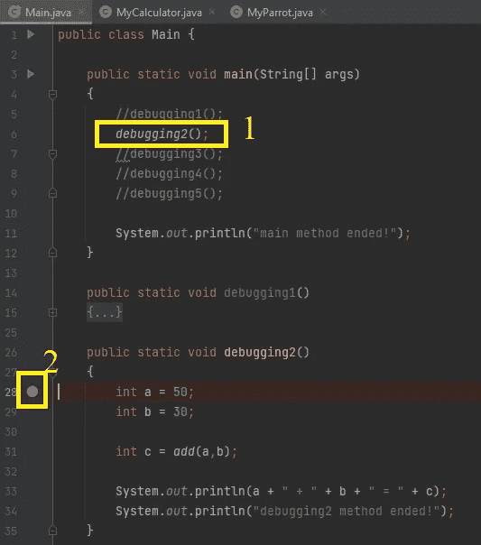

主课程概述

1.  在 main()方法中，确保只有 *debugging2()* 方法调用必须被取消注释，其他方法调用必须被注释。
2.  我们在第 28 行只有一个断点；第一行 *debugging2()* 方法。

S ***点击 bug 图标开始调试。***

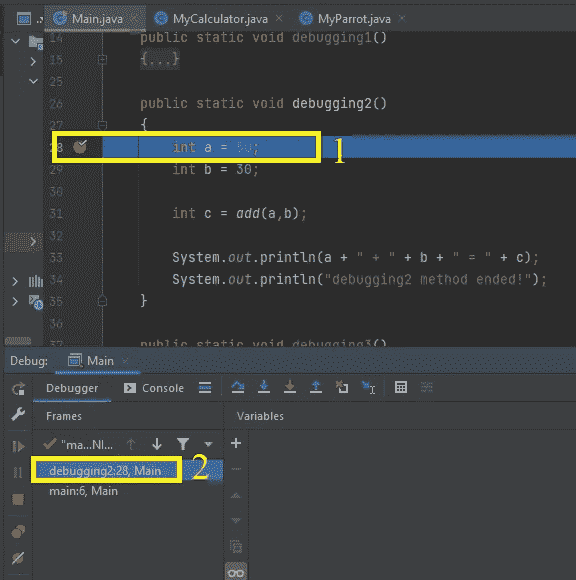

1.  我们的代码从 *main()* 方法的第一行开始，直接来到第 28 行的第一个断点，然后停止。
2.  在调试器窗口中，我们可以看到调试器**停止**的行号和类名(本例中: **Main** )。调试器正在等待我们的命令。

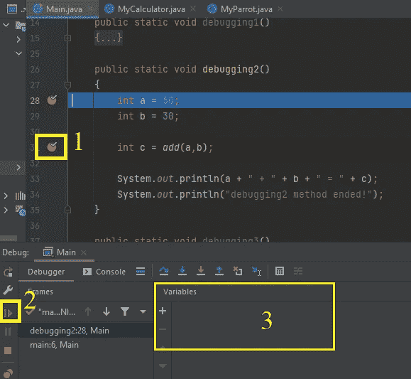

1.  在向调试器发出任何命令之前，在第 31 行添加一个新的断点。

2。 ***单击“恢复”按钮(快捷键 F9)。***

3.**观察**变量窗格中的变化。

1.  正如我们看到的，调试器直接跳到了 31。线。调试器跳过了 29。线。因为我们点击了恢复按钮。如果我们单击了“单步执行”或“单步执行”按钮，调试器将在第 29 行停止。线。恢复按钮向调试器发出这个命令:运行**直到**出现新的断点。
2.  在给局部变量赋值后，调试器显示它们。
3.  “变量”窗格在一步之前还是空白的，但现在它显示了具有值的变量值。注意，c 变量暂时没有显示在变量窗格**中**。

D ***不能点击任何东西*** 😁

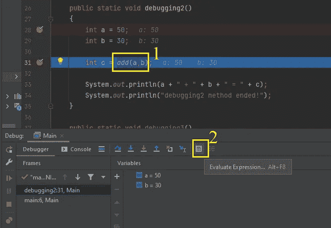

1.  选择第 31 行中的“ **add(a，b)** ”部分，如图所示(不包括分号)。

我们将在一个新的弹出窗口中评估所选的表达式。

C ***点击“评估表达式”按钮(快捷键 Alt+F8)。***

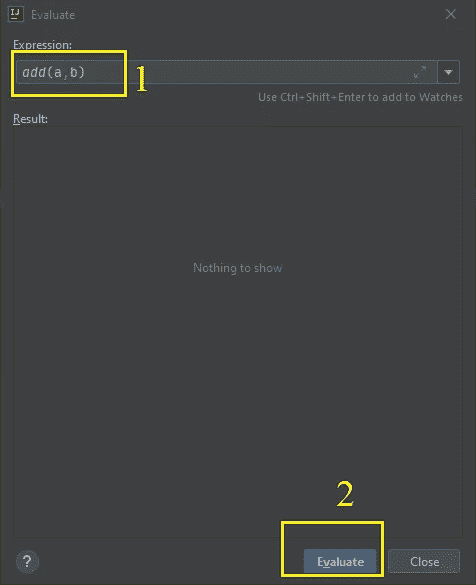

评估窗口

这个过程不会干扰调试进度。调试器正在**等待**我们的命令从它停止的那一行继续。但是，现在，我们正在评估一个表达式。

1.  要计算的表达式必须如上所示。

C**点击评估按钮。**

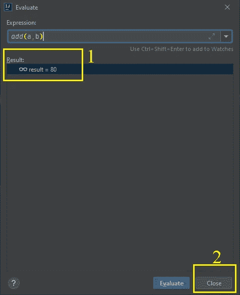

评估结果

1.  “add(a，b)”的评估运行了**而不影响**主调试过程。我们很容易看到结果。这个评估窗口对于复杂表达式一部分一部分地处理**非常有帮助。**

C ***点击关闭按钮关闭弹出窗口。***

如您所见，调试器在第 31 行再次等待。我们在评估窗口中的操作不会影响主调试过程。我们能够在完全执行它所属的行之前运行“add(a，b)”语句**，并且不会干扰调试的连续性。**

C ***点击“跳过(F8)”按钮。***

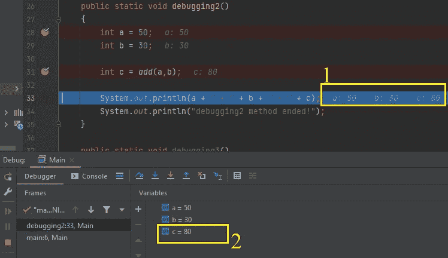

1.  调试器执行了第 31 行，现在在第 33 行等待。调试器显示了 a、b 和 c 变量的值。因为这些变量都是**用**在同一行。
2.  给 c 变量赋值后，变量窗格也开始显示 c 的值。

C ***点击“跨过(F8)”按钮。***

1.  当我们运行第 33 行时，它在控制台上打印出新的一行。调试器显示一个通知(**黄色向下箭头**靠近控制台图标)，这意味着有**新的东西打印到控制台。**

2。 ***点击控制台选项卡观察变化。***

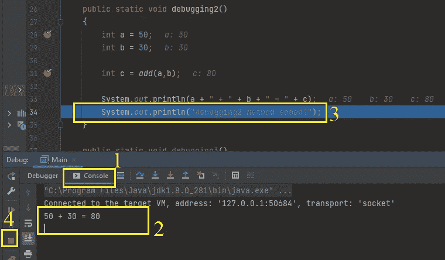

1.  现在，我们在控制台选项卡中。
2.  我们可以看到印刷线。
3.  我们现在 34 岁。当前线路。

4。 ***点击停止按钮停止调试会话。***

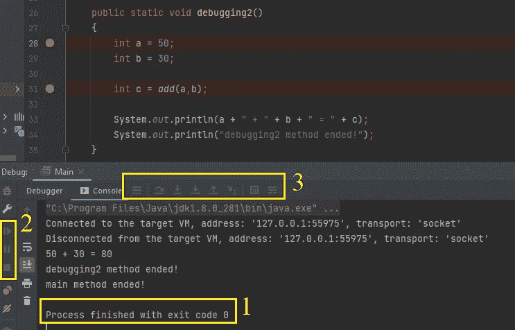

1.  从这条消息中我们可以看到，我们的节目已经结束了。
2.  我们可以从**褪色的**调试命令按钮了解到调试会话已经完成。

**练习 4 : *调试 3()* 方法**

开始新练习前，删除所有断点。你的主类应该**正好**和那个一样:

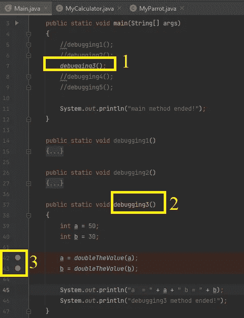

1.  确保在 *main()* 方法中取消对 *debugging3()* 方法调用的注释。并确保您对其他方法调用进行了注释。
2.  确保你在*调试 3()* 方法中。
3.  在第 42 行和第 43 行放置断点。

点击 bug 图标开始调试。

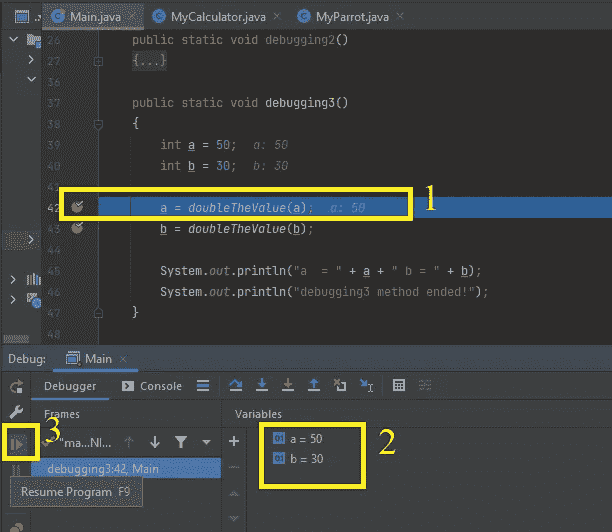

1.  调试会话已开始。我们在第 42 行。
2.  “变量”窗格显示局部变量的值。请仔细观察此窗格中的这些值。

3。 ***点击恢复按钮。***

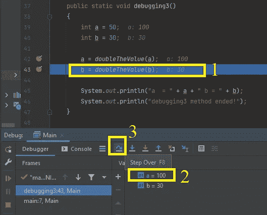

1.  我们现在在第 43 行。我们跑了 42 英里。带有继续按钮的行。因此调试器没有单步执行 doubleTheValue()方法。它只是跳到下一个断点。
2.  注意到 a 的值改变了，所以颜色变了。在“变量”窗格中，的颜色变成了蓝色。它是**新**改变值的指示器。

3。 ***点击步过按钮。***

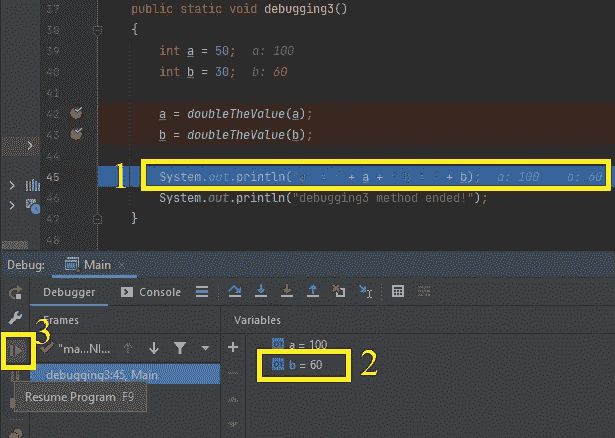

1.  现在我们在第 45 行。调试器正在等待我们的命令。
2.  注意，b 的值发生了变化，**因此颜色为**。因为**最后一个**执行的命令改变了 b 的值。因为它是**新**改变的，变量窗格把它的颜色变成蓝色，而它又把 a 的**颜色变回**。因为“a”变量的值改变比当前步骤早两步。于是就**过了**。**最后改变的值**是 b 的值。因此调试器通过改变颜色来反映它。

3。 ***点击恢复按钮。***

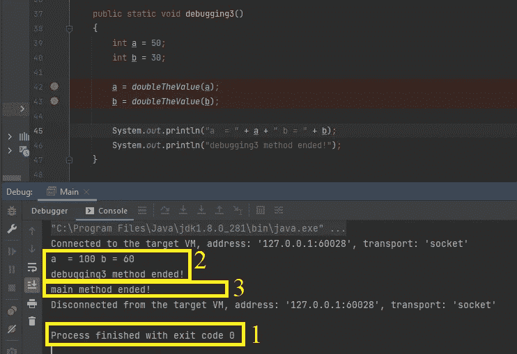

1.  Resume 按钮将程序运行到最后，没有任何中断。因为在未来的代码中没有任何断点。
2.  这两行来自于 *debugging3()* 方法。
3.  这一行来自 main 方法。

**练习 5 : *调试 4()* 方法**

开始新练习前，删除所有断点。你的主类应该**正好**和那个一样:

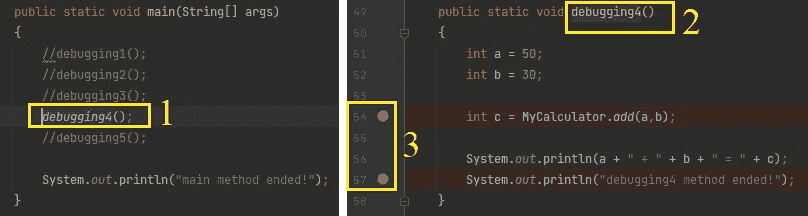

主类概述

1.  确保在 *main()* 方法中取消注释 *debugging4()* 方法调用。并确保您对其他方法调用进行了注释。
2.  确保您在 *debugging4()* 方法中。
3.  在第 54 行和第 57 行放置断点。

S ***点击 bug 图标开始调试。***

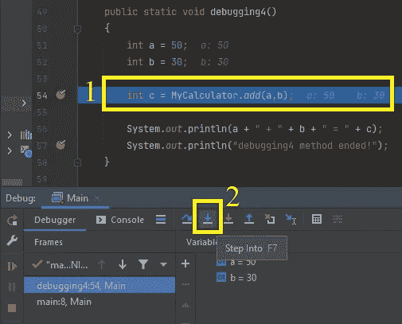

1.  调试器在第一个断点处停止。我们将步入 **MyCalculator** 类的静态 *add()* 方法。

2。 ***单击步进按钮。***

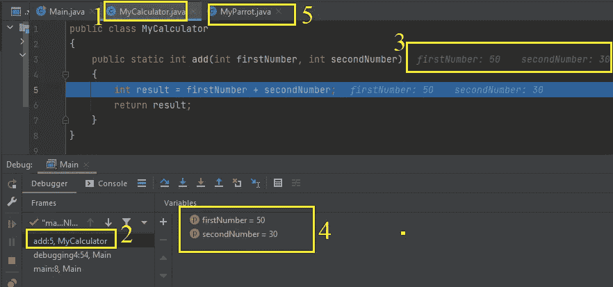

1.  调试器将我们带到了 MyCalculator 类。因为我们进入的 *add()* 方法是在那个类中定义的。
2.  调试器显示执行停止的位置:*my calculator 类的**add()***方法，第 5 行。
3.  感谢调试器，我们发送的参数是可见的。
4.  变量窗格显示的是**当前代码块**(这里是*添加*方法)**变量/参数**。它不再显示变量 a 和 b。它们不属于当前代码块。
5.  让我们点击“MyParrot.java”选项卡。假设您突然想在另一个 close 中检查一个代码。写代码的人脑子里总是有很多想法。当调试器等待我们的命令时，我们突然想检查另一个类。

C ***点击“MyParrot.java”类选项卡。***

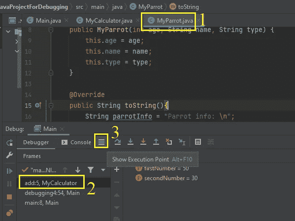

1.  我们正在检查 **MyParrot** 类中的一些代码(一些相关或不相关的内容，只是为了展示在调试时浏览其他选项卡的能力)。
2.  调试器没有更改最后停止的行信息。它显示了上一步中的 **MyCalculator** 类。
3.  让我们找到我们在调试会话中的位置。假设你在另一个班迷路了。因此，单击“显示执行点”按钮会将我们带回调试会话的最后一行。

C ***点击【显示执行点】按钮。***

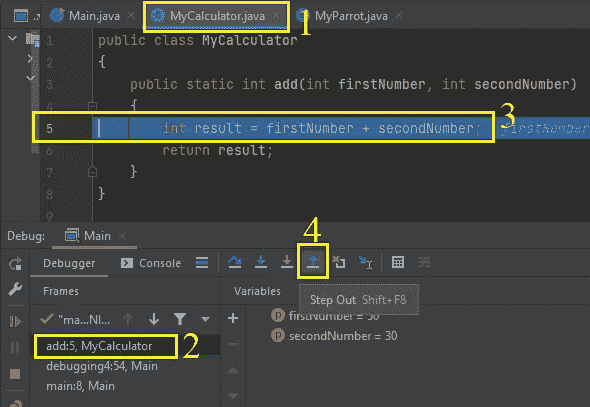

1.  我们又回到了我的计算器课上。
2.  调试器没有改变，只是指向我们最后停止的那一行。
3.  我们回到了下课前的最后一行。
4.  “步出”按钮将直接运行并立刻完成所有剩余代码，并返回到调用代码块(这里是 **Main** 类的 *debugging4* 方法)。

C ***点击“步出”按钮，快捷键是 Shift+F8。***

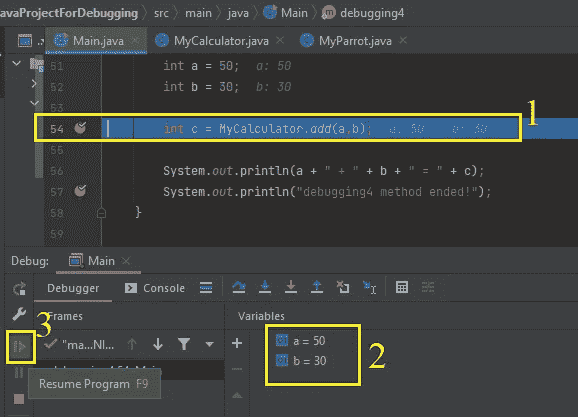

1.  我们从 **MyCalculator** 类的 *add()* 方法中走出来，来到我们调用那个 *add()* 方法的那一行。
2.  变量窗格开始显示当前块的(在本例中，是*调试 4* 方法的变量 a 和 b)变量值。
3.  “恢复程序”按钮将直接跳转到第 57 行的第二个断点。

C ***点击“恢复程序”按钮。***

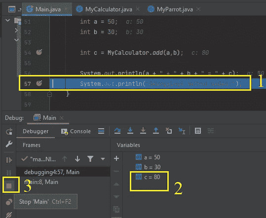

1.  我们直接来到第 57 行。
2.  因为 c 变量的值来自 *add()* 方法，所以它显示在变量窗格中。

3。 ***点击停止按钮停止调试会话。***

> 那是我在 SDET 职业生涯的又一个里程碑。我认为调试是一件大事。但是，现在，我真的很满意有这两个教训。调试第三课学什么？

很高兴听到这个消息。这不是教训，伙计。我们一直在享受 SDET 有趣的员工。所以我们先不要把这几节命名为课，只说文章。

在下一篇文章中，我们将检查变量窗格中的对象，并检查循环中断点的使用。