# 使用 IntelliJ 3/3 进行调试[测试文章系列第 13 部分中的软件开发工程师]

> 原文：<https://medium.com/nerd-for-tech/debugging-with-intellij-3-3-software-development-engineer-in-test-article-series-part-13-bb053422d8ab?source=collection_archive---------4----------------------->

到目前为止，我已经写了 12 篇文章，大部分是关于软件测试的结构。第八篇文章是技术文章。你可以从 [**这里**](https://kicchi.medium.com/) 阅读之前的文章。

本文是 [**第十一篇**](https://kicchi.medium.com/debugging-with-intellij-1-3-software-development-engineer-in-test-article-series-part-11-2b666d5c06f4) 和 [**第十二篇**](https://kicchi.medium.com/debugging-with-intellij-2-3-software-development-engineer-in-test-article-series-part-12-82fa4b7a9134) 的续篇:用 IntelliJ [**1/3**](https://kicchi.medium.com/debugging-with-intellij-1-3-software-development-engineer-in-test-article-series-part-11-2b666d5c06f4) 和 [**2/3**](https://kicchi.medium.com/debugging-with-intellij-2-3-software-development-engineer-in-test-article-series-part-12-82fa4b7a9134) 进行调试。我强烈建议你在阅读这篇文章之前先阅读它。

本文和前两篇文章为初学者处理 IntelliJ IDE 调试。这些文章中没有讨论调试的高级特性。但是这个分三篇文章的系列中解释的特性对于大多数代码编写人员来说已经足够了。

我假设读者懂得用 Java 编码，熟悉 IntelliJ IDE，并阅读了 [**第一篇**](https://kicchi.medium.com/debugging-with-intellij-1-3-software-development-engineer-in-test-article-series-part-11-2b666d5c06f4) 和 [**第二篇**](https://kicchi.medium.com/debugging-with-intellij-2-3-software-development-engineer-in-test-article-series-part-12-82fa4b7a9134) 关于调试的文章。

技术先决条件:

*   必须安装 IntelliJ IDE。
*   必须安装 JDK。
*   第一篇文章**中提到的类( [Main](https://github.com/khicchi/JavaProjectForDebugging/blob/master/Main.java) 、 [MyCalculator](https://github.com/khicchi/JavaProjectForDebugging/blob/master/MyCalculator.java) 、 [MyParrot](https://github.com/khicchi/JavaProjectForDebugging/blob/master/MyParrot.java) )必须在您的本地计算机上准备好**。

请按照我解释的步骤，在你的项目中同步执行。

***练习 6 : debugging5()方法***
在开始新的练习之前删除所有断点。你的主类应该**正好**和那个一样:

1.  确保在 *main()* 方法中取消对 *debugging5()* 方法调用的注释。并确保您对其他方法调用进行了注释。
2.  确保您在 *debugging5()* 方法中。
3.  在第 64、70 和 73 行放置断点。

点击 bug 图标开始调试。

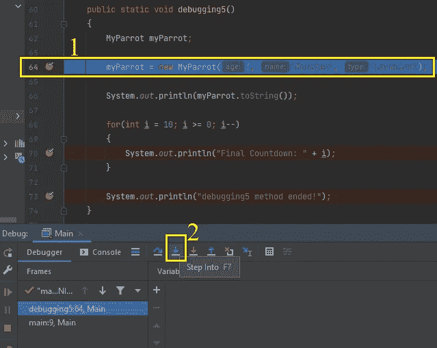

1.  调试会话已开始。调试器在第 64 行的第一个断点处停止。在这一行中，我们将一个新的 MyParrot 对象赋给 myParrot 变量。我们知道，如果用“new”关键字创建一个新对象，相关的**构造函数就会被调用**。我们将通过进入来检查 **MyParrot** 类的三参数*构造器*

2。 ***单击【步进】按钮。***

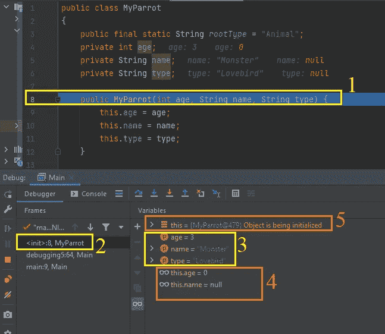

1.  蓝线表示调试器停止的位置。
2.  框架窗格的顶部条目显示调试器停止的最后一行(在本例中是 **MyParrot** 类的第 8 行)
3.  由于我们在 MyParrot *构造函数*的开头，我们可以在 Variables 窗格中看到这个*构造函数*的 3 个参数。圆圈中的字母“p”表示有参数。
4.  同样，我们可以看到构造函数所属的类的实例变量。实例变量有默认值，因为我们没有**初始化**它们。
5.  我们知道“this”关键字总是指当前的类。由于我们一直在调试构造函数，调试器自动将当前新创建的对象(如对象变量)添加到变量窗格中，以便实时观察变化。但是现在显示“对象正在初始化”。因为**我们还没有完成对象创建**。

D 上**下*不能点击任何东西*上**😁

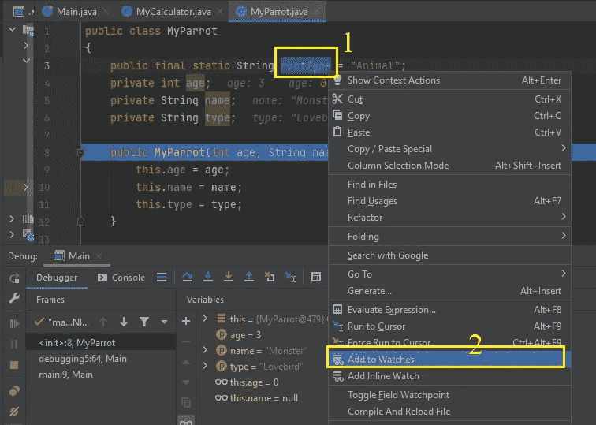

1.  最后一个静态变量“rootType”没有显示在变量窗格中。然而，我们知道它的值是“动物”，它是不可改变的，因为它是最终变量，但是，让我们将这个变量添加到观察列表中，用于其他目的。
2.  要将此变量添加到观察列表:双击单词“rootType”。选中后，在选中的单词上单击鼠标右键。从右键菜单中选择“添加到手表”菜单。

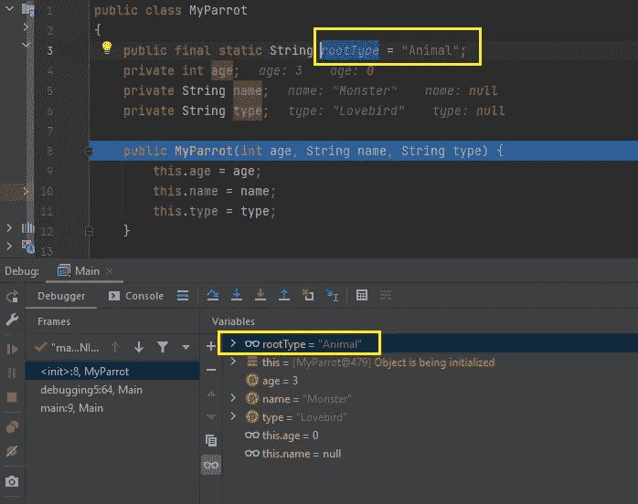

注意到“rootType”变量现在出现在变量窗格中。

D**不能点击任何东西 😁**

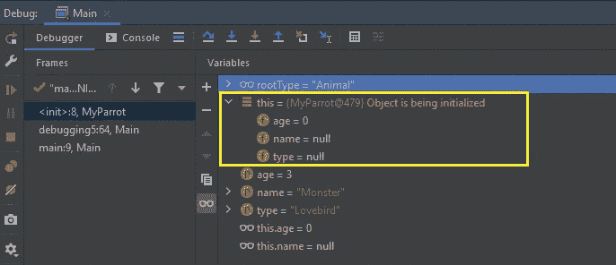

注意，我们还没有初始化实例变量。让我们在构造函数中逐个初始化它们:

点击“跳过(F8)”按钮。

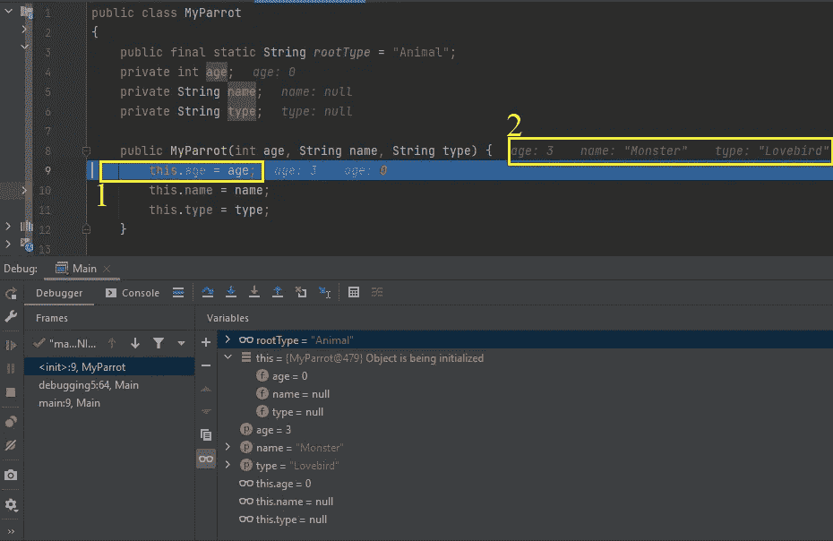

1.  现在我们在第 9 行。调试器正在等待。
2.  我们发送给这个构造函数的参数显示在构造函数的附近的**处。**

C ***点击“跳过(F8)”按钮。***

1.  我们现在在第 10 行。
2.  实例变量“age”已初始化，我们可以从变量窗格中了解它。

C ***点击“步出”按钮，立刻完成剩余的构造函数代码。***

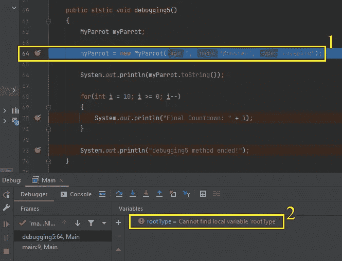

1.  我们执行完了 MyParrot 类的构造函数。现在我们又在第 64 行**了**。**但是对象是为这个时间**而创建的。
2.  在“变量”窗格中,“rootType”变量仍然存在。但是其他人都走了。这是因为我们手动添加了该变量。但是调试器说它找不到“rootType”变量。这很正常，因为我们已经不在我的鹦鹉班了。“rootType”变量不属于当前类或代码块。我们与此事无关。所以现在这对我们来说并不重要。

C ***点击“恢复”按钮，立刻跳转到第 70 行。***

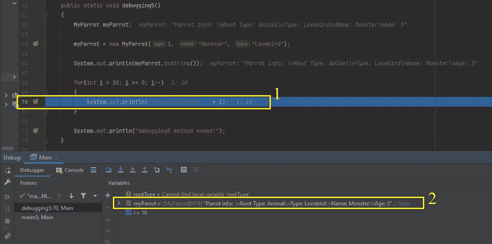

1.  现在我们在第 70 行。我们只是跳过了第 66 行，但是当然它被执行并打印出了“myParrot.toString()”输出。
2.  因为我们初始化了 myParrot 变量，所以 Variables 窗格开始像显示其他局部变量一样显示它。因为它是一个**对象**，它内部有不同的变量。让我们来检查一下:

C **点击第二个矩形中显示的 myParrot 变量末尾的“View”文本。**

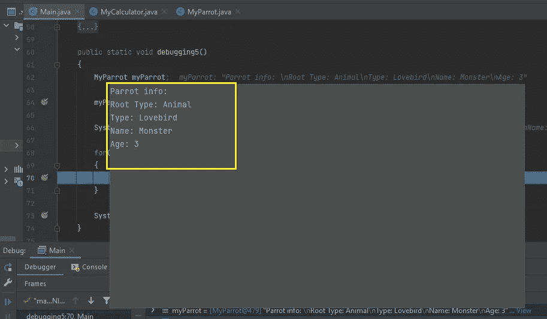

在弹出窗口中我们可以看到 myParrot 对象的定义。

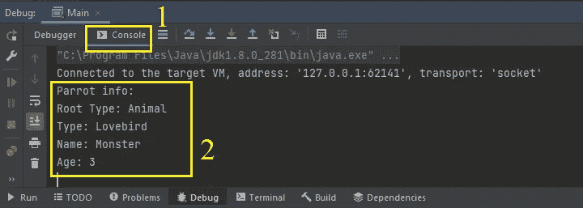

1.  点击**控制台**标签即可。
2.  现在我们可以看到第 66 行的输出。这个输出来自于 **MyParrot** 类中被覆盖的 *toString()* 方法。

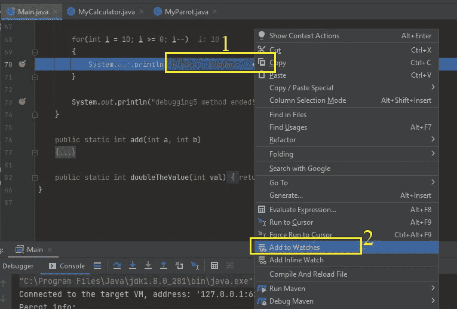

现在我们又到了第 70 行。我们甚至没有前进一行。我们再多考察一下。

1.  在第 70 行，选择如下所示的精确表达式:

> "最后倒计时:"+ i

2.然后，右键单击选择，并在弹出菜单中单击“添加到手表”菜单。

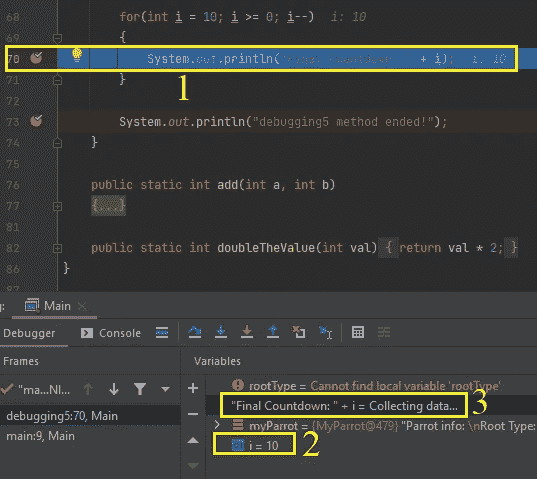

1.  我们又到了第 70 行。
2.  由于我们在一个新的代码块中(对于块),我们可以在变量窗格中看到这个块的变量“I”。
3.  手动添加的代码表达式在监视列表中。我们可以**跟踪它**的变化**作为变量**。它是一个**代码表达式**，换句话说，这个语句里有**一些计算**，但是我们可以像观察变量一样，实时观察这个表达式的变化**。**

C ***点击“恢复”按钮。***

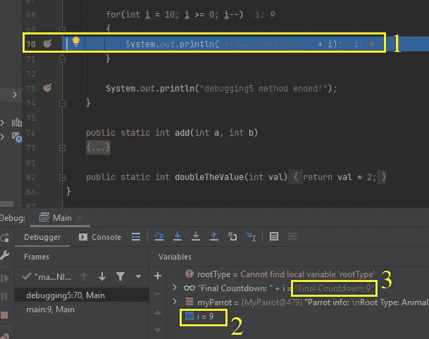

1.  我们又在同一条线上:70。

> **我们不是点了恢复按钮吗？**

是的，我们做到了？

> 然后，我们必须在第 73 行，因为使用 resume 命令调试器会一直运行，直到遇到新的断点。发生了什么事？

是的，Resume 按钮向调试器发出“运行到新的断点”命令，正如您所说的那样。调试器**听从了**的命令。

看第二个黄色矩形。它显示变量“I”的值是 9。是 10，就差一步。由于我们在一个**循环**中，并且由于该循环当前正在**迭代**，我们在第 70 行**再次遇到了中断**。调试器停在了同一行。

3.检查第三个矩形。现在，我们添加到 watch 中的表达式显示了一个有意义的输出。它简单地将“最终倒计时:”字符串与值“I”连接起来。

再次点击“恢复”按钮。

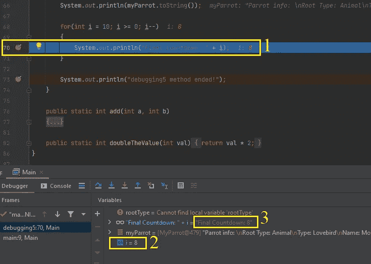

1.  调试器再次停在同一行**(70)。因为我们**还在 for 循环中迭代**。**
2.  **观察“我”的值。**
3.  **观察["最后倒计时:+ " i]表情的变化。**

**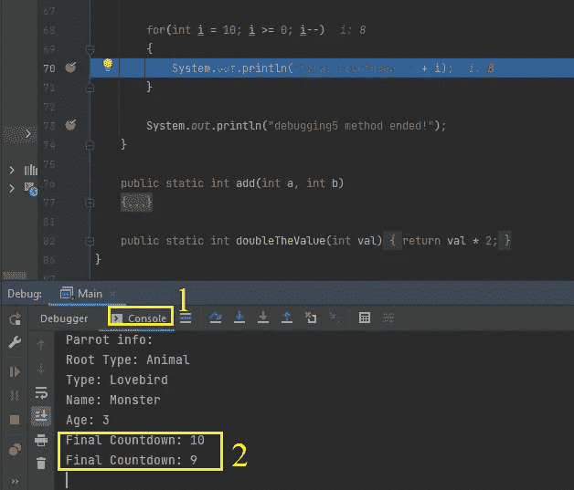**

1.  **单击控制台选项卡。**
2.  **观察到目前为止 for 循环的输出。**

**R ***点击断点，移动第 70 行的断点。*****

**C ***再次点击“恢复”按钮。*****

**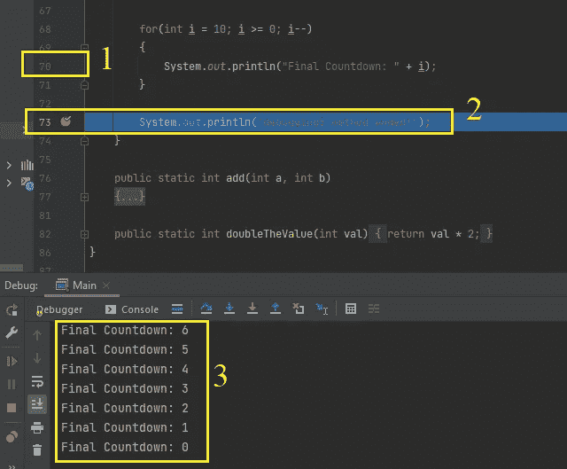**

1.  **由于我们**移除了 for 循环**中的断点，我们通过点击 Resume 按钮成功地退出了 for 循环。**
2.  **Resume 命令立即运行循环的剩余部分，并在第 73 行停止。**
3.  **在 Console 选项卡中观察 for 循环的输出。**

**现在调试器再次等待我们的命令。**

**O ***你的最后一个命令可能是恢复或停止。你可以自由选择你想要的。选择并点击。*****

**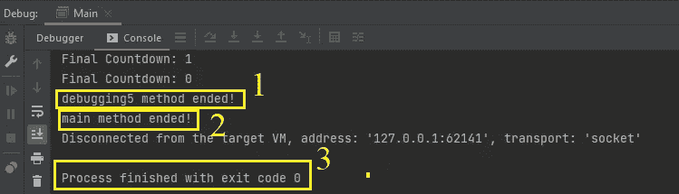**

1.  **该消息来自*调试 5()* 方法。**
2.  **这个消息来自于 *main()* 方法的最后一行。**
3.  **这一行告诉我们程序已经完成。**

****注意:**我在 IntelliJ 中展示了调试。但是所有 ide 的逻辑都是一样的。可以在 Eclipse，Visual Studio，Android Studio 等等调试。**

> ****我很高兴能学会调试。这很容易学。然而，它的功能令人难以置信。下一步是什么？****

**下一篇文章是关于……**

> **抱歉，我听不到。你能大声重复它吗？**

**我是说，下一篇文章……😶**

****😠****