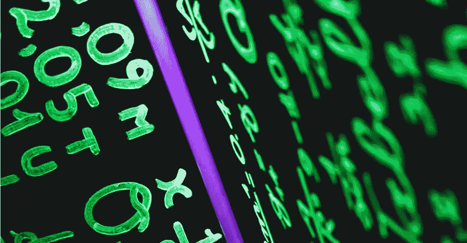
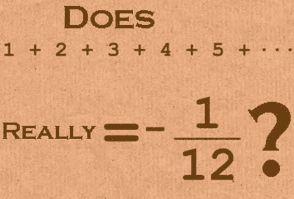
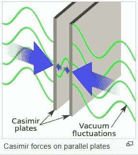

# 揭穿你的基本数学概念

> 原文：<https://medium.com/nerd-for-tech/debunking-your-basic-math-concepts-3d8872c1a53a?source=collection_archive---------24----------------------->



打破神话的数学

# 所有正整数之和

1+2 是什么？啊，谁不知道，是 3。1+2+3 是多少？嗯，已经 6 点了。(简单的柠檬果汁)

现在，如果我让你计算所有正整数的和，也就是:1+2+3+4…到无穷大，会怎么样？

就是这样。**这是这篇博文的症结所在。**

等一下，什么？

所有正数加在一起应该是无穷大，对吗？

但是现在如果我告诉你，这个问题有一个明确的答案，而不是像无限这样不确定的东西。

它有一个固定的赋值🤯

在这篇博文中，我要给大家一个数学上最惊人的证明:**即所有自然数之和等于-1/12** 。

这看起来很不对。你一定认为这是某种打印错误，对吗？好吧，让我向你保证这绝对是故意的！

**所有自然数之和等于-1/12。**


事实上，这个方程实际上是理论物理，尤其是弦理论中一个非常重要的结果。

我肯定你们现在有很多问题。为什么正数的和会产生负数？这背后的证明是什么？我们在现实生活中遇到过吗？

我们将逐一回答这些问题



# 证据

证明相当简单。在此之前，让我们先试着理解其他几个系列

考虑下面的无限求和(X):

```
X = 1–1 + 1–1 + 1–1 + 1–1 …
```

重新排列上面的等式，我们得到:

`X = 1 - (1 - 1 + 1 - 1 + 1 - 1 + 1 - 1 ...)`

如果你看看括号内的术语，你会意识到它是我们最初的系列“X”。所以让我们换成:

```
X = 1 - X
2X = 1
X = 1/2
```

希望这是明确的，顺便说一下，这也被称为[格兰迪的系列](https://en.wikipedia.org/wiki/Grandi%27s_series)

现在让我们考虑另一个求和(Y):

`Y = 1 - 2 + 3 - 4 + 5 +6 ...` — A

用另一种方式写，在两边加 0，我们得到:

```
0 + Y = 0 + 1–2 + 3–4 + 5 + 6…
```

或者简单地说，

`Y = 0 + 1 - 2 + 3 - 4 + 5 + 6...` — B

将两个等式 A + B 相加:

`Y + Y = (1 - 2 + 3 - 4 + 5 ...) + (0 + 1 - 2 + 3 - 4 + 5 ...)`

将括号内的相应术语分组，我们得到:

```
2Y = 1 + 0 - 2 + 1 + 3 - 2 - 4 + 3 + 5 - 4 ...
2Y = 1 - (2-1) + (3-2) - (4-3) + ...
2Y = 1 - 1 + 1 - 1 + 1 - 1 + 1 - 1...
```

但是右手边的总和是 X，正如我们之前看到的，所以让我们替换它:

```
2Y = X
2Y = 1/2
Y = 1/4
```

最后，让我们考虑一下我们的原始数列，即所有自然数的总和:

```
S = 1 + 2 + 3 + 4 + …
```

我们之前将 Y 定义为:

```
Y = 1–2 + 3–4 + …
```

从 S 中减去 Y:

```
S - Y = 1 - 1 + 2 + 2 + 3 - 3 + 4 + 4 + ...
S - Y = 4 + 8 + 12 + 16 + ...
```

我们刚刚计算了 Y 的值，它等于 1/4。所以让我们用它来代替:

```
S - 1/4 = 4 x (1 + 2 + 3 + 4 + ...)
S - 1/4 = 4S
3S = -1/4
S = -1/12
```

所以我们走吧！我们现在有证据了。

看起来是个聪明的策略。这是数学把戏吗？

答案是**否**。

它实际上出现在物理学的许多领域。

这里唯一需要注意的是——我们将正规代数的规则应用于一个发散的无穷级数。

> ***收敛数列*** *是这样一个数列，当你不断向它添加更多的数时，其和会不断收敛到一个特定的定数。* ***发散级数*** *与此相反。我们将在这篇博文的下一部分对此进行更多的讨论。*

# 这个违反直觉的证明的逻辑解释是什么？

一直加正数得到负数的结果是完全没有意义的，对吗？

但这只有在我们不处理无穷大时才有效！

在这里，我们处理的是所谓的无穷级数，一个永远存在的和。

这些金额可分为两类-

*   收敛的
*   分歧的

**收敛级数是收敛到一个有限值的求和。**

**发散级数是发散到更大值(无穷大)的求和。**数列 1+2+3+4+…是一个发散的和，因为它变得越来越大，直到达到无穷大。


无穷大的概念很晦涩。当你想到一系列数字和它们的总和时，你倾向于用收敛级数来思考。

当我们处理发散级数时，事情变得有点棘手。

首先，适用于正则数的代数规则不适用于不收敛的无穷和。

其次，你不能一直增加价值直到无穷大，因为你永远也不会到达那里。我们上面讨论的所有和都是发散的无穷和，所以常规的代数规则不适用。

但是数学家和物理学家不喜欢“一事无成”的概念，他们希望每个问题都有一个明确的答案。因此，他们实现了定义非收敛无穷级数和的方法。

我们刚刚讨论的那个叫做 **Ramanujan 求和。**

# 这个结果在现实世界中有用吗？

撇开所有的数学不谈，人们可能会怀疑这个结果在现实生活中是否有用。

答案是肯定的。

在某些情况下，这种方法在现实世界的问题中给出了正确的结果，即使它在数学上看起来是“错误的”。

一个简单的例子是[卡西米尔效应](https://www.scientificamerican.com/article/what-is-the-casimir-effec/)。



假设我们将两块金属板相隔很短的距离放置(在没有重力的真空中，假设是理想的物理条件)。

我们的经典物理学预言它们将只是静止的，没有作用力在起作用。然而，有研究表明，他们之间实际上有一个小的吸引力。

然而，这可以用量子物理学来解释，计算力的大小使用我们刚刚讨论过的 Ramanujan 求和。

点击了解更多信息[。](https://en.wikiversity.org/wiki/Quantum_mechanics/Casimir_effect_in_one_dimension#:~:text=The%20Casimir%20effect%20is%20interesting,space%20is%20not%20truly%20empty.&text=Furthermore%2C%20the%20regularization%20of%20the,be%20justified%20using%20physical%20arguments.)

在卡西米尔效应中，“常规”物理学方法无法解释这种情况。这就是为什么有时需要复杂的反直觉数学公式来解释简单的事情。

# 结论

唯一的结论是，如果有人每天都给你钱，并且每天都增加一个单位，他们实际上是在愚弄你，让你变穷😜

哦，顺便说一下，这篇博客的灵感来自于[的数字爱好者视频](https://www.youtube.com/watch?v=w-I6XTVZXww)🎥

感谢阅读:)

**喜欢你读的书吗？你可以给我买一辆 coffee☕来表达你的爱**

[](https://www.buymeacoffee.com/apoorvtyagi)

*最初发表于*[*apoorvtyagi . tech*](https://apoorvtyagi.tech/mythbusting-mathematics-can-you-solve-this)*。*