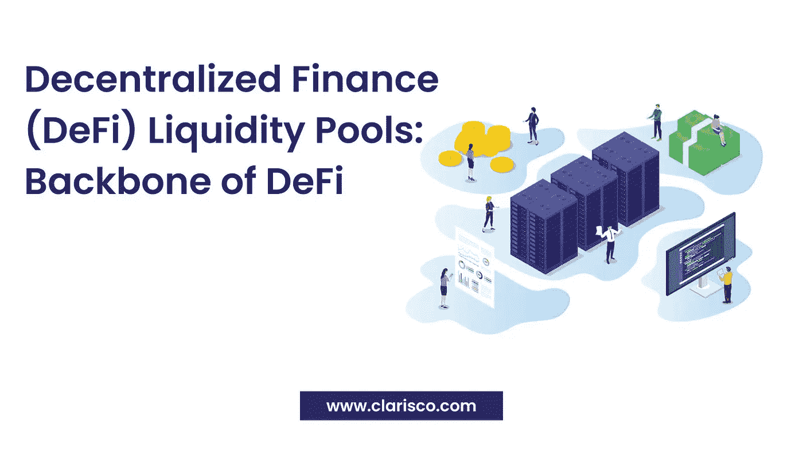

# 分散融资流动性池:分散融资流动性池的支柱

> 原文：<https://medium.com/nerd-for-tech/decentralized-finance-defi-liquidity-pools-backbone-of-defi-50b38c8b0c94?source=collection_archive---------11----------------------->

流动性这个词长期以来一直是加密货币和区块链计划的担忧来源。这种流动性问题在金融市场也很普遍。结果，新的分散金融和分散流动性被创造出来。

分散流动性是使 DeFi 环境更加舒适和高效的支柱，对于创建 DeFi 令牌、DeFi 智能合约和其他产品的 DeFi 令牌开发者，以及使用基于 DeFi 的贷款、交换平台和其他服务的客户来说都是如此。

让我们仔细看看什么是流动性池，它是如何运作的，以及它在分散金融(DeFi)领域需要什么。

我们都知道**流动性**是指将资产转化为现金的能力。

分散加密世界中的流动性是指进入加密市场的能力。

**流动性池**

流动性池是锁定在智能合约中的资金集合。流动性池用于支持分散的贸易、贷款和各种其他服务。

许多分散式交易所(DEX)依赖流动性池，如 Uniswap。为了形成市场，被称为流动性提供者(LP)的用户向池中添加等量的两个代币。作为付出资金的交换，他们从池中发生的交易中获得交易费，这与他们在整体流动性中所占的份额成比例。

由于任何人都可能成为流动性来源，资产管理系统使得创造市场变得更加容易。

Bancor 是第一批使用流动性池的协议之一，但这个概念在 Uniswap 流行起来后得到了认可。SushiSwap、Curve 和 Balancer 是另外三个利用流动性池的主要以太坊交易所。这些场馆的流动性池包括 ERC-20 硬币。PancakeSwap、BakerySwap 和 BurgerSwap 是 BNB 智能链(BSC)的对等产品，池中包含 BEP-20 令牌。

# **分散财政流动性**

如前所述，流动性不仅在加密和区块链领域是一个重要的概念，在金融领域也是如此。由于金融系统面临着一些问题，包括缺乏透明度和时间消耗，一种新的金融交易方法，即分散金融(DeFi)应运而生。这种分散的开源系统提供了无需许可的金融服务，具有极大的流动性和透明度。

尽管 DeFi 实现了无摩擦的金融交易，但在 DeFi 世界中仍存在流动性问题。

流动性提供者已经找到了在所有与 DeFi 相关的服务和平台中通过流动性池概念提供高流动性的最有效方法。

# **什么是 DeFi 流动性池？**

流动性池、令牌池或资产池只不过是保护加密令牌或加密资产的分散式智能合约。这种资产锁定是为了通过增加流动性来增强加密交易。

随着著名的 DeFi 流动性池 Uniswap 的创立，这种流动性池的概念在 DeFi 中变得流行起来。

流动性提供者是加密用户，他们在这些流动性池中下注或存放他们的资产，以通过 DeFi Yield Farming 的想法产生更多的资产或收入。

# **为什么 DeFi 需要流动性池？**

大多数知名的加密货币交易所都使用订单簿模型，在这种模型中，买家和卖家一起下单。此外还有做市商，他们通过随时可以买卖资产来简化交易。通过提供高流动性，客户可以随时进行交易，而无需等待交易对手。

流动性池或做市商的概念可用于分散融资，以解决 DeFi 中的流动性困难。没有做市商，任何平台都会变得缺乏流动性，不适合平台用户。由于大多数 DeFi 系统在以太坊上运行，以太坊对智能合约上的每一笔交易收取燃气费，因此交易可能具有成本效益，但可能会遇到各种流动性问题。

因此，DeFi 流动性池的存在对于分散融资中保持流动性至关重要。

# **DeFi 流动性池的主要优势**

*   提供和启动流动性提供网络
*   为大投资者提供进一步的信心。
*   充当代币持有者的保险
*   通过自动化智能合同促进快速跨境交易。
*   降低分散融资中的流动性风险
*   降低汽油价格。
*   允许流动性提供者产生被动货币。

**DeFi 流动性池的流程是什么？**

流动性池通常存储两个代币，每个代币为该对代币生成一个新市场。在 Uniswap 平台上，DAI/ETH 是 DeFi 中最优秀、最受欢迎的流动性池。

在建立资金池时，第一个流动性提供者确定该资金池中资产的起始价格。当在池中提供流动性时，流动性提供者(LP)获得称为 LP 代币的独特代币。

如果一家有限合伙人想要重新获得其基础流动性，就必须烧掉其有限合伙人代币。调整流动性池中每笔代币掉期价格的系统被称为自动做市商(AMM)。

还有其他著名的 DeFi 流动性池，如 Bancor、Uniswap 等。

**顶级 DeFi 流动性池**

以下是 DeFi 市场中对用户和金融服务影响最大的五个著名的流动性池。

*   班科尔
*   Uniswap
*   平衡器
*   KeeperDAO
*   凸面
*   OIN 金融
*   德弗西菲
*   ICTE
*   Unipig 和 StarkDEX
*   凯伯网络

# **拥有 DeFi 流动性池的顶级加密货币交易所**

这里列出了在 DeFi 流动性系统上提供代币交换的主要加密货币交易所。

*   **币安** —支持通过 Uniswap DeFi 流动性平台进行新令牌交换
*   **Wazirx —** 已经开始用向往交易 YFI/印度卢比。金融，著名的 DeFi 流动性平台。
*   **比特币基地** —允许投资 Uniswap 和向往。对于金融。
*   **Poloniex** —接受 DeFi tokens LEND、BAL、LRc 等存款。
*   **ku coin**——允许你通过使用渴望赚钱。融资流动性池。

市场上还有其他更多的加密货币交易所，包括 Gemini、Houbi 和其他交易所，它们使用分散金融开源协议提供流动性池。

# **流动性池—实际使用案例**

Uniswap 是一种用于交易硬币的 DeFi 技术，它促进了流动性池的使用。然而，许多其他分散式交易所依赖于流动性池的基本概念，同时根据其实际用例区分自己。

例如，自动做市商(AMMs)的概念不适用于类似定价的资产，如稳定的硬币或包装的代币。以太坊交易所流动性池 Curve 通过实施一种新的算法，在交换类似价格的资产时，成功地提供了更低的成本和滑点。

一家自动做市商(AMM)协议平衡器提议，流动性池不必局限于两种资产。它在单个流动性池中支持多达 8 个代币。

# **结论**

流动性池是 DeFi 技术堆栈的重要组成部分。它们允许实施广泛的金融工具，包括分散交易、贷款、产出等等。

全球有几家著名的 DeFi 开发公司提供全面的 DeFi 开发服务，如 DeFi Dapp 开发、DeFi 借贷平台开发、DeFi 智能合同开发等等。

这些公司的专家将在您的 DeFi 平台中包括许多高级功能，如 DeFi Yield Farming、DeFi Liquidity Pools、DeFi Staking、DeFi tokens 等，使其在用户中更受欢迎。

如果您想为您的加密令牌或加密服务(如 Uniswap、Curve Finance、Balancer 或其他服务)开发您的 DeFi 令牌或 DeFi 流动性池，请立即联系具有广泛市场研究的 DeFi 专业人士。