# 决策树——一种革命算法

> 原文：<https://medium.com/nerd-for-tech/decision-tree-a-revolution-algorithm-13b9a4173d37?source=collection_archive---------9----------------------->

基于树的方法的第一层。就是 aka 分类回归树(CART)。

让我们从一个思维实验开始，给我们使用决策树方法背后的一点动机。

想象一个场景，我每周六打网球，我总是邀请一个朋友和我一起去。有时，我的朋友会出现，有时不会。对他来说，这取决于多种因素，如:天气、温度、湿度、风等..我开始记录新功能，以及他是否出现和我一起玩。

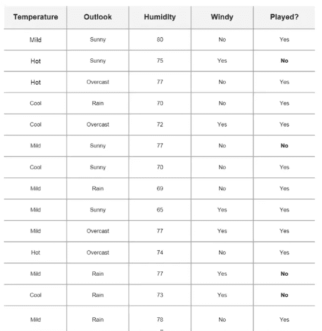

这是数据，每一列代表特征，每一行代表某一天。最后一栏有一个标签，标明我的朋友是否来和我一起玩。你可以看到第一天天气温和，阳光明媚，湿度 80%，无风，我的朋友出来玩。

然而在第二天，天气炎热，天气晴朗，75 %的湿度，有风，我的朋友没有来玩。我可以用这个过程建立决策树，在考虑几个因素的基础上，帮助预测他是否会参加比赛。一种直观的方法是通过决策树。

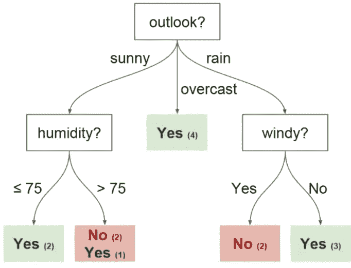

通常，我们在决策树中有术语。在上面的树中，我们有

→ **根节点**:执行第一次拆分的节点。

→ **决策节点:**中间节点，为某个属性值而分裂。

→ **叶:**预测胜负的终端节点。

你可能会想，这些分裂是怎么发生的？这就是信息增益(熵)或基尼指数在分割节点时发挥重要作用的地方。这些是选择最佳分割的数学方法。

首先，让我讲讲熵，以便理解信息增益。

**熵**是不确定性或杂质的度量。它测量分裂的纯度。在下图中，我们可以理解低熵意味着变量的低混合，而高熵意味着变量的高混合。

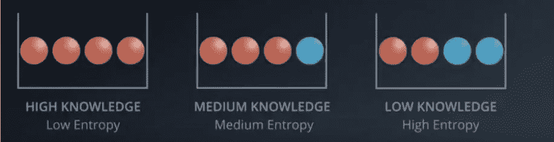

计算每个属性的信息增益有两个步骤:

→计算目标的熵。

→计算每个属性的熵。

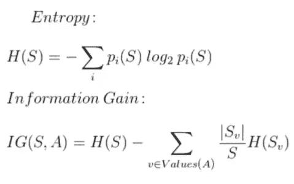

为了说明信息增益是如何工作的，让我以上面的数据集为例。首先，我们需要计算目标的熵，计算如下。

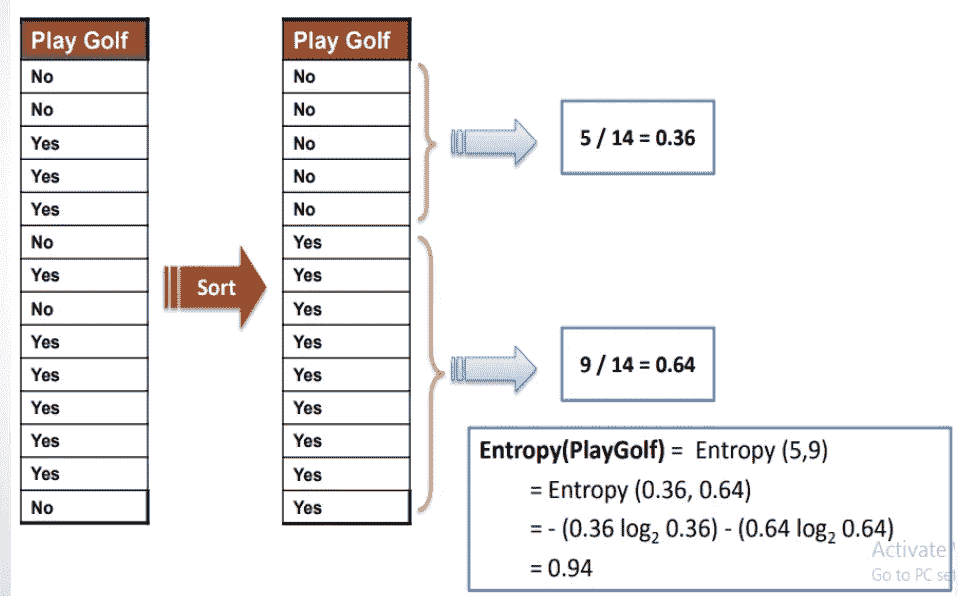

然后，我们需要计算属性的熵。为了计算属性的熵，我们需要为属性创建频率表。

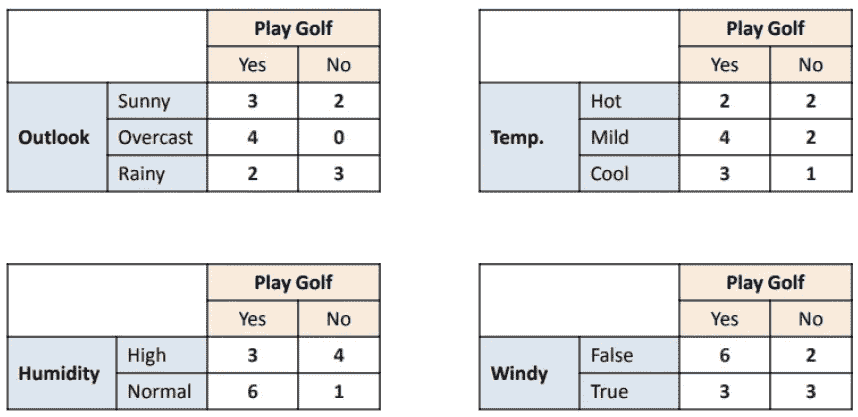

频率表

接下来，计算每个属性的熵。

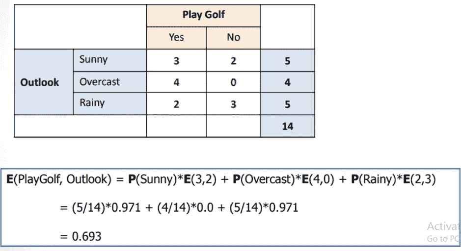

展望的熵计算

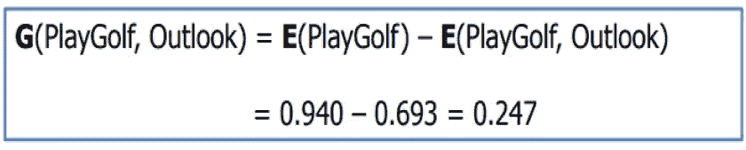

展望的信息增益。

类似地，为每个属性计算信息增益。

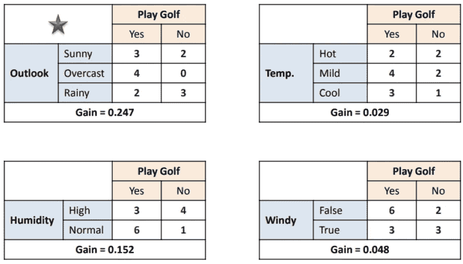

从上面的信息增益计算图中，我们可以得出结论，outlook 特征具有较高的 I.G 值，这意味着它具有较高的标签纯度或较少的目标标签混合，因此我们可以用 outlook 创建树的根节点。

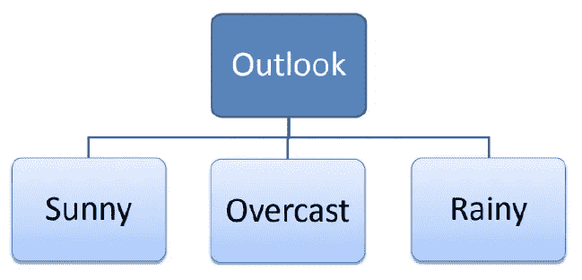

树的构造

让我们重复排除 outlook 的相同过程。

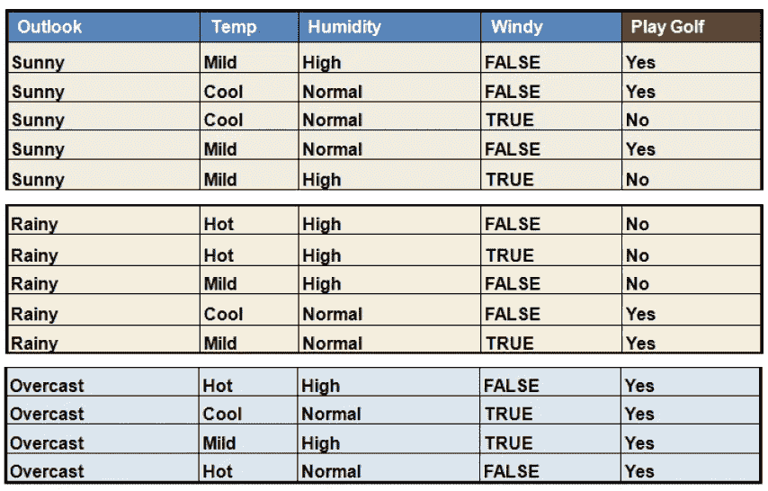

从上表中，我们可以说没有标签的混合，如果场景是阴天，这个人来玩，所以我们可以直接用它来构造决策节点。

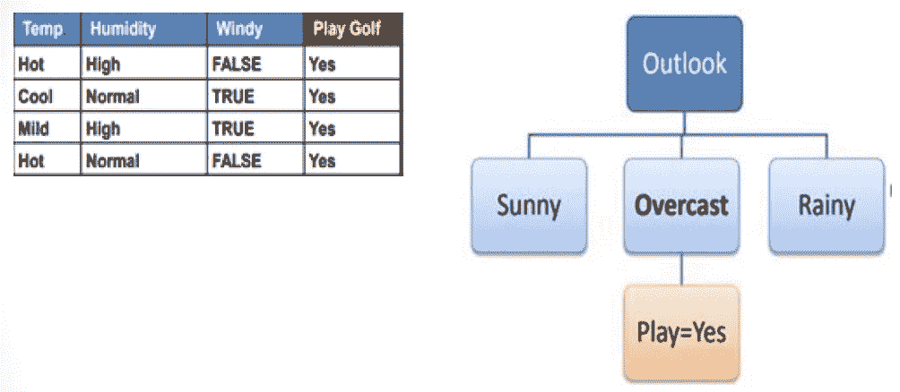

决策树。

在下一步中，我们可以为前景晴朗的特征计算信息增益。

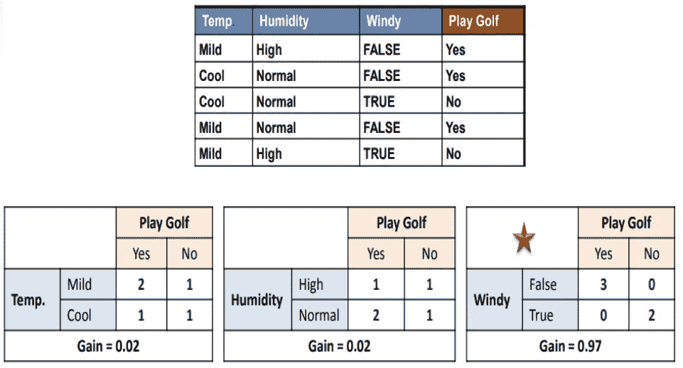

信息增益

根据上面的计算，特征 windy 具有最高的 I.G 值，因此我们可以用该变量构建决策树。

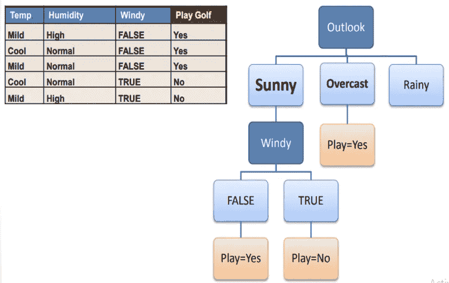

决策树的构造。

接下来，我们需要找到决策节点，如果前景是多雨的。

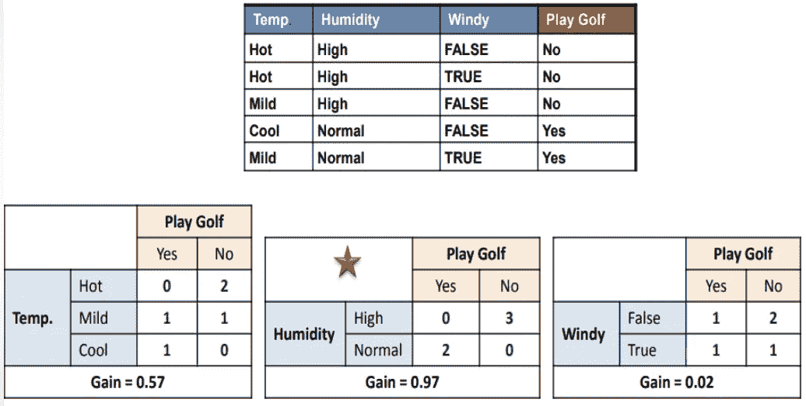

信息增益计算

湿度具有最高的信息增益值。湿度特征被用作树的下一次构造的决策节点。

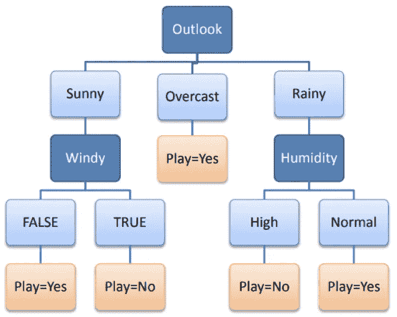

决策树的最终结构。

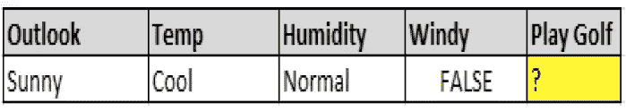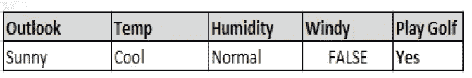

通过查看决策树的最终结构，我们可以很容易地预测各种场景的最终结果。

**基尼指数**作为构建决策树的默认方法。

基尼指数公式

使用**基尼系数**方法构建树的步骤与熵方法相同。由于我们对每个类别取概率的平方和，而不是取对数值，因此计算速度优于熵值法。

对于连续值，最佳分割通过**标准偏差减少(SDR)** 方法计算。

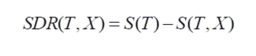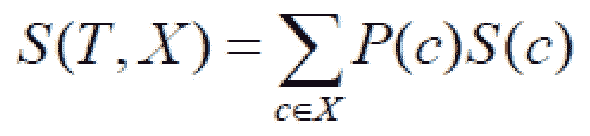

特别提款权公式

这与熵方法相同，但是计算的是值的标准偏差，而不是熵。

## 优势:

*   决策树非常容易实现，也很容易理解。
*   树可以很容易地处理和启动预测。

## 缺点:

*   树通常不具有与任何其他回归和分类方法相同水平的预测准确性。
*   这通常会导致过度拟合，这意味着树对训练数据给出了好结果，而对测试数据给出了坏结果。

## 结论:

*   决策树是非常古老的概念，是随机森林、Boosting 方法等升级模型的基础。为了理解所有这些算法，我们需要理解决策树的工作方法。
*   希望您对决策树的工作原理有了基本的了解。感谢您阅读这篇文章。
*   参考这个[链接](https://github.com/Rishikumar04/Data-Science-Training/blob/main/Classification%20Problems/05-Decision%20Trees%20and%20Random%20Forest%20Project.ipynb)用 Python 实现决策树。