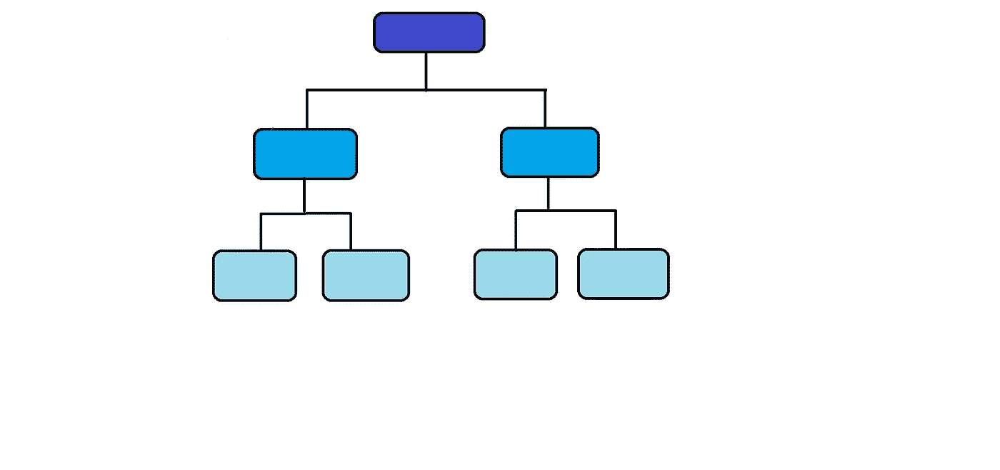
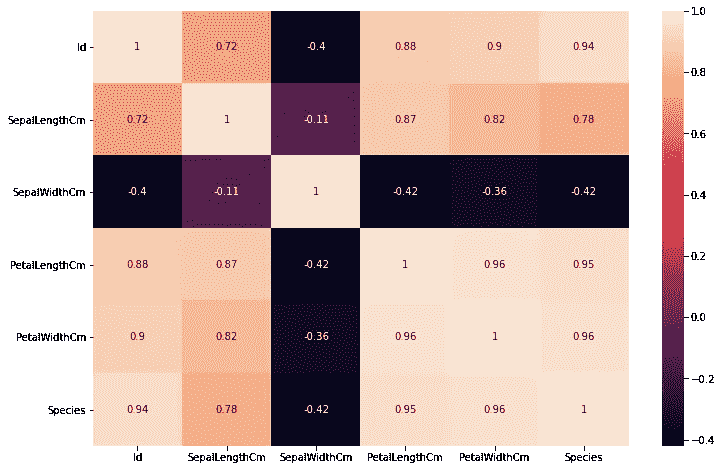
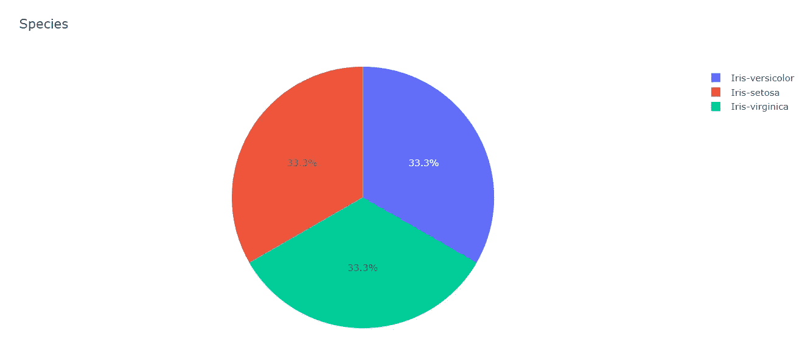
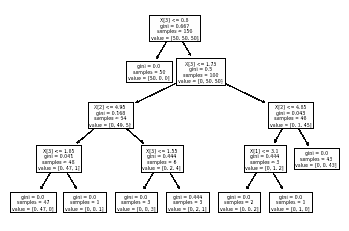

# 决策树算法

> 原文：<https://medium.com/nerd-for-tech/decision-tree-algorithm-3b5e8b0aed2a?source=collection_archive---------4----------------------->



决策树算法是我们在机器学习中使用的一种流行的分类算法。这种算法属于监督类。在这篇文章中，我们将看到什么是决策树算法，它的工作原理以及这种算法可以用在什么地方。

为了理解算法的工作原理，需要一个合适的数据集。我拿了一个非常受欢迎的数据集，要查看数据集[请点击此处](https://www.kaggle.com/code/arya24/let-s-classifiy/data)。

我们先来了解一下数据。这个数据集很受欢迎，也很容易理解。它有六列。这个数据集是关于鸢尾物种的。这些属性描述了花的特征，如萼片长度、萼片宽度、花瓣长度和花瓣宽度。第一列是物种的唯一 id，最后一列是特定物种的名称。我们必须根据这些特征将数据分为三个不同的种类。

让我们开始处理数据。首先，我们必须导入所需的库和数据。因为我们要使用决策树算法，所以我们需要导入所需的库。Sklearn/sci-kit learn 是 python 中流行的库之一。这个库包含了很多机器学习的有效工具，包括分类、回归、聚类和降维。要了解更多关于 sci-kit learn 的信息，可以参考[文档](https://scikit-learn.org/stable/)。代码如下:

```
from sklearn.model_selection import train_test_split                
from sklearn.tree import DecisionTreeClassifier                     
from sklearn.metrics import accuracy_score                          
from sklearn.metrics import classification_report                   
from sklearn import tree    
from sklearn.preprocessing import LabelEncoder
import seaborn as sns
import matplotlib.pyplot as plt
import plotly.express as px
```

导入数据和库之后，让我们来理解和清理数据。我们需要检查数据集中是否存在任何空值。

```
df.isnull().sum()Id               0
SepalLengthCm    0
SepalWidthCm     0
PetalLengthCm    0
PetalWidthCm     0
Species          0
dtype: int64
```

因此数据中不存在空值。如果我们检查行数和列数，有 150 行和 6 列:

```
df.shape
(150, 6)
```

现在，为了检查哪些属性对决定物种是重要的，我们将检查它们之间的相关性。虽然我们可以直接说所有属性都是决定性因素，但我们需要在统计上更强。所以让我们检查一下它们之间的相关性。在检查关系之前，我们将对最后一列进行编码。物种列包含分类数据。为了检查相关性，我们需要将分类数据转换成数字数据。标签编码有助于这种转换。因此，让我们首先执行标签编码:

```
df1 = df.copy(deep = True)
species = LabelEncoder()
df1['Species'] = species.fit_transform(df['Species'])
```

现在，在图的帮助下检查相关性:

```
corr1 = df1.corr()
plt.figure(figsize = (12,8))
sns.heatmap(corr1,annot=True)
plt.show()
```



在这里，我们可以看到所有的属性都与物种高度相关。花瓣宽度和花瓣长度具有. 96 和. 95 的比率，这意味着高度相关。萼片长度的比率为 0.78。萼片宽度呈负相关，暗示着相反的关系。现在，我们将开始数据建模。在此之前，借助饼图快速检查不同物种的数量:

```
pie_df = df.Species.value_counts().reset_index()
pie_df.columns = ['Species', 'count']
fig = px.pie(pie_df, values='count', names='Species', title='Species',
             color_discrete_sequence=['blue', 'light green'])
fig.show()
```



在这里，因变量是除 id 和物种之外的所有属性。自变量是物种列，因为我们要预测这一列中的值。

```
*#Dependent variables*
X = np.array(df[['SepalLengthCm', 'SepalWidthCm', 'PetalLengthCm', 'PetalWidthCm']]) 

*#Independent variables*
y = np.array(df["Species"])
```

现在，拆分数据进行测试和训练(我已经按照 1:3 的比例进行了划分，您可以选择适合数据集的大小):

```
X_train, X_test, y_train, y_test = train_test_split(X, y, test_size=0.30, random_state = 1)
```

然后，使用决策树分类器并拟合数据:

```
tree1 = tree.DecisionTreeClassifier(max_depth=4)
tree1 = tree1.fit(X, y)
```

现在，让我们检查分数！

```
tree1.score(X, y)0.9933333333333333
```

分数是 0.99。这意味着我们已经成功地对数据进行了分类，并且得分很高。现在，让我们看看我们预测的物种名称:

```
y_predicted = tree1.predict(X_test)
y_predicted
```

输出将如下所示:

```
array(['Iris-setosa', 'Iris-versicolor', 'Iris-versicolor', 'Iris-setosa',
       'Iris-virginica', 'Iris-versicolor', 'Iris-virginica',
       'Iris-setosa', 'Iris-setosa', 'Iris-virginica', 'Iris-versicolor',
       'Iris-setosa', 'Iris-virginica', 'Iris-versicolor',
       'Iris-versicolor', 'Iris-setosa', 'Iris-versicolor',
       'Iris-versicolor', 'Iris-setosa', 'Iris-setosa', 'Iris-versicolor',
       'Iris-versicolor', 'Iris-versicolor', 'Iris-setosa',
       'Iris-virginica', 'Iris-versicolor', 'Iris-setosa', 'Iris-setosa',
       'Iris-versicolor', 'Iris-virginica', 'Iris-versicolor',
       'Iris-virginica', 'Iris-versicolor', 'Iris-virginica',
       'Iris-virginica', 'Iris-setosa', 'Iris-versicolor', 'Iris-setosa',
       'Iris-versicolor', 'Iris-virginica', 'Iris-virginica',
       'Iris-setosa', 'Iris-virginica', 'Iris-virginica',
       'Iris-versicolor'], dtype=object)
```

所以我们已经成功地根据物种对数据进行了分类。如果你想打印一个树形图，你可以使用下面的代码:

```
tree.plot_tree(tree1)
```



结论:

1.  决策树算法对于分类非常有用。
2.  它过滤数据并将其分成不同的类别。

欢迎你的建议。您可以在此处查看代码:

1.  Kaggle 笔记本:[点击这里](https://www.kaggle.com/code/arya24/let-s-classifiy/notebook)

2.GitHub 链接:[点击这里](https://github.com/aryatalathi/IRIS-Data-classification)

谢谢大家！

*~ ARYA·塔拉西*