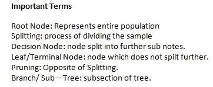
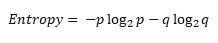
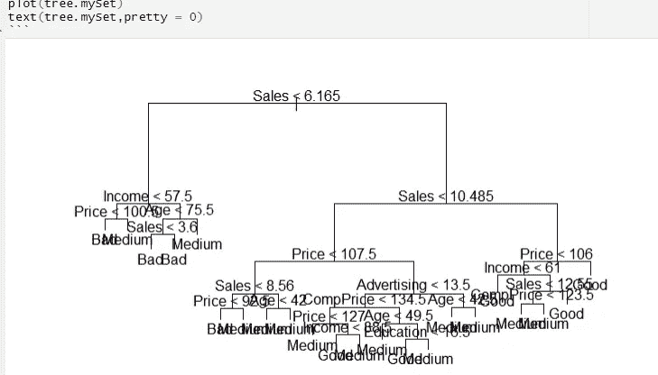
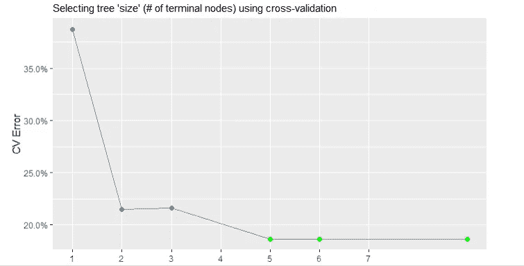
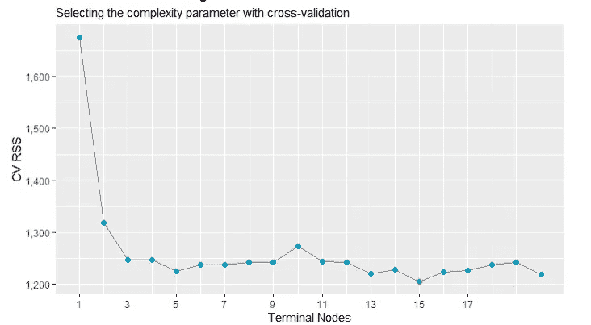
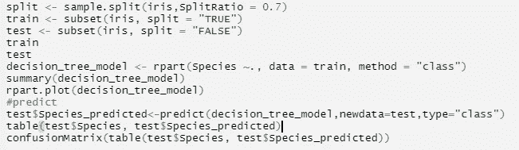
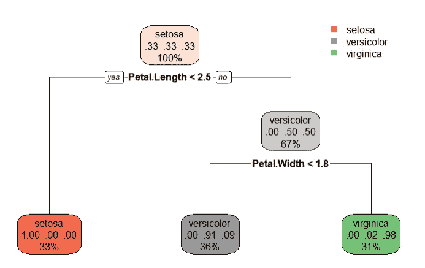
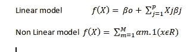
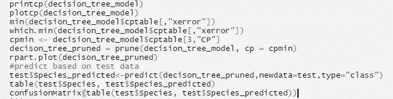

# 决策图表

> 原文：<https://medium.com/nerd-for-tech/decision-tree-f290b9ac1b20?source=collection_archive---------28----------------------->

决策树是一种监督学习算法(具有预定义的目标变量)，主要用于分类问题。它也可以用于回归。

它适用于**分类和连续**输入和输出变量

在这种方法中，我们根据输入变量中最重要的分割器/区分器，将总体或样本分成两个或多个同质组(或子总体)。决策树在所有可用变量上拆分节点，然后选择导致最同质子节点的拆分。

训练模型通过学习具有树表示的决策规则来学习预测目标变量的值。树由具有相应属性的节点组成。在每一个节点，我们根据可用的特性询问一个关于数据的问题。左右分支代表可能的答案。对应于预测值的最终节点左节点。每个特性的重要性是通过自顶向下的方法确定的。节点越高；其属性越重要。

决策树使用多种算法来决定将一个节点分成两个或多个子节点—基尼指数、卡方、信息增益、方差。分割决策树的默认方法是**基尼指数**，这是一个特定模型杂质的度量。本质上，它计算某个特定要素被错误分类的概率。当元素被一个类链接时，我们称之为纯元素。我们可以使用随机森林，但基尼指数是首选，因为它不是计算密集型和不涉及对数函数。基尼指数的一个替代方法是熵。在实际情况下，基尼系数和熵在数值上非常相似。

p 和 q 是成功和失败的问题

**信息增益**:需要较少信息的节点称为纯节点，需要较多信息进行拆分或理解/分类的节点称为不纯节点。信息论是定义系统中这种无序程度的一种方法，被称为**熵。**如果样本是完全同质的，则熵为零，并且样本被等分，其熵为 1。熵也称为**分类目标变量**。它选择与父节点和其他分裂相比具有最低熵的分裂，熵越小越好。

**关于决策树的一些事实！！**

决策树需要很少的数据准备。

从不需要特征缩放或居中。

决策树是随机森林的基本组成部分，可以说是最强大的 ML 算法之一。

决策树是白盒模型，与随机森林和神经网络不同，这意味着这些模型的内部工作原理非常清楚。

从树根开始，使用决策算法分割特征上的数据，从而获得最大的信息增益。

然后在每个子节点上重复分裂过程，直到叶子是纯的。

这意味着每个节点上的样本属于同一个类。

在实践中，我们可以对树的深度设置一个限制，以防止过度拟合。

纯度在这里受到损害，因为最终的叶子可能仍有一些纯度。

让我们更详细地看看分类和回归决策树。

分类树与回归树非常相似，只是它用于预测定性响应，而不是定量响应。

在回归中，预测值由训练数据集的平均响应给出。其中在分类中，它由训练集中最常出现的区域类别导出。

在分类问题以及类别预测中，我们还对训练观察的类别比例感兴趣。

然而，在这两种情况下，我们使用递归二进制分裂来增长树。

虽然 RSS 适合回归，但分类错误率将是分类决策树的选择。

现在让我们试着概述一个简单决策树的算法

*   将所有训练示例放在根位置
*   将属性分类
*   基于所选属性递归划分示例
*   在统计测量的基础上选择测试属性。

停止分区的条件:

对于一个节点，所有样本属于同一个类别。

没有属性可供进一步分割

没有留下样本进行分类。

因此，如果我们要实现一个决策树(我在这里选择了 R)

一个简单的 R 代码

1.  将数据分为训练和测试。
2.  列车模型使用 **rpart** 功能
3.  预测测试数据。
4.  评估模型准确性。

**决策树**的优势

*   树更容易解释
*   决策树被认为比其他分类和回归模型更能反映人类的决策。
*   树的视觉表现使解释变得容易。
*   树可以处理定性预测，而不需要虚拟变量。
*   需要更少的数据清理
*   不受异常值和缺失值的影响。
*   这是识别最重要的变量和它们之间关系的最快方法。
*   它是非参数的，意味着决策树对空间分布和分类器结构没有任何假设。

**决策树的缺点**

*   另一方面，树的预测精度不如其他回归和分类模型高。
*   树木并不健壮。
*   过度拟合是一个问题，尽管可以使用参数约束和修剪来消除。

我们都知道线性模型，现在我们有了决策树模型。一个显而易见的问题可能会出现——选择哪一个，显而易见的答案是“视情况而定！！!"。是的，没错——这取决于场景；我们正在努力解决的问题。如果特征和响应之间的关系可以用线性关系来近似，那么应该选择线性模型。然而，如果结果是复杂的和非线性的，我们可以尝试决策树方法。

回到我们之前离开的地方。**过拟合**。有时，一棵树可能会过度适应数据集，这可能会导致分支过多和准确性降低。显而易见的问题是**如何避免过度拟合？**

有两种方法

*   提前修剪:提前停止树的建造。因此，如果模型的良好性正在恶化(低于阈值)，就不要再分割节点了。要使用的一些参数是-> *maxdepth* :一棵树从根节点到叶节点可以增长的最大值。 *minsplit* :发生拆分时必须在一个节点中的记录数。 *minbucket* :终止节点中可以出现的最小记录数。
*   后期修剪:我们让树充分生长，观察 cp 值。然后我们用最佳 cp 值修剪树。*复杂度参数* (cp)用于控制决策树的大小并选择最佳大小。

— — @ — -