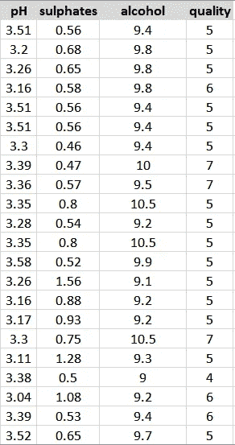
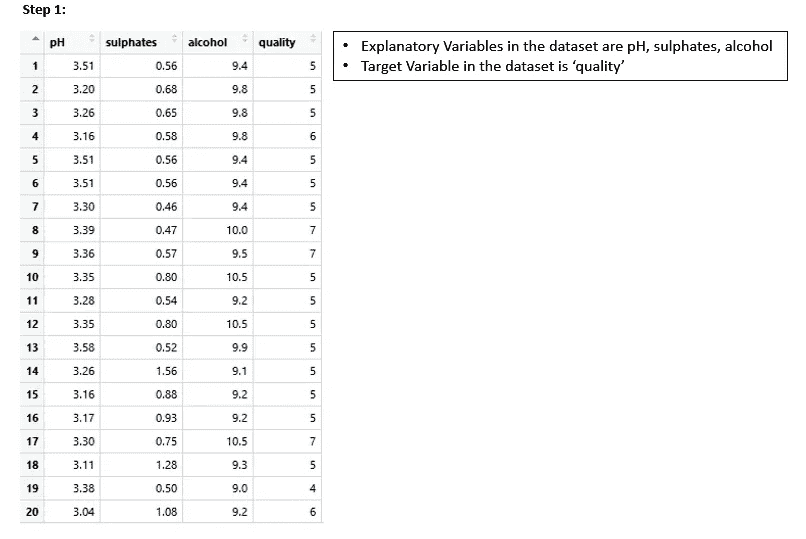
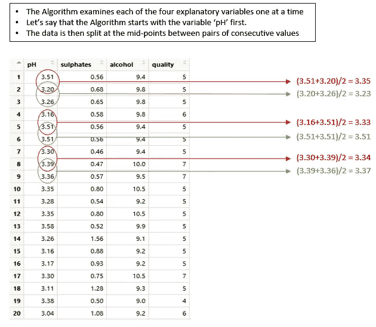
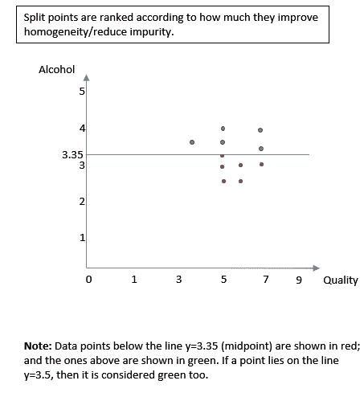
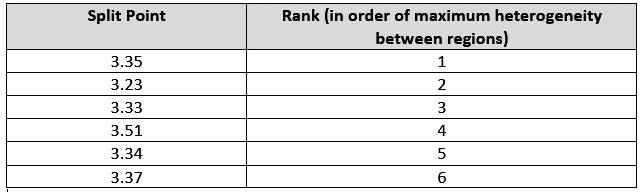
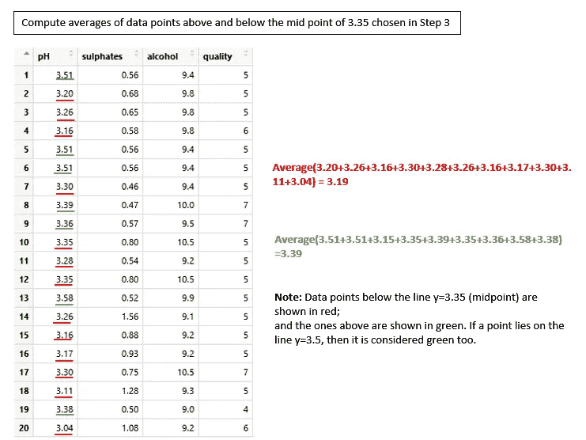
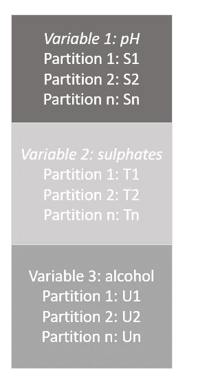
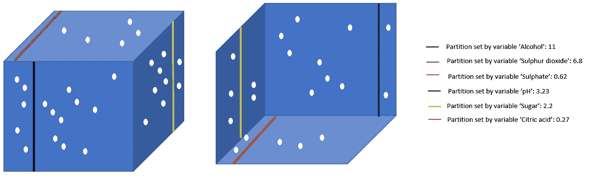
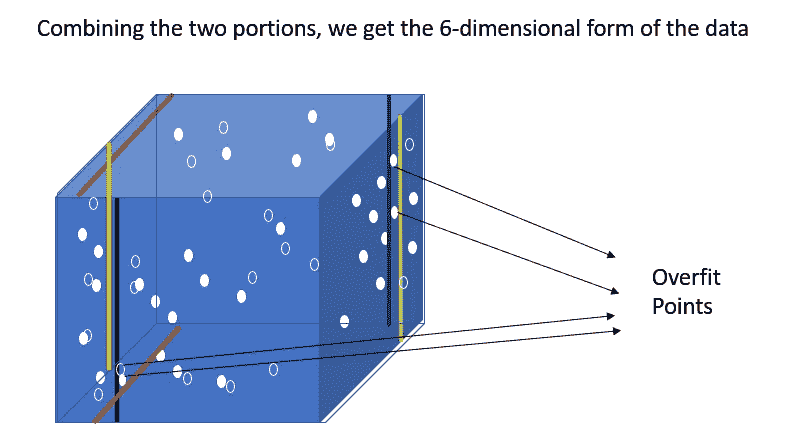

# 决策树——算法工作

> 原文：<https://medium.com/nerd-for-tech/decision-trees-algorithmic-working-1aa837397476?source=collection_archive---------23----------------------->

让我们尝试理解决策树算法的内部工作原理，即算法为我们完成的任务，让我们的生活变得更加轻松。让我们从 UCI 机器学习库中选取名为“葡萄酒质量”的公共数据集。这在[https://archive.ics.uci.edu/ml/datasets/wine+quality](https://archive.ics.uci.edu/ml/datasets/wine+quality)有售

**对于这个例子，让我们先考虑 3 个解释变量，即 pH 值、硫酸盐和酒精。**以下是数据集的局部视图-

示意图 1.0-数据集的局部视图

**算法工作(这是算法如何处理手头的问题以得出决策树)**

**步骤 1:识别解释变量和目标变量**

第一步是计算观察次数。在这种情况下，有 1200 个观察值。下一步是评估列。在这种情况下，有 12 列。每一列的数据类型与目标/响应变量一起被评估。在这种情况下，响应变量是“葡萄酒质量”。分析目标变量。这种情况下的目标变量是一个介于 0 和 10 之间的值(序数值)。计算目标变量“葡萄酒质量”的平均值，在这种情况下恰好是 5.6。

**示意图 1.1 -分析数据集以评估解释变量和目标变量**

**步骤 2:为每个决策节点选择分裂参数**

**示意图 1.2-了解算法如何找到第一个决策节点(示意图 1.1)**

从示意图 1.2 中，我们看到中点是在成对的连续值之间计算的。一旦完成，分裂点值 3.35、3.23、3.33、3.51、3.34 和 3.37(参考示意图 1.2)根据它们提高均一性/减少杂质的程度进行排序。让我们看看示意图 1.3 中的一个这样的分割点- 3.5。

**示意图 1.3——了解算法如何处理分割点**

让我们假设的排名如下:

示意图 1.4-确定分裂参数的分裂点排序

根据示意图 1.4，我们知道变量“pH”的分裂参数是 3.5。

***对数据集中所有可用的解释变量继续步骤 2。*** 对于数据集中可用的每个决策变量，选择分裂参数。在变量“pH”的情况下，分裂参数是 3.5，因为在这一点上，不同区域之间具有最大的异质性，而在一个区域内具有最大的同质性。决策树本质上是二进制的，该算法重复地将记录分成两个区域，以便在区域内实现最大的同质性。同质性(样本内)最大的值被选为**分裂条件**。这被称为**递归分区**或**贪婪逐步下降**。

**步骤 3:确定决策变量**

一旦为数据集中的每个解释变量(预测变量/列)选择了拆分参数，算法就会对所有变量进行彻底扫描，以查看哪个变量产生的杂质最少。

***‘杂质最少’是什么意思？***

正如我们所见，数据集中有各种预测变量。选择能够准确分割变量以使信息增益最大并且分割尽可能异质的预测变量作为第一节点。

杂质通过残差∑(预测值-目标值/实际值)的平方和来衡量。选择产生最小/最小误差平方和的变量。

选择的变量:

**过拟合的概念:**

当算法考虑数据集中的所有变量时，会产生多个决策边界。这些界限中的每一个都集中于创建同质样本，这导致预测测试数据结果的不准确性。这种现象被称为‘过拟合’。如下所示:

让我们假设这些点用值‘3’、‘4’、‘7’和‘8’代表目标变量(质量)。当呈现具有相似分裂条件的测试数据点时，算法将简单地预测质量为 4。因此，由于过度拟合，复杂性增加。过度拟合带来的模式/决策规则更可能是噪声，而不是有用的决策规则/模式。

**修剪:**

修剪是为了克服过度拟合的问题。修剪包括以下步骤:

步骤 1:删除离叶节点最近的决策节点

第二步:计算准确性、错误率和成本复杂性。

步骤 3a:如果错误率比未修剪的树低，继续步骤 1 和 2。

步骤 3b:如果错误率与未修剪的树相比更多，则停止修剪。

**用 rpart 修剪:**

1.rpart 的算法对提供的数据执行 K 倍交叉验证(默认为 10 倍)。

2.然后，它对 K-1 个数据子集应用完全生长的树。(将它们视为训练数据)

3.然后将树模型应用于第 k 个子集(将其视为验证数据)

4.计算如下:-

-相对误差(用训练数据估计)

-交叉验证误差(x_error/X-val 相对误差)(用验证数据估计)

-标准偏差(x_std)(用验证数据估算)

-复杂性参数

5.然后，最接近叶节点的决策树被移除，并且这被应用于 9 个数据子集。

6.步骤 1 至 3 再次应用于修剪后的树。

7.然后对结果进行绘图，以查看 x_error 最小的树的大小。

8.然后，这被认为是最终的修剪最优树模型。

**注:**R 中的 plotcp()给出了——树的大小、复杂度参数和交叉验证误差的图。

它由 X 值相对误差表示，不应与相对误差混淆。

**成本复杂度参数:**

成本复杂性参数是一个建议

分配给树的惩罚值。它是由

> Cp = Err(Tree)+ alpha*[L(T)]

在哪里

Err (Tree)是分类树(or)情况下验证数据集中的误分类率

回归树情况下的 1-(R)项。

Alpha 是基于树中节点数量给出的惩罚值。α介于 0 和 1 之间；0 表示未修剪树的惩罚项；1 表示只有一个节点的树的惩罚项。因此，α在 0 和 1 之间变化。

L(t) —树中终端/叶节点的数量

**结束语**

从上面的步骤中我们看到，算法为我们做了大部分的重量提升工作，因此我们可以毫不费力地构建决策树模型(不可否认，在构建模型之前，我们需要进行大量的数据清理和数据转换)。