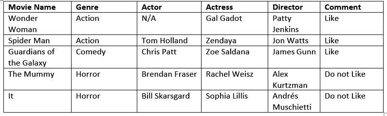

# 决策树—解释

> 原文：<https://medium.com/nerd-for-tech/decision-trees-interpretation-8fdd75b3264d?source=collection_archive---------13----------------------->

让我们用一个有趣的例子来理解“决策树”。让我们假设你对看电影感兴趣。作为一个电影迷，你几乎会看每一部上映的电影。你喜欢一些，不喜欢一些。你现在想了解导致你喜欢/不喜欢一部电影的各个方面。您有一个文本文档，其中包含您在过去两年中观看的电影列表。文本文档如下所示

