# JavaScript 中的声明

> 原文：<https://medium.com/nerd-for-tech/declarations-in-javascript-56377f36097d?source=collection_archive---------13----------------------->

## 声明变量的初学者指南

在 JavaScript 中，当我们想要声明一个新变量时，我们有三种选择。为了快速复习，我们使用变量作为存储值或数据的容器。范围可以从一个数字到一个字符串，或者一个数组，甚至是一个完整的函数。我们将从小事开始，这样我们可以了解我们的声明语句的不同点和相似点。让我们直接开始吧。

**Var**

对你们中的一些人来说，这似乎有些显而易见，但 var 实际上代表变量。这是 JavaScript 最初创建时声明变量的原始方法之一，并且一直沿用至今。当声明任何新变量时，我们总是希望遵循相同的格式。声明，名称，等于值。让我们看看下面的 var 示例，以便更好地了解这种格式。

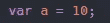

如你所见，我们遵循的就是这种格式。我们的声明是 var，我们把我们的变量命名为 a，我们总是包含等号，因为这是我们的变量 a 所等于的。最后，我们将值设置为 10。我们刚刚声明了第一个变量！如果我们想用 if 语句将 a 的值增加 10，会发生什么？嗯，我们有四种选择，让我们看看所有的选择。

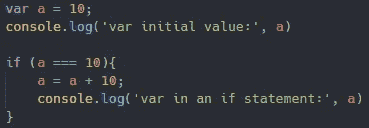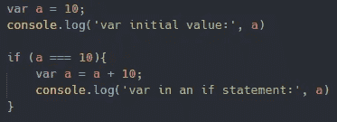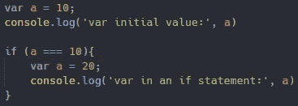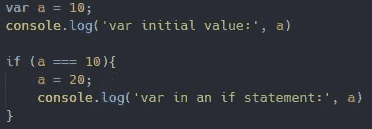

全部返回

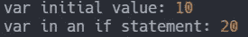

好吧，我可能把两个拉长成了四个，但是有很好的理由，你稍后会看到。在前两个例子中，我们简单地将 a 重新赋值为+10，在后两个例子中，我们将 a 重新赋值为 20。如您所料，在所有情况下，如果我们在 if 语句之外控制日志，a 应该仍然等于 20。对吗？

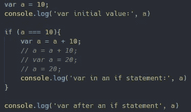

返回

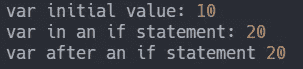

是的，你是对的！在重新分配变量 a 后，我们的结果总是 a 增加了 10。这是因为 var 是全局范围的，也是函数范围的。正如我前面提到的，这是在 JavaScript 中创建变量的传统方式，但是 ES6 给了我们 var 失去已久的孪生兄弟。

**让**

Let 是 2015 年随着 ES6 for JavaScript 的发布而引入的。这给了我们一种新的方法来声明一个变量以及一些不同于 var 的功能。但在此之前，我们先来看三个例子，看看如何改变变量 b 的值。

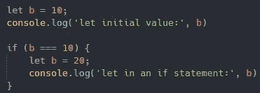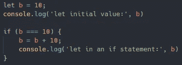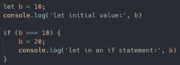

全部返回

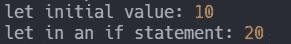

如你所见，我们将 b 的值重新分配为 20，但是用了两种不同的方法。我没漏掉一个例子吗？是的，但是为了帮助你更好地理解区别。现在就来看看吧。

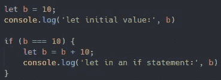

你觉得它会有什么回报？

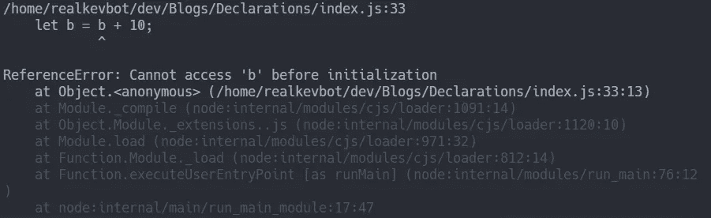

我们得到了一个错误，但是这个错误告诉我们什么呢？很明显，它告诉我们，在 b 变量被初始化之前，我们不能访问它。我们的错误图片也让我们看到了代码停止的地方。在我们声明了变量 b 之后，它应该等于 b，然后停止。这是因为 b 正在被初始化。我们实际上没有调用 b 的初始值，我们在 if 语句中创建了一个全新的 b 变量。对于可视化来说，让我们看看 b 在 if 语句之外是什么。

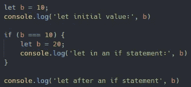

返回

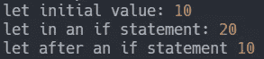

如你所见，变量 b 仍然等于它的初始值 10。这是因为 let 是一个块范围的变量。当我们在 if 语句中声明 b 等于值 20 时，我们在该块中创建了一个名为 b 的新变量。一旦我们退出 if 语句，我们就退出那个块并返回到最外面的块，在那里变量 b 等于 10。但是如果我们像其他两个例子那样重新分配值，会发生什么呢？

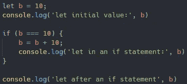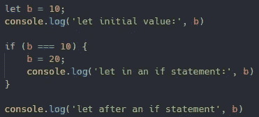

双双归来

在这两种情况下，因为我们没有在 if 语句中初始化 b 的新实例，也就是说创建了一个新的块。我们只是在它第一次初始化的块上重新分配它的值。但是我们还有一个家庭成员要介绍，所以等一下。

**常数**

最后一个但肯定不能被忽略的是 const，正如你可能猜到的，它代表常量变量。听起来有点可怕，那到底是什么意思？简单地说，事实上，常量变量一旦被声明就不能被改变。所以，从某种意义上来说，如果你需要改变变量的值，这是很可怕的。下面我们来看一个例子。

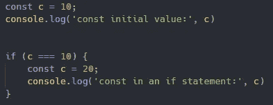

返回

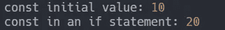

等等，我能做到吗？这是因为类似于 let，const 是一个块范围的变量。这意味着我们实际上刚刚创建了一个新的常数 c，等于 20，但是只在 if 语句中。如果我们试图让 c 的常量变量的值 c 加上 10，我们将会遇到同样的错误，即在 c 的变量初始化之前不能访问它。但是如果我们试着重新分配它呢？

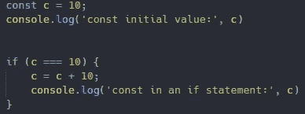

返回

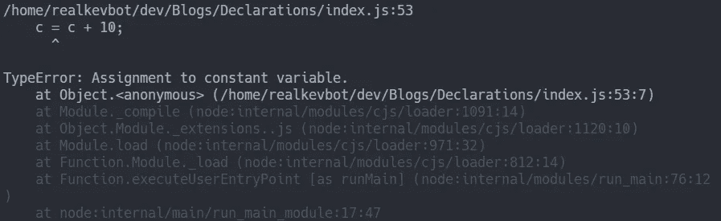

毫不奇怪，JavaScript 甚至不会让我们抛出一个更严重的类型错误。一旦声明了常量变量，就不能重新分配或更改它的值。

我要感谢你的阅读，并希望你学到了新的东西！请关注未来的更多文章！

如果你想查看这些例子的副本，或者只是作为参考，你可以在这里找到 GitHub 回购[的链接。](https://github.com/TheRealKevBot/JSDeclarations)