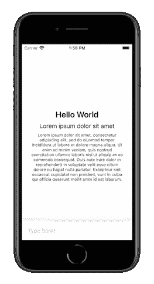
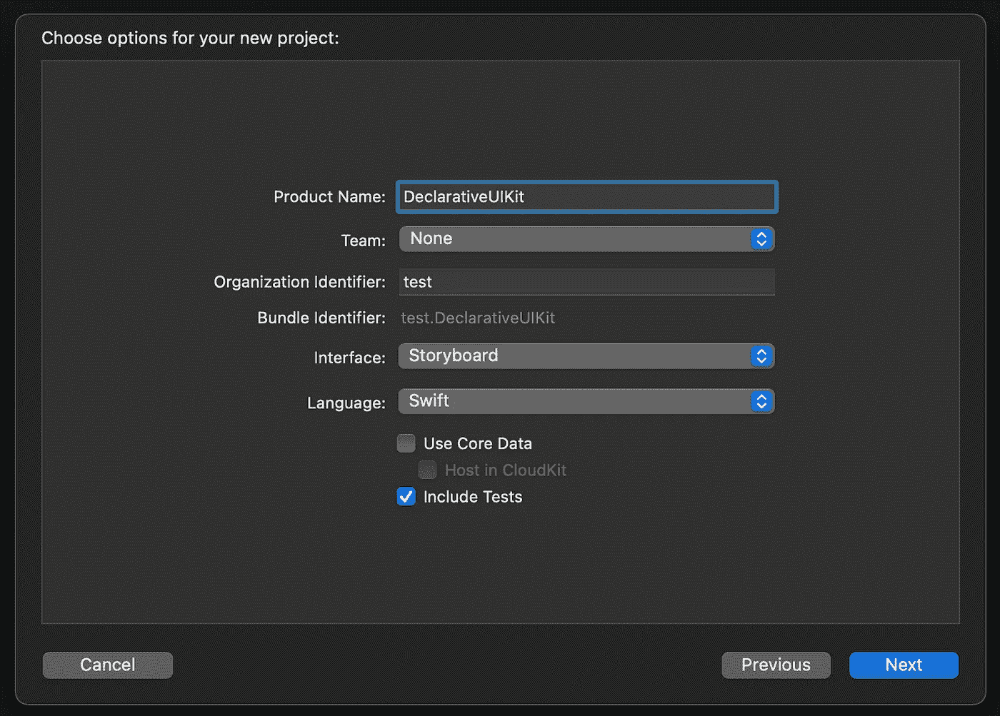
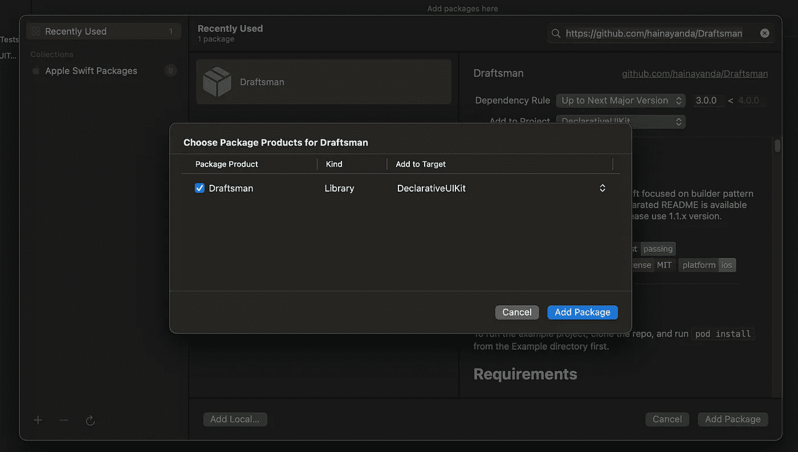
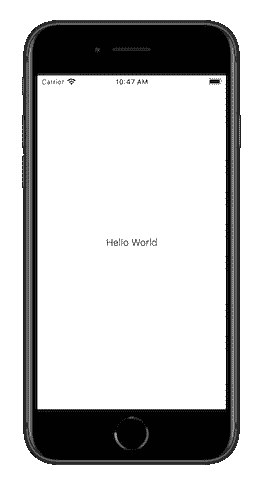
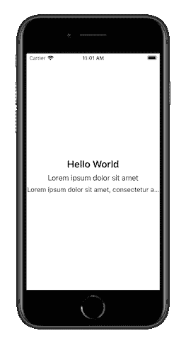
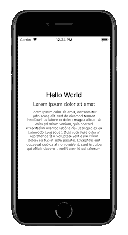
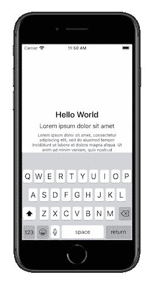

# 声明式 UIKit？为什么不呢？

> 原文：<https://medium.com/nerd-for-tech/declarative-uikit-why-not-348e4532d1f9?source=collection_archive---------0----------------------->

我知道你们所有人都对新的 SwiftUI 感到兴奋。声明式方法比 UIKit 提供的任何方法都更好、更优雅。是的，UIKit 有故事板和 XIB，但那最终会成为 a**的痛。

# 声明式 UIKit？

是啊！我们仍然可以使用 UIKit，但是以声明的方式！你所需要做的就是使用**绘图员**(是的这是我自己的库)作为 UIKit 声明式 UI 构建器。可以查看其 [***Github 页面***](https://github.com/hainayanda/Draftsman) 了解更多信息。

# 让我们试试绘图员！

让我们创建一个迷你项目来尝试这个库。我们的目标是用绘图员创建一个这样的简单用户界面:

确实非常简单。但是我们想要实现的不是一个复杂的 UI，而是证明我们可以使用 UIKit 使用声明式的方法。

让我们创建一个项目！

别忘了加上绘图员作为它的依赖。您可以使用 Swift Package Manager 或 Cocoapods，您更喜欢哪个。在本例中，我使用的是 Swift Package Manager，因为它是现成的:

完成后，请查看一下新自动创建的 ViewController 类:

现在导入**绘图员**并执行**计划的**协议；

我们在这里做的是声明 ViewController 视图的子视图将在 **viewPlan** 属性中包含什么。不要忘记 **LayoutPlan** 属性，正是 *resultBuilder* 实现使这种方法成为可能。 **applyPlan()** 然后将读取 viewPlan 声明并构建一个在那里声明的视图。我们将主要关注我们在视图计划中写的内容。

现在让我们看看如果我们编译这个项目会发生什么:

空白？

不要慌，UILabel 其实是有的，只是大小为零，这就是原因。缺少的是 UILabel 约束。让我们在**视图计划**中添加一个:

如您所见，您需要使用视图中的 **drf** 来提取兼容的锚。我们这里使用的**中心**代表*中心锚*和*中心锚* **、**，我们用来自其父节点的同一个锚来约束它。现在，如果你编译它，标签应该在屏幕的正中央:

# 使用 UIStackView

嗯，如果你看到我们想要实现的，使用 **UIStackView** 会更容易，对吗？那我们就用一个:

现在我们声明 UIStackView 及其约束。**横**代表*左锚*和*右锚*，竖**代表*上锚*和*下锚*。现在为了确保它将使用**安全区域布局指南**，我们用**安全区域**对其进行了约束。**

**insertStacked** 等同于 **addArrangedSubview** ，因为现在 UILabel 是 ui stack view*arranged subviews*的一部分。由于现在 UILabel 约束由 UIStackView 管理，我们需要将其对齐设置为中心，使其居中。绘图员使用 [***构建器***](https://github.com/hainayanda/Builder) (是的，我自己的库也是)来启用开箱即用构建器模式的能力。你所需要做的就是在 **drf** 之后使用**构建器**。

让我们继续构建 UIStackView 内容:

myverylontext 是一个变量，应该是这样的:

现在我们来编译:

不太对是吗？

这个结果其实是意料之中的。这是因为我们的 UILabel 没有设置 **verticalCompression** 优先级，所以它压缩标签并截断其文本。修复很简单:

看起来不太好，是吗？我们实际上可以像这样将**视图计划**组合成另一个**视图计划**:

好多了，对吧？您可以使用 function 或 property getter 根据需要编写 ViewPlan。只是不要忘记在其上添加 LayoutPlan 属性。

正如你在代码中看到的，我在 UIStackView 的垂直和水平方向添加了 **offset(by: 24)** 。这将为视图的外部增加 24 的空间。如果你想增加内部空间，使用**插图(by:)。**

现在让我们编译一下，看看:

快好了！

# UITextField 和键盘

现在到最后一部分。我们将需要 **UITextField** ，当然，它将显示一个**键盘**。添加 UITextField 是容易的部分，但是不要担心，受限于键盘也很容易！

让我们先从 TextField 开始:

我们希望将 UIStackView 底部约束到 UITextField 容器的顶部，这就是为什么我们需要将它存储为一个变量，以便可以在 viewPlan 中使用。*自定义字段*被约束在视图的底部。一切看起来都很好，除了一件事。它忽略了键盘:

不好吗？

幸运的是，你可以随时使用键盘锚作为约束，即使你支持的是一个旧的 iOS 版本，因为它是由*(再次，这也是我的)。我们来补充一下:*

*现在应该完成了，但是我们总是可以让*自定义字段*成为它自己的独立视图组件，以防它被其他组件使用。要定制一个 **UIView** ，你需要做的只是创建一个扩展任何 UIView 的类，并实现**计划的**，就像之前一样:*

*然后它可以在我们的**视图控制器**中用作**自定义字段**:*

*我们来编译一下，看看:*

**

*耶！*

*你做到了！您可以使用 UIKit 的声明性方法创建一个简单的应用程序！让我们回顾一下完成的 ViewController 代码:*

*你可以在这个仓库中克隆这个例子->[***DeclarativeUIKitExample***](https://github.com/hainayanda/DeclarativeUIKitExample)*

# *最终注释*

*如果你错过了起草人的知识库链接，这里就是-> [***起草人***](https://github.com/hainayanda/Draftsman) 。这只是声明式 UIKit 的第 1 部分。第 2 部分将讨论如何在这里添加一个反应式方法，最后一部分我们将据此创建一个完整的 MVVM 架构。*