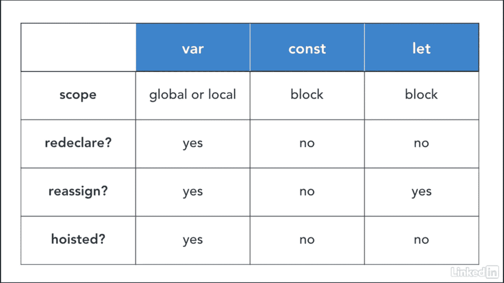

# 在 JavaScript 中声明变量

> 原文：<https://medium.com/nerd-for-tech/declaring-variables-in-javascript-d29119bbe0a?source=collection_archive---------22----------------------->


[Erda Estremera](https://unsplash.com/@erdaest?utm_source=medium&utm_medium=referral) 在 [Unsplash](https://unsplash.com?utm_source=medium&utm_medium=referral) 上拍照

在 Flatiron 学习第 3 单元的 JavaScript 时，我在处理变量时遇到了一些问题。更具体地说，我很难用三种不同的方式来声明和赋值一个变量:`var`、`let`和`const`。我知道描述一个变量的最好方法之一是把它看成一个盒子。那个盒子里可以装着你在网上订购的一件物品，一双你只在外出时穿的最喜欢的鞋子，甚至是你童年的珍贵记忆。不管存储在那个盒子里的是什么类型的对象，只要你需要，你都可以访问那个盒子。好消息是你可以给这个盒子一个名字，这样你就可以随时访问它。

所以在我谈论声明一个变量的三种不同方式之前，我们应该讨论在命名这个变量的时候不要做什么。我想说 JavaScript 要求不高，但有时候可能跟你规划的不太一样，但这就是生活。总之，这些规则很简单，如下所示:

*   每个变量名都以小写字母开头
*   camelCaseYourVariableNames
*   远离[保留字](https://developer.mozilla.org/en-US/docs/Web/JavaScript/Reference/Lexical_grammar#reserved_keywords_as_of_ecmascript_2015)和[未来保留字](https://developer.mozilla.org/en-US/docs/Web/JavaScript/Reference/Lexical_grammar#future_reserved_keywords)

所以让我们回顾一下我们最初声明变量的方式:`var`

直到 2015 年，`var`是声明变量的唯一方式，本质上使它成为唯一的孩子。`var`声明一个函数范围或全局范围的变量。因此，在使用它时，您可以选择分两步声明和分配变量(如下所示):

```
var name;
/* this creates a variable with the name 'name' *///=> undefinedname = "Joy"
/* this give the variable the string value 'Joy' *///=> "Joy"
```

或者同时(如下图):

```
var name = "Joy";
//=> undefined
```

这两种方法都是标准的，但是无论您决定使用哪一种，当您准备好检索该变量时，您只需要引用它的名称(如下所示):

```
name;
//=> "Joy" 
```

现在，一旦这个变量有了名字，你就可以选择任意多次重新声明它，而不会触发错误。这可能是一件好事，也可能是一件坏事，因为你可能会无意中两次声明这个变量。它可能会导致潜在的重大问题；然而，ES2015 引入了两种创建变量的新方法:`let`和`const`。

与`var`不同，如果你试图声明一个变量两次，`let`和`const`语句都会抛出错误，但是它们有区别。就像`var`一样，你可以使用`let`重新赋值一个变量。

```
let name = "Joy"
//=> undefinedname = "Hope"
//=> "Hope
```

现在让我们说，你不想重新分配，甚至重新声明一个变量。我推荐使用`const`声明。

```
const name = "Joy"
//=> undefinedname = "Hope"
//=> Uncaught TypeError: Assignment to constant variable.
```

除了不能重新赋值或者重新声明变量之外，你还必须立即赋值。使用`const`的另一个有趣的事实是，您可以用大写或小写字母来声明它。更常见的是使用大写字母，但这完全取决于开发人员。

```
const name;
//=> Uncaught SyntaxError: Missing initializer in const declaration

const name = "Joy";
//=> undefined 
```



概括一下，远离`var`，当你知道值会改变时使用`let`，如果你知道值不会改变时使用`const`。当然，我不能结束这个主题而不提供任何有用的资源，这个表格提供了关于`var`、`let`和`const`如何工作的有用提示，以防你更喜欢视觉辅助。编码快乐！！！

[](https://developer.mozilla.org/en-US/docs/Web/JavaScript/Reference/Statements/var) [## 定义变量

### var 语句声明了一个函数作用域或全局作用域的变量，可以选择将其初始化为一个值…

developer.mozilla.org](https://developer.mozilla.org/en-US/docs/Web/JavaScript/Reference/Statements/var) [](https://developer.mozilla.org/en-US/docs/Web/JavaScript/Reference/Statements/let) [## 让

### let 语句声明一个块范围的局部变量，可以选择将其初始化为一个值。的名字…

developer.mozilla.org](https://developer.mozilla.org/en-US/docs/Web/JavaScript/Reference/Statements/let) [](https://developer.mozilla.org/en-US/docs/Web/JavaScript/Reference/Statements/const) [## 常数

### 常量是块范围的，很像使用关键字声明的变量。常量的值不能改变…

developer.mozilla.org](https://developer.mozilla.org/en-US/docs/Web/JavaScript/Reference/Statements/const)