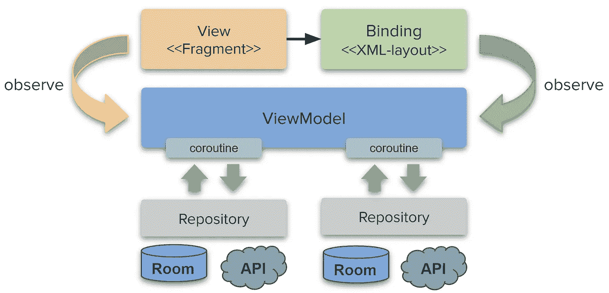

# 解耦绑定

> 原文：<https://medium.com/nerd-for-tech/decoupling-binding-57566dc7b17d?source=collection_archive---------6----------------------->

这是系列文章的一部分。目标、基础、项目结构、文章摘要见 [*Android::简体*](https://sites.google.com/view/migueltt/home_en)

[Jetpack Compose](https://developer.android.com/jetpack/compose) 正在测试中！(截至 2021 年 3 月)

知识库:[https://gitlab.com/migueltt/simpleandroid](https://gitlab.com/migueltt/simpleandroid)

如今，现代的 Android 应用程序很容易构建——也就是说，如果你遵循 Android 架构组件指南的话。如果你遵循这些原则，事情会变得更简单:

*   一个`Activity`或`Fragment`只是 Android 系统、视图(布局)和视图模型的粘合剂
*   将所有与 UI 相关的代码重构为扩展函数
*   不要在您的`Fragment`中创建协程——视图模型应该是唯一启动协程的模型——主要原因是协程应该遵循视图模型生命周期
*   您可以在`Activity`、`navigation-graph`和`Fragment`级别定义视图模型——这使得数据共享和协程行为变得更加容易

主要目标是拥有这样的架构:



**首先，** XML 布局包含了所有的 UI 设计(直到 Jetpack Compose 最终投入生产)——遵循通用的命名约定:`[fragment_test_main.xml](https://gitlab.com/migueltt/simpleandroid/-/blob/develop/app/src/debug/res/layout/fragment_test_main.xml)`

*   在 XML 布局中，仅当您需要引用变量时，才使用*数据绑定***——否则，**不使用**标签，而使用*视图绑定—* 确保您的应用程序`[build.gradle](https://gitlab.com/migueltt/simpleandroid/-/blob/develop/app/build.gradle)`文件指定:**

```
buildFeatures **{** viewBinding true
    dataBinding true
**}**
```

*   请记住，无论何时使用`<layout>..</layout>`，您都在添加大量代码来同步数据如何绑定到您的布局中——如果您真的不需要它，只需使用 ***视图绑定*** *—顺便说一句:* ***不要使用*** `*findViewById(..)*` *或 kotlin 合成 id。*

**其次，**用同样的惯例给相关的`Fragment`命名:`[FragmentTestMain](https://gitlab.com/migueltt/simpleandroid/-/blob/develop/app/src/debug/java/com/simpleandroid/modules/testui/FragmentTestMain.kt)`——是的，有点打破常规…

**第三个**，创建一个`[FragmentTestMainBindingExt](https://gitlab.com/migueltt/simpleandroid/-/blob/develop/app/src/debug/java/com/simpleandroid/modules/testui/FragmentTestMainBindingExt.kt)`文件——这将包括扩展函数，将所有 UI 相关代码从`Fragment`中解耦出来:

*   当使用*数据绑定*或*视图绑定*时，会为您的 XML 布局生成一个类——它恰好遵循`<xml-filename>Binding`约定，这就是我们将`FragmentTestMain`命名为`Fragment`的原因——这样您的所有文件都很容易识别
*   在这个`[FragmentTestMainBindingExt](https://gitlab.com/migueltt/simpleandroid/-/blob/develop/app/src/debug/java/com/simpleandroid/modules/testui/FragmentTestMainBindingExt.kt)`文件中，开始添加与绑定类相关的扩展函数

**第四个**，在你的`FragmentTestMain`中总是使用生成的*绑定类*的扩展函数:

```
// Your traditional FragmentTestMain.kt file
package com.simpleandroid.modules.testui

import android.os.Bundle
import android.view.LayoutInflater
import android.view.View
import android.view.ViewGroup
import androidx.fragment.app.Fragment
import androidx.fragment.app.viewModels
import com.simpleandroid.databinding.FragmentTestMainBinding

class FragmentTestMain : Fragment() {

    private lateinit var binder: FragmentTestMainBinding
    private val viewModel: TestViewModel by viewModels() override fun onCreateView(
        inflater: LayoutInflater,
        container: ViewGroup?,
        savedInstanceState: Bundle?
    ): View =
        FragmentTestMainBinding.inflate(
            inflater, container, false
        ).*apply* **{** binder = this
        **}**.*root* override fun onViewCreated(
        view: View, savedInstanceState: Bundle?
    ) {
        super.onViewCreated(view, savedInstanceState)
        binder.*setup*(this)
        viewModel.sample.observe(*viewLifecycleOwner*) **{** // do something
        **}
**    }
}class TestViewModel : ViewModel() {
    val _sample = MutableLiveData("test")
    val sample: LiveData<String> = _sample
}
```

在另一文件中:

```
// Decouple binding here: FragmentTestMainBindingExt.kt
package com.simpleandroid.modules.testui

import androidx.activity.addCallback
import androidx.core.view.GravityCompat
import androidx.fragment.app.Fragment
import androidx.navigation.fragment.NavHostFragment
import androidx.navigation.fragment.findNavController
import com.simpleandroid.R
import com.simpleandroid.databinding.FragmentTestMainBinding
import com.simpleandroid.ui.setupWithNavControllerExt

fun FragmentTestMainBinding.setup(
    fragment: Fragment
) {
   //reference all UI components through the binding
   :
}
```

这将所有与 UI 相关的代码从`Fragment`本身解耦，并且*从视图模型中观察* `LiveData`。就这样，没有什么需要添加到`Fragment`中的了——它支持开箱即用的配置更改。

对于某些边缘情况可能有例外:

*   在背压上处理自定义*——始终使用`onBackPressedDispatcher`*
*   处理`Toolbar (top, bottom)`、`Drawer`、`FloatingActionButton`时的具体代码——要解决这个问题，查看 [UX 政策系列](https://miguelt.medium.com/ux-policies-bbbb432dc5fc)

通过遵循这些原则，在 Jetpack Compose 上进行迁移将变得更加容易，因为您的所有 UI 都已经与`Fragment`解耦了。