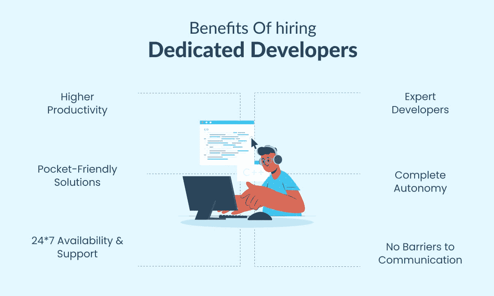

# 专注的开发人员与自由职业者:你的下一个项目应该雇佣哪一个

> 原文：<https://medium.com/nerd-for-tech/dedicated-developers-vs-freelancers-which-one-to-hire-for-your-next-project-5426439208cc?source=collection_archive---------4----------------------->

企业在雇佣开发人员时有广泛的选择。他们可以雇佣自由职业者或专门的开发团队。这两种选择都有优点和缺点，这就是为什么为您的企业决定最佳选择是具有挑战性的。

在这篇博文中，我们将讨论雇佣专职开发人员和自由职业者的利弊，这样你就可以决定哪个选项最适合你的下一个项目。

# 谁是自由职业者？

自由职业者，或自由工作者，是被雇佣来完成某项工作的独立承包人。他们不拿薪水，而是为每个项目的时间和服务付费。大多数情况下，自由职业者是按小时雇佣的，如果他们提前完成任务，就可以获得奖金。

对于一个项目来说，有约定的里程碑是很常见的。一旦达到每个里程碑，付款将被释放给自由职业者。然而，大多数工作并不遵循这样的规则，你通常需要与每个客户协商你的条款——这没什么错！

只要确保你在合作的每个阶段都设定了明确的期望，这样每个人都可以避免失望。

*也读:* [*一条全面的决定性信息雇佣远程团队的开发者*](https://www.valuecoders.com/blog/outsourcing-and-off-shoring/a-piece-of-comprehensive-decisive-information-to-hire-remote-team-of-developers/)

# 雇佣自由职业者的好处

以下是为你的下一个项目雇佣自由职业者的一些‌benefits；其中一些列举如下:

# 降低风险

有时候，雇佣自由职业者是降低风险的一种方式。如果你有一个不确定会成功的应用想法，和一个自由职业者合作是有益的。这样，如果你的应用不流行，你也不会像雇佣全职员工那样损失太多的金钱和时间。

此外，由于自由职业者接受每个项目的报酬，并且不领薪水，双方都没有长期的承诺。

# 更少的责任和监督

除了没有长期承诺之外，雇佣自由职业者意味着你不必担心提供福利或其他津贴。你不必监督或检查他们的进展。

你唯一需要做的就是在工作完成后付给他们报酬。如果你想快速完成一个项目，而不用担心支付病假或假期，这将是一个巨大的好处。如果你的业务资金有限，又负担不起更多的固定员工，这也是有益的。

# 全球覆盖

雇佣自由职业者的另一个好处是你可以从世界任何地方雇佣他们。你不必把自己局限于本地人才或自己国家的人才。你可以雇佣住在千里之外的人，如果他们有你需要的技能。在雇佣一个自由职业者之前，做彻底的调查，知道会发生什么，会花多少钱。

像 Upwork、Fiverr、Guru 和 elance 这样的自由职业者市场允许用户以非常低的成本联系来自世界各地的潜在项目候选人。

*也可阅读:* [*综合指南——雇佣以太坊开发者*](https://www.valuecoders.com/blog/technology-and-apps/a-comprehensive-guide-to-hire-ethereum-developers/)

# 雇佣自由职业者的弊端

这里有一些为你的下一个项目雇佣自由职业者的‌cons。

# 很难找到合适的人选

在雇用自由职业者时，‌spend 有更多的时间寻找合适的候选人。他们大多经验有限，你没有办法知道他们能不能按时交付你的项目。

你知道他们是否能交付你的项目的唯一方法是看他们以前的工作和检查他们的参考资料。如果你雇佣一个自由职业者，他可能会接手你的项目，但最终会让你失望，因为他在那个领域没有足够的经验。

# 很难保持跟踪

雇佣自由职业者的另一个缺点是，他们可能会在你的项目还没完成时就消失了。如果你不确定他们的背景，他们可能在拿了你的钱后甚至不会来上班。密切关注它们，确保它们正常工作。

这意味着如果你想按时完成你的项目，你将不得不雇用其他人来检查他们。发生这种情况是因为大多数自由职业者没有稳定的工作，所以不能保证他们会一直和你在一起，直到你的项目完成。

# 不像全职员工那样忠诚

雇佣自由职业者的另一个缺点是他们对你的公司不忠诚。这意味着无论何时你的项目需要一个新的自由职业者，你都必须继续寻找。他们会和你一起工作，直到找到更好的工作，所以只有在你需要的时候才雇佣他们是至关重要的。

如果你雇佣了一个自由职业者，而他在完成你的项目之前就消失了，这是非常令人沮丧的。

# 谁是敬业的开发人员？

专门的开发人员是创建应用程序、平台和其他 web 服务的雇员或承包商。他们为一家公司工作，在那里他们被分配特定的职责。虽然一些公司允许专门的开发人员与外部公司竞标自由职业项目，但大多数公司只关注雇主的需求。

与专注的开发人员合作的优势在于，他们对你的公司了如指掌，可以根据需要为你提供创新的解决方案；此外，因为他们是你公司的员工，他们有权享受所有法律保护，免受歧视，并获得加班费。

# 雇佣专业开发人员的好处

以下是为你的下一个项目雇佣专门的开发人员的一些好处:

# 专注于商业

当你雇佣软件程序员时，他们只关注你的项目。这意味着他们有一个单一的焦点，不会被其他工作分散注意力。他们还可以了解最新的行业趋势和技术，帮助您在竞争中保持领先。

# 获得特定技术的专业知识

如果你的项目需要特定的技术，雇佣有经验的人是有意义的。这样，他们可以更快地完成你的项目，因为他们知道如何使用它。

例如，如果你的下一个移动应用程序开发项目需要一名 React 原生开发者，‌look 需要一名 React 原生开发者。他们将比多面手开发人员工作更有效率，交付更好的结果。

# 流畅的合作

专注的开发人员更好地了解你的业务和行业，让他们更容易与你合作。他们也能说你的语言，会更流利地跳‌communicate 舞。这导致您和您的开发人员之间更好的合作，从而产生更有效的开发过程。

# 雇佣专业开发人员的缺点

下面是**为你的下一个项目招聘软件开发人员**的一些‌cons:

# 很难找到本地人才

专注的开发人员是指为全职雇佣员工的公司工作的人。寻找本地人才可能很难，尤其是当你不愿意从海外招聘人才的时候。你可能需要在偏远地区寻找，或者通过专门寻找开发商的机构。

他们可能很贵而且很慢，因为在找到合适的人选之前，他们必须对你的项目做大量的研究。还有很多其他方法可以找到好的开发者；只是需要时间和努力。

专注的开发人员是指为全职雇佣员工的公司工作的人。寻找本地人才可能很难，尤其是如果你不愿意 [**从海外雇佣软件开发人员**](https://www.valuecoders.com/hire-developers/hire-software-developers-india#utm_source=hire_soft&utm_medium=Guest_Blog&utm_campaign=Medium&utm_id=NKY) 。

# 内部团队成本高昂

如果你为你的下一个项目雇佣一个专门的开发人员，你需要支付他们一份薪水。如果你的员工中有多个开发人员，这可能会很快增加。

也很容易陷入这样的陷阱:雇佣比你需要的更多的人，支付比他们应得的更多的工资。这不仅在工资方面要花钱，而且还会减缓发展。

# 缺乏可扩展性

当你雇佣一个专门的开发人员时，你就把自己锁在那个人身上至少一年。如果你的项目需要改变或者没有及时完成，你可能会不走运。

自由职业者同时从事多个项目，并根据需要调整他们的时间表。

这意味着他们不必在开始自己的工作之前无所事事地等待别人完成他们的工作。他们也不需要担心请假，因为他们会相应地管理自己的时间表。

*亦读:* [*如何雇佣最优秀的印度软件开发人员？*](https://www.valuecoders.com/blog/technology-and-apps/how-to-hire-the-best-indian-software-developers/)

# 雇佣专注的开发者和自由职业者:哪一个更好？

在为你的下一个项目雇佣专门的开发人员或自由职业者之前，你应该考虑几个因素。

## 1.良好的性能

雇佣在线开发人员是必要的，因为他们可以为你提供更好的表现。一个专注的开发人员比一个同时处理多个项目的自由职业者有更多的时间在你的项目上工作。这意味着您将在更短的时间内获得更多的特性和功能。

## 2.成本效益高

你还会发现，敬业的开发者比自由职业者更划算。因为他们专门为你工作，所以你不必为其他项目付钱给他们。你可以通过雇佣专门的开发人员而不是自由职业者来省钱。

## 3.内部团队

如果你的项目是长期的，需要不断更新，雇佣一个内部团队比自由开发人员更好。原因是，如果你雇佣了一个内部团队，他们甚至会在休假或生病时参与你的项目，而你的应用程序开发不会有任何停机时间。

如果你为一个长期项目雇佣自由职业者，很可能你也将不得不面对一些停工期。

## 4.沟通

雇佣一个敬业的开发者最重要的一点是，他们比自由职业者更能沟通。他们会实时更新你的项目，不会有任何误传。

## 5.灵活性

雇佣专职开发人员的另一个好处是，他们比自由职业者更灵活。根据你的需要，你可以雇佣他们做长期或小时工项目。如果你想省钱并且有时间限制，这种灵活性会很方便。

然而，如果你没有任何限制，最好雇用一名自由职业者，因为他们可以一次帮助你完成多个项目，没有任何麻烦。

*也读:* [*为什么要从估价师中聘请开发人员？*](https://www.valuecoders.com/blog/industry-news/why-should-you-hire-developers-from-valuecoders/)

# 结论

当考虑走哪条路的时候，在做最后决定之前彻底评估公司。你不希望最终与一个达不到你的期望或者不完全理解你的需求的开发人员一起工作。

为你的下一个项目选择一个发展伙伴应该基于理解你的具体需求。如果你有许多特定的功能需求，并且将在短期内发布移动应用，那么 [**雇佣开发人员**](https://www.valuecoders.com/hire-developers#utm_source=hire_dev&utm_medium=Guest_Blog&utm_campaign=Medium&utm_id=NKY) 可能是有意义的。然而，如果你的需求更广泛，或者你正在寻找一个长期的解决方案，雇佣自由职业者可能会更实惠，也更有伸缩性。

如果我们谈论在雇佣专职开发人员和自由职业者之间选择最好的，我们建议你雇佣专职开发人员。因为要找一个对所有需求都很精通，能开发出你想要的东西的自由职业者很复杂；此外，许多自由职业者可以做得很好，但可能不会在你的时间框架‌work。

但是当我们谈到一个专注的开发人员时，他会‌give 你他的全部注意力，并会根据你的要求和你喜欢的时间内工作。这就是为什么你应该 [**为你的下一个项目雇佣专门的开发团队**](https://www.valuecoders.com/dedicated-development-teams) 。