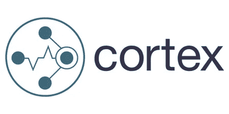
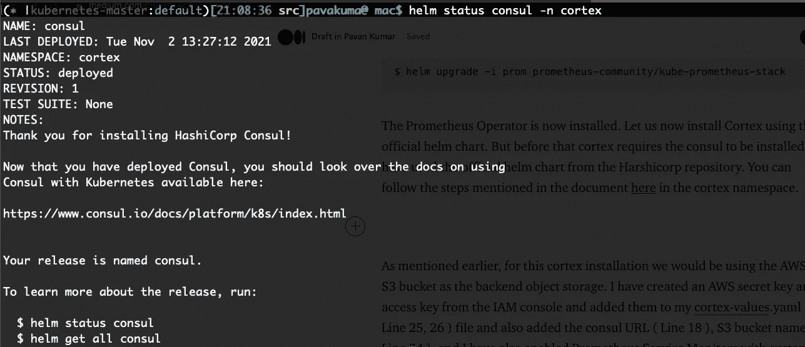
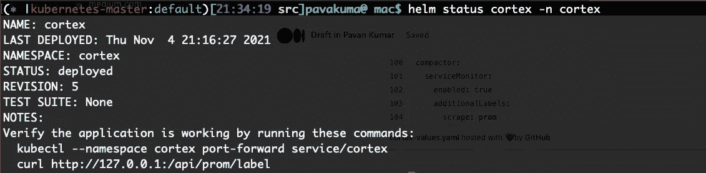
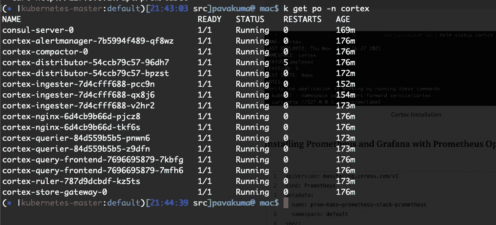
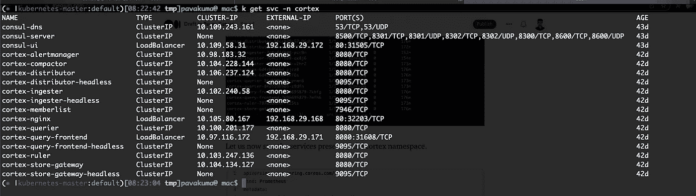
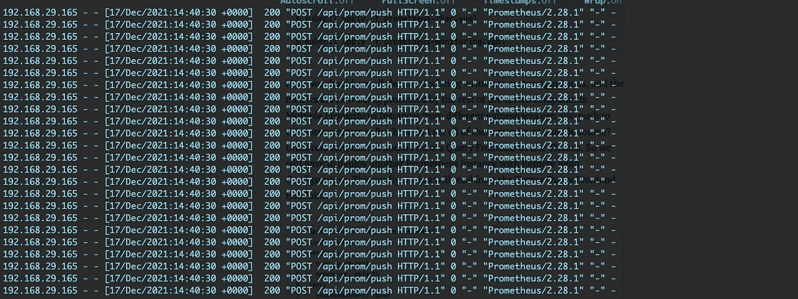
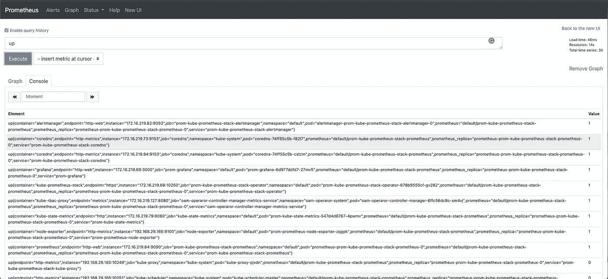
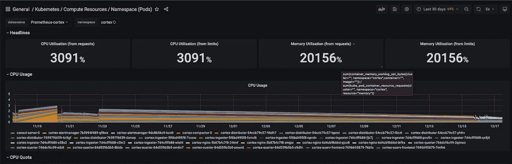
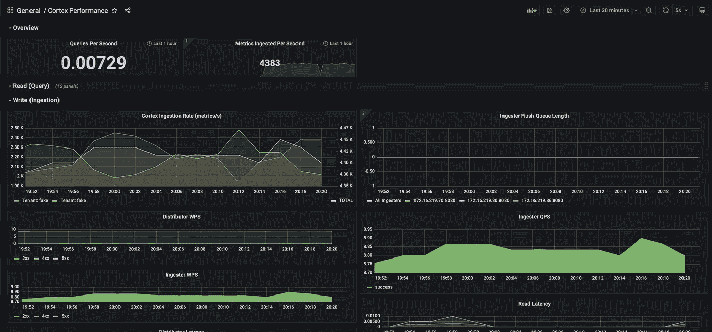

# 深入探究皮层指标第二部分

> 原文：<https://medium.com/nerd-for-tech/deep-dive-into-cortex-metrics-part-ii-666f74cb781a?source=collection_archive---------0----------------------->

深入探究 Cortex Metrics.io 第二部分

在本文的 [***第一部分***](/nerd-for-tech/deep-dive-into-cortex-part-i-c228e01f8c58) 中，我们已经了解了皮层的各个组成部分及其用例。在第二部分中，我们将使用 AWS S3 配置 Cortex 作为其后端存储桶，并了解如何使用 Cortex 将指标保留更长时间。我们还将配置 Grafana 使用 Cortex 查询前端来可视化来自各种 Prometheus 集群的图形。



皮质指标

# 整个故事是关于什么的？(TLDR)

1.  使用官方舵图安装 Cortex。
2.  将 Cortex 配置为使用 AWS S3 作为其对象存储。

# 先决条件

1.  Kubernetes 集群(可以是本地、AKS、EKS、GKE、Kind)。
2.  头盔，已安装 kubectl。

# 这篇文章没有涉及到什么

1.  如何建立基于生产的 Cortex 集群？
2.  比较市场上的各种监控解决方案(灭霸与 Cortex)

# 故事资源

1.  GitHub 链接:[https://github.com/pavan-kumar-99/medium-manifests](https://github.com/pavan-kumar-99/medium-manifests)
2.  GitHub 分支:[皮层](https://github.com/pavan-kumar-99/medium-manifests/tree/cortex)

**安装普罗米修斯操作器。**

如果你使用 helm 这样的包管理器，Cortex 的安装会更容易。Cortex 有一个官方的掌舵图，可以用来在 Kubernetes 集群上安装 Cortex 集群。你可以在这里找到舵图。

在我们安装 Cortex 集群之前，让我们使用此处的舵图安装 Prometheus 操作器。稍后，Prometheus 实例将被配置一个远程写配置，以将其推送到 Cortex 入口。但是现在，让我们按照您的定制安装 Prometheus 操作器。此图表的值可在此配置[。不过，我在非 HA 模式下安装了 consul。舵值可以在](https://github.com/prometheus-community/helm-charts/blob/main/charts/kube-prometheus-stack/values.yaml) [*这里找到*](https://raw.githubusercontent.com/pavan-kumar-99/medium-manifests/cortex/consul-helm-values.yaml) 。

```
$ helm repo add prometheus-community \ [https://prometheuscommunity.github.io/helm-charts](https://prometheus-community.github.io/helm-charts)$ helm repo update$ helm upgrade -i prom prometheus-community/kube-prometheus-stack
```

**在 Kubernetes 集群中安装 Cortex**

普罗米修斯操作员现在已经安装好了。现在让我们使用官方的舵图来安装 Cortex。但是在 cortex 要求安装 consul 之前，我已经使用了 Harshicorp 存储库中的官方舵图。您可以在 cortex 名称空间中遵循文档[这里](https://www.consul.io/docs/k8s/installation/install#helm-chart-installation)中提到的步骤。



领事舵图安装

如前所述，对于这个 cortex 安装，我们将使用 AWS S3 存储桶作为后端对象存储。我已经从 IAM 控制台创建了一个 AWS 密钥和访问密钥，并将它们添加到我的 cortex-values.yaml(第 25、26 行)文件中，还添加了 consul URL(第 18 行)、S3 存储桶名称(第 24 行)，并且我还启用了带有自定义标签的 Prometheus 服务监视器。

```
$ git clone [https://github.com/pavan-kumar-99/medium-manifests.git](https://github.com/pavan-kumar-99/medium-manifests.git) \
-b cortex$ helm repo add cortex-helm \
https://cortexproject.github.io/cortex-helm-chart$ helm repo update $ helm install cortex --namespace cortex cortex-helm/cortex \
-f cortex-values.yaml
```



Cortex 安装

Cortex 名称空间中的 cortex 和 Consul 组件



现在让我们看看，cortex 名称空间中存在的服务。就目前而言，我们应该考虑更多地关注以下服务。

a)cortex-nginx(http://192 . 168 . 29 . 168)

b)皮层-查询-前端( [http://192.168.29.171](http://192.168.29.171)

请随意在此暂停，了解本系列 [**Part-I**](/nerd-for-tech/deep-dive-into-cortex-part-i-c228e01f8c58) 中的皮质成分。



Cortex 名称空间服务

**使用 Prometheus 操作员安装 Prometheus 实例(具有远程写入配置)。**

您可以使用 Prometheus 自定义资源定义来创建 Prometheus 实例。但是我们带来的新变化是增加了这两行。


Prometheus 远程写入配置

如果你清楚地注意到网址，你会意识到网址是 cortex-nginx IP。现在理解起来应该更容易了。我们将所有指标从 Prometheus 发送到 cortex-nginx，cortex-nginx 再发送到其余的 cortex 组件。

```
$ git clone [https://github.com/pavan-kumar-99/medium-manifests.git](https://github.com/pavan-kumar-99/medium-manifests.git) \
-b cortex$ kubectl apply -f prometheus-rbac.yaml$ kubectl apply -f prometheus-monitoring.yaml
```

现在，我们应该看到所有的指标都被写入 cortex nginx pods，并且这些指标正在被其余的 cortex 组件处理。来自不同名称空间的多个 Prometheus 实例也可以推送到这个 cortex 实例。



Cortex Nginx 通过 RemoteWrite 接收所有指标

**Cortex 前端 Querier UI？**

但是，我如何从单一来源获得所有这些指标呢？不幸的是，Cortex 没有像灭霸那样的查询前端 UI。因此，我们必须部署另一个具有远程读取配置的 Prometheus 实例。该配置将从 Cortex 查询前端端点读取。如果您现在看到第 23 行，您应该意识到这个 IP 是 cortex-query-frontend 的 IP。

Cortex 远程读取配置

```
$ git clone [https://github.com/pavan-kumar-99/medium-manifests.git](https://github.com/pavan-kumar-99/medium-manifests.git) \
-b cortex$ kubectl apply -f prometheus-remote-read.yaml
```

现在，您应该可以在这里看到所有不同的普罗米修斯集群的指标。是不是很酷？是的，它是！！



来自各种普罗米修斯集群的指标

现在是验证主要事情的时候了。是的，保留。我已经在我的家庭集群中运行 cortex metrics 很长时间了。我现在想获得过去 30 天的计算资源利用率。我能做到吗？是的，显然是因为我已经将 cortex 配置为使用 AWS S3 存储桶作为其后端块存储。啊，这是数据。



**Cortex 性能仪表板:**

这里有一个漂亮的仪表板，用来可视化 Grafana 中 Cortex 的性能。我通过改变几个面板和查询对它进行了调整，使它看起来更有吸引力。我已经把它添加到我的[回购](https://github.com/pavan-kumar-99/medium-manifests/blob/cortex/cortex-grafana-dashboard.yaml)中，随时对仪表盘提出一些修改建议。



皮层性能指标

# 结论

因此，在 Cortex 和 Prometheus 的帮助下，我们可以建立一个 HA 指标聚合解决方案。虽然市场上有许多其他解决方案，但 cortex 是许多公司在其生产环境中使用的解决方案之一。最初，我很难理解皮层的每个组成部分。但是单独探索每个组件让我对皮层指标有了更深入的了解。请在下面的评论区分享您使用 Cortex 的体验。

直到下一次…..

# 被推荐的

[](/nerd-for-tech/deep-dive-into-cortex-part-i-c228e01f8c58) [## 深入探究皮层指标—第一部分

### 深入探究 Cortex Metrics.io 第一部分

medium.com](/nerd-for-tech/deep-dive-into-cortex-part-i-c228e01f8c58) [](/nerd-for-tech/deep-dive-into-thanos-part-ii-8f48b8bba132) [## 深入灭霸——第二部分

### 使用灭霸和普罗米修斯操作员监控 Kubernetes 的工作负载

medium.com](/nerd-for-tech/deep-dive-into-thanos-part-ii-8f48b8bba132) [](/nerd-for-tech/kubernetes-cluster-autoscaler-in-action-6172a023f542) [## Kubernetes 集群自动缩放器正在运行

### 使用 Kubernetes 集群自动缩放器有效节约成本

medium.com](/nerd-for-tech/kubernetes-cluster-autoscaler-in-action-6172a023f542) [](/nerd-for-tech/running-apache-spark-on-eks-with-aws-spot-instances-f8ce91d319b9) [## 使用 AWS Spot 实例在 EKS 上运行 Apache Spark

### 通过 AWS Spot 实例为 EKS 上的 Apache Spark 工作负载有效节约成本

medium.com](/nerd-for-tech/running-apache-spark-on-eks-with-aws-spot-instances-f8ce91d319b9)