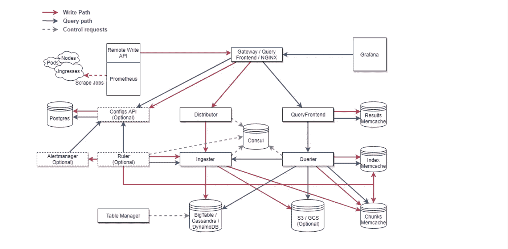
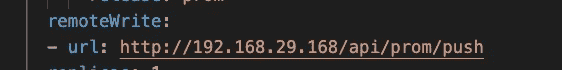
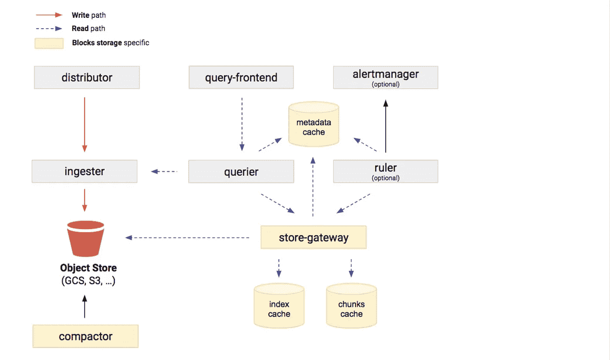

# 深入探究皮层指标—第一部分

> 原文：<https://medium.com/nerd-for-tech/deep-dive-into-cortex-part-i-c228e01f8c58?source=collection_archive---------1----------------------->

深入探究 Cortex Metrics.io 第一部分

您的应用程序运行在 Kubernetes 上吗？它是高度可扩展的吗？你对它的工作方式满意吗？等等，你是怎么监控他们的？啊，普罗米修斯对吧？太棒了，您有没有想过您的 Prometheus 集群的可伸缩性和高可用性如何？在此之前，这里有一封来自你老板的邮件，要求你找出你的网站在去年圣诞节收到的 http_requests 的数量，或者让我们把它变成印度风格。你的老板想知道上一个 Sankranthi(一年前)访问过你的网站的客户数量(http_requests 总数)。现在你试着进入你的普罗米修斯/格拉夫纳服务器。您刚刚意识到没有找到度量标准。你现在怎么跟老板说？在这种情况出现之前，让我们试着用大脑皮层来解决这个问题。Cortex 是一个 [CNCF](https://cncf.io/) 孵化项目，为 Prometheus 提供横向可扩展、高度可用的多租户长期存储。Cortex 主要用作 Prometheus 的[远程写](https://prometheus.io/docs/operating/configuration/#remote_write)目的地，公开 Prometheus 兼容的查询 API。如 Cortex [文档](https://cortexmetrics.io/docs/)中所述

*   **横向可扩展:** Cortex 可以跨一个集群中的多台机器运行，超过单台机器的吞吐量和存储量。这使您能够将指标从多个 Prometheus 服务器发送到单个 Cortex 集群，并在一个位置对所有数据运行“全局聚合”查询。
*   **高可用:**在集群中运行时，Cortex 可以在机器之间复制数据。这使您能够在机器出现故障时保持图表中的空白。
*   **多租户:** Cortex 可以在单个集群中隔离来自多个不同独立 Prometheus 源的数据和查询，允许不可信方共享同一个集群。
*   **长期存储:** Cortex 支持 S3、GCS、Swift 和微软 Azure 长期存储指标数据。这使您能够将数据存储得比任何一台机器的寿命都长，并将这些数据用于长期容量规划。

图片来源:皮质

# 整个故事是关于什么的？(TLDR)

1.  了解皮质成分。
2.  使用 Cortex、Prometheus Operator 和 AWS S3(对象存储)实现 HA-Prometheus。- [第二部分](https://pavan1999-kumar.medium.com/deep-dive-into-cortex-metrics-part-ii-666f74cb781a)

# 故事资源

1.  GitHub 链接:[https://github.com/pavan-kumar-99/medium-manifests](https://github.com/pavan-kumar-99/medium-manifests)
2.  GitHub 分支:[皮层](https://github.com/pavan-kumar-99/medium-manifests/tree/cortex)

## 了解 Cortex 组件

在本文的第一部分，让我们从理解大脑皮层中存在的组件开始。在本文的第二部分中，我们将致力于构建一个 cortex 集群。所以让我们用一张来自 Cortex 官方网站的非常有用的架构图来详细解开每个组件的神秘感，了解它们的用法。

皮质建筑

## a)普罗米修斯

Prometheus 实例负责使用 Prometheus 远程写入 API 从各种目标抓取样本并将其推送到 Cortex。Cortex 要求每个 HTTP 请求都带有一个报头，指定请求的租户 ID(默认情况下使用字符串 fake)。请求认证和授权由外部反向代理处理。

用于远程推送的普罗米修斯配置

**b)块存储**

块存储是基于[普罗米修斯 TSDB](https://prometheus.io/docs/prometheus/latest/storage/) 的 Cortex 存储引擎:它将每个租户的时间序列存储到他们自己的 TSDB 中，后者将他们的序列写出到磁盘块中(默认为 2h 块范围周期)。数据块存储支持的后端包括:

*   [亚马逊 S3](https://aws.amazon.com/s3)
*   [谷歌云存储](https://cloud.google.com/storage/)
*   [微软 Azure 存储](https://azure.microsoft.com/en-us/services/storage/)
*   [OpenStack Swift](https://wiki.openstack.org/wiki/Swift) (实验性)
*   [本地文件系统](https://thanos.io/storage.md/#filesystem)(仅单节点)

存储流架构

b . 1)[**store-gateway**](https://cortexmetrics.io/docs/blocks-storage/store-gateway/)负责查询块，由[查询者](https://cortexmetrics.io/docs/blocks-storage/querier/)在查询时使用。运行块存储时需要存储网关。

b . 2)[**压缩器**](https://cortexmetrics.io/docs/blocks-storage/compactor/) 负责将较小的块合并和重复数据删除为较大的块，以减少给定租户的长期存储中存储的块的数量，并更有效地查询它们。它还保持[桶索引](https://cortexmetrics.io/docs/blocks-storage/bucket-index/)更新，因此，它是一个必需的组件。

## c)分销商

**经销商**服务负责处理来自 Prometheus 的样品。这是系列样品写入路径的第一站。一旦分销商收到来自 Prometheus 的样本，将验证每个样本的正确性，并确保其在配置的租户限制范围内，如果特定租户的限制未被覆盖，则返回默认限制。然后，有效样本被分成批次，并行发送到多个[吸入器](https://cortexmetrics.io/docs/architecture/#ingester)。分销商是无状态的，可以根据需要扩大和缩小规模。

## c)饮食

**ingester** 服务负责将传入的序列写入写入路径上的[长期存储后端](https://cortexmetrics.io/docs/architecture/#storage)，并返回内存中的序列样本以供读取路径上的查询。

传入的序列不会立即写入存储，而是保留在内存中，并定期刷新到存储(默认情况下，块存储 12 小时，块存储 2 小时)。由于这个原因，[查询程序](https://cortexmetrics.io/docs/architecture/#querier)可能需要在读取路径上执行查询时，从吸入器和长期存储器中提取样本。吸入器是半状态的。

## 奎利尔

query er 服务使用 PromQL 查询语言处理查询。

查询程序从吸入器和长期存储器中获取系列样本:吸入器保存尚未刷新到长期存储器中的内存系列。由于复制因素，查询者可能会收到重复的样本；为了解决这个问题，对于给定的时间序列，查询程序在内部使用相同的时间戳对个样本进行重复数据删除。

查询程序是无状态的，可以根据需要伸缩。

## e)查询前端

**查询前端**是一个**可选服务**，提供查询者的 API 端点，可以用来加速读取路径。当查询前端就绪时，传入的查询请求应该被定向到查询前端，而不是查询者。为了执行实际的查询，集群中仍然需要 querier 服务。

## f)标尺

**标尺**是一个**可选服务**,执行 PromQL 查询来记录规则和警报。统治者需要一个数据库来存储每个租户的记录规则和警报。

## g)报警管理器

**alertmanager** 是一个**可选服务**，负责接受来自 [ruler](https://cortexmetrics.io/docs/architecture/#ruler) 的警报通知，对其进行去重和分组，并将其路由到正确的通知通道，如 email、PagerDuty 或 OpsGenie。

## 高可用性跟踪器

分配器具有一个**高可用性(HA)跟踪器**。启用后，分发服务器会对来自冗余 Prometheus 服务器的传入样本进行重复数据删除。这允许您拥有相同 Prometheus 服务器的多个 HA 副本，将相同的系列写入 Cortex，然后在 Cortex distributor 中对这些系列进行重复数据删除。

HA Tracker 需要一个键值(KV)存储来协调当前选择的副本。经销商将只接受来自现任领导的样品。默认情况下，带有一个或没有标签(副本和集群的标签)的样本将被接受，并且永远不会进行重复数据删除。

HA tracker 支持的 KV 存储有:

*   [领事](https://www.consul.io/)
*   [Etcd](https://etcd.io/)

# 结论

这些是大脑皮层中存在的各种成分。在本文的第二部分中，我已经解释了如何建立一个 HA-Prometheus，对 cortex 实例进行远程写入，然后 cortex 将其推送到对象存储进行保留(S3 桶)。

直到下一次…..

# 被推荐的

 [## 深入探究皮层指标第二部分

### 深入探究 Cortex Metrics.io 第二部分

pavan1999-kumar.medium.com](https://pavan1999-kumar.medium.com/deep-dive-into-cortex-metrics-part-ii-666f74cb781a)  [## Kubernetes 集群自动缩放器正在运行

### 使用 Kubernetes 集群自动缩放器有效节约成本

medium.com](/nerd-for-tech/kubernetes-cluster-autoscaler-in-action-6172a023f542)  [## 使用 AWS Spot 实例在 EKS 上运行 Apache Spark

### 通过 AWS Spot 实例为 EKS 上的 Apache Spark 工作负载有效节约成本

medium.com](/nerd-for-tech/running-apache-spark-on-eks-with-aws-spot-instances-f8ce91d319b9)  [## 使用证书管理器在 Kubernetes 中免费提供自动 SSL 证书

### 使用证书管理器获得免费的自动 SSL 证书，让我们加密

medium.com](/nerd-for-tech/free-and-automatic-ssl-certificates-in-kubernetes-using-cert-manager-6fb65ac63d5)