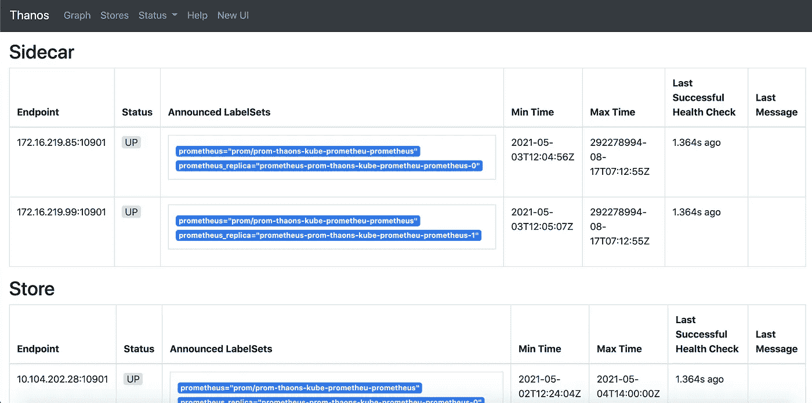
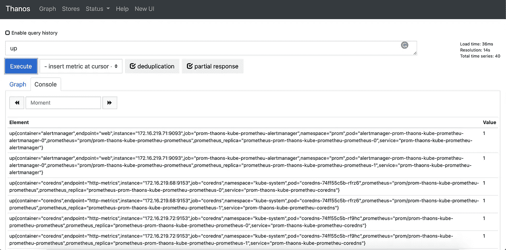
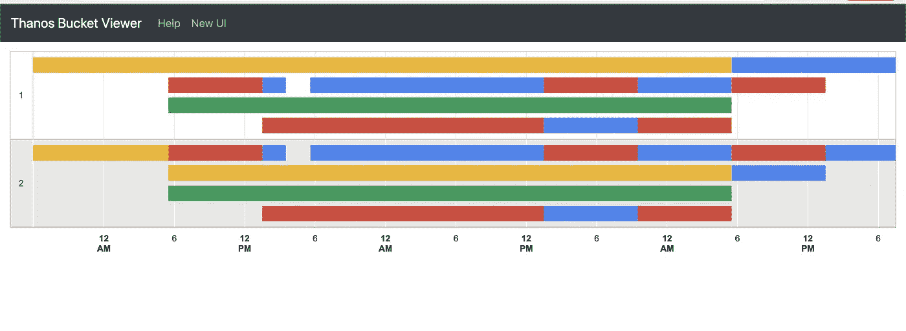

# 深入灭霸——第一部分

> 原文：<https://medium.com/nerd-for-tech/deep-dive-into-thanos-part-i-f72ecba39f76?source=collection_archive---------1----------------------->

使用灭霸和普罗米修斯操作员监控 Kubernetes 的工作负载

您的应用程序运行在 Kubernetes 上吗？它是高度可扩展的吗？你对它的工作方式满意吗？等等，你是怎么监控他们的？啊，普罗米修斯对吧？太棒了，您有没有想过您的 Prometheus 集群的可伸缩性和高可用性如何？在此之前，这里有一封来自你老板的邮件，要求你找出你的网站在去年圣诞节收到的 http_requests 的数量，或者让我们把它变成印度风格。你的老板想知道上一个 Sankranthi(一年前)访问过你的网站的客户数量(http_requests 总数)。现在你试着进入你的普罗米修斯/格拉夫纳服务器。您刚刚意识到没有找到度量标准。你现在怎么跟老板说？在这种情况真正出现之前，让我们尝试使用**来解决这个问题。灭霸是一种工具，用于设置具有长期存储能力的高可用性 Prometheus。灭霸是开源的，是 **CNCF 孵化项目**。灭霸的特色是**

1.  **在 GCS、S3、Azure Blob、Swift 和 Tencent COS 等受支持的对象存储中无限制保留 Prometheus 指标。**
2.  **全局查询视图帮助我们查看跨各种名称空间和各种集群产生的多个 Prometheus 实例的指标。**
3.  **它与您现有的监控工具兼容，如 Prometheus 和 Grafana。**
4.  **在查询较大的时间范围或配置复杂的保留策略时，对历史数据进行缩减采样可以大幅提高查询速度。**

****

**图片来源[灭霸网站](https://thanos.io/)**

# **整个故事是关于什么的？(TLDR)**

1.  **了解灭霸组件。**
2.  **用灭霸、普罗米修斯操作符和 GCS(对象存储)实现 HA-Prometheus。**

# **先决条件**

1.  **对普罗米修斯的基本了解。**

# **故事资源**

1.  **GitHub 链接:[https://github.com/pavan-kumar-99/medium-manifests](https://github.com/pavan-kumar-99/medium-manifests)**
2.  **GitHub 分支: [thanos](https://github.com/pavan-kumar-99/medium-manifests/tree/thanos)**

## **了解灭霸组件**

**开始之前，让我们先详细了解一下灭霸的组件。当我最初试图研究灭霸时，我真的很难理解灭霸是如何运作的，灭霸要完全发挥作用需要哪些组成部分，以及每个组成部分的作用。因此，让我们通过灭霸官方网站上的一个非常有用的架构图来详细解释每个组件并理解它们的用法。**

****

**灭霸建筑**

****a)灭霸边车****

**灭霸边车被部署为普罗米修斯舱的边车集装箱。[ **边车容器**是应该与 pod 中的主容器一起运行的容器]。这是与你的对象存储交互的组件之一(比如 S3、GCS、Azure Blob 等)。它负责将 TSBD 块上传到对象存储器。普罗米修斯每两小时生产的积木由灭霸边车上传(每两小时一次)到目标存储器。让我给你看一个样本灭霸边车集装箱上传 TSBD 块到 GCS 的日志。**

****b)灭霸查询者/查询者****

**灭霸查询程序是一个无状态组件，它实现了 Prometheus HTTP v1 API 来查询灭霸集群中的数据。它通过 gRPC 协议从底层商店 API 收集评估 PromQL 查询所需的数据。商店可以是实现 gRPC 商店 API 的数据源之一。**

*   **普罗米修斯(灭霸边车通过无头服务发现启用)。**
*   **通过存储网关从 S3、GCS 等对象存储。**
*   **另一个灭霸查询者(可以来自不同的集群)。**

****

**灭霸 Querier UI**

**灭霸·奎尔界面显示了各种商店(通过普罗米修斯边车和来自不同集群的另一个商店发现)。**

****c)灭霸查询前端****

**灭霸查询前端是一个放在灭霸查询器前面的服务，用于改善读取路径。它帮助我们将一个长查询拆分成多个短查询。这有助于更好地并行化查询，也有助于更好地平衡查询的负载。这也有助于缓存查询，并提高较长查询的效率。目前支持内存缓存(FIFO 缓存)和 Memcached。**

****

**灭霸查询前端**

**这与灭霸的查询用户界面非常相似。但是支持查询拆分和查询缓存等功能。**

****d)灭霸商场入口(灭霸商场)****

**灭霸存储网关充当灭霸集群和对象存储之间的 API 网关。这是需要访问对象存储的组件之一。它在对象存储桶中的历史数据之上实现 Store API。它在本地磁盘上保留了关于所有远程块的少量信息，并使其与桶保持同步。**

**灭霸商店网关日志示例**

****e)灭霸压实机****

**众所周知，Prometheus 会定期压缩数据块以提高查询效率。同样，压缩器扫描存储在对象存储中的对象(如 AWS S3、GCS、Azure Blob 等),并在必要时应用压缩。该组件还有助于对数据进行缩减采样，以提高较大数据块的查询效率。**

**默认情况下，一旦压缩了对象，压缩就会运行到完成。要使其无限期运行，请确保添加标记—在运行该压实机时等待。它必须作为单例部署在存储桶上。压缩器通常需要 100–300 GB 的本地数据来处理本地数据。在理想情况下，50–70GB 的数据就足够了，除非您的指标非常大。**

**灭霸压缩日志示例**

****f)灭霸尺****

**统治者根据所选择的查询 API 评估普罗米修斯记录和警报规则。您可以将 Rule 看作一个简化的 Prometheus，它不需要 sidecar，也不进行 PromQL 评估(没有 QueryAPI)。**

****g)灭霸接收****

**灭霸接收实现了普罗米修斯远程写 API。灭霸边车对此是不够的，因为系统总是滞后于街区长度(通常 2 小时)。在此阅读更多关于灭霸接收****。******

******h)灭霸工具******

****与其他灭霸组件相比，灭霸工具是提供附加功能和工具的附加工具。其中一些是****

****1)灭霸工具桶 web:这用于从 Web UI 检查桶块。****

****2)灭霸工具桶 ls:用于列出指定桶中的所有块。****

****3)灭霸工具桶复制:这用于将桶从一个对象存储复制到另一个对象存储。****

********

****灭霸网络存储桶查看器****

****这些是灭霸各个组成部分的细节。在本文的 [***第二部分***](https://pavan1999-kumar.medium.com/deep-dive-into-thanos-part-ii-8f48b8bba132) 中，我们将动手探索灭霸的各个组成部分，并将灭霸与普罗米修斯和格拉法纳结合起来。****

# ****结论****

****这些是灭霸存在的各种成分。在本文的 [***第二部分***](https://pavan1999-kumar.medium.com/deep-dive-into-thanos-part-ii-8f48b8bba132) 中，我已经解释了如何设置一个 HA-Prometheus，用灭霸边车将 TSBD 石块推到 GCS 桶中。我还解释了如何使用 Bitnami 的灭霸掌舵图安装灭霸集群。****

****直到下一次…..****

# ****被推荐的****

**** [## 深入灭霸——第二部分

### 使用灭霸和普罗米修斯操作员监控 Kubernetes 的工作负载

pavan1999-kumar.medium.com](https://pavan1999-kumar.medium.com/deep-dive-into-thanos-part-ii-8f48b8bba132)  [## Kubernetes 中的自动缩放(HPA / VPA)

### 使用垂直 Pod 自动缩放器(VPA)和水平 Pod 自动缩放器(HPA)在 Kubernetes 中自动缩放您的应用程序

medium.com](/nerd-for-tech/autoscaling-in-kubernetes-hpa-vpa-ab61a2177950)  [## 在 Kubernetes 集群中创建自托管 GitHub 运行程序

### 在您自己的 Kubernetes 集群上运行 GitHub 操作

www.techmanyu.com](https://www.techmanyu.com/creating-self-hosted-github-runners-in-a-kubernetes-cluster-fd05560de34a)  [## 使用 GitHub 操作创建 GKE 集群

### 使用 GitHub 动作自动化 Kubernetes 集群创建和引导

medium.com](/nerd-for-tech/creating-a-gke-cluster-with-github-actions-dd34e2de50a6)****