# 深入灭霸——第二部分

> 原文：<https://medium.com/nerd-for-tech/deep-dive-into-thanos-part-ii-8f48b8bba132?source=collection_archive---------0----------------------->

使用灭霸和普罗米修斯操作员监控 Kubernetes 的工作负载

在本文的第一部分[](https://pavan1999-kumar.medium.com/deep-dive-into-thanos-part-i-f72ecba39f76)*中，我们已经了解了灭霸的各种组件及其用例。在第二部分中，我们将使用 GCS ( Google 云存储)配置灭霸，并了解如何使用灭霸将指标保留更长时间。我们还将配置 Grafana 使用灭霸查询前端来可视化来自不同集群(灭霸查询)的图形。*

**

*图片来源:[灭霸网站](https://thanos.io/)*

# *整个故事是关于什么的？(TLDR)*

1.  *使用 Bitnami 舵图安装灭霸。*
2.  *将灭霸配置为使用 GCS 作为其对象存储。*

# *先决条件*

1.  *Kubernetes 集群(可以是本地、AKS、EKS、GKE、Kind)。*
2.  *一个 GCP 账户(将区块推给 GCS)。*

# *故事资源*

1.  *GitHub 链接:[https://github.com/pavan-kumar-99/medium-manifests](https://github.com/pavan-kumar-99/medium-manifests)*
2.  *GitHub 分支: [thanos](https://github.com/pavan-kumar-99/medium-manifests/tree/thanos)*

*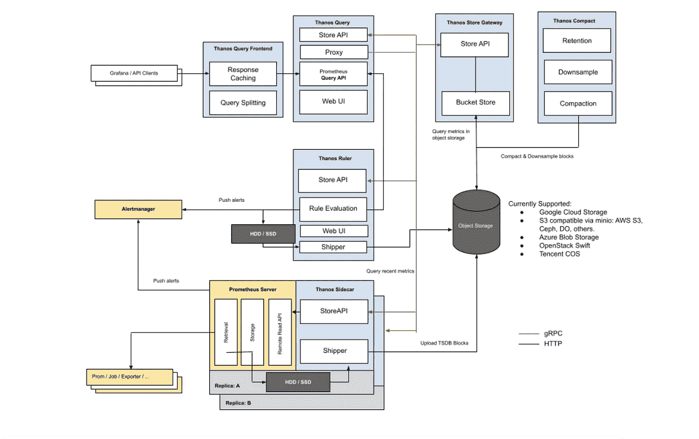*

*图片来源:[灭霸](https://thanos.io/)*

***在 Kubernetes 集群中安装灭霸***

*嗯，在您的 Kubernetes 集群中安装灭霸有多种方法。您可以选择使用**[***kube-thanos***](https://github.com/thanos-io/kube-thanos)来安装它们，通过参考相应组件的灭霸命令来写下您自己的 Kubernetes 清单/舵图，通过 Bitnami 的灭霸舵图来安装它(本文的范围)。在我们安装灭霸集群之前，让我们安装启用了灭霸边车的普罗米修斯。灭霸边车将负责将 TSBD 块推送到对象存储，如 GCS、AWS S3。***

*****用 Prometheus 操作器安装 Prometheus 和 Grafana。*****

***在我们安装 Prometheus 操作员之前，我们必须为 GCP 服务帐户创建一个密码，以便我们的灭霸边车能够与铲斗通信。***

```
***$ git clone [https://github.com/pavan-kumar-99/medium-manifests.git](https://github.com/pavan-kumar-99/medium-manifests.git) \
-b thanos$ cd medium-manifests/***
```

***让我们创建一个名为[thanos-sidecar-secret . YAML](https://gist.github.com/pavan-kumar-99/a73e7ddb64096bbf46c49632ccb301ac)的文件。这将包含关于对象存储类型、GCS 存储桶名称以及用于与 GCP 通信的 GCP 服务帐户的详细信息。一旦文件的值被替换，让我们从文件中创建一个秘密。***

> *****ku bectl create secret generic thanos-GCP-config—from-file = thanos . YAML =**[**thanos-sidecar-secret . YAML**](https://gist.github.com/pavan-kumar-99/a73e7ddb64096bbf46c49632ccb301ac)***

***默认情况下，Prometheus Operator 安装中不启用灭霸。让我们写一个覆盖文件来覆盖默认值并安装灭霸边车。***

```
***$ helm repo add prometheus-community https://prometheus-community.github.io/helm-charts$ helm repo update$ helm install prom-thaons prometheus-community/kube-prometheus-stack -f [prometheus-operator-thanos.yaml](https://gist.github.com/pavan-kumar-99/df4f75f0566a9ff8ae3dcff8220baae2)***
```

***现在，您应该看到 Prometheus、Grafana 和其他组件已经安装完毕。现在让我们检查 thanos-sidecar 集装箱的日志。***

***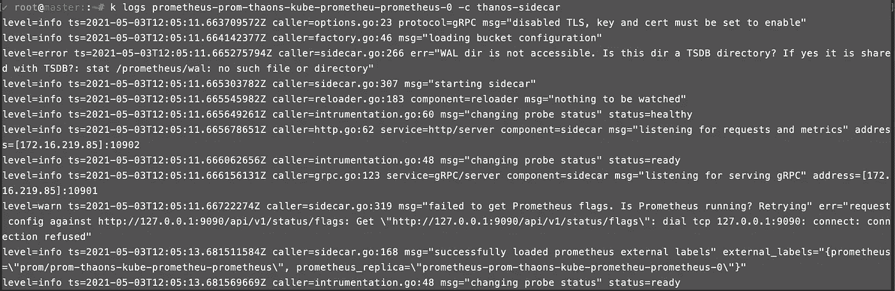***

*****kubectl logs Prometheus-prom-thaons-kube-Prometheus-Prometheus-0-c thanos-sidecar*****

***现在让我们使用 Bitnami 的舵图安装灭霸集群。我已经使用 Bitnami 的 Helm chart 为灭霸集群的安装创建了一个定制的 value.yaml 文件。这个自定义的 values.yaml 文件将有助于简化配置。通过参考完整的 values.yaml 文件 [**在此**](https://github.com/bitnami/charts/blob/master/bitnami/thanos/values.yaml) 随意添加任何其他所需值。***

```
***$ helm repo add bitnami https://charts.bitnami.com/bitnami$ helm repo update$ helm install thanos bitnami/thanos -f thanos-values.yaml*** 
```

***您现在应该看到正在安装灭霸集群组件。所有这些都应该在一段时间内准备好。***

***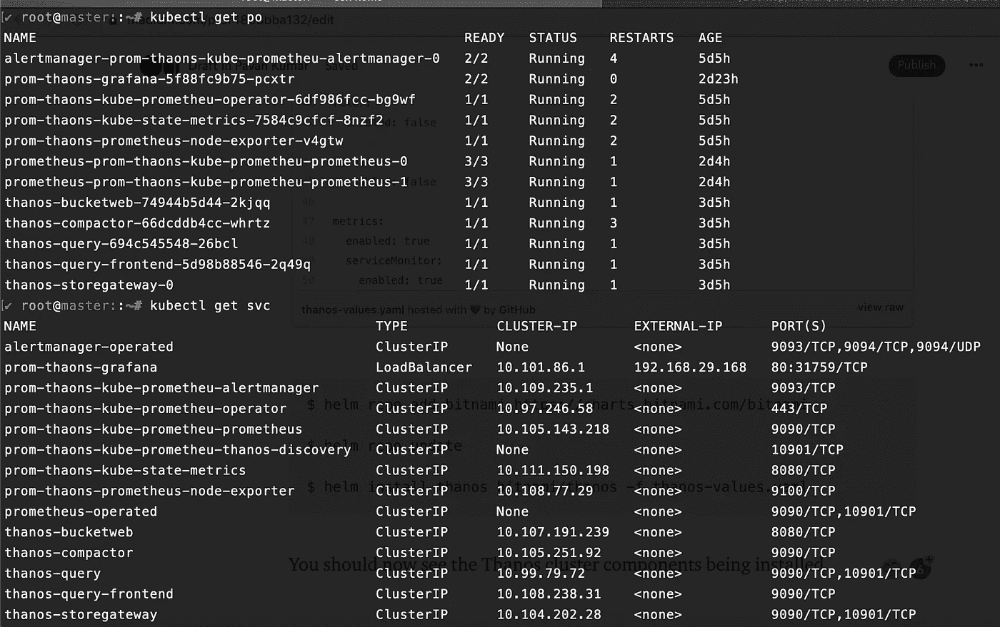***

***灭霸组件***

***没有进一步的原因，让我们通过端口转发来访问 thanos-query-frontend。(请注意，这种类型的安装仅适用于演示/本地目的。在生产中，用户可能希望通过启用了 TLS 的入口控制器来访问它)。***

> *****ku bectl port-forward SVC/thanos-query-frontend 9091:9090—address = 0 . 0 . 0 . 0*****

***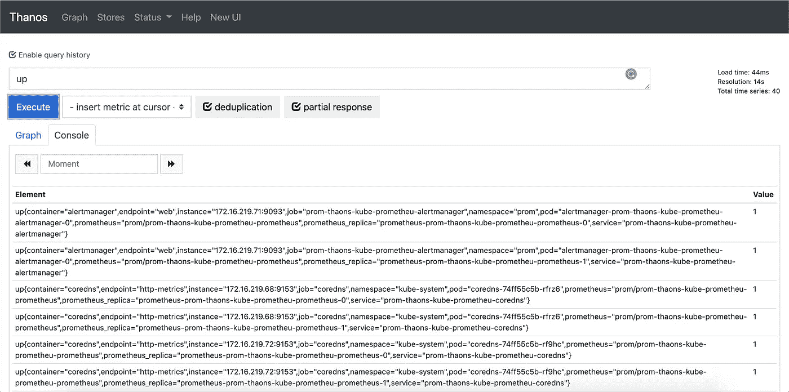***

***灭霸前端查询***

***我将在这里暂停我的博客。再等 4 天，这样我的 TSBD 数据块就会被推入 GCS 存储桶，然后恢复可用数据。***

******

***等待 4 天，以便积累数据。***

***我现在有了过去 4 天的可用数据。现在让我们连接到 Grafana，然后添加灭霸·奎瑞尔作为 Prometheus 源(这可以通过在创建 Grafana 本身时添加数据源 URL 来自动完成。我手动显示这个只是为了更好地理解)。让我从浏览器进入 Grafana。(凭证:管理员/prom-操作员)。***

> *****kubectl 端口转发 SVC/prom-thaons-grafana 8080:80—地址=0.0.0.0*****

***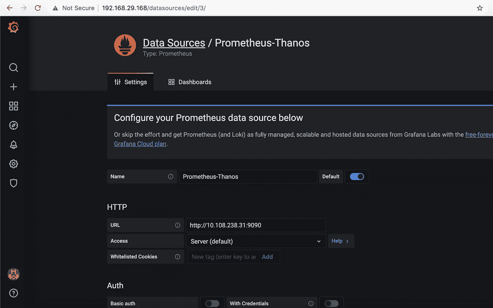***

***Grafana 数据源***

***这里的 URL 是灭霸查询前端的 URL。该 IP 是 **thanos-query-frontend** 服务的集群 IP。IP 可以通过以下方式获得***

> *****✔root @ master::~ # k get SVC thanos-query-frontend*****
> 
> *****NAME TYPE CLUSTER-IP EXTERNAL-IP PORT AGE*****
> 
> *****thanos-query-frontend cluster IP 10 . 108 . 238 . 31<none>9090/TCP 4d 23h*****

***一旦您添加了具有相应端口的 IP，您应该会得到一个弹出窗口，提示数据源正在工作。***

***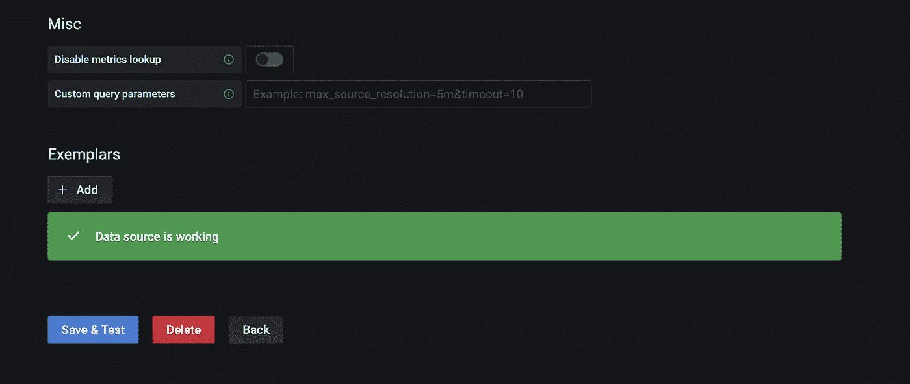***

***添加了 Grafana 数据源***

***默认情况下，当你安装 Grafana 与普罗米修斯运营商，你应该得到一些默认仪表板。这些仪表板监控您的控制面板组件和资源，如集群中的 pod 和网络使用情况。一个这样的仪表板是**计算资源/节点(pod)**。***

***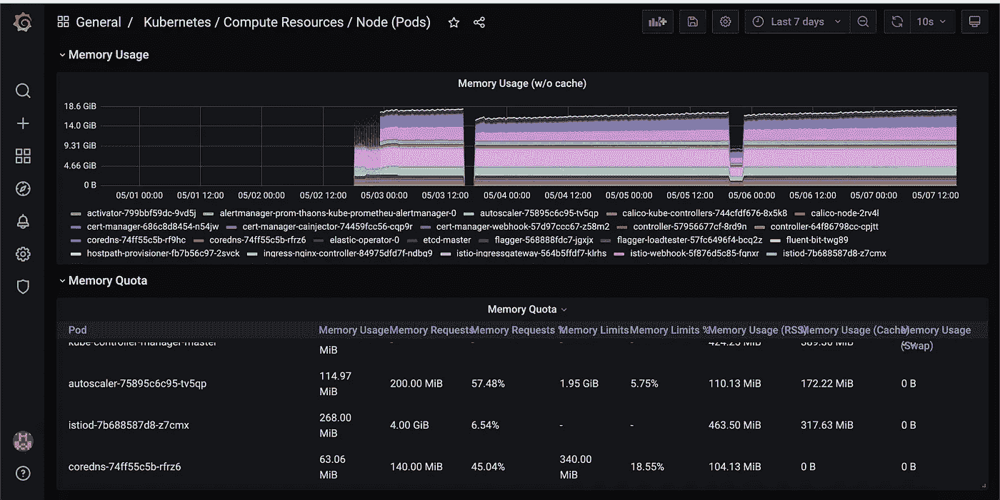***

***显示过去 4 天指标的 Grafana 仪表板***

***现在让我们关闭 Prometheus Pods，以验证过去 4 天的指标是否仍然显示。在此之前，让我们先验证一下过去 5 分钟的指标。我们还可以看到过去五分钟的指标。***

***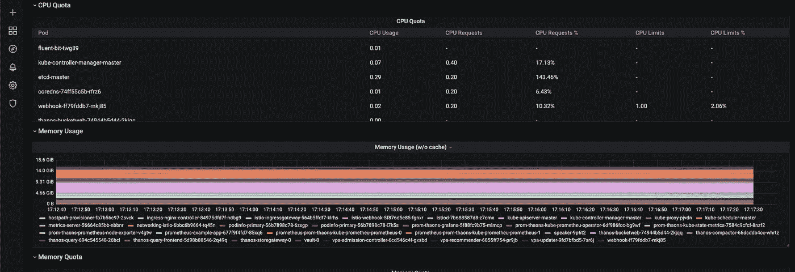***

***过去 5 分钟的指标。***

***我现在将关闭我的 Kubernetes 集群(托管 Kubernetes 集群的虚拟机),并在 5 分钟后返回。当我打开虚拟机时，默认情况下所有的 pod 也将重新启动(重新安排)。***

***我回来了。我现在将打开我的 Kubernetes 集群来验证过去 30 分钟的指标。***

***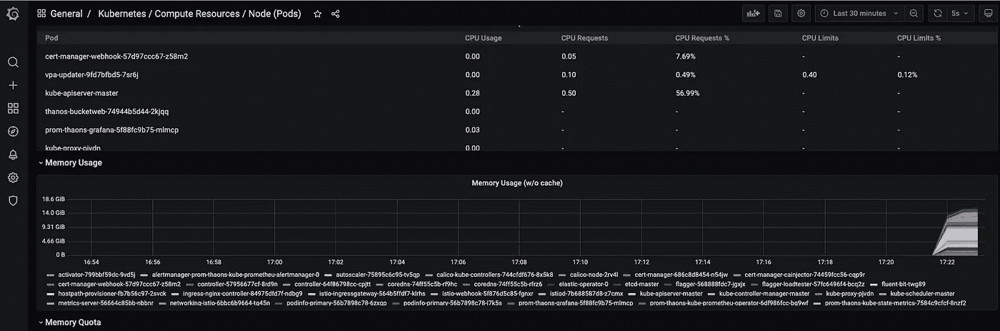***

***普罗米修斯舱重启时数据丢失。***

***但是当 pod 重新启动时，指标发生了什么变化呢？**没错，这就是我想要展示的。虽然我们为 HA 设置了灭霸，但 TSBD 块每 2 小时推一次。**同时，如果 Prometheus pod 重新启动，2 小时内的数据将会丢失。所以我们总是建议为普罗米修斯本身创建一个 PV。现在让我们升级舵图，但是现在让我们也将永久卷添加到我们的 Prometheus 副本中。***

***一旦我执行了头盔升级，我现在可以找到我的卷连接到吊舱。***

> *****头盔升级-I prom-thaons Prometheus-community/kube-Prometheus-stack-f prom-operator . YAML*****

***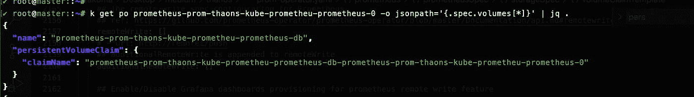***

***普罗米修斯吊舱有聚氯乙烯***

***现在让我重启普罗米修斯舱。***

***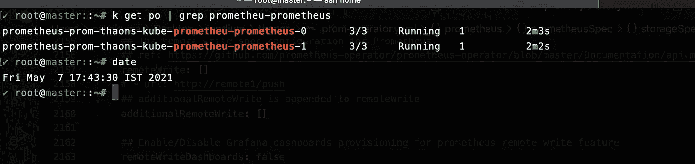***

***重启了豆荚***

***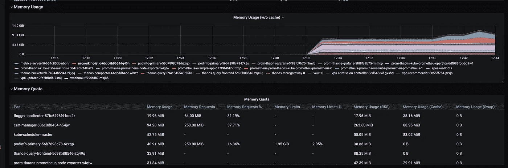***

***数据保留在永久卷中***

***现在让我们检查一下 GCS 中存储的数据块。***

***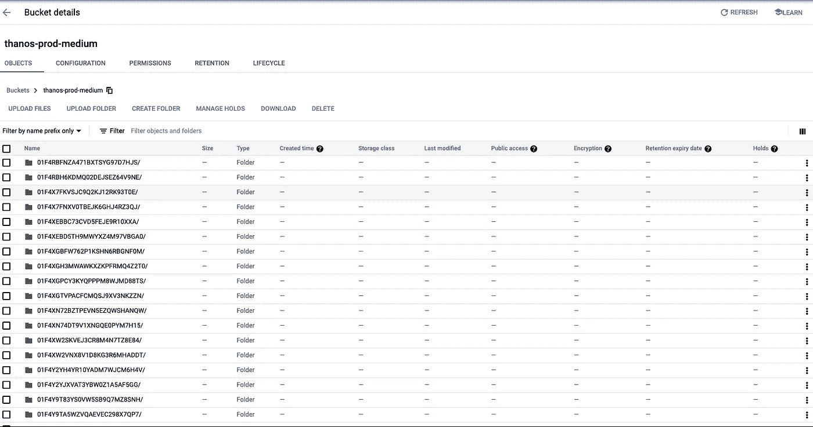***

***灭霸·边车上传的 TSBD 街区***

***我们还可以利用作为灭霸安装的一部分安装的 bucketweb 工具，从 Web UI 检查 bucket 块。***

> *****kubectl 端口转发 svc/thanos-bucketweb 8080:8080 —地址=0.0.0.0*****

***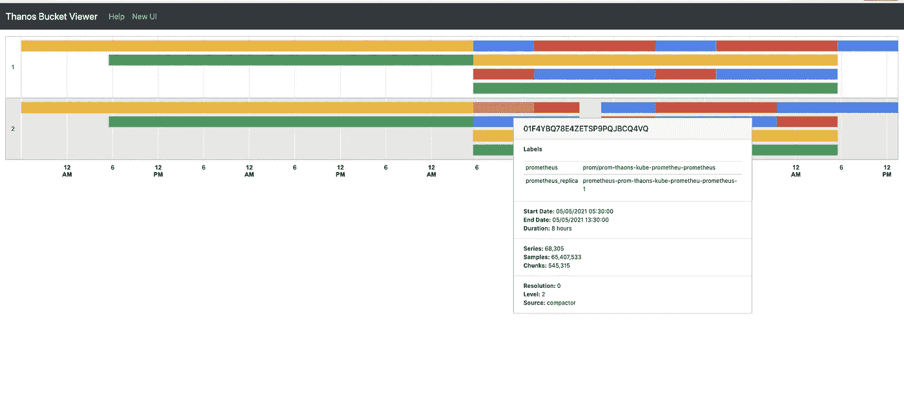***

***灭霸桶形网***

## ***GKE 工作量标识***

***如果您想使用 GKE 工作负载标识，请遵循此处[指定的步骤](https://github.com/pavan-kumar-99/medium-manifests/blob/thanos/GKE/sa_mapping.sh)，并使用此处[的 helm values.yaml 文件](https://github.com/pavan-kumar-99/medium-manifests/tree/thanos/GKE)。***

***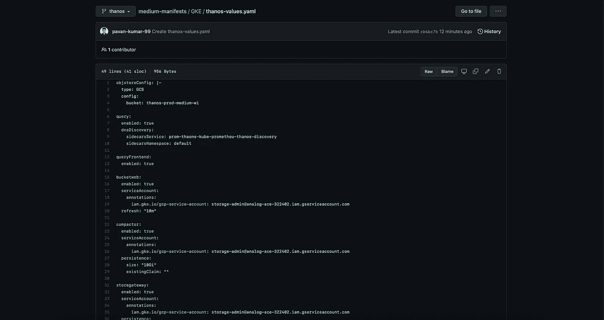***

***灭霸 GKE IAM(工作量身份)***

# ***结论***

***因此，在灭霸和普罗米修斯的帮助下，人们可以建立一个高可用性指标聚合解决方案。虽然有许多其他安装方法来安装灭霸，探索它们也将有助于您了解如何配置每个组件。最初，我很难理解灭霸的每一个组成部分。但是单独探索每一个部分让我对灭霸有了更深刻的了解。欢迎在评论区分享你和灭霸的经历。***

***直到下一次…..***

# ***被推荐的***

***[](/nerd-for-tech/introduction-to-crossplane-2f873ae0f9f3) [## 交叉平面简介

### 如何使用 Kubernetes 清单和 Crossplane 在云上创建任何资源。

medium.com](/nerd-for-tech/introduction-to-crossplane-2f873ae0f9f3) [](https://faun.pub/introduction-to-bitnami-sealed-secrets-bb5ae74d9a25) [## 比特纳米密封秘密介绍

### 如何使用 Sealed Secrets 和 Kubese 在 GitHub 中存储您的秘密

faun.pub](https://faun.pub/introduction-to-bitnami-sealed-secrets-bb5ae74d9a25) [](https://www.techmanyu.com/kubernetes-security-with-kube-bench-and-kube-hunter-6765bf44ebc6) [## Kubernetes 安全与 Kube-bench 和 Kube-hunter

### 使用 Kube-bench 和 Kube-hunter 在 Kubernetes 集群中进行安全检查

www.techmanyu.com](https://www.techmanyu.com/kubernetes-security-with-kube-bench-and-kube-hunter-6765bf44ebc6)***