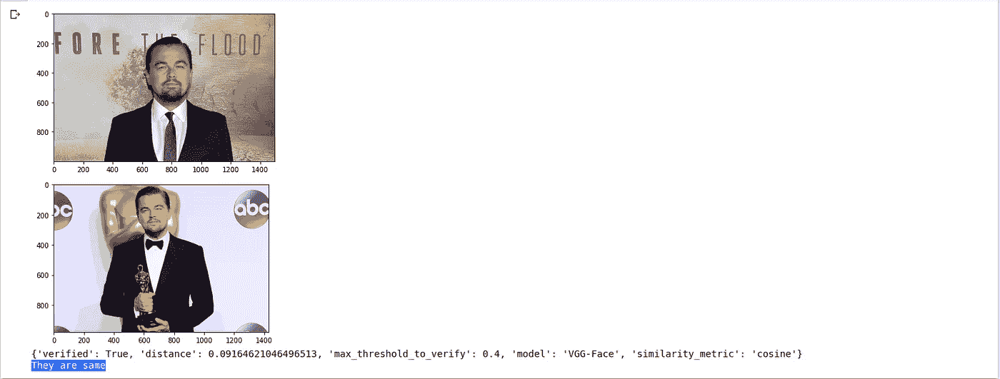
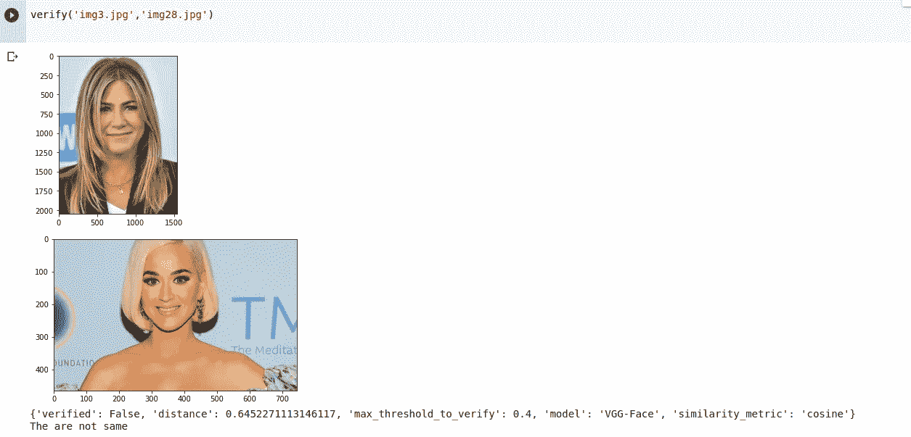
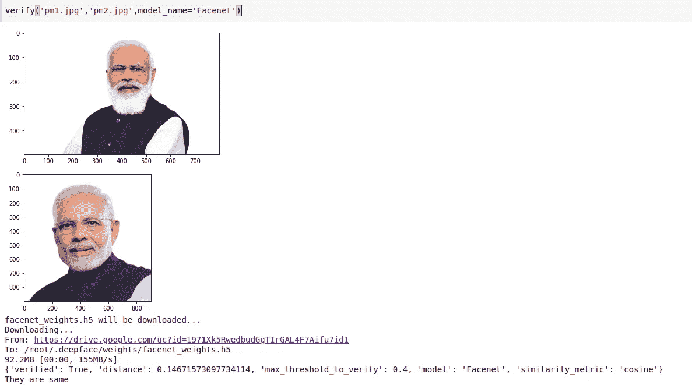
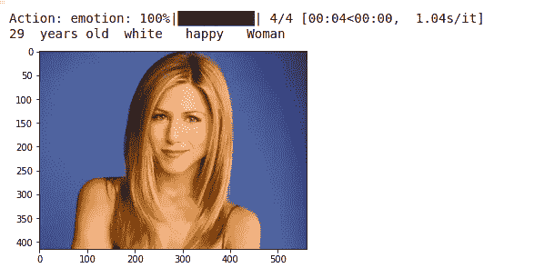

# Python 中的深度人脸识别

> 原文：<https://medium.com/nerd-for-tech/deep-face-recognition-in-python-41522fb47028?source=collection_archive---------2----------------------->


阿曼达·达尔比约恩在 [Unsplash](https://unsplash.com?utm_source=medium&utm_medium=referral) 上拍摄的照片

*   **什么是深沉的脸？**

Deepface 是一个针对 python 的轻量级人脸识别和面部属性分析(年龄、性别、情感和种族)框架。

这是一个混合人脸识别框架，包含了最先进的模型:VGG 脸，谷歌脸网，开放脸，脸书脸，DeepID，ArcFace 和 Dlib。库主要基于 **Keras** 和 **TensorFlow** 。

*   **使用的模块:**

1.  深脸
2.  OpenCV -(读取输入图像)
3.  Matplotlib -(用于可视化)

**我们来看看实现:**

*   首先，您需要将必备库安装到您的 python 环境中

```
pip install deepface
pip install opencv-python
pip install matplotlib
```

*   安装后，让我们导入已安装的库

```
from deepface import DeepFace
import cv2
import matplotlib.pyplot as plt
```

*   现在创建一个函数来读取和验证图像

```
def verify(img1_path,img2_path):
    img1= cv2.imread(img1_path)
    img2= cv2.imread(img2_path)

    plt.imshow(img1[:,:,::-1])
    plt.show()
    plt.imshow(img2[:,:,::-1])
    plt.show() output = DeepFace.verify(img1_path,img2_path)
    print(output)
    verification = output['verified'] if verification:
       print('They are same')
    else:
       print('The are not same')
```

*   让我们调用验证函数

```
verify('img36.jpg','img37.jpg')
```

*   以下是输出:



输出结果

在上面的输出结果中，你可以看到两幅图像是相同的，我们的模型也预测相同。

*   现在让我们看看另一个例子，两个不同的图像。



他们不一样

*   正如我在上面已经提到，Deepface 模型支持几种人脸识别模型。默认情况下，它使用 VGG 脸模型。现在让我们看看另一个模型及其结果:

```
def verify(img1_path,img2_path,model_name):
    img1= cv2.imread(img1_path)
    img2= cv2.imread(img2_path) plt.imshow(img1[:,:,::-1])
    plt.show()
    plt.imshow(img2[:,:,::-1])
    plt.show()
   output=DeepFace.verify(img1_path,img2_path,model_name=model_name) print(output) verification = output['verified']

   if verification:
      print('They are same')
   else:
     print('The are not same')
```

*   以下是 **Facenet 模型**的输出结果



面网模型

**注意:**在这里你可以尝试不同的型号，你可以看到精度差异。

*   **使用 DeepFace 进行面部属性分析**

使用 DeepFace 你还可以做人脸的分析，下面用一个例子来了解一下。

```
from deepface import DeepFaceimg = cv2.imread('img12.jpg')imgplot = plt.imshow(img)obj = DeepFace.analyze(img_path = "img12.jpg", actions = ['age', 'gender', 'race', 'emotion']) print(obj["age"]," years old ",obj["dominant_race"]," ",obj["dominant_emotion"]," ", obj["gender"])
```



面部分析

如果你想了解更多关于 Deepface 的信息，你可以探索 deepface github repo。

[](https://github.com/serengil/deepface) [## serengil/deepface

### Deepface 是一个轻量级的人脸识别和面部属性分析(年龄，性别，情感和种族)框架…

github.com](https://github.com/serengil/deepface) 

感谢您的阅读。试试吧，分享你的宝贵建议。感谢您的诚实反馈！