# 深度学习——基础

> 原文：<https://medium.com/nerd-for-tech/deep-learning-a-foundation-645b612f4e54?source=collection_archive---------13----------------------->

深度学习背后的整个想法是让计算机人工模拟生物自然智能，所以让我们对生物神经元如何工作有一个大致的了解。

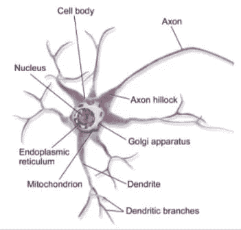

图 1:生物神经元

*   这是生物神经元，这里要注意的是各个部分都与细胞核相连，轴突负责从细胞核输出的部分。

.

.

.

.

图 2:核心

*   这是一个生物学的例子，树突带来输入信号，然后将信号传递给细胞核，在那里进行数学计算，轴突将输出传递给另一个树突。
*   这是生物神经元模型的基本思想，在感知器发挥作用的地方，它被转换成数学神经元。
*   感知器是神经网络的一种形式，由弗兰克·T2·罗森布拉特于 1958 年发明。他当时看到了巨大的潜力，并引用*的话说，“感知机最终可能能够学习、决策和翻译语言”。一个很好的例子是谷歌翻译使用神经网络来翻译语言。*
*   1969 年马文·明斯基和西蒙·派珀特出版了他们的书*。他们在书中提出的主要缺点是计算能力，回到 1970 年，计算能力非常低，所以很难建立多层神经网络。流行起来需要时间。*
*   *下一个问题来了*‘既然我们有 ML，为什么我们还需要 DL？’**

*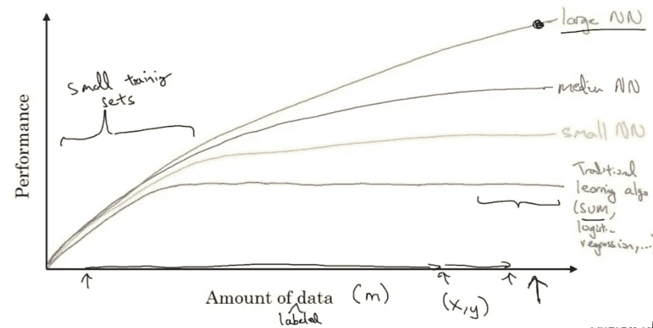*

*图 3:ML 和 DL 的比较。*

*   *机器学习性能在特定数据量时会饱和，而深度学习性能随着数据量呈指数增长。*
*   *对于小的训练集，性能是相同的。这个时代充斥着数据，所以 DL 在从数据中获取洞察方面起着至关重要的作用。*
*   *现在我们可以把生物神经元替换成数学单位。*

*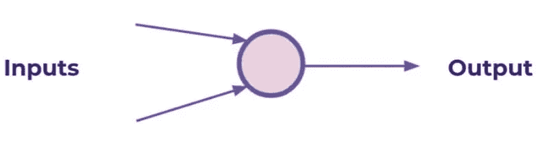*

*图 4:单一感知器*

*   *这是单个神经元，它有两个输入特征和一个输出。*

*.*

*.*

**

*图 5:单一感知器的工作。*

*   *权重与输入特征相乘，因此我们可以优化权重值以减少损失。*
*   *该项增加了一个偏差，以固定输出的最小值。通过梯度下降找到权重和偏差的优化值，它可以是负值也可以是正值。*
*   *神经元执行线性计算和激活功能，该输出作为另一个神经元的输入传递。*

*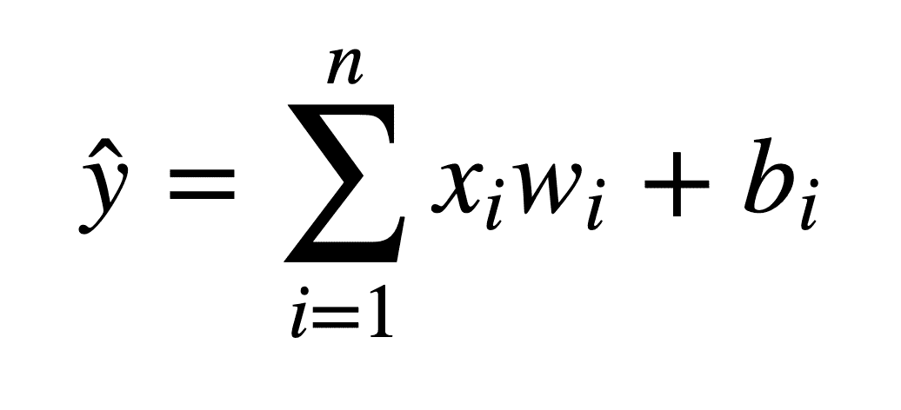*

*图 6:线性函数的通用公式。*

*   *单个神经元不足以学习复杂的系统。幸运的是，我们可以扩展单个感知器的思想，创建一个多层感知器模型。*
*   ***神经网络**是一种模仿生物网络的机器学习架构。*
*   ***深度学习**是训练超过一个隐层的神经网络的过程。*

*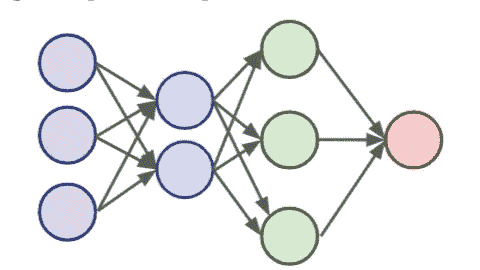*

*图 7:多层感知器*

*   *为了建立一个感知器网络，我们可以使用一个**多层感知器模型**连接多层感知器。*
*   *第一层是**输入层**，它直接接受真实数据值。*
*   *最后一层是**输出层**，它可以是多个神经元，具体取决于多标签预测。*
*   *输入层和输出层之间的层是**隐藏层。**隐藏层很难解释，因为它们具有高度的互连性，并且远离已知的输入或输出值。如果神经网络包含 2 个或更多隐藏层，则成为**“深度神经网络”**。*

*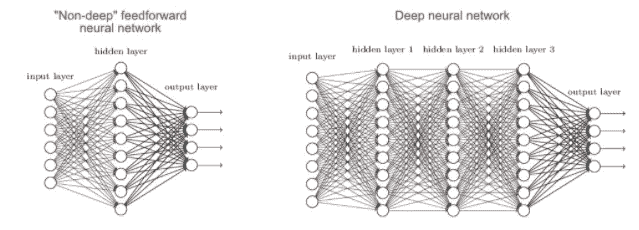*

*图 8:非深度神经网络 vs 深度神经网络。*

*   *我们看到感知器本身包含一个非常简单的求和函数 f(x)。然而，对于大多数用例来说，这是没有用的，我们希望能够为我们的输出值设置约束，尤其是在分类任务中。*
*   *让所有输出落在 0 和 1 之间将是有用的。这就是**激活功能**发挥作用的地方。*

## *激活功能:*

*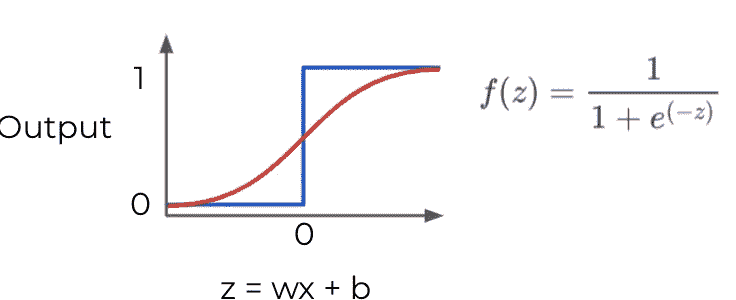*

*图 9: Sigmoid 函数*

*   *Sigmoid 函数或 Logit 函数给出介于 0 和 1 之间的值。它的截止点是 0.5。*
*   *问题是。值> 0.5 为 1，概率。值< 0.5 is 0.*

*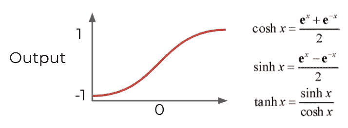*

*Figure 10 : Tanh function*

*   *Hyperbolic Tanget function or Tanh function gives the output between -1 and 1 instead of 0 to 1.*
*   *The major drawback with Tanh and sigmoid function it get saturated at particular point.*
*   *During back propagation the derivative value becomes smaller, which slows down the process of gradient descent optimisation. To overcome this we have some other activation function like **ReLU** 和**泄漏 ReLU** 。*

*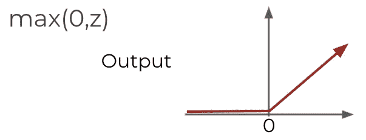*

*图 11: ReLU*

*   *整流线性单元是相对简单的单元。*
*   *它给出的输出为*

*如果值 Z ≤ 0，则为 0*

*如果值 Z > 0，则返回 Z。*

*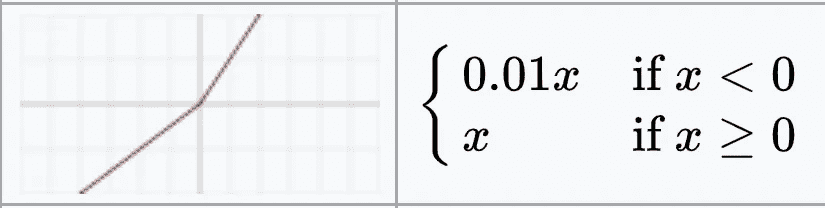*

*图 12:泄漏的 ReLU*

*.*

*   *Leaky- ReLU 类似于 ReLU，只是值小于或等于零，它给出的输出为 0.01*x，从而加快了优化过程。*
*   *ReLu 和 Leaky-ReLu 已经被发现具有非常好的性能，特别是在处理**消失梯度**的问题时，这种问题是由于 sigmoid 和 tanh 的导数值很小而导致的，这会减慢优化过程。*

***成本函数:***

*   *神经网络接受输入，将它们乘以权重，并向它们添加偏差。然后，这个结果通过一个激活函数，该函数在所有层的末尾导致一些输出。*
*   *我们需要获取网络的估计输出，然后将它们与标签的真实值进行比较。*
*   *成本函数必须是平均值，因此它可以输出单个值。损失函数是为 1 个时期(一个正向传播+一个反向传播)计算的单个值。*

*→ y 代表真实值*

*→ a 代表神经元的预测*

*→ w*x + b = z*

*→将 z 传递给激活函数σ(z) = a*

*   *我们简单地计算实际值 y(x)与预测值 a(x)之间的差值。*

*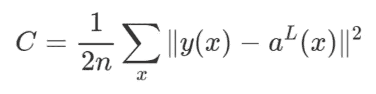*

*图 13:平方成本函数。*

*   *平方这为我们做了 2 件有用的事情，让一切保持积极，并且**惩罚**大错误！*

**

*图 14:带参数的多层网络。*

*   *在一个真实的例子中，这意味着我们有一些成本函数 **C** 依赖大量的权重！ **C(w1，w2，w3，…。wn)***
*   *我们如何计算出哪种重量使我们的成本最低？*
*   ***梯度下降**用于寻找具有低成本函数的权重和偏差的优化值。*
*   *我们在插图中展示的学习率是恒定的(每个步长都是相等的)。但是我们可以聪明地在前进的过程中调整我们的步长*
*   *我们可以从更大的步长开始，然后当我们意识到斜率越来越接近零时，我们可以变得更小。这被称为**自适应梯度下降。***

*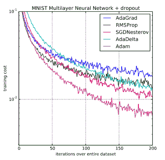*

*图 15:梯度下降性能。*

*   *Adam 与其他梯度下降算法。*
*   *对于二元分类，我们使用二元交叉熵。*

*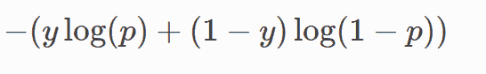*

*图 16:二元交叉熵。*

*   *对于大于 2 的类，我们使用分类交叉熵。*

*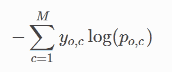*

*图 17:分类交叉熵。*

*   *一旦我们得到了成本/损失值，我们实际上如何回过头来调整我们的权重和偏差呢？这是**反向传播。***

***关于衍生品的直觉:***

*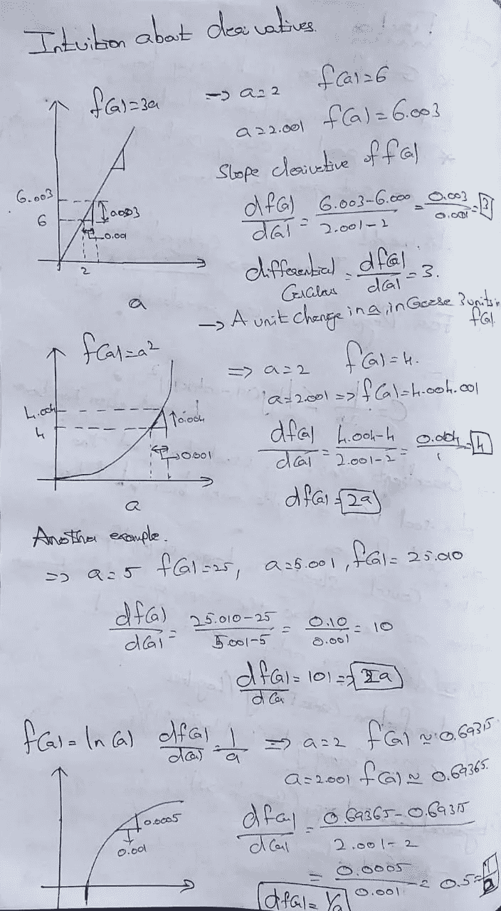*

*图 18:导数计算*

*   *当我们计算函数的导数时，它给出了输入的变化如何影响输出的值。*

***反向传播**:*

*   *我们想知道成本函数结果如何相对于网络中的权重变化，因此我们可以更新权重以最小化成本函数*

*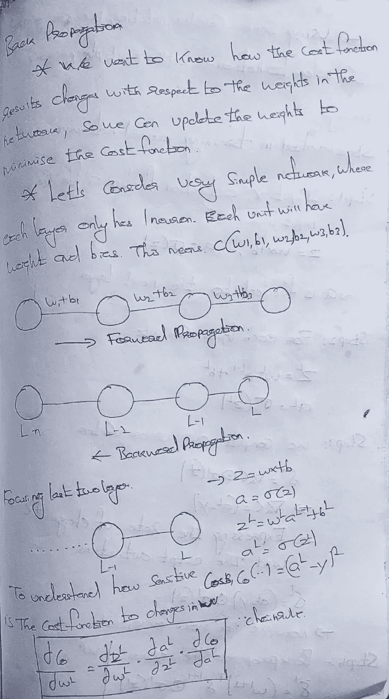***

*图 19:反向传播的步骤*

*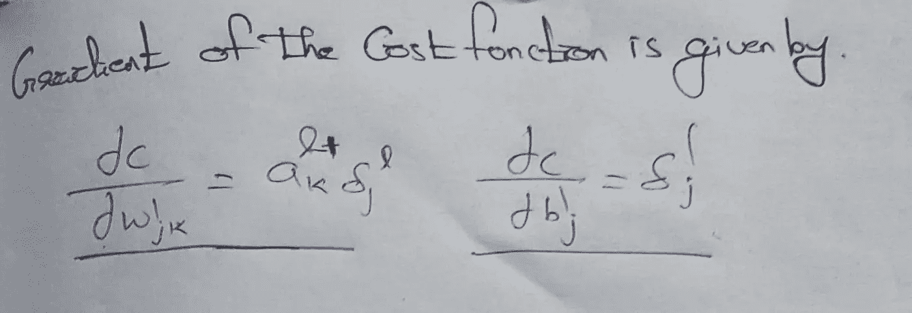*

*图 20:最终导数。*

***逻辑回归的计算图**。*

*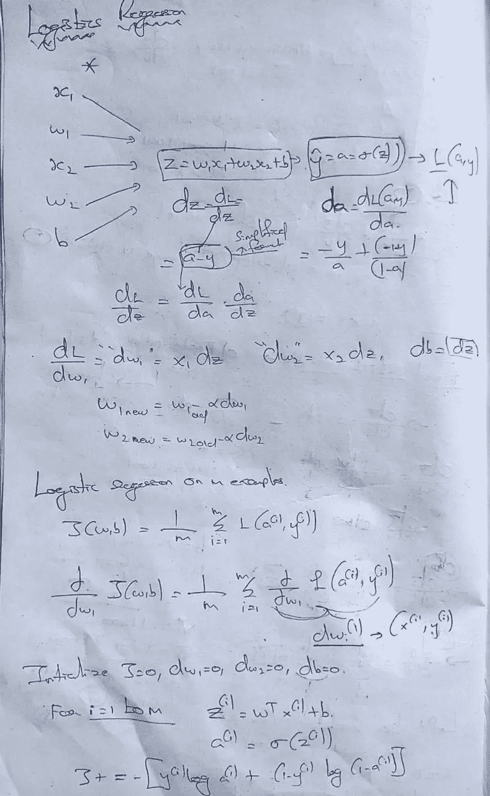*

*图 21:反向传播导数*

*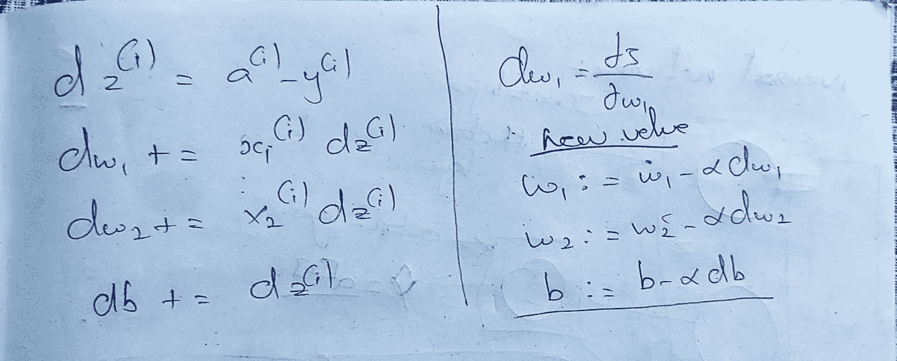*

*图 22:最终导数*

*   *逻辑回归检查损失函数，然后反向传播以分配优化值。*

*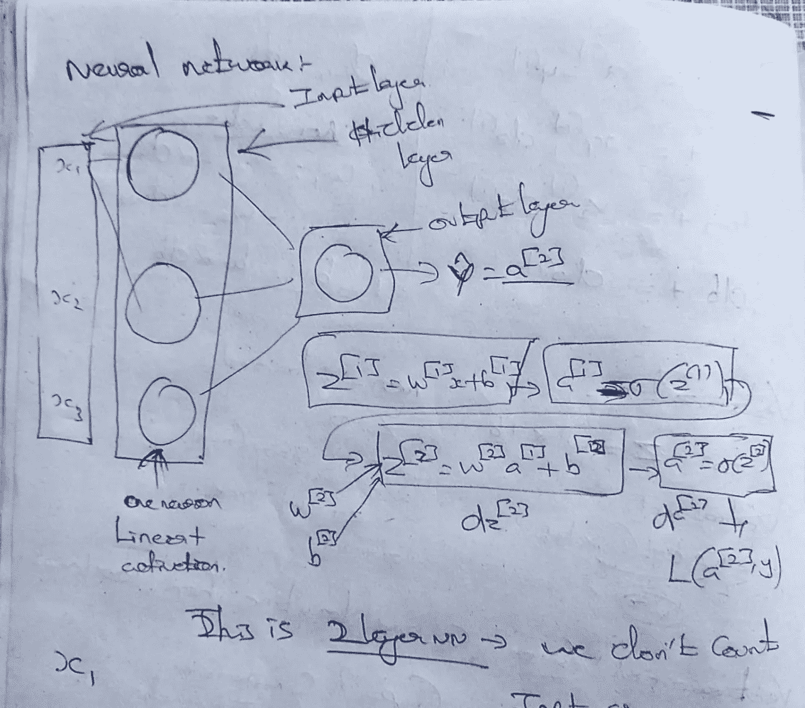*

*图 23:神经网络的计算图。*

*   *每个神经元具有不同的权重和偏差值。*
*   *随机初始化权重和偏差值以加速优化。*

*参考以下内容，了解如何构建基本人工神经网络模型:*

*[https://github . com/rishikumar 04/Deep-Learning/blob/main/Basic % 20 ann . ipynb](https://github.com/Rishikumar04/Deep-Learning/blob/main/Basic%20ANN.ipynb)*

*感谢阅读。希望你对神经网络如何工作有了基本的直觉。*