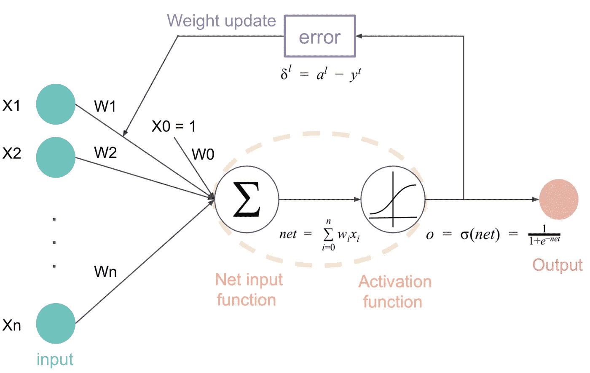
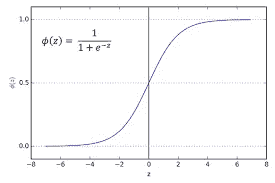
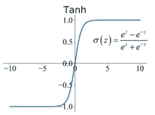
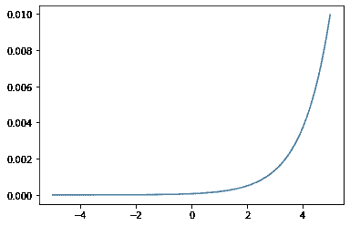
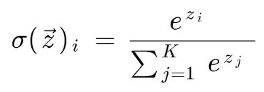
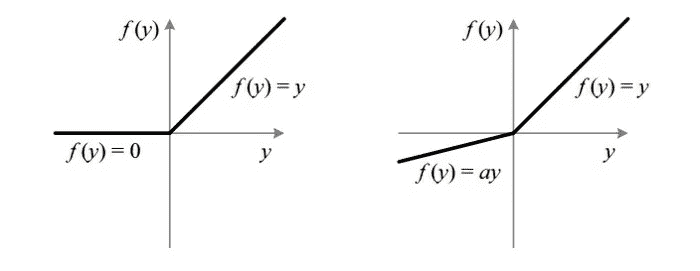
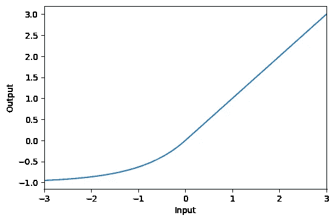
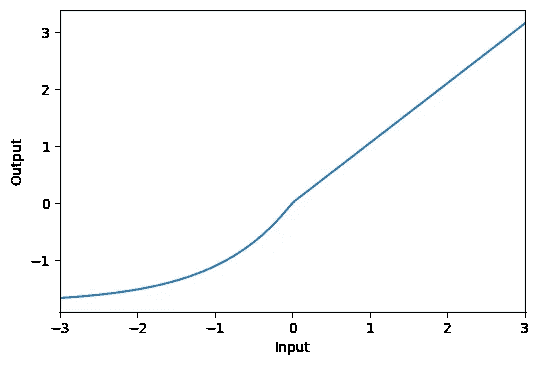
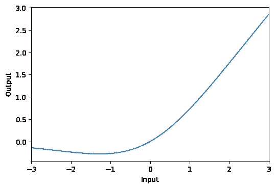

# 深度学习激活函数及其数学实现。

> 原文：<https://medium.com/nerd-for-tech/deep-learning-activation-functions-their-mathematical-implementation-b620d536d39b?source=collection_archive---------9----------------------->



激活函数，也称为**传递函数**在设计神经网络中至关重要。激活函数在某种意义上很重要，因为它用于确定**神经网络**的输出。它将结果值映射到 0 到 1 或-1 到 1 之间，等等。(取决于功能)。激活功能还有另一个名字叫做**挤压功能，**当激活功能的范围受限时使用这个名字。激活函数应用于神经网络的每个节点，并确定神经元是否应该被“激发”/“激活”。

> **为什么在选择激活功能时仔细选择很重要。**

当在隐藏和输出层中实现时，激活函数的选择非常关键。模型的准确性和损失非常依赖于激活函数。此外，必须根据您对模型性能的预期来选择它们。例如，在二元分类问题中，sigmoid 函数是最佳选择。

> **激活功能的类型。**

激活功能可以大致分为两类:

1.  线性激活函数。
2.  非线性激活函数。

**要导入的库**

```
import math as m
import matplotlib.pyplot as plt
import numpy as np
import tensorflow as tf
from tensorflow import keras
from tensorflow.keras import layers
```

> **乙状结肠功能**

*乙状结肠激活功能也称为逻辑功能。sigmoid 函数在回归分类问题中非常流行。sigmoid 函数给出 0 到 1 范围内的值。*



sigmoid 函数

**要实现的代码:**

```
def sigmoid(x):
    return 1 / (1 + m.exp(-x))values_of_sigmoid = []
values_of_x = []
for i in range(-500,500,1):
    i = i*0.01
    values_of_x.append(i)
    values_of_sigmoid.append(sigmoid(i))plt.plot( values_of_x ,values_of_sigmoid)
plt.xlabel("values of x")
plt.ylabel("value of sigmoid")
```

> 2.**双曲正切函数**

*该功能与乙状结肠激活功能非常相似。该函数将任何实数值作为输入，并输出-1 到 1 范围内的值。输入越大(越正)，输出值越接近 1.0，而输入越小(越负)，输出越接近-1.0。双曲正切激活函数计算如下。*



TanH 函数

**代码实现:**

```
def tanh(x):
    return (m.exp(x) - m.exp(-x)) / (m.exp(x) + m.exp(-x))values_of_tanh = []
values_of_x = []
for i in range(-500,500,1):
    i = i*0.001
    values_of_x.append(i)
    values_of_tanh.append(tanh(i))plt.plot( values_of_x ,values_of_tanh)
plt.xlabel("values of x")
plt.ylabel("value of tanh")
```

> **3。Softmax 功能**

Softmax 激活函数输出总和为 1.0 的值的向量，该向量可以被解释为类成员的概率。Softmax 是 argmax 函数的一个“*更软的*”版本，它允许一个赢家通吃函数的类似概率的输出。



softmax 函数

**代码实现:**

```
def softmax(x):
    e_x = np.exp(x - np.max(x))
    return e_x / e_x.sum()values_of_x = [i*0.01 for i in range(-500,500)]
plt.plot(scores ,softmax(values_of_x))
plt.xlabel("values of x")
plt.ylabel("value of softmax")
```

> **4。整流线性单元功能**

ReLU 或整流线性激活函数可能是隐藏层最常用的函数。它还可以有效地克服其他以前流行的激活功能的限制，如 Sigmoid 和 Tanh。具体来说，它不太容易受到阻止深度模型被训练的**消失梯度下降问题**的影响，尽管它可能遭受其他问题，如**饱和**单元。


ReLU 函数

要实现的代码:

```
def ReLU(x):
    return max(0,x)values_of_relu = []
values_of_x = []
for i in range(-500,500,1):
    i = i*0.01
    values_of_x.append(i)
    values_of_relu.append(ReLU(i))plt.plot(values_of_x,values_of_relu)
```

> **5。泄漏的 ReLU**

校正线性单元的问题:当给 ReLU 一个负值时，它会立即变为零，这降低了模型拟合或根据数据正确训练的能力。这意味着给予 ReLU 激活函数的任何负输入都会在图形中立即将值变成零，这反过来会通过不适当地映射负值来影响结果图形。

为了克服这个问题，引入了泄漏 ReLU。



要实现的代码:

```
def leaky_ReLU(x):
    return max(0.1*x,x)values_of_L_relu = []
values_of_x = []
for i in range(-500,500,1):
    i = i*0.01
    values_of_x.append(i)
    values_of_L_relu.append(leaky_ReLU(i))plt.plot(values_of_x,values_of_L_relu)
```

> **6。其他一些激活功能和实现:**

**6.1 指数线性单位:**



指数线性单位

要实现的代码:

```
activation_elu = layers.Activation(‘elu’)x = tf.linspace(-3.0, 3.0, 100)
y = activation_elu(x) # once created, a layer is callable just like a functionplt.figure(dpi=100)
plt.plot(x, y)
plt.xlim(-3, 3)
plt.xlabel(“Input”)
plt.ylabel(“Output”)
plt.show()
```

**6.2 比例指数线性单位:**



标度指数线性单位

要实现的代码:

```
activation_selu = layers.Activation('selu')x = tf.linspace(-3.0, 3.0, 100)
y = activation_selu(x) # once created, a layer is callable just like a functionplt.figure(dpi=100)
plt.plot(x, y)
plt.xlim(-3, 3)
plt.xlabel("Input")
plt.ylabel("Output")
plt.show()
```

**6.3 嗖嗖声:**



嗖嗖

```
activation_swish = layers.Activation(‘swish’)x = tf.linspace(-3.0, 3.0, 100)
y = activation_swish(x) # once created, a layer is callable just like a functionplt.figure(dpi=100)
plt.plot(x, y)
plt.xlim(-3, 3)
plt.xlabel(“Input”)
plt.ylabel(“Output”)
plt.show()
```

> **隐藏层激活功能:**

通常支持递归神经网络使用双曲正切函数或 sigmoid 激活函数，或者两者都使用。例如，LSTM 通常将 Sigmoid 激活用于循环连接，将 Tanh 激活用于输出。

1.多层感知器(MLP): ReLU 激活函数。

2.卷积神经网络(CNN): ReLU 激活函数。

3.递归神经网络:Tanh 和/或 Sigmoid 激活函数。

好吧，如果你不确定使用哪种激活功能，你当然可以尝试不同的组合，寻找最合适的。

> **输出层激活功能:**

必须根据您正在解决的问题类型来选择输出层激活函数。例如，如果你有一个线性回归问题，那么一个线性激活函数将是有帮助的。以下是您可能会遇到的一些常见问题和使用的激活功能。

*   **二元分类**:一个节点，乙状结肠激活。
*   **多类分类**:每类一个节点，softmax 激活。
*   **多标记分类**:每类一个节点，sigmoid 激活。

