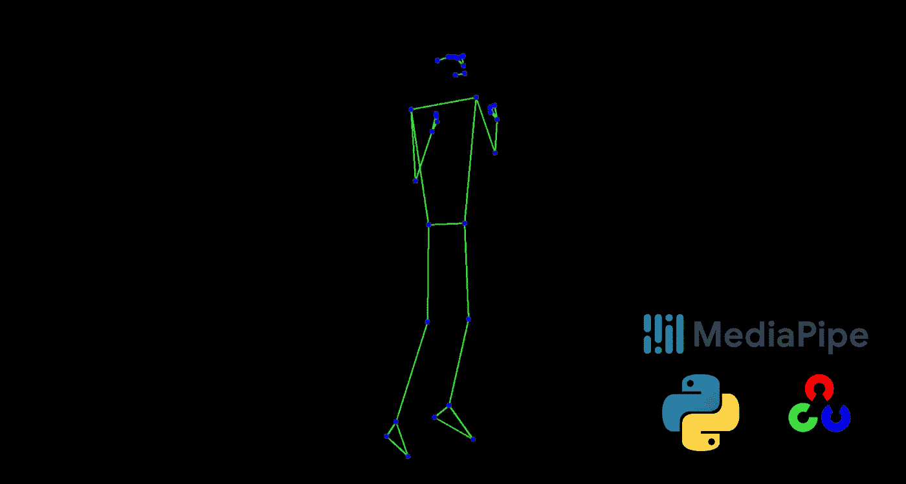
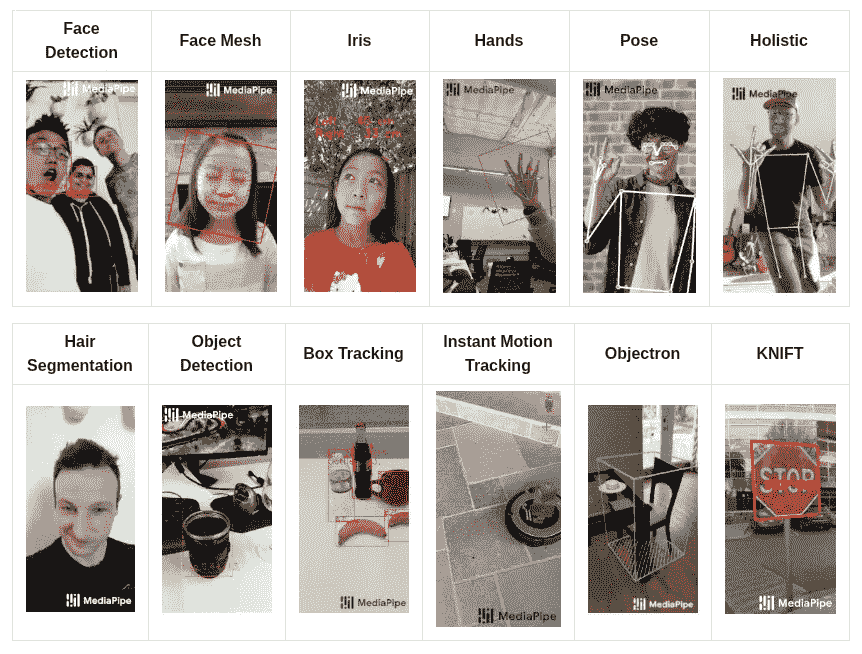

# 基于深度学习的 OpenCV 和 MediaPipe 人体姿态估计

> 原文：<https://medium.com/nerd-for-tech/deep-learning-based-human-pose-estimation-using-opencv-and-mediapipe-d0be7a834076?source=collection_archive---------1----------------------->

人体姿态估计媒体管道库指南



无背景情况下的姿态估计结果。

计算机视觉中最困难的任务之一是确定人体的高自由度配置，包括所有的肢体、复杂的自遮挡、自相似的部分以及由于服装、体型、照明和许多其他因素造成的巨大变化。人体姿态估计的问题可以定义为预测各种人体关键点(关节和标志)的位置的计算机视觉技术，这些关键点例如肘、膝、颈、肩、髋、胸等。在今天的文章中，我们将了解使用 MediaPipe 和 OpenCV 库的基于深度学习的人体姿态估计。

# 目录

*   什么是 MediaPipe？
*   姿态估计问题
*   实施解决方案
*   有用的链接

# 什么是 MediaPipe？

Mediapipe 是一个框架，主要用于构建多模态音频、视频或任何时间序列数据。在 MediaPipe 框架的帮助下，可以构建令人印象深刻的 ML 管道，例如 TensorFlow、TFLite 等推理模型，以及媒体处理函数。

> **注意:**你甚至不需要 GPU 来运行 MediaPipe 的实验，因为今天的集成显卡和 CPU 很适合这个解决方案。从逻辑上讲，FPS 将比使用 GPU 低得多。

MediaPipe 在 [PyPI](https://pypi.org/project/mediapipe/) 上以预建 Python 包的形式提供可定制的 Python 解决方案，可以简单地用`pip install mediapipe`安装。它还为用户提供了构建自己的解决方案的工具。更多信息请参见 Python 中的 [MediaPipe。](https://google.github.io/mediapipe/getting_started/python)

ML 的媒体管道解决方案:



MediaPipe 覆盖的 ML 解决方案。(来源:[https://google.github.io/mediapipe/solutions/pose.html](https://google.github.io/mediapipe/solutions/pose.html))

# 姿态估计问题

视频中的人体姿态估计在各种应用中起着至关重要的作用，例如[量化体育锻炼](https://google.github.io/mediapipe/solutions/pose_classification.html)、手语识别和全身手势控制。例如，它可以形成瑜伽、舞蹈和健身应用的基础。它还可以在增强现实中实现数字内容和信息在物理世界之上的叠加。MediaPipe Pose 是一个用于高保真身体姿势跟踪的 ML 解决方案，利用我们的 [BlazePose](https://ai.googleblog.com/2020/08/on-device-real-time-body-pose-tracking.html) 研究从 RGB 视频帧中推断出全身的 33 个 3D 地标，该研究也为 [ML 套件姿势检测 API](https://developers.google.com/ml-kit/vision/pose-detection) 提供了动力。


MediaPipe 识别的地标。(来源:[https://google.github.io/mediapipe/solutions/pose.html](https://google.github.io/mediapipe/solutions/pose.html))

# **实施解决方案**

## 要求

对于这个项目，我使用 Python 和 Anaconda Env 并使用了下面的库:

```
# Using conda
conda install -c conda-forge opencv# Using pip
pip install mediapipe
```

## 创建姿势估计器类

让我们创建一个 python 类来估计姿态，这个类还可以用于任何与姿态估计相关的项目。此外，在网络摄像头的帮助下，您可以实时使用它。

## 做出预测

由于我们在上面的文件中创建了一个类，我们将在另一个文件中使用它来对视频进行预测。

现在只需运行以下命令:

```
python detector.py -i videos/input_video.mp4 -o videos/output_video.mp4 -b False
```

> **注意:**完整的代码和需求可以在我的 GitHub 上找到，可以在有用的链接上找到。

## 结果

# 有用的链接

[](https://github.com/arthurfortes/pose_estimation) [## 艺术/姿态 _ 估计

### 在 GitHub 上创建一个帐户，为 arthurfortes/pose_estimation 开发做贡献。

github.com](https://github.com/arthurfortes/pose_estimation) [](https://mediapipe.dev/) [## 中间管道

### 内置的快速 ML 推理和处理甚至在通用硬件上加速了跨 Android 的统一解决方案…

mediapipe.dev](https://mediapipe.dev/)