# 零售产品分类中的深度学习—一个用例

> 原文：<https://medium.com/nerd-for-tech/deep-learning-in-retail-product-classification-a-use-case-b8258d471195?source=collection_archive---------0----------------------->

人工智能，特别是深度学习的进步为研究人员和企业家提升产品技能提供了新的机会。" ***根据 Gartner 的数据，到 2020 年底，零售业 85%的客户交互由 AI 管理"*******" Gartner 研究显示，77%的零售商计划到 2021 年部署 AI "。****

**

*有了这样的能力，深度学习在巨大的用例中得到了实现。这里讨论的就是这样一个用例。*

*PYMNTS *的一项新调查发现，近 36%的美国消费者现在在网上购买零售商品，相比之下，4 月中旬* *大多数实体店关门时，只有 29%的消费者这样做。面对如此惊人的在线人数和销售范围，简化整个购买和销售流程成为一项首要责任。同时保持竞争和健康销售。**

*数量是巨大的，责任也是巨大的，因此将产品分类和在潜在客户面前展示等任务委托给人工智能模型会有很大帮助。*

*我们现在通过利用深度学习的力量来讨论零售产品分类的用例。*

*说到基于图像的学习[卷积神经网络](https://en.wikipedia.org/wiki/Convolutional_neural_network)已经建立了它们的优点。我们将讨论 CNN 的实现，并使用它对两种产品进行分类:*

**1。个人电脑**

**

*图 1:一台个人电脑*

**2。一个电脑包**

*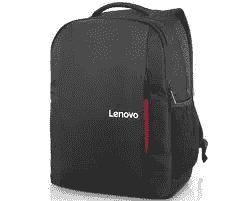*

*图二:一个电脑包*

# ***CNN 产品分类和转移学习***

*我们讨论了使用 Tensorflow 在 Python 中实现卷积神经网络的两种方法。*

1.  *从头做起*
2.  *使用迁移学习(最先进模型的权重)*

*我们从数据集信息开始。*

# ***1。数据集***

*项目中使用的数据集是从[谷歌图片](https://www.google.com/imghp?hl=en)定制下载的。使用了两类图像，一类是笔记本电脑和台式机，另一类是笔记本电脑包。*

*共使用 ***80 张图像****(每类 40 张)******20 张图像****(每类 10 张)***测试**。下载的图像保存在两个目录: *train，test。*包含*类别标签*信息的 *CSV 文件*被创建用于*列车*和*测试*图像。***

***。/数据集
├──。/图片
│ ├──。/图片/测试
│ └──。/图片/火车
├──。└──。/train.csv***

***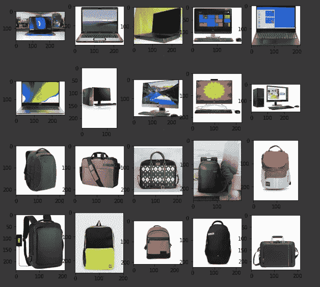***

***图 3:使用的图像示例***

# *****2。美国有线电视新闻网*****

***A [**卷积神经网络(ConvNet/CNN)**](https://towardsdatascience.com/a-comprehensive-guide-to-convolutional-neural-networks-the-eli5-way-3bd2b1164a53) 是一种深度学习算法，它可以获取输入图像，为图像中的不同方面/对象分配重要性(可学习的权重和偏差)，并能够区分它们。ConvNet 所需的预处理比其他分类算法要低得多。虽然手工设计的滤波器用于原始方法，但经过足够的训练，ConvNets 有能力学习这些滤波器/特性。***

******

***图 4:CNN 的结构***

*****2.1 使用 Tensorflow 在 python 中实现 CNN*****

# *****3。项目讨论*****

***该项目旨在将产品分为两类。***

1.  ****PC 2。****
2.  ****电脑袋****

***我们使用 *pandas* 将数据集加载到数据框中，并使用 *matplotlib* 通过 *imread 查看图像。*我们执行*数据辩论*和*使用 *ImageDataGenerator 扩充*数据集。*我们通过在 *ResNet50 上使用*迁移学习*,使用扩充的数据从 *scratch* 和 *1 CNN* 模型中训练出 *3 个*不同的 *CNN 模型*。****

*****3.1 加载并查看图像*****

***i. *imread(path):* *从提供的路径中读取图像****

***二。 *imshow():打印图像****

*****3.2 数据角力*****

*****3.2.1 为不同的标签创建不同的文件夹***(imagedata generator 数据扩充所需)****

***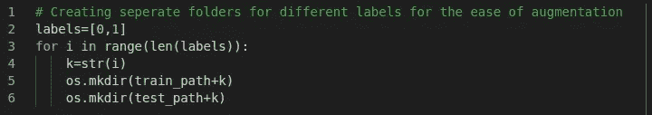***

*****3.2.2 定义将图像复制到标签文件夹的实用功能*****

***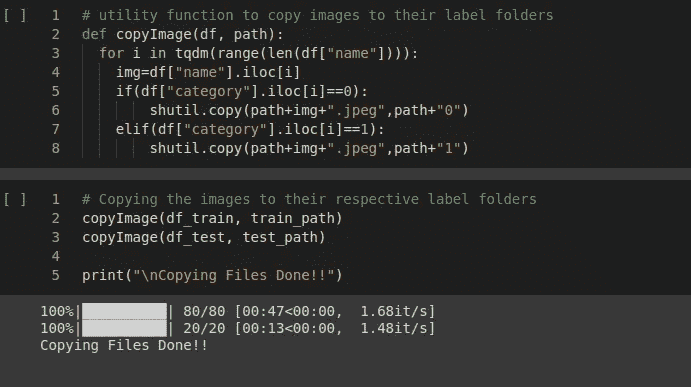***

*****3.2.3 让我们看看标签的分布*****

***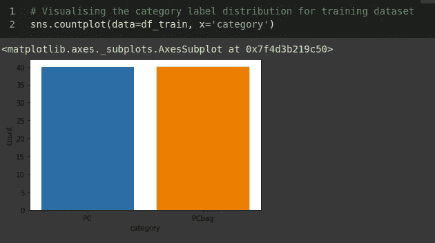***

***图 5:标签类别分布***

***在类别标签的数量上有一个平衡。***

*****3.2.4 让我们看看图像的形状分布*****

***我们将不得不查看图像的形状分布，以得出用于训练的共同值，因为不同形状的图像可能会给训练过程添加噪声。我们需要将它们调整到一个公共的形状尺寸。为了统一。***

***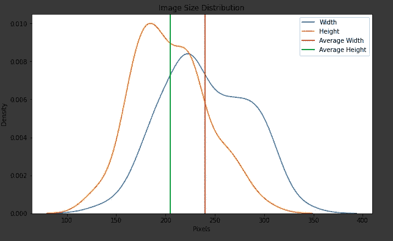***

***图 6:图像尺寸分布***

***看起来这些图像在形状上近似为正方形，其中大多数图像的*宽度*大约为 *230* 而*高度*为*170–195*。我们使用平均值进行进一步的研究和建模。***

*****3.2.5 扩充图像数据*****

****现实生活中的数据*可能与用于*培训的数据*不同*。为了我们建立的*模型*的*健壮性*，我们需要坚持所有可能出现的*极限情况*。*扩充*图像数据通过其各种操作(如*旋转、翻转、移动、剪切等)来简化该过程。从而确保用于训练的数据与测试中可用的数据相匹配。*****

*****3.3 模型构建*****

***通常推断初始卷积和汇集层从图像中提取边缘和线(低级)特征，而较深的层从图像中提取更复杂的特征。***

***达到完美的层数本身就是一项研究。我们很幸运，像 [Keras Tuner](https://www.tensorflow.org/tutorials/keras/keras_tuner) 这样的工具可以用来调整深度学习模型的超参数。***

***对于这个版本的项目，我们将自己限制在试凑法。我们开发了三种不同的 CNN:***

1.  ***具有 1 个卷积和 1 个汇集层***

***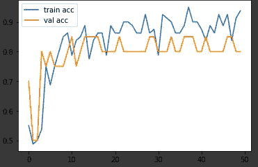***

***图 7:50 个时期的精确度***

***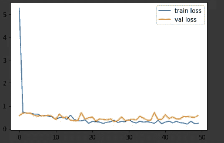***

***图 8:50 个时代的损失***

***2.具有 2 个卷积和 2 个池层***

***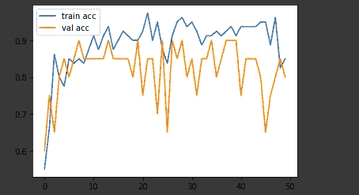***

***图 9:50 个时期的精确度***

***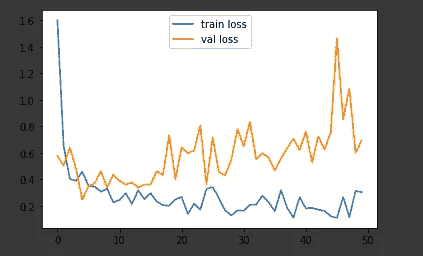***

***图 10:50 个时代的损失***

***3.具有 3 个回旋层和 3 个池层***

***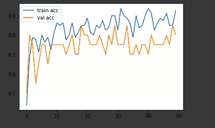***

***图 11:50 个时期的精确度***

***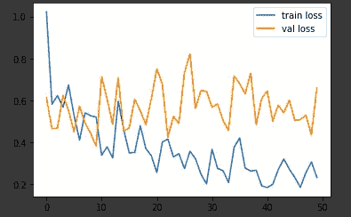***

***图 12:50 个时代的损失***

***并分析损失和精度图以检查过度拟合和欠拟合。***

***该实现可从以下网址获得:***

*** [## sten Zr/产品 _ 分类

### 使用 CNN 和转移学习- stenzr/product_classification，根据两个产品的图像对其进行分类

github.com](https://github.com/stenzr/product_classification) 

我们还利用[迁移学习](https://en.wikipedia.org/wiki/Transfer_learning)的力量，在最先进的模型 [ResNet50](https://en.wikipedia.org/wiki/Residual_neural_network) 的基础上构建。

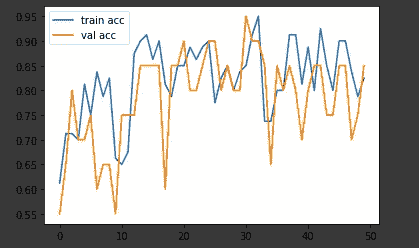

图 13:50 个时期的精确度

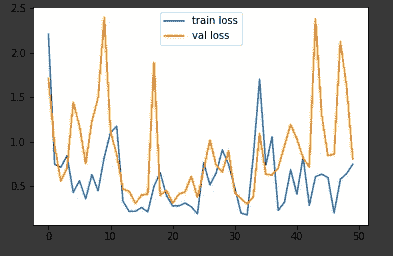

图 14:50 个时代的损失

然后，我们比较每个模型获得的准确度分数，最终宣布获胜者。

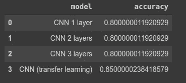

图 15:不同模型在测试数据上的表现*** 

# *****4。结果*****

1.  ***从图 15 可以明显看出，CNN(迁移学习)模型优于其他模型。***
2.  ***以单位步长增加卷积和合并层无助于我们的事业。***
3.  ***损失曲线和准确度曲线还没有收敛，所以我们需要训练更多的时期来使模型一般化。***
4.  ***Keras Tuner 可用于调整模型参数。从而避免在试凑法中浪费训练时间。***

# *****5。源代码*****

***该项目的源代码可从以下网址获得:***

*** [## sten Zr/产品 _ 分类

### 使用 CNN 和转移学习- stenzr/product_classification，根据两个产品的图像对其进行分类

github.com](https://github.com/stenzr/product_classification)***