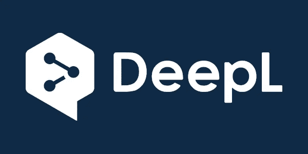
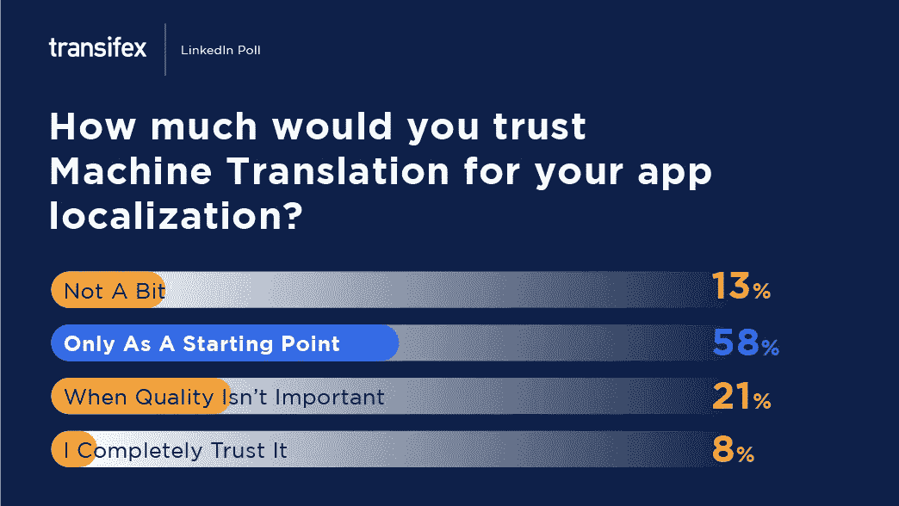

# DeepL 加入 Transifex 作为机器翻译工具

> 原文：<https://medium.com/nerd-for-tech/deepl-joins-transifex-as-a-machine-translation-tool-74968a634e0e?source=collection_archive---------31----------------------->

就[本地化自动化(l10n)](https://www.transifex.com/blog/2021/what-is-localization/#What_is_Automation_in_Localization) 而言，机器翻译无疑是最被低估的功能之一。事情是这样的，一些机器翻译工具，比如 DeepL，比其他的更适合某些语言。它们当然值得一试。

这就是我们现在将 DeepL 集成到 Transifex 平台的原因。请继续阅读，了解它的所有信息，以及它与其他机器翻译工具的不同之处！

# 什么是机器翻译？

机器翻译(MT)是一种通过使用以下任一方法翻译内容的软件:

1.  语言学规则与双语词典
2.  训练数据的数据库
3.  深度学习系统/人工智能

或者，在许多情况下，这三种方法的组合。

机器翻译软件的好处是，它可以自动翻译一切，无需任何人工输入。然而，坏的一面是它不如真正的翻译准确——尤其是当我们提到[本地化](https://www.transifex.com/blog/2021/what-is-localization/)的时候。但这些年来，由于人工智能和不断增长的人类输入数据库，它们变得越来越好。

我们在 Transifex 支持的机器翻译的一些流行的例子是[谷歌翻译](https://www.transifex.com/blog/2015/google-translate-reliability/)、[亚马逊翻译、KantanMT 和微软翻译](https://docs.transifex.com/machine-translation/setting-up-machine-translation)。现在我们也将 DeepL 带上船！

# DeepL 是什么？

DeepL 是另一种机器翻译工具——很像谷歌翻译或亚马逊翻译。从现在开始，你可以用它在 Transifex 编辑器中自动翻译单词或短语。

DeepL 和其他 MTs 的主要区别在于，DeepL 主要关注欧洲语言，同时为它们提供卓越的准确性。[有些人声称这是迄今为止最精确的机器翻译](https://www.reddit.com/r/TranslationStudies/comments/9ww6lo/google_translate_vs_deeplcom_which_is_better/)，但我们会让你来决定。毕竟，不管你的计划如何，所有的 Transifex 用户都可以使用 DeepL。

要在 Transifex 中为您的组织设置和使用 DeepL:

1.  登录您的 Transifex 帐户
2.  点击屏幕右上角的“Transifex”
3.  组织设置
4.  机器翻译
5.  并从下拉列表中选择“DeepL”
6.  插入您的 API 密钥

或者，您也可以选择在每个项目的基础上启用 MT——这意味着您可以在单个项目上使用它，而不是为您正在处理的所有项目启用它。本页提供更多相关信息。

# 为什么要用 DeepL？

机器翻译不准确的主要原因是由于人们在文化上如何表达自己，以及一个单词可能有多个意思的事实。所以，如果你试图逐字逐句地翻译，很难得到准确的翻译。

例如，希腊人可能会从字面上说“你的眼睛 14”，这是“小心”的一种说法。但是如果你一个字一个字地翻译，它在英语中是没有任何意义的。这也是机器在本地化方面无法与人类竞争的主要原因之一。

然而，DeepL 已经证明它可以更有效地处理这种情况，特别是在欧洲语言中，因为它已经使用欧盟的文档语料库进行了“训练”。这是使用它胜过其他 mt 的一个原因。

当然，你不会按一下按钮就自动翻译整个网站。但是，根据我们的研究，58%的用户愿意使用机器翻译，至少作为一个起点。也许你也想这么做。

请随意加入并尝试一下。

# 包扎

这就是目前你需要了解的关于 DeepL 的全部内容。我们计划在不久的将来创建一个更详细的机器翻译指南，敬请关注！

这个帖子是[最初发表在这个](https://www.transifex.com/blog/2021/deepl/)页面上的。