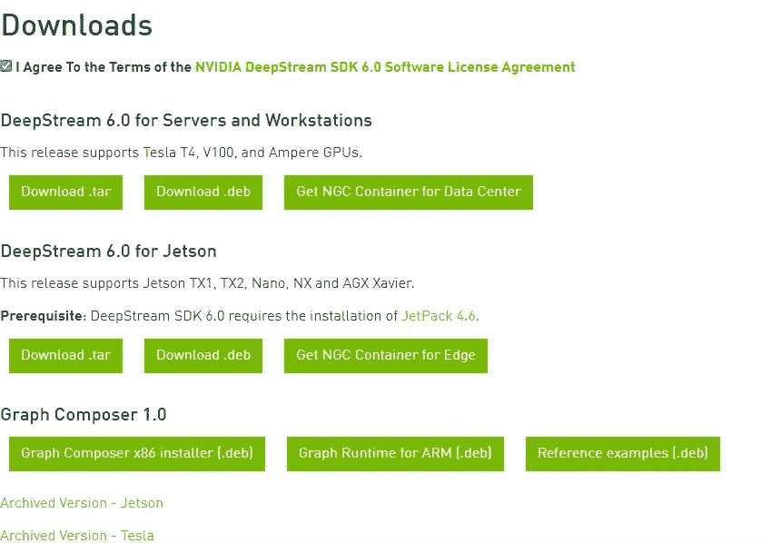
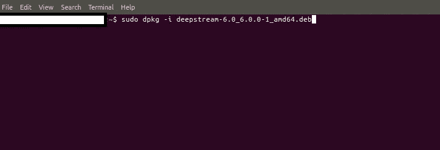
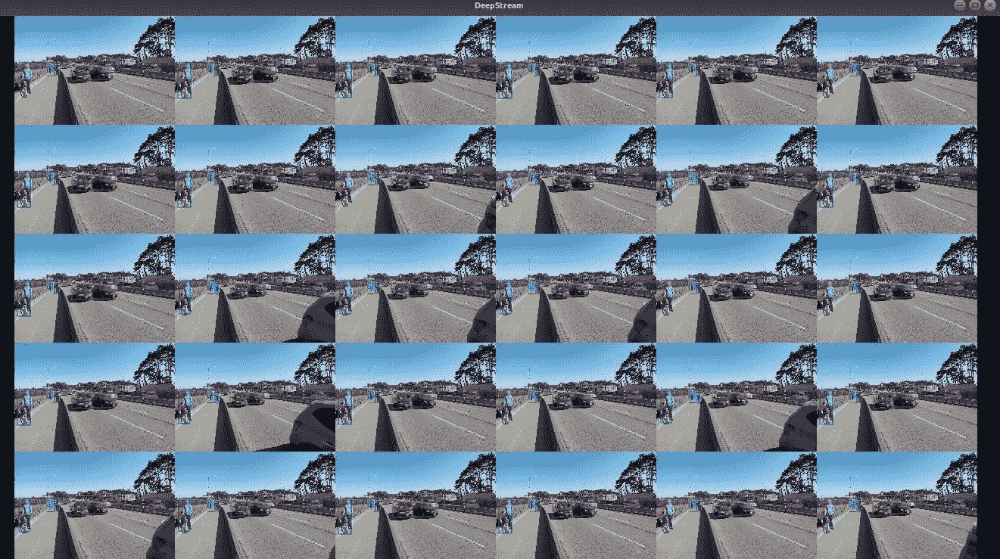

# jetson 设备上的 Deepstream 安装

> 原文：<https://medium.com/nerd-for-tech/deepstream-installation-on-jetson-devices-fb55ace0587f?source=collection_archive---------0----------------------->

D eepstream 是 nvidia 开发的软件开发套件(sdk)，主要用于嵌入式设备，但我们可以在 pc 上使用它(有 gpu 支持)，旨在简化可扩展智能视频分析应用的整体开发。我们可以用它来快速构建计算机视觉的自定义应用程序，包括对象检测、图像分类等。


Deepstream 工作流

> **注意:**开始之前，确保你有 nvidia 开发者账号。如果你已经有了，那么你可以继续。否则你可以从[链接](https://developer.nvidia.com/login)制作 NVidia 开发者账号。

以下是完成整个过程所涉及步骤。

```
a) How to download debian file of deepstream.
b) How to install debian file of deepstream.
c) How to test installation of deepstream
```

**深流下载流程:**

> **注意:**安装前，请从 [***链接***](https://developer.nvidia.com/deepstream-getting-started) 查看需求，如果您的 Tensorrt 版本与需求匹配，那么您可以继续，否则您可以从 [***链接***](https://developer.nvidia.com/embedded/deepstream-on-jetson-downloads-archived) ***(需要登录)、*** 下载与您的 Tensorrt 版本匹配的存档版本。

你可以用下面的命令检查你的 Tensorrt 版本。

```
dpkg -l | grep tensorrt
```

转到 [***链接***](https://developer.nvidia.com/deepstream-getting-started) ，移动到页面末尾，在下载选项中，勾选下面提到文字的复选框。

```
I Agree To the Terms of the NVIDIA DeepStream SDK 6.0 Software License Agreement
```

一旦您选中了复选框，您将看到如下所示的界面。根据你的系统选择版本 **(Jetson)** ，标签**“Jetson 的 DeepStream”**是给 Jetson 用户的，我们会下载(。deb)文件，因为它很容易安装在 **Jetson** 上。



Deepstream 下载页面

一旦你点击**“下载。deb"** ，新标签将会打开，如果你已经用 Nvidia 开发者帐户登录，那么下载将会开始，如果你没有登录，那么首先用 Nvidia 开发者帐户凭证登录，然后你的下载将会开始。

**深流安装程序:**

一旦你的下载完成，在 jetson 中打开一个终端，运行下面的命令，确保提供 debian **的完整路径。deb)** 下载的文件。

```
sudo dpkg -i deepstream-6.0_6.0.0–1_amd64.deb
```



上面的命令，会在你的设备上安装 **deepstream-sdk** 。默认安装路径将在下面提到，一旦 deb 文件安装完成，你可以移动到那个位置进行验证。

```
/opt/nvidia/deepstream/deepstream-6.0/
```

**深流安装验证:**

到目前为止，我们下载并安装了 deepstream，但我们如何验证它是否工作正常？在这里，deepstream-sdk 的示例应用程序将帮助我们。如果示例应用程序工作正常，这意味着 deepstream 已经正确安装。

移动到 sample apps 文件夹，它将位于下面提到的路径。

```
/opt/nvidia/deepstream/deepstream-6.0/samples/configs/deepstream-app/
```

在这里，您将看到不同的示例配置文件，我们可以使用它们中的任何一个进行测试。我已经使用了 ***三十个* *流*** 配置文件，但是它们的操作步骤都和下面提到的一样。

在 sample apps 文件夹路径下打开一个终端，运行下面的命令进行测试。

```
deepstream-app -c source30_1080p_dec_infer-resnet_tracker_sgie_tiled_display_int8.txt
```


深流-示例-应用程序测试

上面的命令需要一些时间来运行，几秒钟后，你会看到如下的屏幕。



deepstream-30 流测试

最后，我们的 deepstream 安装成功。

> 以上是关于安装 deepstream-sdk 的全部内容。你可以自己尝试，如果你会遇到任何错误，在读完整篇文章后，你可以在文章回复中发送你的问题。我将努力为所有人提供解决方案。

**关于我:**

我有超过 1 年的软件开发工作经验。目前，我是一名软件工程师，通过使用零售分析、建立大数据分析工具、创建和维护模型以及加入引人注目的新数据集，为我们的客户改进产品和服务。此前，我是 Spark 基金会的计算机视觉实习生，在那里我获得了分析来自不同开源平台(如 kaggle、google images、openimages 等)的视觉数据的经验。)并在该数据上训练不同的深度学习模型。

*   [*在 LinkedIn 上联系我*](https://www.linkedin.com/in/muhammadrizwanmunawar/)
*   [*与我协商*](https://www.upwork.com/services/product/consultation-1477666319161577472?ref=project_share)
*   [*我的 yolov5 服务*](https://www.upwork.com/services/product/you-will-get-image-classification-projects-using-machine-learning-with-python-1323963101029052416?ref=project_share)

***如有任何疑问，欢迎在下方评论***