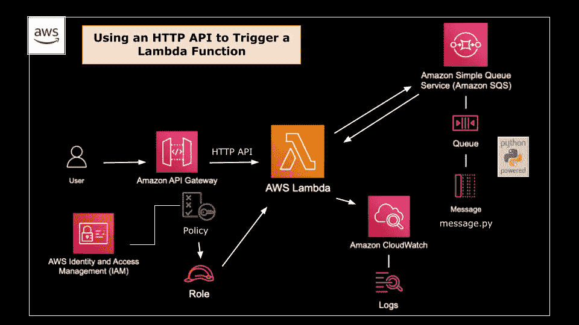
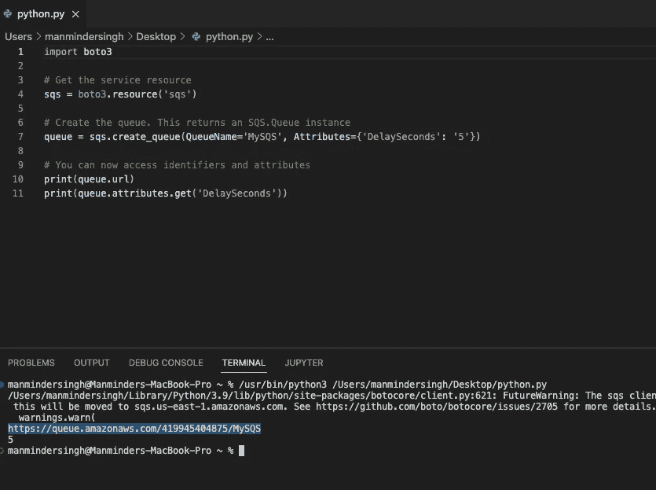
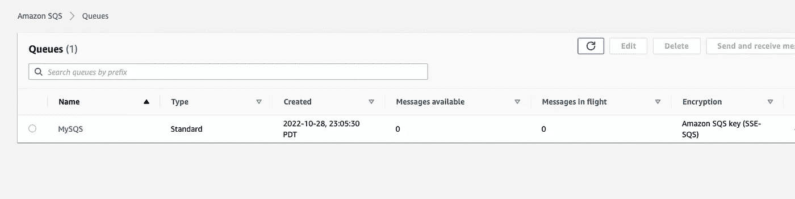
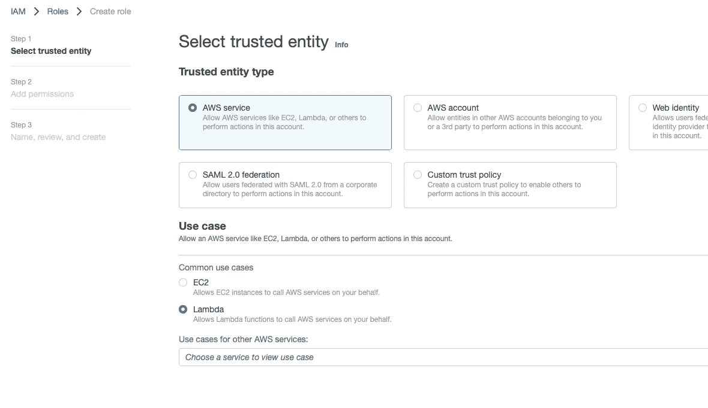
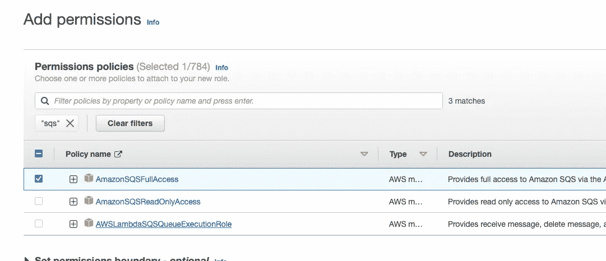
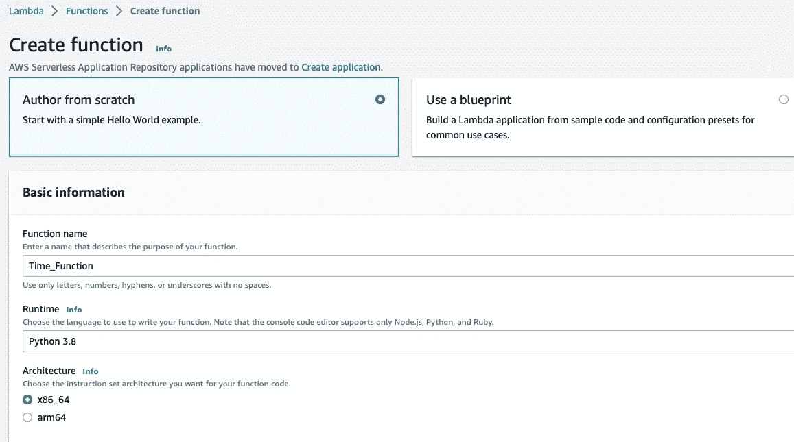
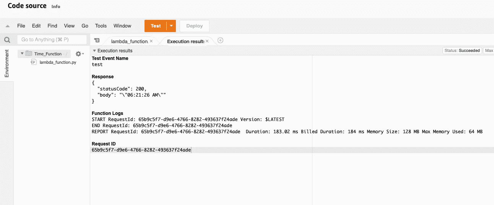
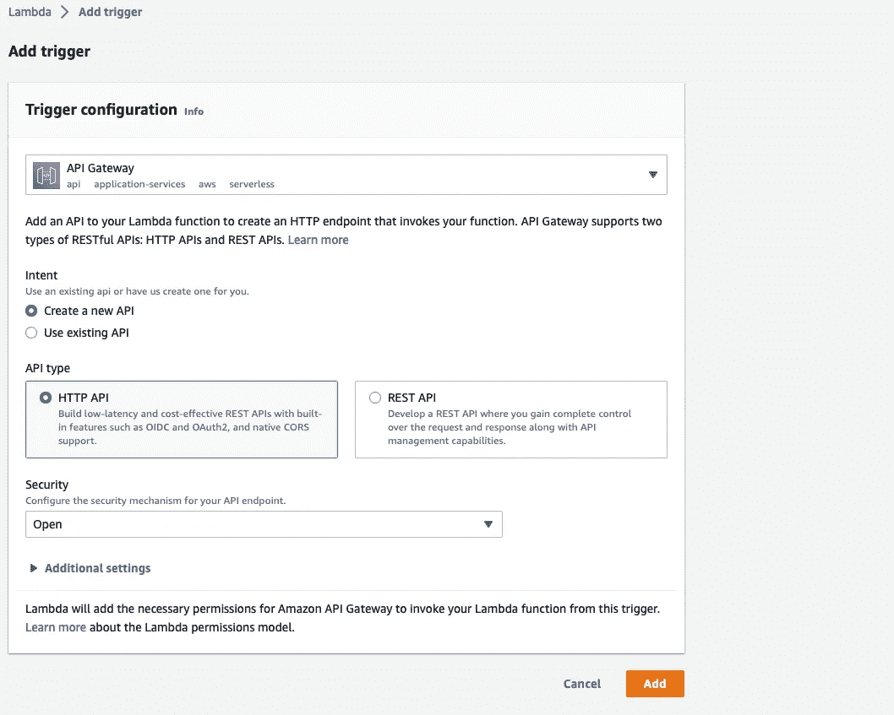
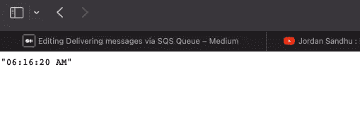

# 通过 SQS 队列传递消息

> 原文：<https://medium.com/nerd-for-tech/delivering-messages-via-sqs-queue-f5d2e98994b?source=collection_archive---------0----------------------->

Lambda 函数将当前时间发送到 SQS 队列。


**概述:**亚马逊简单队列服务(SQS)让您可以在任意数量的软件组件之间发送、存储和接收消息，而不会丢失消息或要求其他服务可用。



**项目目的:**通过 Lambda 函数向 SQS 队列发送消息(当前时间)

```
Objectives:
- Create a Standard SQS Queue using Python
- Create a Lambda function
- Modify Lambda to send a message to the SQS Queue with current time
- Create an API gateway HTTP API type trigger
- Test the trigger to verify the message was sent
```


**第一步:创建一个 SQS 队列** 这可以通过 AWS 控制台完成，但对于这个项目，我们将通过 Python 使用 boto3 库来完成。作为参考，我将使用该链接获取我的 python 代码来构建 sqs 队列。不要忘记在代码中添加导入 boto3。

 [## 示例教程- Boto3 Docs 1.25.3 文档

### 本教程将向您展示如何在 AWS 服务中使用 Boto3。在本示例教程中，您将学习如何使用…

boto3.amazonaws.com](https://boto3.amazonaws.com/v1/documentation/api/latest/guide/sqs.html) 

来自 AWS 控制台的 SS

**第 2 步:创建 IAM 角色** 我们将前往 IAM 角色，为 Lambda 服务创建 IAM 角色，并为其分配 FullSQSAccess 权限。这个 IAM 角色将被分配给 Lambda 函数来访问 SQS。



选择 Lambda 作为用例



添加 SQS 完全访问权限

**步骤 3:创建 Lambda 函数** 为此，我们将前往控制台创建 Lambda 函数。

转到>> Lambda >>创建函数>>从头开始创作>>名称> >选择 Python 作为运行时> >选择在上一步中创建的策略



**步骤 2 和 3 的结论:**我们创建了一个 IAM 角色(SQS 完全访问)，并将其分配给 Lambda 函数(Time_Function)，这将让 Lambda 函数承担一个角色，将消息发送到 SQS 队列中。

**步骤 4:修改 Lambda 函数代码** 现在，我们将修改“lambda_function.py”脚本，以便在它执行时生成一个时间戳。为此，删除样板文件并添加以下代码。

更新代码>>后，单击部署>>测试



**步骤 5:创建 API 网关** 现在我们将添加 API 网关来触发 Lambda 函数，以将所需的结果发送到我们的 SQS 队列中。

转到>> Lambda 函数>>添加触发器> >使用以下设置选择 API 网关



将 API 网关创建为触发器后，在 browser 选项卡中检查 API 端点。您将收到以下结果。



显示此结果的 API 端点

同样，您也将收到 SQS 队列中的消息。


任务完成后，我们配置了 lambda 函数，将当前时间发送到 sqs 队列。感谢阅读！！