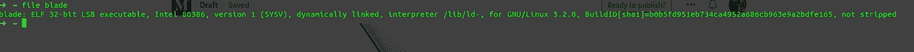
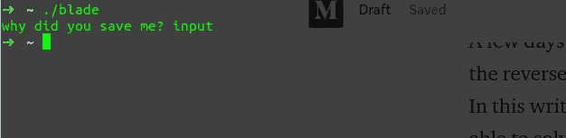
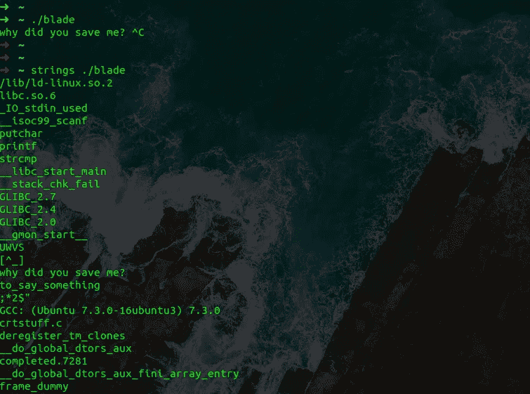
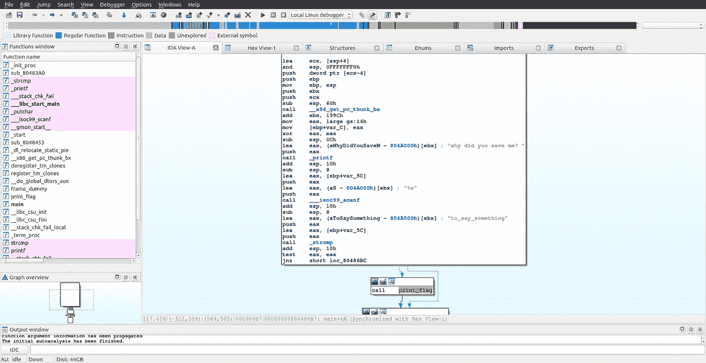
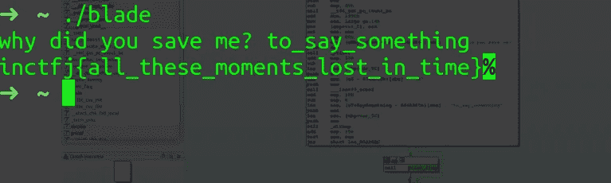
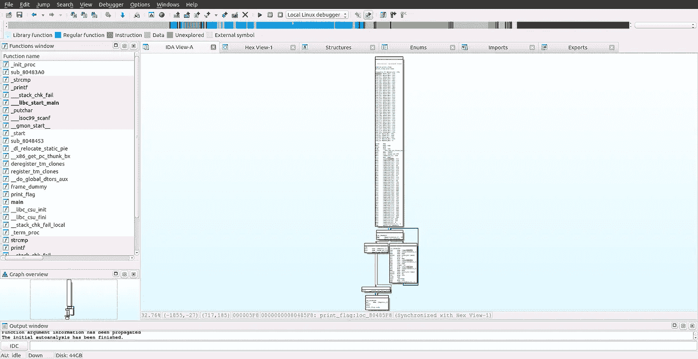
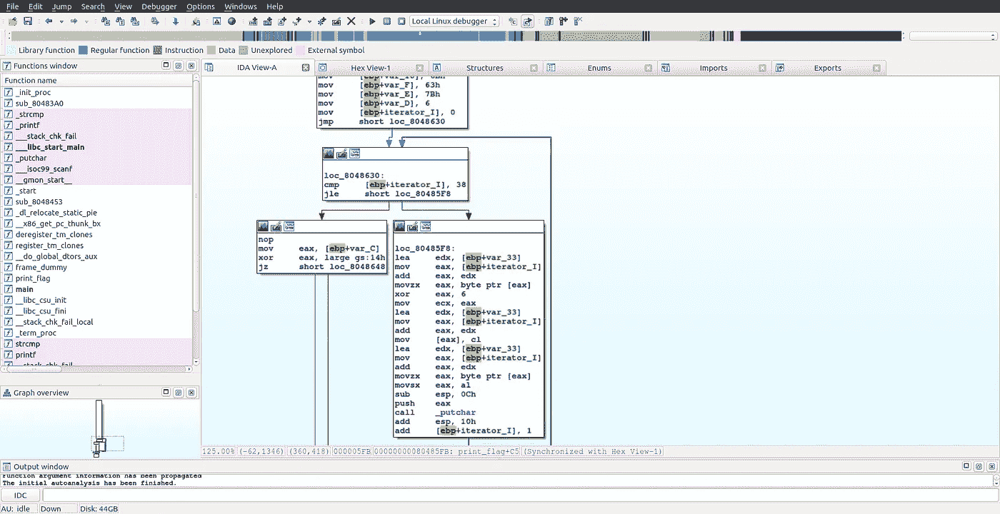
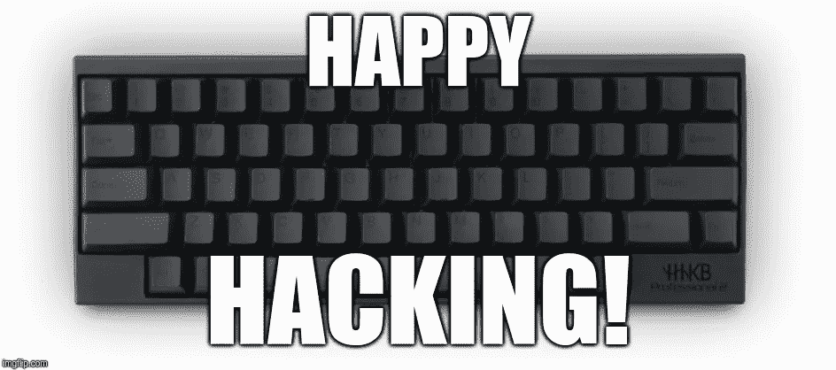

# 揭开逆向工程 CTF 挑战赛的神秘面纱——刀锋

> 原文：<https://medium.com/nerd-for-tech/demystify-reverse-engineering-ctf-challenge-blade-40c45e7933c0?source=collection_archive---------0----------------------->

有没有试过**逆向工程**？？？

一天，我的朋友在解决 CTF**竞赛中的一个挑战时，在逆向工程部分卡住了。我想尝试一下，我能够解决这个挑战。可以吗？？？试试看。**

**任何开始逆向工程的人都可以解决这个挑战。**

**我想分享我解决这个挑战的方法。**

 **[## 刀片二进制

### 试试吧！！！

drive.google.com](https://drive.google.com/open?id=1oTERzqyVPbK8TImkkZyWsrnPfRNGYygN)** 

# **检查文件类型**

**我的第一步是确定文件类型。我打开终端，键入`file blade`,得到了这个输出**

****

**32 位可执行文件**

**因为，这是一个可执行文件，我们可以在任何反汇编程序中打开，如 IDA pro，radare2，binary ninja 和 ghidra 等。但是在用反汇编程序打开它之前，我执行了二进制文件来检查它接受的所有输入是什么？**

# **执行二进制文件**

****

**二进制执行**

**正如您所看到的，在执行 binary 时，它只接受一个输入，不打印任何内容。此时，我认为当输入正确时，它可能会打印一些字符串或实际的标志。**

# **打印二进制文件中的字符串**

**为了打印二进制文件中的所有字符串，我使用了`strings`,下面是输出。**

****

**字符串命令输出**

**现在，你知道当我们执行二进制时，它会问一个问题，我们必须输入。根据经验，我的猜测是“说点什么”可能是正确的输入。让我们检查反汇编程序。**

# **IDA-Pro 反汇编程序**

****

**IDA Pro 反汇编程序**

**我赶紧下载安装了 IDA pro 反汇编程序，打开二进制。使用 IDA pro 反汇编程序的原因是我用起来很舒服。我知道它的基本原理。**

****

**主函数的图形视图**

**正如我们所看到的，有一个对 strcmp 函数的调用，它接受我们之前找到的字符串和输入变量。如果你知道 strcmp 函数，如果两个字符串相等，它将返回 0，如果 strcmp 返回非零值，有一个指令`jnz`跳转，否则它将调用‘print _ flag’函数。这就是我想看的。**

**让我们输入字符串并获得我们的第一个标志。**

****

**标志输出**

## **耶！！！我得到了我的第一面旗帜:)**

# **print_flag 里面有什么？？？？**

**出于好奇，我想看看' print_flag '函数中有什么，以及当我们使用 string 命令时为什么没有打印出标志。我迅速导航到“print_flag”功能并开始探索。**

****

**Print_flag 函数图形视图**

**起初，这个函数似乎很长，但后来我意识到这个函数很简单。我们来分析一下这个函数是干什么的。**

****

**print_flag 函数的逻辑**

**正如我们在这里看到的，有一个循环，循环内部有 xor 指令。这个循环将逐字符打印标志。**

****这个挑战的 Python 代码应该是这样的****

**理解组装是这次挑战的主要**难点**。这个挑战非常有趣。**

**希望你喜欢:)**

**是的，将来还会有类似的文章，敬请关注！**

****

**永远感谢@ [**Deepank**](https://www.instagram.com/deepank.srivastava/) 对他的目光和他在这件作品上的笔记。**